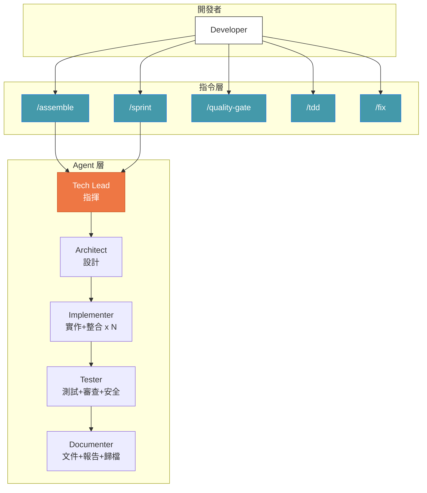

# Symbiotic Engineering — Agent Army

> AI Agent 大軍：讓單人開發者透過 Claude Code CLI 指揮多 Agent 團隊，涵蓋完整軟體開發生命週期。

## 前置條件

- [Claude Code CLI](https://docs.anthropic.com/en/docs/claude-code) 已安裝並可運行
- Claude Code Plugin 功能已啟用

## 安裝

### Step 1: 註冊 Marketplace 來源

在 Claude Code CLI 中執行：

```bash
/plugin marketplace add Muheng1992/symbiotic-engineering
```

這會將本 repo 註冊為 Plugin 來源。

### Step 2: 安裝 Agent Army Plugin

```bash
/plugin install agent-army@symbiotic-engineering
```

安裝後你會獲得 5 個 Agent 和 14 個 Skill（以 `/agent-army:` 命名空間前綴呼叫）。

### Step 3: 初始化專案

在你的目標專案中執行：

```bash
/agent-army:setup my-project
```

Setup 會自動完成以下工作：

| 項目 | 說明 |
|------|------|
| `docs/` 目錄結構 | 建立 reports、architecture、guides、archive 等子目錄 |
| `docs/INDEX.md` | 主文件索引，所有報告都會登記在此 |
| `.claude/CLAUDE.md` | 注入 Clean Architecture 標準與開發規範 |
| `.claude/settings.json` | 啟用 Agent Teams 環境變數與權限設定 |

### 驗證安裝

安裝完成後，嘗試執行以下指令確認一切正常：

```bash
# 查看可用指令
/agent-army:assemble --help

# 執行品質檢查
/agent-army:quality-gate all
```

## 包含什麼

### 5 個專責 Agent

| Agent | 角色 |
|-------|------|
| `tech-lead` | 團隊指揮、協調與委派（不直接寫碼） |
| `architect` | 系統設計、API 設計、資料建模 |
| `implementer` | 程式碼實作 + 整合驗證（可多個並行） |
| `tester` | 測試 + Code Review + 安全審計 |
| `documenter` | 文件撰寫 + 報告產生 + 歸檔管理 |

### 14 個 Skill

| 指令 | 用途 |
|------|------|
| `/agent-army:assemble [功能描述]` | 集結 Agent 大軍開發功能 |
| `/agent-army:sprint [功能描述]` | Sprint 規劃與任務分解 |
| `/agent-army:quality-gate [範圍]` | 品質閘門（6 道檢查） |
| `/agent-army:integration-test [範圍]` | 整合測試編排（5 階段流程） |
| `/agent-army:code-review [範圍]` | 程式碼審查編排（4 階段流程） |
| `/agent-army:setup [專案名稱]` | 初始化專案設定 |
| `/agent-army:tdd [功能描述]` | TDD Red-Green-Refactor 強制執行 |
| `/agent-army:fix [錯誤描述]` | 智慧問題診斷與修復 |
| `/agent-army:timesheet [時間範圍]` | 工時分析與日報 |
| `/agent-army:retrospective` | Mission 結束後回顧學習 |
| `/agent-army:context-sync [模式]` | 跨 Session Context 同步（save/load/team） |
| `/agent-army:onboard [專案名稱]` | 專案上手分析與 Memory 初始化 |
| `/agent-army:changelog [版本規格]` | 自動變更日誌產生 |
| `dev-standards` | 開發標準（自動載入） |

### 5 類專案範本

`/agent-army:setup` 會自動安裝以下範本：

| 類別 | 內容 | 說明 |
|------|------|------|
| **Memory** | `MEMORY.md` + 4 個 topic files | 結構化 AI 記憶架構，跨 session 累積知識 |
| **Git Hooks** | `pre-commit`, `commit-msg`, `pre-push` | 自動檢查檔案長度、secrets、commit 格式 |
| **CI/CD** | `quality-gate.yml` | GitHub Actions 品質閘門（6 道檢查） |
| **Keybindings** | `keybindings.json` | Agent Army 常用指令快捷鍵 |
| **Workspace** | `workspace.json` | 多專案協調設定 |

## 系統架構概覽



## 快速使用

```
# 集結大軍開發功能
/agent-army:assemble implement user authentication with JWT

# Sprint 規劃
/agent-army:sprint add dashboard with charts and filters

# 品質檢查
/agent-army:quality-gate all
```

### Hooks 自動化

安裝後會自動啟用以下 Hooks：

| Hook 事件 | 觸發時機 | 行為 |
|-----------|---------|------|
| `PostToolUse(Write/Edit)` | 每次寫入/編輯程式碼後 | 提醒 Clean Architecture 合規 |
| `PostToolUse(npm install/pip install/...)` | 安裝新依賴後 | 提醒檢查 License、CVE、Bundle size |
| `PreToolUse(git push)` | Push 前 | 提醒先跑 `/quality-gate` |
| `Stop` | Session 結束前 | 確認報告已歸檔到 `docs/reports/` |

## 核心特性

- **精簡高效** — 5 個 Agent 基於業界最佳實踐（Anthropic 建議 3-5 個）
- **並行開發** — 多個 Agent 同時處理不同檔案
- **Clean Architecture** — 自動強制依賴規則（Hooks + 標準）
- **完整報告** — Code Review、測試、安全審計全部文件化保留
- **成本優化** — 文件類 Agent 用 Sonnet、推理類用 Opus
- **TDD 強制** — 測試先行，嚴格 Red-Green-Refactor 循環
- **智慧修復** — 自動診斷問題、選擇適當 Agent 修復
- **職責隔離** — Tech Lead 只協調不寫碼、Architect 只設計不實作
- **Worktree 隔離** — 多個 Implementer 在獨立 Git worktree 中安全並行
- **跨 Session 記憶** — Context Sync 保存/恢復工作狀態，確保開發連續性
- **一鍵上手** — Onboard 掃描專案、產生結構化 Memory，新專案秒入狀態
- **自動 CHANGELOG** — 從 git history + 報告自動產生 Keep a Changelog 格式

## 文件

### Plugin 文件
- [系統設計文件](docs/plugin/agent-army-design.md) — 架構設計與 Mermaid 圖
- [使用指南](docs/plugin/agent-army-usage.md) — 完整教學

### 研究與知識庫
- [iPhone 遠端開發指南](docs/guides/iphone-remote-dev-guide.md) — Claude Code Remote Control + SSH + VNC
- [雙 Mac 遠端開發指南](docs/guides/dual-mac-dev-guide.md) — Mac Mini 伺服器 + MacBook 客戶端
- [更多研究文章](docs/guides/) — Claude Code 功能系列研究（7 篇）

## 版本

**當前版本**: v3.0.0

詳見 [CHANGELOG.md](CHANGELOG.md) 了解版本變更歷史。

## License

MIT
