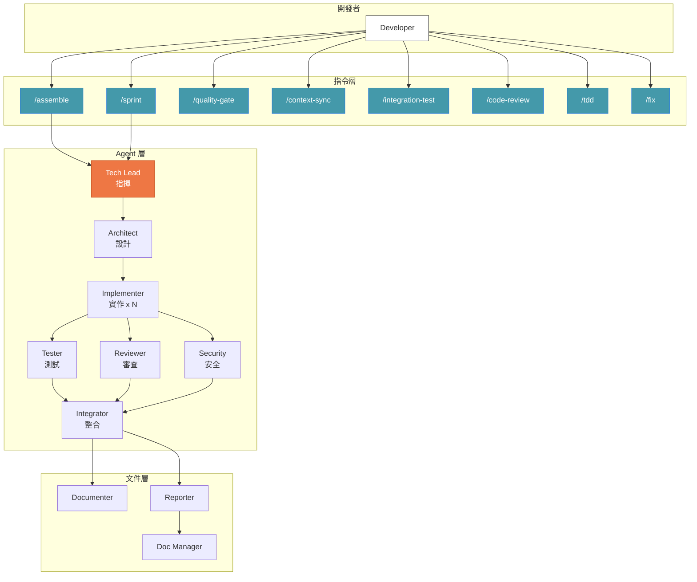

# Symbiotic Engineering — Agent Army

> AI Agent 大軍：讓單人開發者透過 Claude Code CLI 指揮多 Agent 團隊，涵蓋完整軟體開發生命週期。

## 前置條件

- [Claude Code CLI](https://docs.anthropic.com/en/docs/claude-code) 已安裝並可運行
- Claude Code Plugin 功能已啟用

## 安裝

### Step 1: 註冊 Marketplace 來源

在 Claude Code CLI 中執行：

```bash
/plugin marketplace add Muheng1992/symbiotic-engineering
```

這會將本 repo 註冊為 Plugin 來源。

### Step 2: 安裝 Agent Army Plugin

```bash
/plugin install agent-army@symbiotic-engineering
```

安裝後你會獲得 10 個 Agent 和 11 個 Skill（以 `/agent-army:` 命名空間前綴呼叫）。

### Step 3: 初始化專案

在你的目標專案中執行：

```bash
/agent-army:setup my-project
```

Setup 會自動完成以下工作：

| 項目 | 說明 |
|------|------|
| `docs/` 目錄結構 | 建立 reports、architecture、guides、archive 等子目錄 |
| `docs/INDEX.md` | 主文件索引，所有報告都會登記在此 |
| `.claude/CLAUDE.md` | 注入 Clean Architecture 標準與開發規範 |
| `.claude/settings.json` | 啟用 Agent Teams 環境變數與權限設定 |

### 驗證安裝

安裝完成後，嘗試執行以下指令確認一切正常：

```bash
# 查看可用指令
/agent-army:assemble --help

# 執行品質檢查
/agent-army:quality-gate all
```

## 包含什麼

### 10 個專責 Agent

| Agent | 角色 |
|-------|------|
| `tech-lead` | 團隊指揮、協調與委派（不直接寫碼） |
| `architect` | 系統設計、API 設計、資料建模 |
| `implementer` | 程式碼實作（可多個並行） |
| `tester` | 單元測試、整合測試、E2E 測試策略 |
| `reviewer` | Code Review、品質審查 |
| `documenter` | 文件撰寫 |
| `security-auditor` | OWASP 安全掃描 |
| `integrator` | 合併驗證、E2E 測試 |
| `doc-manager` | 文件歸檔、索引維護 |
| `reporter` | 結構化報告產生 |

### 11 個 Skill

| 指令 | 用途 |
|------|------|
| `/agent-army:assemble [功能描述]` | 集結 Agent 大軍開發功能 |
| `/agent-army:sprint [功能描述]` | Sprint 規劃與任務分解 |
| `/agent-army:quality-gate [範圍]` | 品質閘門（6 道檢查） |
| `/agent-army:context-sync [動作]` | 跨 Agent Context 管理 |
| `/agent-army:integration-test [範圍]` | 整合測試編排（5 階段流程） |
| `/agent-army:code-review [範圍]` | 程式碼審查編排（4 階段流程） |
| `/agent-army:setup [專案名稱]` | 初始化專案設定 |
| `/agent-army:retrospective` | Mission 結束後回顧學習 |
| `/agent-army:tdd [功能描述]` | TDD Red-Green-Refactor 強制執行 |
| `/agent-army:fix [錯誤描述]` | 智慧問題診斷與修復 |
| `dev-standards` | 開發標準（自動載入） |

## 系統架構概覽



## 快速使用

```
# 集結大軍開發功能
/agent-army:assemble implement user authentication with JWT

# Sprint 規劃
/agent-army:sprint add dashboard with charts and filters

# 品質檢查
/agent-army:quality-gate all
```

## 核心特性

- **並行開發** — 多個 Agent 同時處理不同檔案
- **Clean Architecture** — 自動強制依賴規則（Hooks + 標準）
- **完整報告** — Code Review、測試、安全審計全部文件化保留
- **Plan 追蹤** — 每個計畫的審核、拒絕、執行狀態皆可追溯
- **成本優化** — 文件類 Agent 用 Sonnet、推理類用 Opus
- **自我改善** — Mission 結束後自動回顧學習，持續優化 Agent 配置
- **對抗式審查** — Reviewer 和 Security Auditor 主動挑戰其他 Agent 的設計與實作
- **Worktree 隔離** — 多個 Implementer 在獨立 Git worktree 中安全並行
- **TDD 強制** — 測試先行，嚴格 Red-Green-Refactor 循環
- **智慧修復** — 自動診斷問題、選擇適當 Agent 修復
- **職責隔離** — Tech Lead 只協調不寫碼、Architect 只設計不實作

## 文件

- [系統設計文件](docs/AGENT-ARMY-DESIGN.md) — 架構設計與 Mermaid 圖
- [使用指南](docs/AGENT-ARMY-USAGE.md) — 完整教學

## License

MIT
