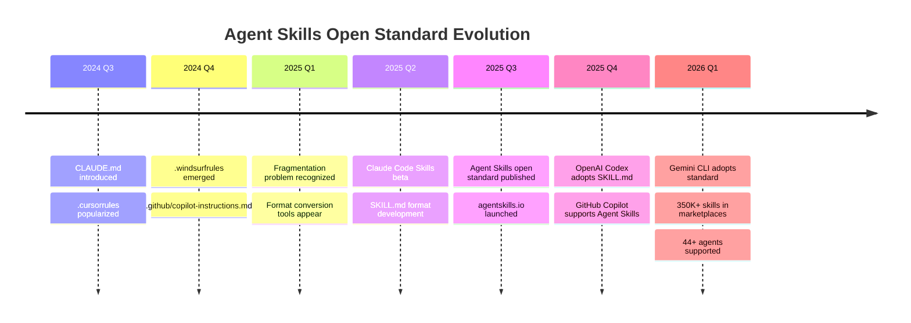
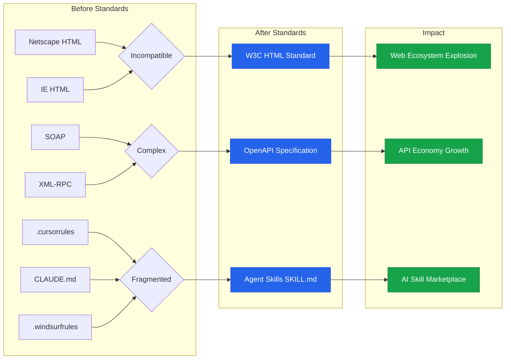
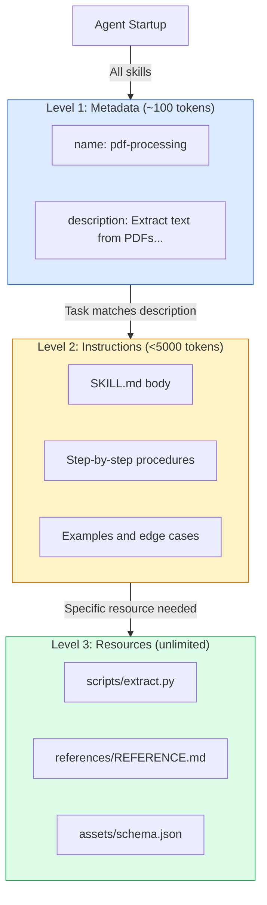
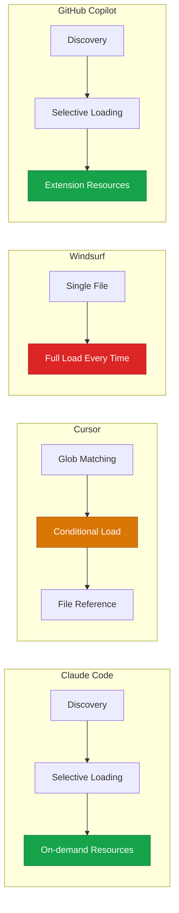
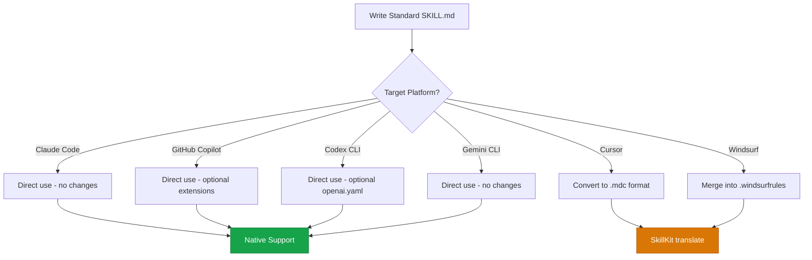
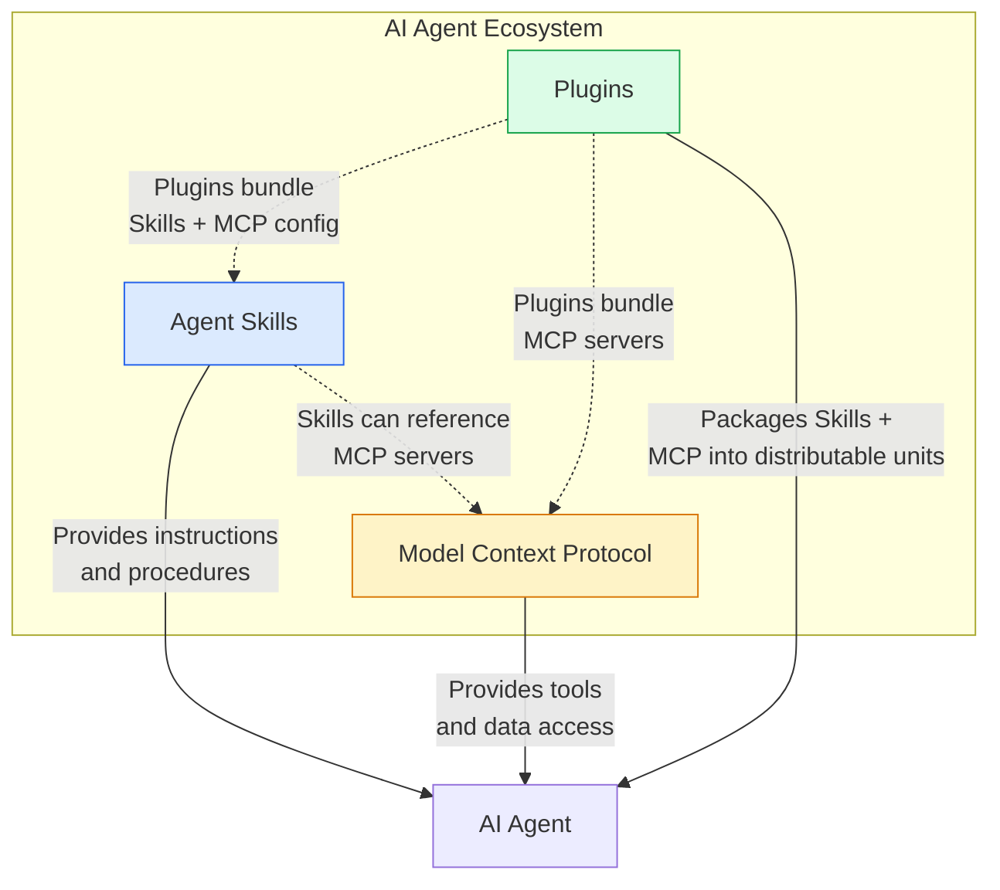

# Agent Skills 開放標準：跨工具 AI 指令的統一格式

> **當每個 AI 工具都有自己的指令格式，開發者就成了翻譯官。**
> Agent Skills 開放標準的出現，正如 HTML 統一了網頁、OpenAPI 統一了 API 文件——它要統一的，是 AI 時代的「技能語言」。



---

## 目錄

1. [為什麼需要開放標準](#1-為什麼需要開放標準)
2. [Agent Skills 規範深度解析](#2-agent-skills-規範深度解析)
3. [三層漸進式載入架構](#3-三層漸進式載入架構)
4. [25+ 工具採用情況實測](#4-25-工具採用情況實測)
5. [跨平台 Skill 撰寫技巧](#5-跨平台-skill-撰寫技巧)
6. [Skill 開發實戰](#6-skill-開發實戰)
7. [生態系展望](#7-生態系展望)
8. [安全性考量](#8-安全性考量)
9. [參考文獻](#9-參考文獻)

---

## 1. 為什麼需要開放標準

### 1.1 指令系統的碎片化現狀

2024-2025 年間，幾乎每一個 AI 編程工具都發明了自己的指令格式：

| 工具 | 指令檔案 | 格式 | 載入方式 |
|------|---------|------|---------|
| Claude Code | `CLAUDE.md` | Markdown | 啟動時全量載入 |
| Cursor | `.cursor/rules/*.mdc` | MDC (Markdown + Context) | Glob 匹配 / 手動 |
| Windsurf | `.windsurfrules` | Markdown | 每次提示全量載入 |
| GitHub Copilot | `.github/copilot-instructions.md` | Markdown | 每次對話載入 |
| Cline | `.clinerules/*` | Markdown | 啟動時載入 |
| Devin | `devin.md` | Markdown | 全量載入 |

這就像在 HTML 標準化之前，每家瀏覽器都有自己的標記語言——開發者被迫為每個平台維護一套指令。

> **碎片化的代價是真實的**：社群中出現了 [rule-porter](https://github.com/nedcodes-ok/rule-porter) 等格式轉換工具，專門在 Cursor、Windsurf、CLAUDE.md、AGENTS.md 和 Copilot 之間轉換規則。這本身就證明了標準化的迫切需求。

### 1.2 歷史類比：標準化的啟示



每一次重要的技術標準化都遵循相似的軌跡：

| 標準 | 碎片化時期 | 統一後的影響 |
|------|-----------|-------------|
| **HTML** (1993) | 各家瀏覽器自訂標記語言 | 統一的 Web 生態系爆發 |
| **RSS** (1999) | 內容聚合各自為政 | Podcast、新聞聚合器興起 |
| **OpenAPI** (2014) | SOAP vs REST vs 自訂格式 | API 經濟蓬勃發展 |
| **Agent Skills** (2025) | 每個 AI 工具一套指令格式 | 跨平台 Skill 生態系成形 |

OpenAPI 的歷史特別值得借鏡：2011 年 Swagger 誕生時只是一個開源工具，2014 年被捐贈給 Linux Foundation 成為 OpenAPI Initiative，最終成為 API 文件的事實標準。Agent Skills 正在走類似的路——由 Anthropic 發起，但以開放標準的形式開放給整個產業。

### 1.3 標準化的商業與技術價值

**對開發者**：
- 寫一次 Skill，在 44+ 個 AI 工具中使用
- 不再被單一工具綁定（vendor lock-in）
- 共享和複用社群知識

**對工具廠商**：
- 降低生態系建設成本
- 吸引已有 Skills 資產的使用者
- 聚焦在差異化功能而非指令格式

**對企業**：
- 統一管理 AI 工具的行為規範
- 降低多工具環境的維護成本
- 建立組織級知識資產

---

## 2. Agent Skills 規範深度解析

### 2.1 目錄結構

一個 Skill 的最小結構只需要一個目錄和一個 `SKILL.md` 檔案：

```
skill-name/
├── SKILL.md          # 必要：指令與 metadata
├── scripts/          # 可選：可執行腳本
│   ├── extract.py
│   └── validate.sh
├── references/       # 可選：參考文件
│   ├── REFERENCE.md
│   └── API.md
└── assets/           # 可選：靜態資源
    ├── templates/
    └── schemas/
```

### 2.2 SKILL.md 完整格式

SKILL.md 由兩個部分組成：**YAML Frontmatter**（metadata）和 **Markdown Body**（指令內容）。

#### 必要欄位

```yaml
---
name: pdf-processing
description: >
  Extract text and tables from PDF files, fill PDF forms,
  and merge multiple PDFs. Use when working with PDF documents
  or when the user mentions PDFs, forms, or document extraction.
---
```

#### 完整欄位規範

```yaml
---
name: code-review
description: >
  Perform comprehensive code reviews with security analysis,
  performance optimization, and best practice validation.
  Use when asked to review, audit, or analyze code quality.
license: Apache-2.0
compatibility: Requires git, jq, and access to the internet
metadata:
  author: example-org
  version: "2.0"
  tags: "security, performance, quality"
allowed-tools: Bash(git:*) Bash(jq:*) Read
---
```

各欄位的完整規範如下：

| 欄位 | 必要 | 限制 | 說明 |
|------|------|------|------|
| `name` | Yes | 1-64 字元，小寫字母、數字、連字號 | 必須與目錄名一致 |
| `description` | Yes | 1-1024 字元 | 描述用途和觸發時機 |
| `license` | No | 自由格式 | 授權條款 |
| `compatibility` | No | 1-500 字元 | 環境需求說明 |
| `metadata` | No | key-value 字串映射 | 額外的結構化資訊 |
| `allowed-tools` | No | 空格分隔的工具列表 | 預核准的工具清單（實驗性） |

#### `name` 欄位驗證規則

```
[OK]  pdf-processing        # 小寫 + 連字號
[OK]  data-analysis         # 小寫 + 連字號
[OK]  code-review           # 小寫 + 連字號
[NG]  PDF-Processing        # 不允許大寫
[NG]  -pdf                  # 不可以連字號開頭
[NG]  pdf--processing       # 不允許連續連字號
[NG]  pdf_processing        # 不允許底線
```

#### `description` 欄位最佳實踐

`description` 是 Agent 決定是否載入 Skill 的關鍵依據。好的 description 要同時說明「做什麼」和「何時使用」：

```yaml
# 好的範例 - 說明用途 + 觸發時機
description: >
  Extracts text and tables from PDF files, fills PDF forms,
  and merges multiple PDFs. Use when working with PDF documents
  or when the user mentions PDFs, forms, or document extraction.

# 差的範例 - 太模糊，Agent 無法有效匹配
description: Helps with PDFs.
```

### 2.3 各工具的擴展欄位對比

不同工具在標準規範之上增加了各自的擴展：

| 欄位 | Agent Skills 標準 | GitHub Copilot | OpenAI Codex | Cursor |
|------|-------------------|----------------|--------------|--------|
| `name` | Required | Required | Required | N/A (用檔名) |
| `description` | Required | Required | Required | `description` |
| `license` | Optional | -- | -- | -- |
| `compatibility` | Optional | -- | -- | -- |
| `metadata` | Optional | -- | `agents/openai.yaml` | -- |
| `allowed-tools` | Optional (experimental) | -- | `dependencies` | -- |
| `argument-hint` | -- | Optional | -- | -- |
| `user-invokable` | -- | Optional (default: true) | -- | -- |
| `disable-model-invocation` | -- | Optional (default: false) | `allow_implicit_invocation` | -- |
| `globs` | -- | -- | -- | Optional |

GitHub Copilot 額外支援了 `argument-hint`（斜線命令提示文字）、`user-invokable`（是否出現在 `/` 選單）和 `disable-model-invocation`（是否僅允許手動觸發）。

OpenAI Codex 則透過獨立的 `agents/openai.yaml` 檔案提供 UI 外觀、品牌色彩和 MCP 依賴等進階設定。

Cursor 完全走自己的路，使用 `.mdc` 格式搭配 `globs` 來控制檔案類型匹配。

### 2.4 Body Content 撰寫指南

Frontmatter 之後的 Markdown 內容沒有格式限制，但建議包含以下區塊：

- **Quick Start**：最常見的使用情境，3-5 步驟
- **Step-by-Step Instructions**：完整的操作步驟
- **Examples**：輸入/輸出範例
- **Edge Cases**：邊界情況的處理方式
- **References**：指向 `references/` 和 `scripts/` 的相對路徑連結

> **重要**：建議將主要的 `SKILL.md` 控制在 500 行以下、5000 tokens 以內。較長的內容應拆分到 `references/` 目錄中。

---

## 3. 三層漸進式載入架構

### 3.1 核心設計理念

Agent Skills 最精妙的設計是其三層漸進式載入（Progressive Disclosure）架構。這意味著 Agent 只在需要時才載入相關內容，而非一次把所有 Skill 的完整內容塞進 context window。



### 3.2 三層詳解

| 層級 | 載入時機 | Token 成本 | 內容 |
|------|---------|-----------|------|
| **Level 1: Metadata** | Agent 啟動時，全部 Skills | ~100 tokens / Skill | `name` + `description`（從 frontmatter） |
| **Level 2: Instructions** | 任務匹配 description 時 | < 5000 tokens | SKILL.md body 的完整指令 |
| **Level 3: Resources** | 指令引用到特定檔案時 | 有效無限制 | scripts、references、assets |

### 3.3 為什麼這個設計如此重要

假設你安裝了 50 個 Skills：

- **全量載入**：50 Skills x 5000 tokens = 250,000 tokens（超出大多數模型的 context window）
- **漸進式載入**：50 Skills x 100 tokens（metadata）= 5,000 tokens + 1-2 個被觸發的 Skill（10,000 tokens）= **僅 15,000 tokens**

這就是為什麼 Claude Code 可以流暢地處理 50+ 個並存的 Skills，而 Windsurf 在 10 個以上的規則時就開始出現 context 限制。

### 3.4 各工具載入機制比較



| 特性 | Claude Code | Cursor | Windsurf | GitHub Copilot |
|------|-----------|--------|----------|----------------|
| **載入策略** | 按需載入 | Glob 匹配 | 全量載入 | 按需載入 |
| **Context 效率** | 極高 | 中等 | 低 | 高 |
| **可擴展性** | 50+ Skills 無壓力 | Glob 定向中等 | 10+ 開始受限 | 50+ Skills |
| **觸發方式** | 自動 + 手動 | 自動 + 手動 + always | 始終載入 | 自動 + 斜線命令 |

---

## 4. 25+ 工具採用情況實測

### 4.1 採用總覽

Agent Skills 開放標準自 2025 年 Q3 發布以來，已被產業中的主要玩家採用。截至 2026 年 3 月，以下是各工具的支援程度：

| 工具 | 支援程度 | SKILL.md | Skill 目錄路徑 | 備註 |
|------|---------|----------|---------------|------|
| **Claude Code** | 原生完整 | Yes | `.claude/skills/` | 標準制定者 |
| **Claude.ai** | 原生完整 | Yes | 設定上傳 ZIP | 含預建 Skills (PPTX, XLSX...) |
| **Claude API** | 原生完整 | Yes | API 上傳 | 需 beta headers |
| **Claude Agent SDK** | 原生完整 | Yes | `.claude/skills/` | 需 `allowed_tools: ["Skill"]` |
| **GitHub Copilot** | 原生支援 | Yes | `.github/skills/` `.agents/skills/` | 擴充 argument-hint 等欄位 |
| **VS Code (Copilot)** | 原生支援 | Yes | `.github/skills/` `~/.copilot/skills/` | 支援 Extension 整合 |
| **OpenAI Codex CLI** | 原生支援 | Yes | `.agents/skills/` `~/.agents/skills/` | 額外 openai.yaml 設定 |
| **Gemini CLI** | 原生支援 | Yes | `.agents/skills/` | 2026 Q1 正式整合 |
| **Google Antigravity** | 原生支援 | Yes | `.agents/skills/` | 2026 年 1 月正式採用 |
| **Cursor** | 相容（需轉換） | 部分 | `.cursor/rules/` (.mdc) | SkillKit 可自動轉換 |
| **Windsurf** | 相容（需轉換） | 部分 | `.windsurfrules` | 需合併為單一檔案 |
| **Cline** | 相容 | Yes | `.clinerules/` | 社群支援 |
| **Aider** | 相容 | Yes | `.agents/skills/` | 社群支援 |
| **Amazon Q** | 相容 | Yes | `.agents/skills/` | 基本支援 |
| **OpenCode** | 原生支援 | Yes | `.agents/skills/` | 開源工具原生支援 |
| **fast-agent** | 原生支援 | Yes | `.agents/skills/` | 框架級支援 |

### 4.2 Claude Code：標準的發源地

Claude Code 是 Agent Skills 的第一實作者，支援最完整。Skills 存放於 `.claude/skills/`（專案級）或 `~/.claude/skills/`（個人級），每個 Skill 是一個包含 `SKILL.md` 的目錄。

特色：完整三層漸進式載入、自動觸發 + `/` 斜線命令手動調用、`allowed-tools` 預核准工具、與 Plugins 系統整合可透過 npm 分發。

### 4.3 GitHub Copilot：最大的第三方採用者

GitHub Copilot 在 VS Code 中的支援值得特別關注，因為它擴展了標準規範：

```yaml
---
name: webapp-testing
description: >
  Guide for testing web applications using Playwright.
  Use this when asked to create or run browser-based tests.
argument-hint: "Describe the page or feature to test"
user-invokable: true
disable-model-invocation: false
---
```

Copilot 的 Skill 發現路徑有三個優先級：
1. 專案級：`.github/skills/`、`.claude/skills/`、`.agents/skills/`
2. 個人級：`~/.copilot/skills/`、`~/.claude/skills/`、`~/.agents/skills/`
3. 自定路徑：透過 `chat.agentSkillsLocations` 設定

VS Code Extension 也可以透過 `package.json` 貢獻 Skills：

```json
{
  "contributes": {
    "chatSkills": [
      {
        "path": "./skills/my-skill/SKILL.md"
      }
    ]
  }
}
```

### 4.4 OpenAI Codex CLI：競爭對手的致敬

OpenAI 採用了相同的 SKILL.md 格式，但增加了 `agents/openai.yaml` 專屬設定層：

```yaml
# agents/openai.yaml - Codex 專屬擴展
interface:
  display_name: "Code Review Pro"
  icon: "shield"
  brand_color: "#4A90D9"
policy:
  allow_implicit_invocation: true
dependencies:
  mcp_servers:
    - name: "eslint-server"
      uri: "npx eslint-mcp-server"
```

Codex 掃描順序：Repository (`.agents/skills`) -> User (`$HOME/.agents/skills`) -> Admin (`/etc/codex/skills`) -> System bundled。

### 4.5 Gemini CLI：Google 的加入

Gemini CLI 自 2026 年初正式支援 Agent Skills，掃描 `.agents/skills/`（專案級）和 `~/.agents/skills/`（個人級）。它遵循標準 SKILL.md 格式，沒有額外自訂欄位，展現對開放標準的純粹遵守。

---

## 5. 跨平台 Skill 撰寫技巧

### 5.1 寫一次、到處用的策略

跨平台 Skill 的核心原則是：**以 Agent Skills 標準為基準，針對特定平台做降級處理**。



### 5.2 通用 Frontmatter 模板

以下是一個能在最多平台上運作的 frontmatter 模板：

```yaml
---
name: your-skill-name
description: >
  [What it does]. [When to use it].
  Use this skill when the user asks about [keywords].
license: Apache-2.0
compatibility: Designed for Claude Code (or similar products)
metadata:
  author: your-name
  version: "1.0"
---
```

**重點**：只使用標準規範中的欄位。平台特定欄位（如 Copilot 的 `argument-hint`）放在條件區塊中，或透過工具自動生成。

### 5.3 降級策略（Graceful Degradation）

| 情境 | 標準行為 | Cursor 降級 | Windsurf 降級 |
|------|---------|------------|--------------|
| 多檔案 Skill | scripts/ + references/ | 合併為單一 .mdc | 合併為 .windsurfrules 區段 |
| `allowed-tools` | 預核准工具清單 | 忽略（不支援） | 忽略（不支援） |
| 漸進式載入 | 三層按需載入 | Glob 匹配載入 | 全量載入 |
| 斜線命令 | `/skill-name` | 部分支援 | 不支援 |

### 5.4 使用 SkillKit 自動轉換

[SkillKit](https://github.com/rohitg00/skillkit) 是一個開源工具，可以在 44 個 Agent 之間自動轉換 Skill 格式：

```bash
# 安裝 SkillKit
npm install -g skillkit

# 初始化專案（偵測已安裝的 agents）
skillkit init

# 安裝一個 Skill（從 GitHub）
skillkit install github:anthropics/skills/code-review

# 轉換為 Cursor 格式
skillkit translate code-review --to cursor

# 同步到所有已偵測的 agents
skillkit sync

# 推薦適合你專案堆疊的 Skills
skillkit recommend
```

SkillKit 的 `translate` 指令可以處理格式差異：
- SKILL.md 到 Cursor `.mdc`：自動加入 `globs` 欄位
- SKILL.md 到 Windsurf：合併所有內容到單一檔案
- `.mdc` 到 SKILL.md：提取 frontmatter，重構目錄

---

## 6. Skill 開發實戰

### 6.1 實戰範例一：跨語言 Code Review Skill

這個 Skill 展示如何建立一個支援多語言的程式碼審查工具：

```
code-review/
├── SKILL.md
├── scripts/
│   ├── review.py
│   └── analyze.sh
└── references/
    └── CHECKLIST.md
```

**SKILL.md**：

```yaml
---
name: code-review
description: >
  Perform comprehensive code reviews with security analysis,
  performance checks, and best practice validation for TypeScript,
  Python, Go, Kotlin, and Swift. Use when asked to review code,
  check for bugs, or audit code quality.
license: Apache-2.0
metadata:
  author: symbiotic-engineering
  version: "1.0"
allowed-tools: Bash(git:*) Read
---
```

```markdown
# Multi-Language Code Review

## Review Process

1. Read the target file(s) completely
2. Run the analysis script for initial checks
3. Perform language-specific review based on the checklist
4. Output structured findings

## Language-Specific Checks

### TypeScript
- Verify strict mode is enabled
- Check for `any` type usage
- Validate error handling patterns
- Review async/await usage

### Python
- Check type hints coverage
- Validate docstring format (Google style)
- Review exception handling
- Check for f-string usage over .format()

### Go
- Verify error handling (no silent drops)
- Check goroutine leak potential
- Review interface compliance
- Validate context propagation

### Kotlin
- Check null safety usage
- Review coroutine scope management
- Validate sealed class exhaustiveness
- Check data class usage

### Swift
- Verify optional handling patterns
- Review actor isolation
- Check Sendable conformance
- Validate error type definitions

## Running Analysis

```bash
python scripts/review.py --file <target_file>
```

## Output Format

Present findings as a structured table:

| Severity | Location | Issue | Suggestion |
|----------|----------|-------|------------|
| HIGH | line:col | Description | Fix recommendation |

See [CHECKLIST.md](references/CHECKLIST.md) for the complete review checklist.
```

**scripts/review.py**（核心邏輯）：

```python
#!/usr/bin/env python3
"""Multi-language code review analysis script."""
import sys, re
from pathlib import Path

LANGUAGE_PATTERNS = {
    ".ts": {"any_usage": r"\bany\b", "console_log": r"console\.log\("},
    ".py": {"bare_except": r"except\s*:", "missing_type_hint": r"def \w+\([^:)]+\)"},
    ".go": {"error_ignored": r"\b_\s*=.*err", "naked_return": r"return\s*$"},
    ".kt": {"force_unwrap": r"!!\.", "platform_type": r": \w+!"},
    ".swift": {"force_unwrap": r"!\.", "force_try": r"try!"},
}

def analyze_file(filepath: str) -> list[dict]:
    suffix = Path(filepath).suffix
    if suffix not in LANGUAGE_PATTERNS:
        return []
    findings = []
    with open(filepath, "r") as f:
        for num, line in enumerate(f, 1):
            for name, pat in LANGUAGE_PATTERNS[suffix].items():
                if re.search(pat, line):
                    findings.append({"line": num, "issue": name, "code": line.strip()})
    return findings

if __name__ == "__main__":
    for r in analyze_file(sys.argv[2]):
        print(f"Line {r['line']}: [{r['issue']}] {r['code']}")
```

### 6.2 實戰範例二：Go 語言 API 腳手架 Skill

```yaml
---
name: go-api-scaffold
description: >
  Generate Go REST API scaffolding with Chi router, structured
  logging, and OpenAPI documentation. Use when creating new Go
  APIs, HTTP endpoints, or microservices.
metadata:
  author: symbiotic-engineering
  version: "1.0"
---
```

SKILL.md body 包含 Handler 模板和錯誤處理模式：

```go
// Handler Template - GET /api/v1/users/{id}
func (h *UserHandler) GetUser(w http.ResponseWriter, r *http.Request) {
    ctx := r.Context()
    id := chi.URLParam(r, "id")
    user, err := h.repo.FindByID(ctx, id)
    if err != nil {
        h.logger.ErrorContext(ctx, "failed to find user",
            slog.String("id", id), slog.Any("error", err))
        writeError(w, http.StatusNotFound, "NOT_FOUND", "user not found")
        return
    }
    w.Header().Set("Content-Type", "application/json")
    json.NewEncoder(w).Encode(user)
}

// Structured Error Response
type ErrorResponse struct {
    Code    string `json:"code"`
    Message string `json:"message"`
    Details any    `json:"details,omitempty"`
}
```

### 6.3 實戰範例三：Kotlin Multiplatform Skill

```yaml
---
name: kotlin-multiplatform
description: >
  Guide for building Kotlin Multiplatform (KMP) projects with
  shared business logic across Android, iOS, Desktop, and Web.
  Use when working with KMP, shared modules, or expect/actual patterns.
metadata:
  author: symbiotic-engineering
  version: "1.0"
---
```

SKILL.md body 核心內容——Expect/Actual 跨平台模式：

```kotlin
// commonMain - 共用宣告
expect class PlatformLogger() {
    fun log(message: String, level: LogLevel)
}
enum class LogLevel { DEBUG, INFO, WARN, ERROR }

// androidMain - Android 實作
actual class PlatformLogger {
    actual fun log(message: String, level: LogLevel) {
        when (level) {
            LogLevel.DEBUG -> Log.d("App", message)
            LogLevel.INFO -> Log.i("App", message)
            LogLevel.WARN -> Log.w("App", message)
            LogLevel.ERROR -> Log.e("App", message)
        }
    }
}

// iosMain - iOS 實作
actual class PlatformLogger {
    actual fun log(message: String, level: LogLevel) {
        NSLog("[${level.name}] $message")
    }
}
```

### 6.4 實戰範例四：Swift Concurrency Skill

```yaml
---
name: swift-concurrency
description: >
  Guide for Swift structured concurrency patterns including
  async/await, actors, task groups, and Sendable conformance.
  Use when writing concurrent Swift code or refactoring
  completion handlers to async/await.
metadata:
  author: symbiotic-engineering
  version: "1.0"
---
```

SKILL.md body 核心內容——Actor 與 TaskGroup 模式：

```swift
// Actor Pattern - 執行緒安全的狀態管理
actor AccountManager {
    private var accounts: [String: Account] = [:]
    func deposit(to id: String, amount: Decimal) throws {
        guard var account = accounts[id] else { throw AccountError.notFound(id) }
        account.balance += amount
        accounts[id] = account
    }
}

// TaskGroup - 平行工作
func fetchAllUserData(userIds: [String]) async throws -> [UserData] {
    try await withThrowingTaskGroup(of: UserData.self) { group in
        for id in userIds { group.addTask { try await self.fetchUser(id: id) } }
        var results: [UserData] = []
        for try await userData in group { results.append(userData) }
        return results
    }
}

// Migration: completion handler -> async/await
func fetchUser(id: String) async throws -> User {
    let (data, response) = try await URLSession.shared.data(from: url)
    guard let httpResponse = response as? HTTPURLResponse,
          httpResponse.statusCode == 200 else { throw NetworkError.invalidResponse }
    return try JSONDecoder().decode(User.self, from: data)
}
```

### 6.5 實戰範例五：Python Data Pipeline Skill

```yaml
---
name: data-pipeline
description: >
  Build robust data processing pipelines with validation,
  transformation, and error recovery. Use when creating
  ETL workflows, data cleaning scripts, or batch processing jobs.
license: Apache-2.0
metadata:
  author: symbiotic-engineering
  version: "1.0"
allowed-tools: Bash(python:*) Read
---
```

SKILL.md body 核心內容——可組合的 Pipeline 架構：

```python
@dataclass
class PipelineResult(Generic[T]):
    """Result of a pipeline stage."""
    data: T | None = None
    errors: list[str] = field(default_factory=list)
    metrics: dict[str, float] = field(default_factory=dict)

    @property
    def is_success(self) -> bool:
        return self.data is not None and len(self.errors) == 0

class Pipeline:
    """Composable data processing pipeline."""
    def __init__(self, name: str):
        self.name = name
        self.stages: list[tuple[str, Callable]] = []

    def add_stage(self, name: str, fn: Callable) -> "Pipeline":
        self.stages.append((name, fn))
        return self

    def execute(self, input_data) -> PipelineResult:
        current = input_data
        for stage_name, stage_fn in self.stages:
            try:
                result = stage_fn(current)
                if isinstance(result, PipelineResult) and not result.is_success:
                    return result
                current = result.data if isinstance(result, PipelineResult) else result
            except Exception as e:
                return PipelineResult(errors=[f"{stage_name}: {str(e)}"])
        return PipelineResult(data=current)

# Usage
pipeline = (Pipeline("user-etl")
    .add_stage("load", lambda _: pd.read_csv("users.csv"))
    .add_stage("validate", validate_schema)
    .add_stage("transform", transform_data)
    .add_stage("export", export_to_parquet))
result = pipeline.execute(None)
```

### 6.6 測試、驗證與發布

```bash
# 使用官方 skills-ref 驗證格式
python -m skills_ref validate ./my-skill/

# 使用 SkillKit 驗證 + 安全掃描
skillkit test ./my-skill/
skillkit scan ./my-skill/
```

驗證項目：Frontmatter 格式、`name` 命名規範與目錄名一致性、`description` 長度限制、檔案引用路徑。

發布管道：
- **skills.sh**（Vercel）：`npx skills add ./my-skill`，透過 GitHub PR 提交
- **SkillsMP**：確保 GitHub repo 有 SKILL.md，自動被索引
- **Claude Code Plugins**：`npm publish` 後透過 `/install-plugin` 安裝

---

## 7. 生態系展望

### 7.1 Marketplace 的現況與未來

截至 2026 年 3 月，Agent Skills 生態系已經形成多層次的市場：

| 平台 | Skills 數量 | 特色 |
|------|------------|------|
| [SkillsMP](https://skillsmp.com) | 350,000+ | 最大的社群目錄，智慧搜尋 + 分類 |
| [skills.sh](https://skills.sh) | 10,000+ | Vercel 維護，自動安全審計 |
| [AgentSkills.so](https://agentskills.so) | 5,000+ | AI 搜尋，依用例分類 |
| [awesome-agent-skills](https://github.com/VoltAgent/awesome-agent-skills) | 500+ | 社群精選，含官方 Skills |
| Claude Code Plugins | 200+ | npm 分發，版本管理 |

> **值得注意**：SkillsMP 是獨立社群專案，自動從 GitHub 索引公開的 Agent Skills。Vercel 的 skills.sh 則提供自動化安全審計，讓安裝過程更安全。

### 7.2 企業 Skill 管理

企業場景需要三個層級的 Skill 分發：組織級（合規、安全，強制安裝）、團隊級（工作流程、專案模板）、個人級（生產力工具、實驗性 Skills）。

目前各平台對企業管理的支援程度不同：

| 平台 | 共享範圍 | 分發方式 |
|------|---------|---------|
| Claude API | Workspace 級別 | API 上傳，所有成員可存取 |
| Claude.ai | 僅個人 | 各自上傳 ZIP |
| Claude Code | 專案級 | 透過 Git repo 共享 |
| GitHub Copilot | 專案級 | `.github/skills/` 隨 repo 分發 |

### 7.3 與 MCP、Plugins 的關係

Agent Skills 並非孤立存在，而是與其他擴展機制形成互補關係：



| 擴展機制 | 用途 | 技術特性 | 類比 |
|---------|------|---------|------|
| **Agent Skills** | 教 Agent「怎麼做」 | 檔案系統，Markdown + scripts | 操作手冊 |
| **MCP** | 給 Agent「用什麼工具」 | Client-server 協定，JSON-RPC | API 接口 |
| **Plugins** | 打包分發 Skills + MCP | npm/pip 套件，版本管理 | 應用商店 |

簡單來說：
- **Skills** 是知識和流程
- **MCP** 是工具和資料來源
- **Plugins** 是把 Skills 和 MCP 打包成可安裝的套件

未來展望：Anthropic 預期 Agent 最終將能夠**自主建立和評估自己的 Skills**——本質上讓 Agent 能夠「將自己的行為模式編碼為可重用的能力」。

### 7.4 開源社群的力量

社群在 Agent Skills 生態系中扮演關鍵角色：

- **[agentskills/agentskills](https://github.com/agentskills/agentskills)**：官方規範 repo，11.8K+ stars，Apache 2.0 授權
- **[anthropics/skills](https://github.com/anthropics/skills)**：Anthropic 官方參考實作
- **[VoltAgent/awesome-agent-skills](https://github.com/VoltAgent/awesome-agent-skills)**：社群精選的 500+ Skills
- **[rohitg00/skillkit](https://github.com/rohitg00/skillkit)**：跨 44 平台的 Skill 管理工具
- **[sickn33/antigravity-awesome-skills](https://github.com/sickn33/antigravity-awesome-skills)**：900+ 個 battle-tested Skills

---

## 8. 安全性考量

### 8.1 安全風險

Agent Skills 的強大也帶來安全風險。Skills 可以指示 Agent 執行程式碼、存取檔案系統、發起網路請求——惡意 Skill 可能造成嚴重損害。

> **Anthropic 官方警告**：「僅從受信任的來源安裝 Skills。Skills 透過指令和程式碼為 Claude 提供新能力，惡意 Skill 可能導致資料外洩、未授權的系統存取或其他安全風險。」

關鍵安全考量：
- **審計所有檔案**：檢查 SKILL.md、scripts、assets 中的所有內容
- **外部資源風險**：從外部 URL 獲取資料的 Skills 風險特別高
- **工具濫用**：惡意 Skills 可以利用檔案操作、bash 命令造成傷害
- **資料暴露**：有權存取敏感資料的 Skills 可能被設計來洩漏資訊

### 8.2 安全防護措施與最佳實踐

安全工具生態：
- **[skills.sh](https://skills.sh/audits)**：安裝時自動顯示風險等級和審計結果
- **[SkillAudit](https://skillaudit.vercel.app/)**：AI 驅動的安全掃描器
- **SkillKit scan**：整合式安全掃描，檢測 prompt injection、硬編碼密鑰

企業最佳實踐：
1. 所有外部 Skills 需經安全團隊審查
2. 使用私有 Skill Registry，不從公開 marketplace 直接安裝
3. 明確宣告 `allowed-tools`，限制 Skill 可用工具
4. 記錄 Agent 在 Skill 啟用期間的所有操作
5. 鎖定 Skill 版本，避免供應鏈攻擊

> **警示數據**：截至 2026 年已有 341+ 個惡意 Skills 透過公開 registry 被推送給 172K+ 使用者。企業必須嚴肅看待 Skill 供應鏈安全。

---

## 9. 參考文獻

1. [Agent Skills Specification](https://agentskills.io/specification) — Agent Skills 官方規範文件
2. [Equipping agents for the real world with Agent Skills](https://claude.com/blog/equipping-agents-for-the-real-world-with-agent-skills) — Anthropic 官方工程部落格
3. [Agent Skills - Claude API Docs](https://platform.claude.com/docs/en/agents-and-tools/agent-skills/overview) — Claude 平台 Agent Skills 完整文件
4. [Use Agent Skills in VS Code](https://code.visualstudio.com/docs/copilot/customization/agent-skills) — GitHub Copilot Agent Skills 支援文件
5. [Agent Skills - OpenAI Codex](https://developers.openai.com/codex/skills/) — OpenAI Codex CLI 的 Agent Skills 支援
6. [Agent Skills - Gemini CLI](https://geminicli.com/docs/cli/skills/) — Gemini CLI 的 Agent Skills 支援
7. [agentskills/agentskills GitHub Repository](https://github.com/agentskills/agentskills) — 規範原始碼與文件（11.8K+ stars）
8. [skill.md: An open standard for agent skills](https://www.mintlify.com/blog/skill-md) — Mintlify 的 Skill.md 標準實作
9. [Claude Code vs Cursor vs Windsurf: which IDE handles AI skills best?](https://killer-skills.com/en/blog/claude-code-vs-cursor-vs-windsurf/) — 三大工具 Skills 處理方式比較
10. [SkillKit - Cross-platform Skill Manager](https://github.com/rohitg00/skillkit) — 44 平台 Skill 轉換管理工具
11. [SkillsMP - Agent Skills Marketplace](https://skillsmp.com) — 最大的 Agent Skills 市場（350K+ Skills）
12. [skills.sh - The Agent Skills Directory](https://skills.sh/) — Vercel 維護的 Skills 目錄
13. [Automated security audits for skills.sh](https://vercel.com/changelog/automated-security-audits-now-available-for-skills-sh) — Vercel 的安全審計機制
14. [VoltAgent/awesome-agent-skills](https://github.com/VoltAgent/awesome-agent-skills) — 社群精選 500+ Agent Skills
15. [rule-porter](https://github.com/nedcodes-ok/rule-porter) — AI IDE 規則格式轉換工具
16. [Beyond Prompt Engineering: Using Agent Skills in Gemini CLI](https://medium.com/google-cloud/beyond-prompt-engineering-using-agent-skills-in-gemini-cli-04d9af3cda21) — Google Cloud 的 Agent Skills 指南
17. [Codex CLI & Agent Skills Guide 2026](https://itecsonline.com/post/codex-cli-agent-skills-guide-install-usage-cross-platform-resources-2026) — Codex CLI 完整指南
18. [Best AI agent skills for Claude, Cursor, and Windsurf in 2026](https://killer-skills.com/en/blog/best-ai-agent-skills-2026/) — 2026 年最佳 Agent Skills 評比
19. [Agent Skills: The Open Standard for Custom AI Capabilities](https://www.bishoylabib.com/posts/claude-skills-comprehensive-guide) — 完整技術指南
20. [SkillAudit - AI Agent Security Scanner](https://skillaudit.vercel.app/) — Skill 安全掃描工具

---

*最後更新：2026-03-04 | 基於 Claude Code v2.1+ 和 Agent Skills 開放標準*
