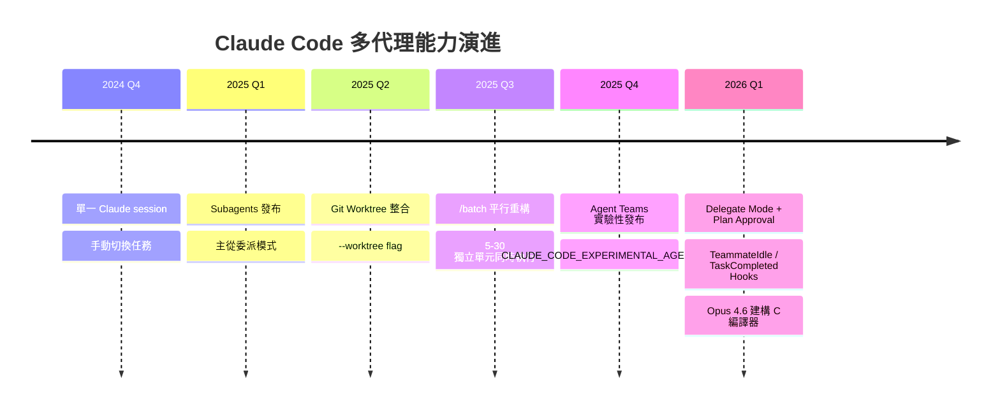
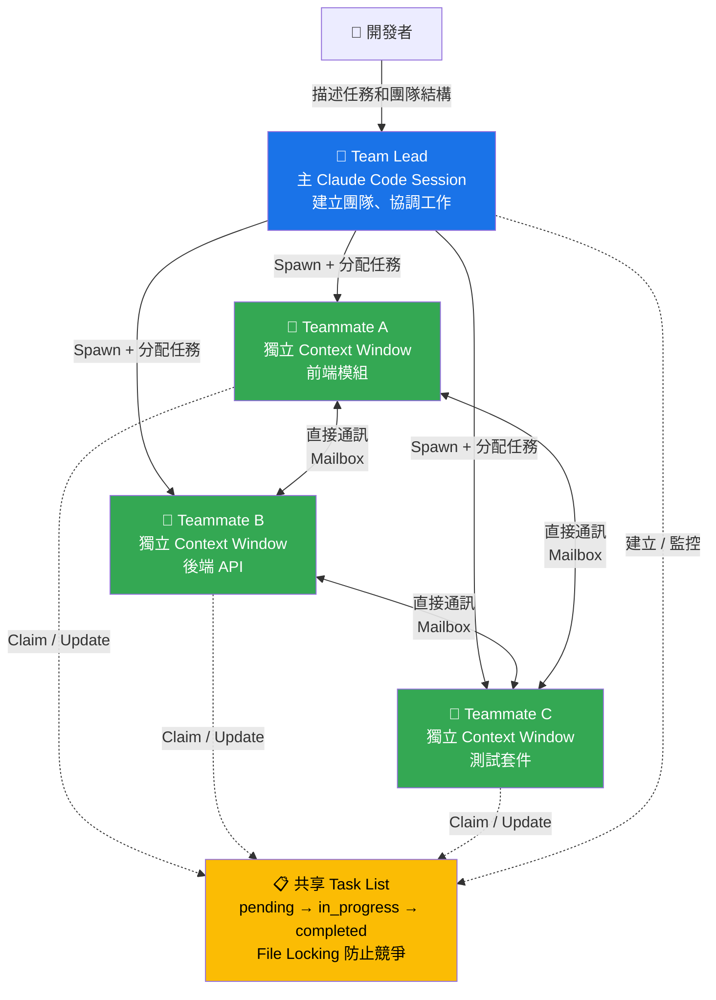
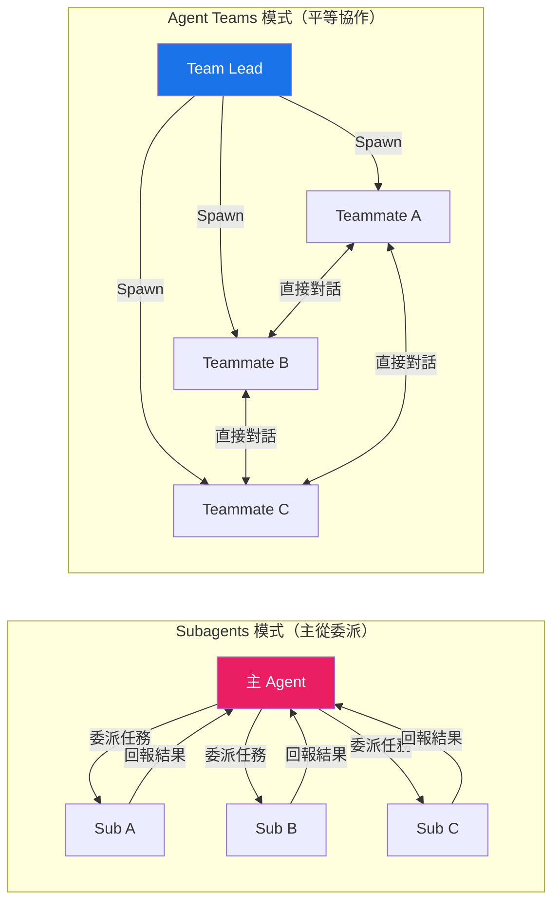
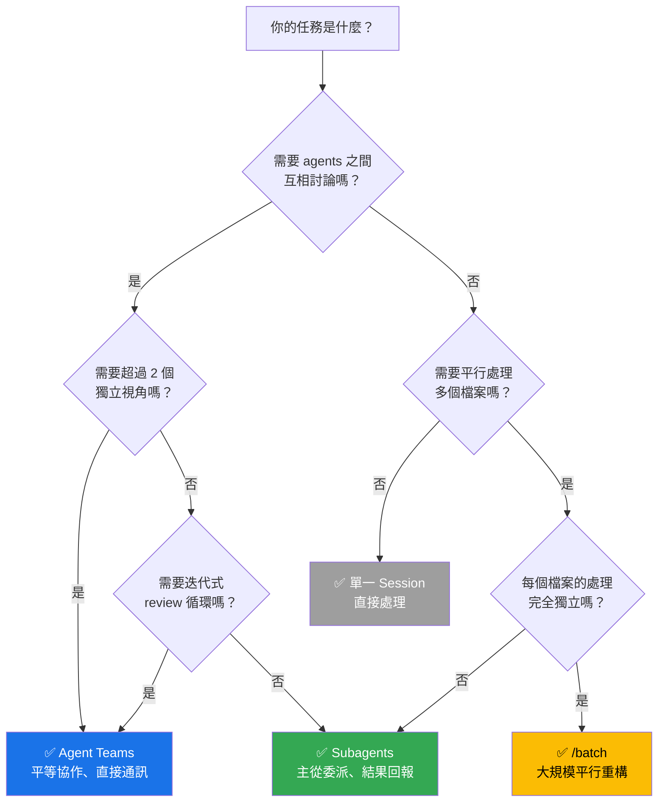
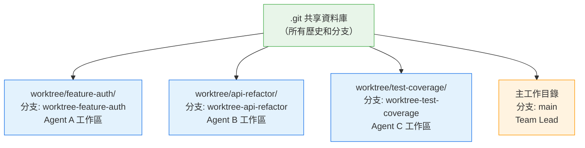
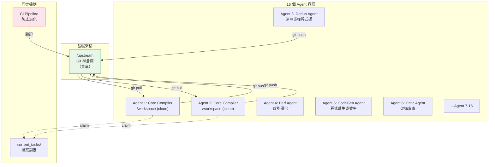
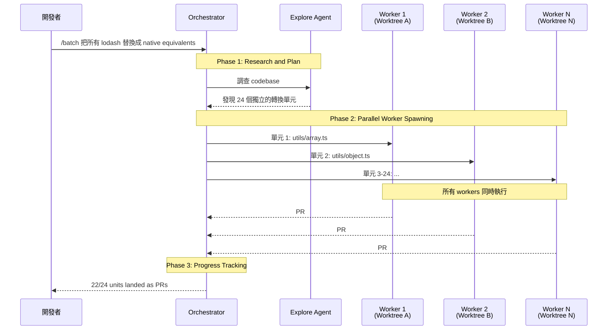
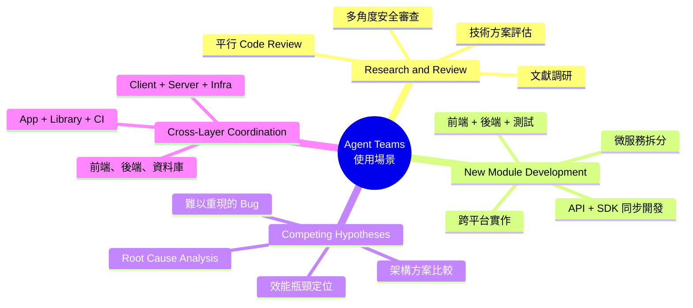
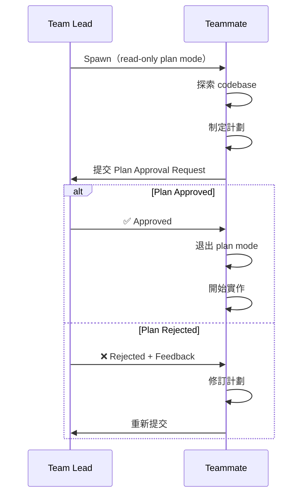

# Agent Teams + Git Worktree：多代理平行開發實戰指南

> **當一個 AI 不夠用，就召喚一整個團隊。**
> **Agent Teams 讓多個 Claude 實例在你的 codebase 上平行工作、自動分工、互相審查——這是 2026 年最具革命性的開發模式。**



---

## 目錄

1. [Agent Teams 是什麼](#1-agent-teams-是什麼)
2. [Agent Teams vs Subagents：本質差異](#2-agent-teams-vs-subagents本質差異)
3. [Git Worktree 原生支援](#3-git-worktree-原生支援)
4. [實戰案例：用 16 個 Agent 建 C 編譯器](#4-實戰案例用-16-個-agent-建-c-編譯器)
5. [`/batch` 大規模平行重構](#5-batch-大規模平行重構)
6. [使用模式與最佳實踐](#6-使用模式與最佳實踐)
7. [進階控制：Delegate Mode、Hooks 與 Plan Approval](#7-進階控制delegate-modehooks-與-plan-approval)
8. [限制與風險](#8-限制與風險)
9. [參考文獻](#9-參考文獻)

---

## 1. Agent Teams 是什麼

### 1.1 一句話定義

**Agent Teams 是讓多個獨立的 Claude Code 實例以平等團隊的方式協作，擁有共享的任務列表和直接通訊能力。**

把它想成是你的 AI 開發部門——有 Team Lead 分配工作，有 Teammates 各自負責不同模組，完成後互相審查，全程不需要你當中間人。

### 1.2 核心架構



### 1.3 核心組件

| 組件 | 說明 |
|------|------|
| **Team Lead** | 主 Claude Code session，負責建立團隊、生成 teammates、協調工作 |
| **Teammates** | 獨立運行的 Claude Code 實例，各自擁有獨立的 context window |
| **Task List** | 共享的工作項目清單，teammates 可自行 claim 並完成任務 |
| **Mailbox** | Agent 之間的通訊系統，支援一對一和廣播 |

### 1.4 啟用方式

Agent Teams 目前是**實驗性功能**，需要手動啟用：

```json
// .claude/settings.json
{
  "env": {
    "CLAUDE_CODE_EXPERIMENTAL_AGENT_TEAMS": "1"
  }
}
```

或透過環境變數：

```bash
export CLAUDE_CODE_EXPERIMENTAL_AGENT_TEAMS=1
```

### 1.5 啟動你的第一個團隊

用自然語言告訴 Claude 你想要的團隊結構：

```text
我正在設計一個 CLI 工具來追蹤 codebase 中的 TODO 註解。
建立一個 agent team 從不同角度探索：
一個 teammate 負責 UX 設計，
一個負責技術架構，
一個扮演 devil's advocate 挑戰方案。
```

Claude 會自動建立團隊、生成 teammates、分配任務，並在完成後整合發現。

---

## 2. Agent Teams vs Subagents：本質差異

### 2.1 對比總覽



### 2.2 詳細比較

| 面向 | Subagents | Agent Teams |
|------|-----------|-------------|
| **Context** | 自己的 context window，結果摘要回傳 | 自己的 context window，完全獨立 |
| **通訊方向** | 單向：只能回報給主 agent | 雙向：teammates 可直接互相通訊 |
| **協調方式** | 主 agent 集中管理所有工作 | 共享 task list，自我協調 |
| **適合場景** | 聚焦任務，只需結果 | 需要討論和協作的複雜工作 |
| **Token 成本** | 較低：結果摘要回傳主 context | 較高：每個 teammate 是獨立 Claude 實例 |
| **隔離機制** | 可設定 `isolation: worktree` | 各自 context window + 可搭配 worktree |
| **生命週期** | 完成即銷毀 | 持續運行直到 lead 關閉 |

### 2.3 決策樹：何時用哪個



### 2.4 實際選擇範例

| 場景 | 推薦方式 | 原因 |
|------|---------|------|
| 搜尋 codebase 中的安全漏洞 | Subagent | 只需結果，不需討論 |
| 三人 code review（安全、效能、測試） | Agent Teams | 需要多角度交叉審查 |
| 將 100 個檔案從 React 遷移到 Vue | /batch | 完全獨立的平行處理 |
| 前端 + 後端 + 測試同步開發 | Agent Teams | 需要跨層協調 |
| 生成一份技術文件 | Subagent | 聚焦任務，結果回報即可 |
| 除錯一個難以重現的 bug | Agent Teams | 需要競爭假設和互相反駁 |

---

## 3. Git Worktree 原生支援

### 3.1 為什麼需要 Worktree

當多個 agent 同時修改同一個 repository，最大的問題是**檔案衝突**。Git Worktree 的原生支援解決了這個問題——每個 agent 都在自己的工作目錄中操作，共享同一個 `.git` 資料庫。



### 3.2 使用方式

#### 直接啟動 Worktree Session

```bash
# 建立名為 "feature-auth" 的 worktree 並啟動 Claude
claude --worktree feature-auth

# 建立另一個平行 session
claude --worktree bugfix-123

# 自動生成名稱（如 "bright-running-fox"）
claude --worktree
```

每個 worktree 會建立在 `<repo>/.claude/worktrees/<name>` 目錄下，並自動建立 `worktree-<name>` 分支。

#### 在 Subagent 中使用 Worktree 隔離

在 Skill 或 Subagent 的 frontmatter 中設定：

```yaml
---
isolation: worktree
---
這個 subagent 會在獨立的 worktree 中工作，完成後合併回主分支。
```

或在對話中直接說：

```text
Use worktrees for your agents
```

### 3.3 Worktree 生命週期

| 情境 | 行為 |
|------|------|
| Agent 完成，**無更改** | Worktree 和分支自動移除 |
| Agent 完成，**有 commits** | Claude 詢問保留或移除 |
| Session 異常結束 | Worktree 保留在磁碟上 |

### 3.4 手動管理 Worktree

```bash
# 建立新分支的 worktree
git worktree add ../project-feature-a -b feature-a

# 使用既有分支
git worktree add ../project-bugfix bugfix-123

# 在 worktree 中啟動 Claude
cd ../project-feature-a && claude

# 列出所有 worktree
git worktree list

# 清理
git worktree remove ../project-feature-a
```

### 3.5 重要：.gitignore 設定

```gitignore
# 忽略 Claude 自動建立的 worktree 目錄
.claude/worktrees/
```

### 3.6 非 Git 版本控制系統

透過 `WorktreeCreate` 和 `WorktreeRemove` hooks，可以支援 SVN、Perforce、Mercurial 等版本控制系統：

```json
{
  "hooks": {
    "WorktreeCreate": [
      {
        "hooks": [
          {
            "type": "command",
            "command": "bash -c 'svn checkout $SVN_URL /tmp/worktree-$(jq -r .name)'"
          }
        ]
      }
    ],
    "WorktreeRemove": [
      {
        "hooks": [
          {
            "type": "command",
            "command": "bash -c 'jq -r .worktree_path | xargs rm -rf'"
          }
        ]
      }
    ]
  }
}
```

---

## 4. 實戰案例：用 16 個 Agent 建 C 編譯器

### 4.1 專案背景

Anthropic 工程師 Nicholas Carlini 使用 **16 個平行 Claude 實例**，在兩週內建構了一個能編譯 Linux Kernel 的 C 編譯器。這不是使用官方 Agent Teams 功能（當時尚未發布），而是自建的 Docker + Git bare repo 架構——但它完美展示了多代理平行開發的威力和模式。

### 4.2 數據一覽

| 指標 | 數值 |
|------|------|
| 語言 | Rust（僅依賴標準庫，clean-room） |
| 程式碼行數 | **100,000 行** |
| Claude Code sessions | 約 **2,000 個** |
| 輸入 tokens | **20 億**（2 billion） |
| 輸出 tokens | **1.4 億**（140 million） |
| 總 API 成本 | **$20,000 美元** |
| 時間 | **2 週** |
| 平行 agents | **16 個** |

### 4.3 架構設計



#### 任務鎖定協議

Agents 通過寫入文字檔案到 `current_tasks/` 目錄來 claim 任務：

```
current_tasks/parse_if_statement.txt
current_tasks/codegen_function_definition.txt
current_tasks/optimize_register_allocation.txt
```

Git 同步機制在 agents 嘗試相同任務時強制衝突，迫使重新導向。完成後移除鎖定檔案。

#### 持續執行迴圈

```bash
#!/bin/bash
while true; do
  COMMIT=$(git rev-parse --short=6 HEAD)
  claude --model claude-opus-4-6 \
    -p "根據 TODO 列表選擇下一個任務，完成後 push 回 upstream"
done
```

### 4.4 專業化分工策略

16 個 agent 並非全部做同樣的事，而是**專業化分工**：

| Agent 類型 | 數量 | 職責 |
|-----------|------|------|
| Core Compiler | 8-10 | 解決主要編譯挑戰（解析、codegen 等） |
| Dedup Agent | 1 | 消除跨模組的重複程式碼 |
| Perf Agent | 1 | 編譯器效能優化 |
| CodeGen Agent | 1 | 機器碼生成效率提升 |
| Critic Agent | 1 | 從 Rust 開發者角度批評和改進架構 |
| Doc Agent | 1 | 文件管理 |
| Quality Agent | 1 | 程式碼品質監督 |

### 4.5 編譯成果

成功編譯的專案：

- **Linux kernel 6.9**（可在 x86、ARM、RISC-V 上啟動）
- QEMU
- FFmpeg
- SQLite
- PostgreSQL
- Redis
- **Doom**（可以編譯並執行）
- GCC torture test 達到 **99% 通過率**

### 4.6 關鍵教訓

> 「Claude 會自主工作來解決我給它的任何問題。因此，任務驗證器必須近乎完美——否則 Claude 會解決錯誤的問題。」
> — Nicholas Carlini

**三大教訓：**

1. **測試品質至上**：CI pipeline 是防止退化的關鍵。不是給 agent 更多自由，而是給它更嚴格的驗證
2. **Context Window 管理**：不直接輸出大量資料，而是將結果記錄到檔案。錯誤標記為 `ERROR` 在同一行，方便 grep
3. **模型能力是瓶頸**：Opus 4.0 幾乎無法產生功能正常的編譯器；Opus 4.5 首次跨越門檻但無法編譯大型專案；Opus 4.6 才達到生產級能力

### 4.7 平行化突破策略

當 99% 測試通過後，所有 agents 在編譯 Linux kernel 時遇到相同 bugs，互相阻塞。突破方法：

```
使用 GCC 作為 "online known-good compiler oracle"
→ 隨機用 GCC 編譯部分 kernel 檔案
→ 只用 Claude 的編譯器處理剩餘檔案
→ 如果編譯成功，問題不在 Claude 的子集中
→ 不同 agents 可以平行除錯不同檔案
```

這個策略將原本序列化的瓶頸變成了可平行化的問題。

---

## 5. `/batch` 大規模平行重構

### 5.1 什麼是 /batch

`/batch` 是 Claude Code 的內建指令，用於將大規模重構任務自動拆解為 5-30 個獨立單元，每個單元在自己的 Git Worktree 中平行執行，最終各自產生 PR。

### 5.2 三階段處理模型



### 5.3 使用語法

```text
/batch migrate from React to Vue
/batch replace all uses of lodash with native equivalents
/batch add type annotations to all untyped function parameters
/batch update all API endpoints from v2 to v3
```

### 5.4 適合 /batch 的場景

| 場景 | 適合度 | 原因 |
|------|--------|------|
| 框架遷移（React → Vue） | ✅ 極佳 | 每個元件獨立轉換 |
| API 版本升級 | ✅ 極佳 | 每個 endpoint 獨立更新 |
| 大規模重命名 | ✅ 極佳 | 檔案間無依賴 |
| 新增型別註解 | ✅ 極佳 | 每個檔案獨立處理 |
| 資料庫 schema 遷移 | ❌ 不適合 | 有強烈的跨檔案依賴 |
| 新功能開發（有互相依賴） | ❌ 不適合 | Agent A 建立的 utility，Agent B 需要 import |

### 5.5 /batch vs Agent Teams

| 面向 | /batch | Agent Teams |
|------|--------|-------------|
| **工作模式** | 自動拆解 + 平行執行 | 人工描述團隊結構 |
| **通訊** | Workers 完全獨立 | Teammates 可直接溝通 |
| **產出** | 每個單元一個 PR | 共同完成一個目標 |
| **適合** | 重複性、獨立性高的批量修改 | 需要協作和討論的複雜工作 |
| **隔離** | 自動 Git Worktree | 可選 Worktree |

---

## 6. 使用模式與最佳實踐

### 6.1 適合 Agent Teams 的四大場景



### 6.2 Prompt 設計範例

#### 平行 Code Review

```text
Create an agent team to review PR #142. Spawn three reviewers:
- One focused on security implications
- One checking performance impact
- One validating test coverage
Have them each review and report findings.
```

#### 競爭假設除錯

```text
使用者回報 app 在第一條訊息後就斷開連線。
Spawn 5 個 agent teammates 調查不同假設。
讓他們互相對話，嘗試推翻彼此的理論——像科學辯論一樣。
把最終共識寫入 findings.md。
```

#### 跨層協調開發

```text
Create a team with 3 teammates to implement the payment module:
- Backend: src/api/payment/ (Express endpoints + Stripe integration)
- Frontend: src/components/Payment/ (React components)
- Tests: tests/payment/ (unit + integration tests)
Use Sonnet for each teammate. Require plan approval before implementation.
```

### 6.3 團隊規模建議

| 團隊大小 | 適合場景 | 注意事項 |
|---------|---------|---------|
| 2-3 | Code review、簡單功能開發 | 入門推薦，容易管理 |
| 3-5 | 中型功能、多角度調查 | **最佳甜蜜點** |
| 5-8 | 大型重構、多模組開發 | 需要清晰的模組邊界 |
| 8+ | 只在 C 編譯器等級的專案使用 | 邊際效益顯著遞減 |

> **經驗法則**：每個 teammate 分配 **5-6 個 tasks**，三個專注的 teammates 通常勝過五個分散的。

### 6.4 CLAUDE.md 團隊優化

在使用 Agent Teams 時，CLAUDE.md 的寫法直接影響效率。三個關鍵規則：

#### 規則一：明確定義模組邊界

```markdown
## Independent Modules

| Module  | Directory       | Notes                    |
| ------- | --------------- | ------------------------ |
| API     | src/api/        | Each file is independent |
| CLI     | src/cli/        | Core logic               |
| Website | docs/           | Static content           |

**Shared files (coordinate before editing):**
- package.json
- tsconfig.json
- schema.prisma
```

Claude 會根據這些邊界智慧分配檔案給不同 teammates，減少衝突。

#### 規則二：保持簡短的操作性 Context

```markdown
## Project Overview
- Stack: TypeScript, Express, PostgreSQL, React
- Entry: src/index.ts
- Test: npm test
- Build: npm run build
- DB: PostgreSQL 15, migrations in prisma/
```

短而精確的描述讓 teammates 快速理解專案，而不是每次都花 tokens 去探索。

#### 規則三：定義驗證方式

```markdown
## Verification
- `npm test` — all tests must pass
- `npm run lint` — zero errors
- `npm run build` — successful compilation
```

Teammates 完成工作後會自行驗證，不需要 lead 介入。

### 6.5 顯示模式選擇

| 模式 | 設定 | 需求 | 適合 |
|------|------|------|------|
| **In-process** | `"teammateMode": "in-process"` | 任何終端機 | 預設推薦 |
| **Split panes** | `"teammateMode": "tmux"` | tmux 或 iTerm2 | 同時監控多個 agent |

**In-process 快捷鍵：**
- `Shift+Down`：切換到下一個 teammate
- `Enter`：查看 teammate 的完整 session
- `Escape`：中斷 teammate 當前工作
- `Ctrl+T`：切換 task list 顯示

---

## 7. 進階控制：Delegate Mode、Hooks 與 Plan Approval

### 7.1 Delegate Mode

按 `Shift+Tab` 啟用 Delegate Mode，限制 lead 只能做協調工作：

- ✅ Spawn teammates
- ✅ 發送訊息
- ✅ 管理 task list
- ✅ Shutdown teammates
- ❌ 直接修改程式碼

> 「Lead 不能碰程式碼，完全專注於編排。」這在 4+ 個 teammates 的場景特別有效，防止 lead 搶 teammates 的活。

### 7.2 Plan Approval 工作流

對於複雜或高風險任務，可以要求 teammates 先提交計劃：

```text
Spawn an architect teammate to refactor the authentication module.
Require plan approval before they make any changes.
Only approve plans that include test coverage.
Reject plans that modify the database schema without migrations.
```

#### 流程



### 7.3 Hooks 品質門禁

Agent Teams 整合了兩個專用的 hook events：

#### TeammateIdle Hook

當 teammate 即將閒置時觸發。Exit code 2 可以阻止閒置並給予反饋：

```json
{
  "hooks": {
    "TeammateIdle": [
      {
        "hooks": [
          {
            "type": "command",
            "command": "/path/to/check-remaining-work.sh"
          }
        ]
      }
    ]
  }
}
```

```bash
#!/bin/bash
# check-remaining-work.sh
INPUT=$(cat)
TEAMMATE=$(echo "$INPUT" | jq -r '.teammate_name')

# 檢查是否還有剩餘任務
REMAINING=$(grep -rc "TODO\|FIXME" src/ 2>/dev/null || echo "0")
if [ "$REMAINING" -gt 0 ]; then
  echo "Found $REMAINING TODO/FIXME items. Please address them." >&2
  exit 2  # 阻止閒置，繼續工作
fi

exit 0  # 允許閒置
```

#### TaskCompleted Hook

當任務被標記為完成時觸發。Exit code 2 可以阻止完成並要求修正：

```json
{
  "hooks": {
    "TaskCompleted": [
      {
        "hooks": [
          {
            "type": "command",
            "command": "/path/to/quality-gate.sh"
          }
        ]
      }
    ]
  }
}
```

```bash
#!/bin/bash
# quality-gate.sh — 強制測試通過才能完成任務
INPUT=$(cat)
TASK_SUBJECT=$(echo "$INPUT" | jq -r '.task_subject')

if ! npm test 2>&1; then
  echo "Tests not passing. Fix failing tests before completing: $TASK_SUBJECT" >&2
  exit 2  # 阻止任務完成
fi

exit 0  # 允許完成
```

### 7.4 通訊機制

| 方式 | 說明 | 成本 |
|------|------|------|
| **message** | 發送給一個特定 teammate | 低 |
| **broadcast** | 同時發送給所有 teammates | 隨團隊大小線性增長 |
| **idle notification** | Teammate 完成時自動通知 lead | 自動 |
| **task list** | 所有 agents 可見的共享狀態 | 最低 |

> **謹慎使用 broadcast**：3 個 teammates 的 broadcast = 3x token 成本。只在真正需要所有人知道的資訊才用。

---

## 8. 限制與風險

### 8.1 已知限制

| 限制 | 影響 | 因應策略 |
|------|------|---------|
| **實驗性功能** | 穩定性尚未完全驗證 | 重要工作做好備份 |
| **無法恢復 teammates** | `/resume` 和 `/rewind` 不會恢復 teammates | 重新 spawn |
| **任務狀態可能滯後** | Teammates 有時忘記標記任務完成 | 手動更新或 nudge |
| **關閉速度慢** | Teammates 需完成當前請求才能關閉 | 提前規劃 shutdown |
| **每個 session 一個團隊** | Lead 一次只能管理一個團隊 | 需要多團隊時用多個終端機 |
| **不支援巢狀團隊** | Teammates 不能生成自己的團隊 | 只有 Lead 可管理 |
| **Split panes 限制** | 不支援 VS Code Terminal、Windows Terminal、Ghostty | 使用 tmux 或 iTerm2 |

### 8.2 Token 成本分析

Agent Teams 的 token 消耗顯著高於單一 session：

| 模式 | Token 倍數 | 月均成本估算 |
|------|-----------|-------------|
| 單一 Session | 1x | $100-200/月 |
| 3 Teammates (Sonnet) | ~3-4x | $300-800/月 |
| 5 Teammates (Sonnet) | ~5-7x | $500-1,400/月 |
| Plan mode teammates | ~7x | 較高（規劃階段消耗大） |

**成本控制策略：**

1. **Teammates 用 Sonnet**：在實作任務中平衡能力與成本
2. **Lead 用 Opus**：只在協調決策時使用最強模型
3. **保持團隊小規模**：3-5 個 teammates 是甜蜜點
4. **Spawn prompts 要精簡**：teammates 自動載入 CLAUDE.md，不需重複
5. **完成後立即清理**：閒置的 teammates 仍然消耗 tokens
6. **偏好 message 而非 broadcast**：避免不必要的全隊廣播

### 8.3 合併衝突處理

多個 agent 同時修改 codebase 的最大風險是合併衝突。三層防禦：

**第一層：模組邊界**
在 CLAUDE.md 中明確定義各 teammate 的工作範圍，避免修改同一檔案。

**第二層：Git Worktree 隔離**
每個 agent 在獨立的 worktree 工作，push 時才可能衝突。

**第三層：自動衝突解決**
Claude 可以獨立解決大多數 merge conflicts，但複雜的語意衝突仍需人工介入。

### 8.4 安全與權限

- Teammates 繼承 lead 的權限設定
- 如果 lead 使用 `--dangerously-skip-permissions`，**所有 teammates 也會**
- 建議：先在 permission settings 中預核准常用操作，減少權限提示中斷
- 不能在 spawn 時設定個別 teammate 的權限

---

## 9. 參考文獻

### 官方文件

1. Anthropic, "Orchestrate teams of Claude Code sessions," [code.claude.com/docs/en/agent-teams](https://code.claude.com/docs/en/agent-teams)
2. Anthropic, "Claude Code Sub-agents," [code.claude.com/docs/en/sub-agents](https://code.claude.com/docs/en/sub-agents)
3. Anthropic, "Run parallel sessions with Git Worktrees," [code.claude.com/docs/en/common-workflows](https://code.claude.com/docs/en/common-workflows#run-parallel-claude-code-sessions-with-git-worktrees)
4. Anthropic, "Claude Code Costs," [code.claude.com/docs/en/costs](https://code.claude.com/docs/en/costs#agent-team-token-costs)
5. Anthropic, "Hooks — WorktreeCreate / WorktreeRemove," [code.claude.com/docs/en/hooks](https://code.claude.com/docs/en/hooks#worktreecreate)

### 工程案例

6. Nicholas Carlini, "Building a C Compiler with Claude," [anthropic.com/engineering/building-c-compiler](https://www.anthropic.com/engineering/building-c-compiler)
7. Anthropic, "Enabling Claude Code to Work More Autonomously," [anthropic.com/news/enabling-claude-code-to-work-more-autonomously](https://www.anthropic.com/news/enabling-claude-code-to-work-more-autonomously)

### 深度技術分析

8. ClaudeFa.st, "Agent Teams: The Complete Guide 2026," [claudefa.st/blog/guide/agents/agent-teams](https://claudefa.st/blog/guide/agents/agent-teams)
9. ClaudeFa.st, "Agent Teams Controls: Delegate Mode, Hooks & More," [claudefa.st/blog/guide/agents/agent-teams-controls](https://claudefa.st/blog/guide/agents/agent-teams-controls)
10. Supergok, "Claude Code Git Worktree Support," [supergok.com/claude-code-git-worktree-support/](https://supergok.com/claude-code-git-worktree-support/)

### 社群教學與經驗

11. SitePoint, "Anthropic Claude Code Agent Teams," [sitepoint.com/anthropic-claude-code-agent-teams/](https://www.sitepoint.com/anthropic-claude-code-agent-teams/)
12. Darasoba, "How to Set Up and Use Claude Code Agent Teams," [darasoba.medium.com](https://darasoba.medium.com/how-to-set-up-and-use-claude-code-agent-teams)
13. Owain Lewis, "Claude Code Agent Teams Explained," [newsletter.owainlewis.com](https://newsletter.owainlewis.com/p/claude-code-agent-teams-explained)
14. Cobus Greyling, "Claude Code Agent Teams," [github.com/cobusgreyling/claude-agent-teams](https://github.com/cobusgreyling/claude-agent-teams)
15. SmartScope, "Claude Code Batch Processing," [smartscope.blog/en/generative-ai/claude/claude-code-batch-processing/](https://smartscope.blog/en/generative-ai/claude/claude-code-batch-processing/)
16. Zatoima, "Claude Code Agent Teams: Parallel Collaborative Work," [zatoima.github.io](https://zatoima.github.io/en/claude-code-agent-teams-parallel-collaboration/)
17. Agent Factory, "Agent Teams: Coordinating Multiple Claude Sessions," [agentfactory.panaversity.org](https://agentfactory.panaversity.org/docs/General-Agents-Foundations/general-agents/agent-teams)
18. DeepWiki, "Agent Teams Documentation," [deepwiki.com/victor-software-house/claude-code-docs/7.4.3-agent-teams](https://deepwiki.com/victor-software-house/claude-code-docs/7.4.3-agent-teams)

---

*最後更新：2026-03-04 | 基於 Claude Code v2.1+ 和 Agent Teams 實驗性功能*
