# AI 時代的程式碼最佳實踐：從 Clean Code 到 Symbiotic Code

> **當 AI 成為你的共同作者，程式碼的讀者從「人類」變成了「人類 + 機器」。**
> 最佳實踐不是被推翻，而是在演化。

---

## 目錄

- [引言：典範轉移](#引言典範轉移)
- [一、註解策略的革命](#一註解策略的革命)
- [二、命名慣例：研究數據說了什麼](#二命名慣例研究數據說了什麼)
- [三、程式碼結構與組織](#三程式碼結構與組織)
- [四、Token 經濟學：成本與效能的平衡](#四token-經濟學成本與效能的平衡)
- [五、型別系統：AI 時代的安全網](#五型別系統ai-時代的安全網)
- [六、經典原則的重新審視](#六經典原則的重新審視)
- [七、專案配置檔：AI 的指南針](#七專案配置檔ai-的指南針)
- [八、實踐建議總結](#八實踐建議總結)
- [參考文獻](#參考文獻)

---

## 引言：典範轉移

### 三個時代的演進

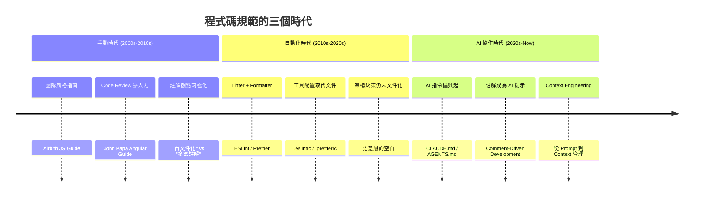

> 「當你的 codebase 遵循一致的模式時，AI 助手成為力量倍增器。當它不一致時，AI 成為混亂放大器。」
> — [The Renaissance of Written Coding Conventions](https://www.brokenrobot.xyz/blog/the-renaissance-of-written-coding-conventions/)

### 核心問題

AI 工具的出現帶來了一個根本性的問題：

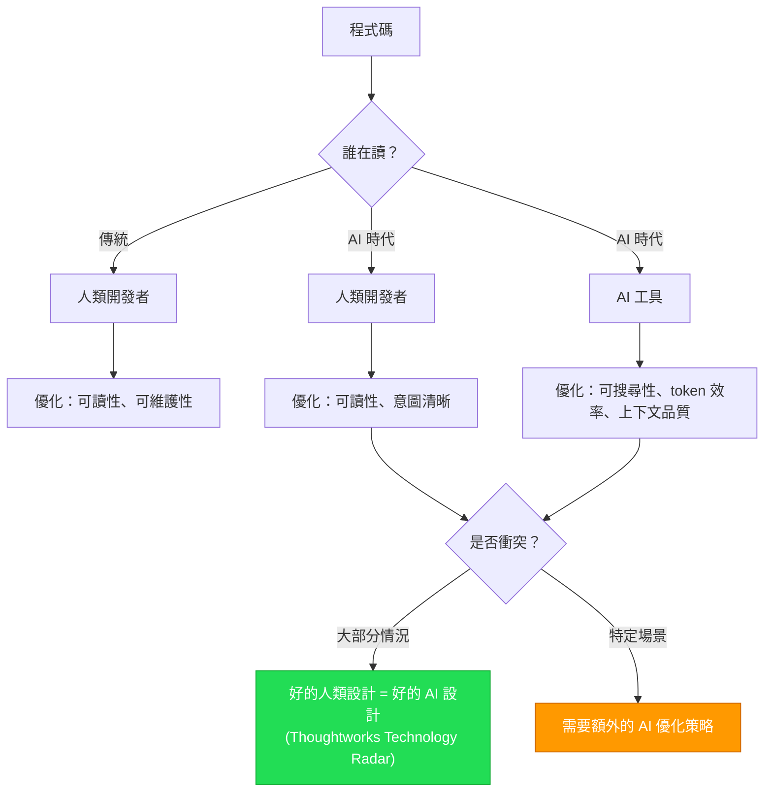

Thoughtworks Technology Radar 明確指出：

> 「好的人類軟體設計也有益於 AI……但預期會有更多 AI 特定的模式出現。」
> — [AI-friendly code design](https://www.thoughtworks.com/radar/techniques/ai-friendly-code-design)

---

## 一、註解策略的革命

### 1.1 傳統觀點 vs. AI 時代觀點

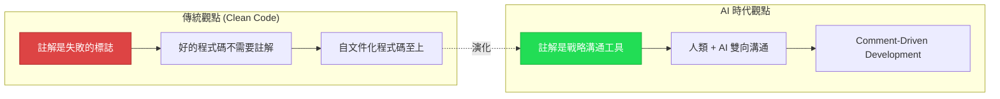

| 維度 | Clean Code 傳統 | AI 時代最佳實踐 |
|------|----------------|----------------|
| **核心態度** | 註解 = 程式碼不夠清晰的補償 | 註解 = 人機溝通的關鍵通道 |
| **內容焦點** | 避免解釋「做什麼」 | 專注解釋「為什麼」和「意圖」 |
| **維護問題** | 註解容易過時 | AI 可即時監控程式碼與註解一致性 |
| **對象** | 僅為人類讀者 | 人類 + AI 雙重讀者 |
| **數量** | 越少越好 | 品質重於數量，但不吝嗇 |

> 「程式碼註解辯論已經結束（AI 贏了）。」
> — [Revelry](https://revelry.co/insights/code-comment-debate-ai/)

### 1.2 AI 時代的註解分類框架

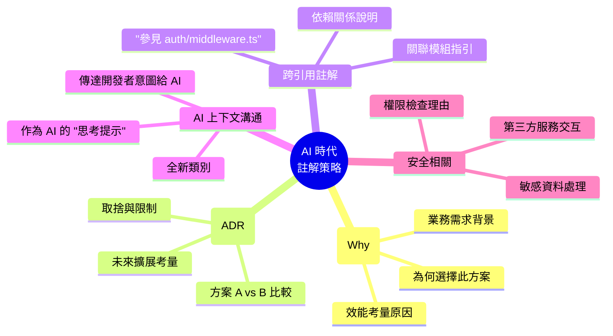

### 1.3 實際範例比較

#### 傳統 Clean Code 風格（最少註解）

```python
# Clean Code 認為：好的命名 = 不需要註解
def calculate_discount(price: float, member_years: int) -> float:
    if member_years >= 10:
        return price * 0.8
    elif member_years >= 5:
        return price * 0.9
    return price
```

#### AI 時代最佳實踐（意圖 + 上下文註解）

```python
def calculate_discount(price: float, member_years: int) -> float:
    """Calculate membership-based discount for purchase amount.

    Business rule: Loyalty tiers were defined in Q3 2024 product meeting.
    - Gold (10+ years): 20% discount (matches competitor MaxShop's tier)
    - Silver (5+ years): 10% discount
    - Standard: no discount

    Note: Finance team requested these exact thresholds. Do NOT modify
    without approval from product-owner@company.com (see JIRA-4521).
    """
    if member_years >= 10:
        return price * 0.8  # Gold tier
    elif member_years >= 5:
        return price * 0.9  # Silver tier
    return price
```

**為什麼這樣設計？**

1. **AI 搜尋性**：當 AI agent 搜尋 "discount" 或 "loyalty" 時，docstring 提供完整業務上下文
2. **意圖保留**：門檻值 `10` 和 `5` 不是隨意的——有明確的業務來源
3. **防止意外修改**：「Do NOT modify」是給 AI 和人類的雙重警告
4. **可追溯性**：JIRA ticket 連結讓 AI 可以進一步查找上下文

> Tusk 的研究指出：「維護良好註解的工程師比堅持自文件化程式碼的工程師**快 3 倍**」
> — [The Case for Comment-Driven Development](https://www.usetusk.ai/resources/the-case-for-comment-driven-development/)

### 1.4 Comment-Driven Development (CDD)

這是 AI 時代全新的方法論：


**五個戰術性最佳實踐** (Tusk, 2025)：

1. 優先使用描述性函式名（如 `calculateMembershipDiscountForPurchaseAmount`）
2. 寫全面的方法 docstring
3. 添加跨引用註解（讓 AI 能從提到的檔案/函式中收集額外上下文）
4. 實施兩層文件：註解解釋「為什麼」，單元測試定義「做什麼」
5. 建立註解品質門檻（合併前審查 AI 生成的註解）

---

## 二、命名慣例：研究數據說了什麼

### 2.1 命名對 AI 性能的量化影響

這是目前最有力的實證研究之一。

#### 研究 A：命名對 LLM 程式碼分析的影響

論文 *[How Does Naming Affect LLMs on Code Analysis Tasks?](https://arxiv.org/html/2307.12488v5)* 的核心發現：

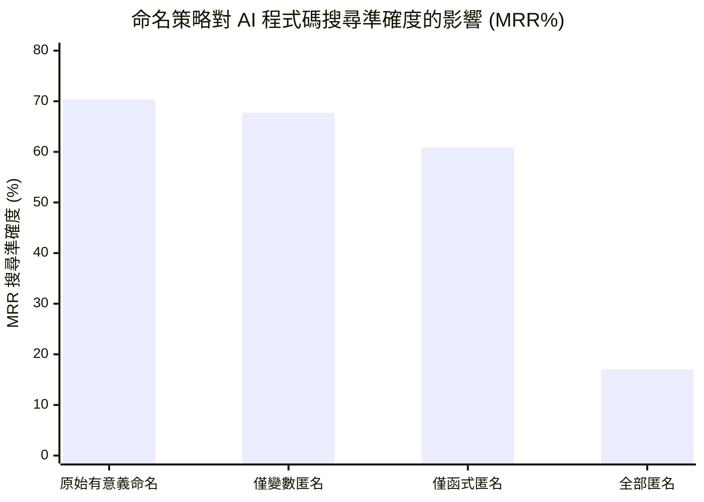

| 命名策略 | Java MRR | Python MRR | 下降幅度 |
|----------|----------|------------|---------|
| 原始（有意義命名） | 70.36% | 68.17% | — |
| 僅變數匿名化 | 67.73% | 59.80% | -3.7% / -12.3% |
| 僅函式匿名化 | 60.89% | 55.43% | -13.5% / -18.7% |
| **全部匿名化** | **17.03%** | **23.73%** | **-75.8% / -65.2%** |

> **關鍵發現**：匿名化所有名稱會讓 AI 搜尋準確度下降 65-76%。函式/方法名的影響大於變數名。

#### 研究 B：命名慣例排名

*[Variable Naming Impact on AI Code Completion](https://yakubov.org/blogs/2025-07-25-variable-naming-impact-on-ai-code-completion)* 橫跨 8 個 AI 模型、500 個 Python 樣本的研究：

| 指標 | descriptive | obfuscated | 差距 |
|------|------------|-----------|------|
| 精確匹配率 | 34.2% | 16.6% | +106% |
| 編輯距離相似度 | 0.786 | 0.666 | +18% |
| 語意正確性 | 0.874 | 0.802 | +8.9% |

**命名慣例效能排名**：

```
descriptive > SCREAM_SNAKE_CASE > snake_case > PascalCase > minimal > obfuscated
```

### 2.2 傳統 vs. AI 時代命名策略比較

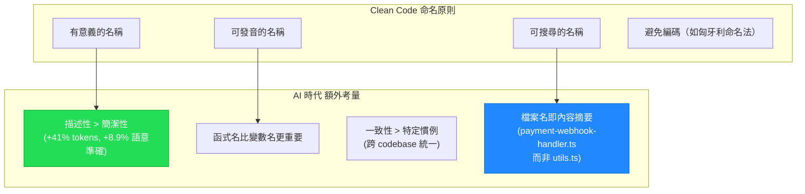

#### 範例：檔案命名

```
❌ 傳統（可能的做法）
src/
├── utils.ts
├── helpers.ts
├── handlers.ts
└── services.ts

✅ AI 時代最佳實踐
src/
├── payment-webhook-handler.ts
├── user-auth-middleware.ts
├── order-discount-calculator.ts
└── email-notification-service.ts
```

> 「檔案名應該告訴 AI 裡面有什麼，而不需要打開它。」
> — [Developer Toolkit](https://developertoolkit.ai/en/shared-workflows/context-management/file-organization/)

### 2.3 Token 效率 vs. 語意準確：核心取捨

| 命名策略 | Token 消耗 | AI 語意準確度 | 所在象限 |
|----------|-----------|-------------|---------|
| `obfuscated` | 最低 | 0.802 (最低) | 避免區 |
| `minimal` | 低 | 中低 | 過度壓縮區 |
| `PascalCase` | 中 | 中 | 可接受區 |
| `snake_case` | 中 | 0.65+ | 可接受區 |
| `SCREAM_SNAKE` | 中高 | 0.72+ | 接近理想區 |
| **`descriptive`** | **最高 (+41%)** | **0.874 (最高)** | **理想區** |

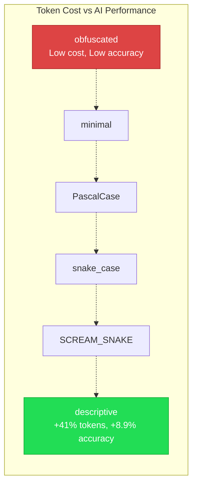

**結論**：描述性命名消耗多 41% 的 token，但帶來 8.9% 的語意性能提升。**AI 模型優先考慮清晰度而非壓縮**。這意味著在命名上，不應犧牲清晰度來省 token。

---

## 三、程式碼結構與組織

### 3.1 傳統 vs. AI 友好的架構模式

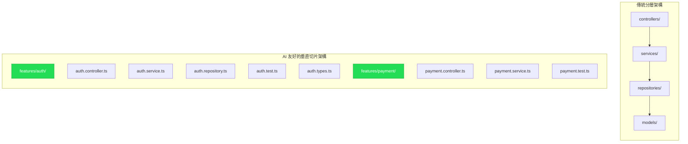

| 維度 | 傳統分層架構 | AI 友好垂直切片 |
|------|------------|----------------|
| **組織方式** | 按技術類型（controller/service/repo） | 按功能/領域（auth/payment/order） |
| **AI 理解效率** | 需要讀取多個目錄 | 相關程式碼集中，減少 context 消耗 |
| **修改範圍** | 一個功能分散在多個資料夾 | 一個功能集中在一個資料夾 |
| **上下文隔離** | 差——AI 需要大量跨目錄讀取 | 好——AI 只需讀取一個目錄 |

> 「垂直切片架構特別適合 AI，因為每個切片包含該功能的所有必要組件。AI 工具可以更容易地理解和修改自包含的功能。」
> — [Rick Hightower](https://medium.com/@richardhightower/ai-optimizing-codebase-architecture-for-ai-coding-tools-ff6bb6fdc497)

### 3.2 檔案大小與 AI 效能

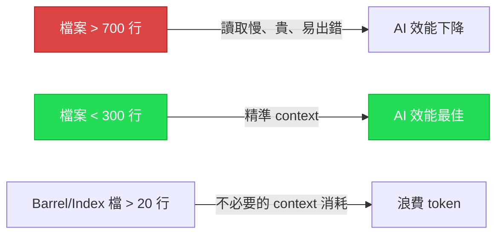

**Ben Houston（Agentic Coding Best Practices）的具體建議**：

- **檔案長度上限**：~700 行。越長的檔案讀取/寫入越慢、越貴、越容易出錯
- **扁平化目錄**：AI agent 理解 `frontend/`, `backend/`, `shared/` 只需幾分鐘，理解複雜的微包結構可能需要 5 分鐘僅是映射依賴關係
- **最小化間接引用**：避免通過多個 `index.ts` 的鏈式 re-export，使用直接 import
- **共置相關檔案**：實作、測試、型別放在一起

> — [Agentic Coding Best Practices](https://benhouston3d.com/blog/agentic-coding-best-practices)

### 3.3 推薦的 AI 友好目錄結構

```
project-root/
├── CLAUDE.md                          # Claude Code 指令
├── AGENTS.md                          # 通用 AI agent 指令
├── .cursorrules                       # Cursor 規則
├── llms.txt                           # LLM 友好專案摘要
│
├── src/
│   ├── features/                      # 按功能垂直切片
│   │   ├── auth/
│   │   │   ├── auth.controller.ts
│   │   │   ├── auth.service.ts
│   │   │   ├── auth.types.ts
│   │   │   └── auth.test.ts
│   │   └── payment/
│   │       ├── payment.controller.ts
│   │       ├── payment.service.ts
│   │       └── payment.test.ts
│   │
│   ├── shared/                        # 跨功能共用
│   │   ├── ui/                        # UI 組件
│   │   ├── hooks/                     # React hooks
│   │   └── types/                     # 共用型別
│   │
│   └── lib/                           # 工具函式
│
├── docs/
│   ├── architecture.md                # 架構文件（給人和 AI 讀）
│   └── decisions/                     # ADR (Architecture Decision Records)
│
└── tests/                             # E2E / Integration tests
```

### 3.4 Lost-in-the-Middle 問題

Stanford 和 UC Berkeley 的研究揭示了一個 AI 的根本限制：

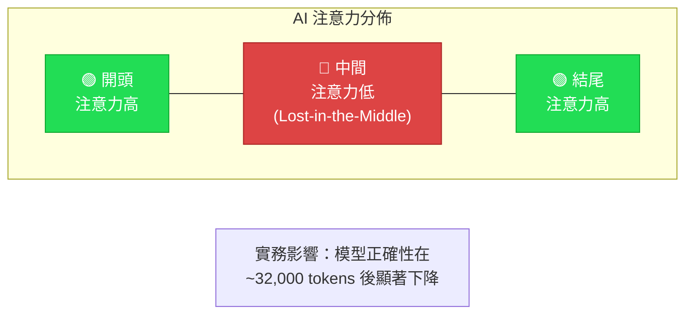

**這意味著**：
- 不要把最重要的程式碼放在超長檔案的中間
- 關鍵邏輯放在檔案開頭或使用清晰的結構分隔
- 保持檔案短小，讓 AI 能完整理解每個檔案

---

## 四、Token 經濟學：成本與效能的平衡

### 4.1 格式化的隱藏成本

學術論文 *[The Hidden Cost of Readability](https://arxiv.org/html/2508.13666v1)* 提供了最嚴謹的測量：

> **格式化元素消耗大約 24.5% 的所有 token，但對進階模型提供的效能提升微乎其微。**

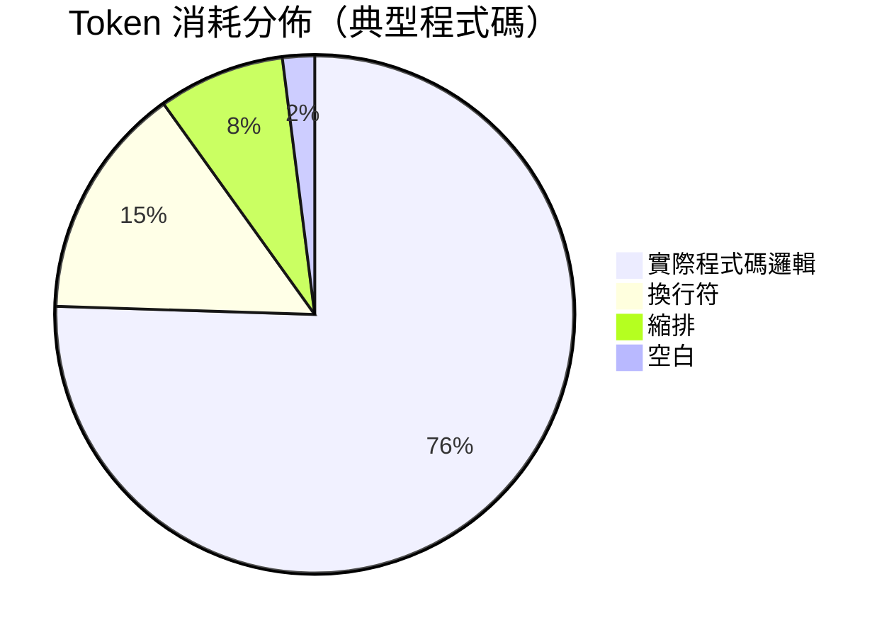

| 語言 | 移除格式化後 Token 減少 |
|------|----------------------|
| **Java** | 34.9% |
| **C++** | 31.1% |
| **C#** | 25.3% |
| **Python** | 6.5%（縮排有語法意義） |

**效能影響**：模型在格式化/未格式化程式碼上的 Pass@1 分數差異**小於 4.2%**。DeepSeek-V3 在未格式化程式碼上甚至**略微提升**（79.1% → 80.0%）。

### 4.2 程式碼品質 vs. Token 消耗

論文 *[Clean Code, Better Models](https://arxiv.org/html/2508.11958)* 的關鍵發現：

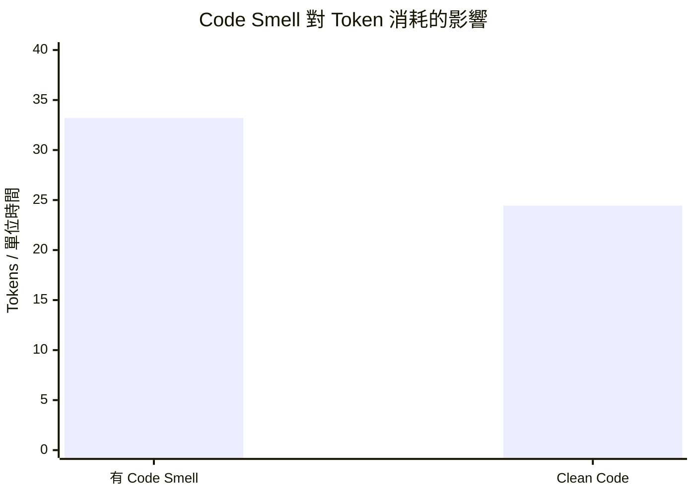

| 指標 | 有 Code Smell | Clean Code | 節省 |
|------|-------------|------------|------|
| Token/單位時間 | 33.20 | 24.44 | **36%** |
| Token/單位複雜度 | 0.1015 | 0.0576 | **43%** |

> **重構移除 code smell 可以減少高達 50% 的 token 消耗。**

### 4.3 資料格式的 Token 成本

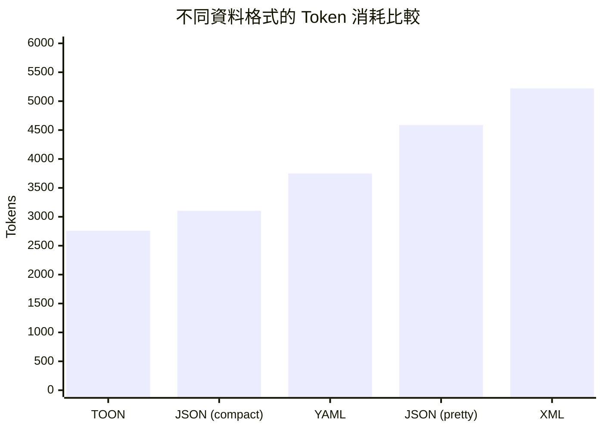

| 格式 | Tokens | 相對 JSON (pretty) |
|------|--------|-------------------|
| TOON | 2,759 | **-39.9%** |
| JSON (compact) | 3,104 | -32.3% |
| YAML | 3,749 | -18.3% |
| JSON (pretty) | 4,587 | 基準 |
| XML | 5,221 | +13.8% |

> [TOON (Token-Oriented Object Notation)](https://www.tensorlake.ai/blog/toon-vs-json) 透過以縮排取代括號、引號和重複 key，實現 30-60% 的 token 節省。

### 4.4 Token 優化策略全覽

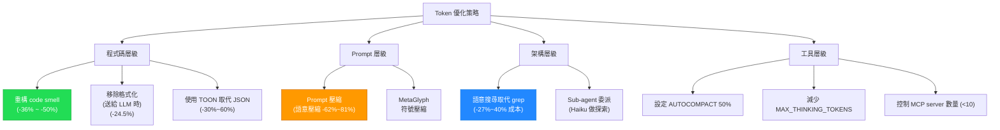

### 4.5 壓縮層級系統

[AI-Coding-Style-Guides](https://github.com/lidangzzz/AI-Coding-Style-Guides) 提出的漸進壓縮：

| 層級 | 策略 | 適用場景 |
|------|------|---------|
| 1-2 | 移除多餘空格/換行 | 日常開發 |
| 3-4 | 縮短本地/非導出變數名 | Token 敏感場景 |
| 5-6 | 完全移除空白 | 極端優化 |
| 7-8 | 最大壓縮 + 重構 | 僅限 AI-to-AI 溝通 |

**KMP 演算法範例**：

| 壓縮層級 | 字符數 | 壓縮率 |
|---------|--------|--------|
| 原始 | 1,216 | 100% |
| 層級 2 | 795 | 65.4% |
| 層級 5 | 715 | 58.7% |
| 層級 7 | 443 | 36.4% |

> **重要警告**：過度壓縮會降低 AI 語意理解能力。命名研究已證實描述性命名即使多用 41% token，語意準確度仍提升 8.9%。壓縮應有策略，不應盲目。

---

## 五、型別系統與語言特性：AI 時代的安全網

### 5.1 型別語言的歷史性崛起

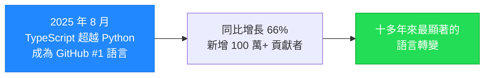

這不僅僅是 TypeScript 的故事——**所有具備強型別系統的語言**都在 AI 時代獲得優勢。

### 5.2 為什麼型別在 AI 時代更重要

> 「2025 年的一項學術研究發現，**94% 的 LLM 生成編譯錯誤是型別檢查失敗**。」
> — [GitHub Blog](https://github.blog/ai-and-ml/llms/why-ai-is-pushing-developers-toward-typed-languages/)

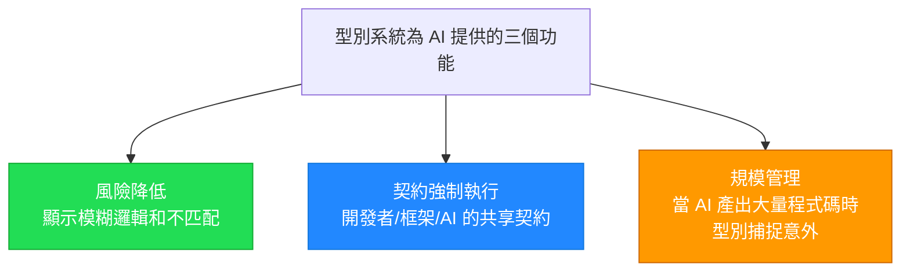

### 5.3 各語言的型別系統與 AI 協作特性

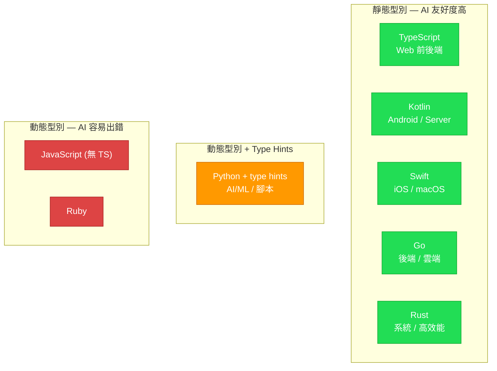

| 語言 | 型別系統 | AI 友好特性 | AI 常見問題 |
|------|---------|------------|-----------|
| **TypeScript** | 靜態（結構型別） | 介面推斷、union types、generic | AI 可能過度使用 `any` |
| **Kotlin** | 靜態（null safety） | Null safety 內建、data class、sealed class | AI 可能忽略 coroutine scope |
| **Swift** | 靜態（protocol-oriented） | Optional 型別、protocol extension、value types | AI 可能混淆 struct/class 語意 |
| **Go** | 靜態（簡潔） | 介面隱式實現、error 作為值、goroutine | AI 可能忽略 error handling |
| **Rust** | 靜態（ownership） | 編譯器即安全網、Result/Option types | AI 生成的 lifetime 常不正確 |
| **Python** | 動態 + type hints | mypy/pyright 靜態檢查、dataclass | AI 常省略 type hints |

### 5.4 多語言範例對比

#### TypeScript（Web 前後端）

```typescript
interface OrderItem {
    productId: string;
    quantity: number;
    unitPrice: number;
}

/** Process order with membership discount.
 *  @throws {InsufficientStockError} if any item is out of stock */
function processOrder(
    items: OrderItem[],
    userId: string,
    discountPercent: number  // 0-100, e.g. 20 means 20% off
): Promise<OrderResult> {
    // 型別確保 AI 不會傳錯參數
}
```

#### Kotlin（Android / Server-side）

```kotlin
data class OrderItem(
    val productId: String,
    val quantity: Int,
    val unitPrice: Double
)

/**
 * Process order with membership discount.
 * @throws InsufficientStockException if any item is out of stock
 */
suspend fun processOrder(
    items: List<OrderItem>,
    userId: String,
    discountPercent: Int  // 0-100
): OrderResult {
    // Kotlin 的 null safety 防止 AI 生成 NPE
    // suspend 標記提醒 AI 這是 coroutine context
}
```

#### Swift（iOS / macOS）

```swift
struct OrderItem {
    let productId: String
    let quantity: Int
    let unitPrice: Double
}

/// Process order with membership discount.
/// - Throws: `InsufficientStockError` if any item is out of stock.
func processOrder(
    items: [OrderItem],
    userId: String,
    discountPercent: Int  // 0-100
) async throws -> OrderResult {
    // Swift 的 Optional 和 async/throws 讓 AI 必須處理所有錯誤路徑
}
```

#### Go（後端 / 雲端服務）

```go
type OrderItem struct {
    ProductID string  `json:"product_id"`
    Quantity  int     `json:"quantity"`
    UnitPrice float64 `json:"unit_price"`
}

// ProcessOrder applies membership discount to an order.
// Returns ErrInsufficientStock if any item is out of stock.
func ProcessOrder(
    items []OrderItem,
    userID string,
    discountPercent int, // 0-100
) (*OrderResult, error) {
    // Go 的 error-as-value 迫使 AI 顯式處理每個錯誤
    // 簡潔語法 + 強型別 = AI 友好
}
```

#### Python（with type hints）

```python
from dataclasses import dataclass

@dataclass
class OrderItem:
    product_id: str
    quantity: int
    unit_price: float

async def process_order(
    items: list[OrderItem],
    user_id: str,
    discount_percent: int,  # 0-100
) -> OrderResult:
    """Process order with membership discount.

    Raises:
        InsufficientStockError: if any item is out of stock.
    """
    # type hints + docstring 讓 AI 理解預期行為
    # 搭配 mypy --strict 確保 AI 生成的程式碼符合型別約束
```

### 5.5 各語言的 AI 輔助開發建議

| 語言 | 關鍵建議 | Armin Ronacher 觀點 |
|------|---------|-------------------|
| **TypeScript** | 開啟 `strict` 模式；避免 `any`；用 `zod` 做 runtime validation | — |
| **Kotlin** | 用 `sealed class` 限制 AI 生成的狀態；搭配 `ktlint` | — |
| **Swift** | 用 `protocol` 定義契約；`@MainActor` 確保線程安全 | — |
| **Go** | 「後端 agentic 工作的最佳選擇」；簡單、無 magic、可預測 | Go 是 AI 友好的首選後端語言 |
| **Python** | 必須用 `mypy --strict`；「避免 Python 因為其 magic」 | 因 magic 方法和動態特性而不推薦用於 agentic coding |
| **Rust** | 編譯器是最強的 AI 安全網；但 lifetime 對 AI 仍具挑戰 | — |

> Armin Ronacher（Flask/Ruff 創建者）明確指出：「Go 是後端代理工作的最佳選擇；避免 Python 因為其 magic。」代理寫出的 SQL 很好，且能匹配 SQL 日誌——選擇純 SQL 而非複雜 ORM。
> — [Agentic Coding Recommendations](https://lucumr.pocoo.org/2025/6/12/agentic-coding/)

### 5.6 Token 效率：各語言比較

研究橫跨 1,000+ RosettaCode 任務的 GPT-4 tokenizer 分析：

| 語言 | 平均 Token/任務 | 相對效率 | 型別系統 |
|------|---------------|---------|---------|
| Python | ~130 | 基準 | 動態 + hints |
| Go | ~145 | -12% | 靜態（簡潔） |
| JavaScript | ~148 | -14% | 動態 |
| Kotlin | ~155 | -19% | 靜態（表達力強） |
| Swift | ~160 | -23% | 靜態（表達力強） |
| TypeScript | ~165 | -27% | 靜態（結構型別） |
| Java | ~182 | -40% | 靜態（冗長） |

> **關鍵取捨**：Python 和 Go 最省 token，但 TypeScript/Kotlin/Swift 的型別安全帶來的錯誤預防價值遠超額外 token 成本。型別約束解碼（[arXiv 2504.09246](https://arxiv.org/abs/2504.09246)）的研究顯示：利用型別系統引導 AI 程式碼生成，編譯錯誤減少**超過一半**。
>
> — [Programming Languages Ranked by Token Efficiency](https://ubos.tech/news/programming-languages-ranked-by-token-efficiency-for-ai%E2%80%91assisted-development/)

---

## 六、經典原則的重新審視

### 6.1 Clean Code 原則 — 重新審視

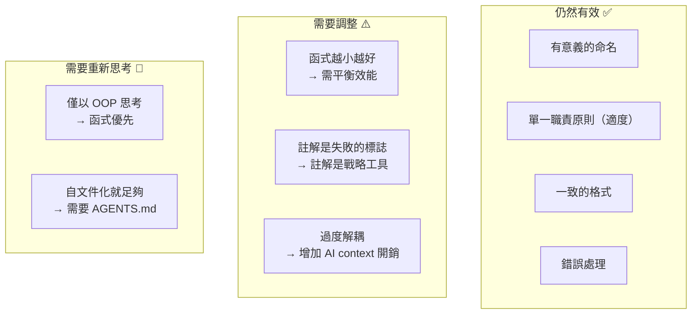

**Casey Muratori 的效能批判**：

> 「你讓問題越複雜，這些 Clean Code 觀念就越損害你的效能。」
> — [The New Stack](https://thenewstack.io/when-clean-code-hampers-application-performance/)

Clean Code 第二版（2025）已加入 AI 工具的指南，但核心建議並未實質修改。批評者指出其範例過於依賴 Java OOP，缺乏函式式程式設計的探討。

**推薦替代閱讀**：
- *A Philosophy of Software Design* — John Ousterhout
- *Domain-Driven Design* — Eric Evans

### 6.2 SOLID 原則 — AI 時代再詮釋

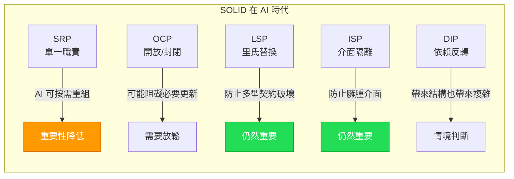

> 「當 AI 可以按需重寫、重構或重新生成整個系統時，我們依賴 SOLID 的原因開始轉變。」
> — [Frontegg](https://frontegg.com/blog/vibe-coding-vs-solid-is-clean-code-still-king)

但反面觀點同樣重要：

> 「SOLID 原則透過有效的 prompt engineering 和與 AI 工具的周到協作繼續發揮作用。」
> — [Syncfusion](https://www.syncfusion.com/blogs/post/solid-principles-ai-development)

### 6.3 DRY 原則 — AI 的雙面刃

#### GitClear 2025 研究（2.11 億行變更程式碼）

```mermaid
xychart-beta
    title "AI 時代程式碼重複的變化趨勢"
    x-axis [2021, 2022, 2023, 2024]
    y-axis "重複程式碼區塊（相對值）" 0 --> 10
    bar [1, 2, 4.5, 8]
```

| 指標 | 2021 | 2024 | 變化 |
|------|------|------|------|
| 重複程式碼區塊 | 基準 | **8x** | 急劇惡化 |
| 複製/貼上佔比 | 8.3% | 12.3% | **+48%** |
| 重構相關程式碼 | 25% | <10% | **-60%+** |
| 兩週內被修改的新程式碼 | 3.1% | 5.7% | **+84%** |

> 「2024 年，複製/貼上程式碼首次超過了『移動』程式碼（程式碼重用），這在資料集歷史上前所未有。」
> — [GitClear](https://www.gitclear.com/ai_assistant_code_quality_2025_research)

#### 策略性重複的五點檢查清單

```mermaid
flowchart TD
    A[是否應該重複程式碼？] --> B{不同團隊擁有？}
    B -->|是| C["✅ 保持分離"]
    B -->|否| D{業務邏輯會分歧？}
    D -->|是| E["✅ 接受重複"]
    D -->|否| F{抽象比重複複雜？}
    F -->|是| G["✅ 允許重複"]
    F -->|否| H{重新生成比修改快？}
    H -->|是| I["✅ 允許重複"]
    H -->|否| J["❌ 抽象化"]

    style C fill:#2d5,stroke:#1a3,color:#fff
    style J fill:#28f,stroke:#17d,color:#fff
```

> — [Beyond DRY: When AI-Generated Duplication Improves Maintainability](https://dev.to/rakbro/beyond-dry-when-ai-generated-duplication-improves-maintainability-1daf)

### 6.4 經典原則演化總結表

| 傳統原則 | Clean Code 立場 | AI 時代演化 | 變化方向 |
|----------|----------------|------------|---------|
| **命名** | 有意義、可發音 | 更長更描述性，一致性最重要 | 🔼 加強 |
| **函式大小** | 越小越好，只做一件事 | 需平衡效能和 context 開銷 | ⚠️ 調整 |
| **註解** | 失敗的標誌 | 戰略溝通工具 | 🔄 翻轉 |
| **DRY** | 絕對不重複 | 策略性重複可能更優 | ⚠️ 放鬆 |
| **SOLID** | 嚴格遵守 | 根據上下文重新詮釋 | ⚠️ 調整 |
| **型別** | 視語言而定 | 幾乎是必需的安全機制 | 🔼 加強 |
| **自文件化** | 好程式碼不需要註解 | 不夠——需要 AGENTS.md + 意圖註解 | 🔄 翻轉 |
| **格式化** | 一致且美觀 | 人類看的保持美觀；餵給 AI 的可壓縮 | ⚠️ 情境化 |

---

## 七、專案配置檔：AI 的指南針

### 7.1 AI 指令檔生態系

```mermaid
graph TB
    A[專案根目錄] --> B["CLAUDE.md<br/>(Claude Code)"]
    A --> C["AGENTS.md<br/>(開放標準, 20+ 工具)"]
    A --> D[".cursorrules<br/>(Cursor)"]
    A --> E[".github/copilot-instructions.md<br/>(GitHub Copilot)"]
    A --> F["llms.txt<br/>(通用 LLM 友好文件)"]
    A --> G[".junie/guidelines.md<br/>(JetBrains Junie)"]

    B --> H["每次 session 自動讀取<br/>持久記憶機制"]
    C --> I["60,000+ repos 採用<br/>Linux Foundation 管理"]
    F --> J["類似 robots.txt<br/>告訴 AI 讀什麼"]

    style C fill:#2d5,stroke:#1a3,color:#fff
    style B fill:#28f,stroke:#17d,color:#fff
```

### 7.2 CLAUDE.md 最佳實踐

根據 [Anthropic 官方](https://code.claude.com/docs/en/best-practices)、[Builder.io](https://www.builder.io/blog/claude-md-guide) 和 [HumanLayer](https://www.humanlayer.dev/blog/writing-a-good-claude-md) 的建議：

| 做 ✅ | 不做 ❌ |
|------|--------|
| 保持簡潔（~500 行以內） | 放入完整程式碼片段（會過時） |
| 覆蓋 WHAT/WHY/HOW | 放入程式碼風格規則（用 linter） |
| 提供精確可執行命令 | 寫模糊的通用指引 |
| 使用指標而非程式碼 | 超過 500 行（Claude 會忽略） |
| 支援層級化（子目錄版本） | 只有一個全域版本 |

### 7.3 AGENTS.md — 新的開放標準

GitHub 分析超過 2,500 個 agents.md 文件的發現：

> 「大多數代理文件失敗是因為它們太模糊。一個展示風格的真實程式碼片段勝過三段描述。」
> — [GitHub Blog](https://github.blog/ai-and-ml/github-copilot/how-to-write-a-great-agents-md-lessons-from-over-2500-repositories/)

**成功的 AGENTS.md 包含**：
1. 明確的角色定位
2. 精確的可執行命令
3. 清晰的邊界定義
4. 實際的程式碼範例

### 7.4 llms.txt — AI 的 robots.txt

```
/llms.txt          → 輕量摘要版（給 context 有限的 AI）
/llms-full.txt     → 完整文件版（給 context 充足的 AI）
```

> 由 Jeremy Howard 於 2024 年 9 月提出，作為標準化的方式讓網站/專案向 LLM 提供友好資訊。
> — [llms.txt specification](https://llmstxt.org/)

---

## 八、實踐建議總結

### 8.1 分層品質策略

```mermaid
graph TD
    A[程式碼分層品質策略]

    A --> B["🔴 核心層<br/>(認證/支付/安全)"]
    A --> C["🟡 業務邏輯層<br/>(API/領域邏輯)"]
    A --> D["🟢 常規處理層<br/>(CRUD/樣板)"]

    B --> B1["嚴格 Clean Code"]
    B --> B2["強制「為什麼」註解"]
    B --> B3["人工審查必須"]
    B --> B4["完整型別安全"]

    C --> C1["AI 生成可接受"]
    C --> C2["需人類理解和審查"]
    C --> C3["意圖註解"]

    D --> D1["AI 最佳化"]
    D --> D2["最少註解"]
    D --> D3["功能驗證即可"]

    style B fill:#d44,stroke:#a22,color:#fff
    style C fill:#f90,stroke:#c60,color:#fff
    style D fill:#2d5,stroke:#1a3,color:#fff
```

### 8.2 行動清單

#### 立即可做

- [ ] 在專案根目錄加入 `CLAUDE.md` 和/或 `AGENTS.md`
- [ ] 將 `utils.ts` 類的通用檔名改為描述性檔名
- [ ] 為公開 API 添加「為什麼」導向的 docstring
- [ ] 確保使用 TypeScript 或其他型別語言

#### 短期改善

- [ ] 重構為垂直切片架構（按功能而非按技術類型）
- [ ] 將超過 700 行的檔案拆分
- [ ] 建立 `llms.txt` 檔案
- [ ] 設定 linter/formatter 自動化（不要用 AI 做 linter 的工作）

#### 長期策略

- [ ] 採用 Spec-Driven Development 工作流
- [ ] 建立 AI 生成程式碼的品質門檻
- [ ] 導入語意搜尋工具（減少 27-40% token 成本）
- [ ] 定期進行人類可理解性審計

### 8.3 思想領袖推薦總結

| 人物 | 身份 | 核心建議 |
|------|------|---------|
| **Addy Osmani** | Google Chrome 工程總監 | 規格先行、頻繁 commit、提供完整 context |
| **Simon Willison** | Django 共同創辦人 | TDD 特別適合 AI 迭代、管理 context 是關鍵技巧 |
| **Armin Ronacher** | Flask/Ruff 創建者 | 做最笨但能工作的事、偏好函式非類別、避免 magic |
| **Charity Majors** | Honeycomb CEO | 用 llms.txt、寫高層系統目標文件、焦點從 How → What/Why |
| **Anthropic Team** | Claude Code 團隊 | Plan → Diff → Test → Review、不跳步驟、AI 輸出未經信任直到驗證 |

---

## 參考文獻

### 學術論文

1. **The Hidden Cost of Readability** — 格式化消耗 24.5% token ([arXiv 2508.13666](https://arxiv.org/html/2508.13666v1))
2. **How Does Naming Affect LLMs on Code Analysis Tasks?** — 命名匿名化降低 65-76% 準確度 ([arXiv 2307.12488](https://arxiv.org/html/2307.12488v5))
3. **Clean Code, Better Models** — Code smell 增加 36% token 消耗 ([arXiv 2508.11958](https://arxiv.org/html/2508.11958))
4. **Semantic Compression With LLMs** — 5x 有效 context 擴展 ([arXiv 2304.12512](https://arxiv.org/abs/2304.12512))
5. **MetaGlyph: Semantic Compression via Symbolic Metalanguages** — 62-81% token 壓縮 ([arXiv 2601.07354](https://arxiv.org/abs/2601.07354))
6. **Optimizing Token Consumption: Nano Surge** — Code smell 增加 36% token ([arXiv 2504.15989](https://arxiv.org/html/2504.15989v2))
7. **Type-Constrained Code Generation** — 型別約束減少一半以上編譯錯誤 ([arXiv 2504.09246](https://arxiv.org/abs/2504.09246))
8. **Variable Naming Impact on AI Code Completion** — 描述性命名 +8.9% 語意準確 ([Research Square](https://www.researchsquare.com/article/rs-7180885/v1))
9. **Code Readability in the Age of LLMs: Atlassian Case Study** ([arXiv 2501.11264](https://arxiv.org/html/2501.11264v3))
10. **Evaluating SOLID in Modern AI Frameworks** ([arXiv 2503.13786](https://arxiv.org/abs/2503.13786))

### 思想領袖文章

11. Addy Osmani — [My LLM coding workflow going into 2026](https://addyosmani.com/blog/ai-coding-workflow/)
12. Simon Willison — [Here's how I use LLMs to help me write code](https://simonwillison.net/2025/Mar/11/using-llms-for-code/)
13. Armin Ronacher — [Agentic Coding Recommendations](https://lucumr.pocoo.org/2025/6/12/agentic-coding/)
14. Charity Majors — [How I Code With LLMs These Days](https://www.honeycomb.io/blog/how-i-code-with-llms-these-days)
15. Ben Houston — [Agentic Coding Best Practices](https://benhouston3d.com/blog/agentic-coding-best-practices)
16. Matsen — [Agentic coding from first principles](https://matsen.fhcrc.org/general/2025/10/30/agentic-coding-principles.html)
17. Addy Osmani — [How to write a good spec for AI agents](https://addyosmani.com/blog/good-spec/)

### 官方文件與標準

18. Anthropic — [Claude Code: Best practices for agentic coding](https://www.anthropic.com/engineering/claude-code-best-practices)
19. Anthropic — [Effective Context Engineering for AI Agents](https://www.anthropic.com/engineering/effective-context-engineering-for-ai-agents)
20. GitHub — [How to write a great agents.md](https://github.blog/ai-and-ml/github-copilot/how-to-write-a-great-agents-md-lessons-from-over-2500-repositories/)
21. GitHub — [Why AI is pushing developers toward typed languages](https://github.blog/ai-and-ml/llms/why-ai-is-pushing-developers-toward-typed-languages/)
22. GitHub — [Code review in the age of AI](https://github.blog/ai-and-ml/generative-ai/code-review-in-the-age-of-ai-why-developers-will-always-own-the-merge-button/)
23. Thoughtworks — [AI-friendly code design (Technology Radar)](https://www.thoughtworks.com/radar/techniques/ai-friendly-code-design)
24. Thoughtworks — [In the age of AI coding, code quality still matters](https://www.thoughtworks.com/insights/blog/generative-ai/in-the-age-of-AI-coding-code-quality-still-matters)
25. [AGENTS.md specification](https://agents.md/)
26. [llms.txt specification](https://llmstxt.org/)

### 行業研究與指南

27. GitClear — [AI Assistant Code Quality 2025 Research](https://www.gitclear.com/ai_assistant_code_quality_2025_research)
28. Revelry — [The Code Comment Debate Is Over (AI Won)](https://revelry.co/insights/code-comment-debate-ai/)
29. Tusk — [The Case for Comment-Driven Development](https://www.usetusk.ai/resources/the-case-for-comment-driven-development/)
30. byAlex — [Rethinking Code Comments in the AI Era](https://blog.byalex.dev/article/rethinking-code-comments-in-the-ai-era/)
31. Glean — [How AI assistants interpret code comments](https://www.glean.com/perspectives/how-ai-assistants-interpret-code-comments-a-practical-guide)
32. Builder.io — [How to Write a Good CLAUDE.md File](https://www.builder.io/blog/claude-md-guide)
33. Builder.io — [Improve your AI code output with AGENTS.md](https://www.builder.io/blog/agents-md)
34. HumanLayer — [Writing a good CLAUDE.md](https://www.humanlayer.dev/blog/writing-a-good-claude-md)
35. Propel — [Structuring Your Codebase for AI Tools: 2025 Guide](https://www.propelcode.ai/blog/structuring-codebases-for-ai-tools-2025-guide)
36. Augment Code — [Enterprise Coding Standards: 12 Rules for AI-Ready Teams](https://www.augmentcode.com/guides/enterprise-coding-standards-12-rules-for-ai-ready-teams)
37. JetBrains — [Coding Guidelines for Your AI Agents](https://blog.jetbrains.com/idea/2025/05/coding-guidelines-for-your-ai-agents/)
38. Rick Hightower — [Optimizing Codebase Architecture for AI Coding Tools](https://medium.com/@richardhightower/ai-optimizing-codebase-architecture-for-ai-coding-tools-ff6bb6fdc497)
39. Broken Robot — [The renaissance of written coding conventions](https://www.brokenrobot.xyz/blog/the-renaissance-of-written-coding-conventions/)
40. Developer Toolkit — [Search and Indexing Strategies](https://developertoolkit.ai/en/shared-workflows/context-management/codebase-indexing/)

### Token 優化相關

41. [Programming Languages Ranked by Token Efficiency](https://ubos.tech/news/programming-languages-ranked-by-token-efficiency-for-ai%E2%80%91assisted-development/)
42. [TOON vs JSON](https://www.tensorlake.ai/blog/toon-vs-json)
43. [12 Proven Techniques to Save Tokens in Claude Code](https://aslamdoctor.com/12-proven-techniques-to-save-tokens-in-claude-code/)
44. [Token Optimization Techniques — everything-claude-code](https://github.com/affaan-m/everything-claude-code/blob/main/docs/token-optimization.md)
45. lidangzzz — [AI-Coding-Style-Guides](https://github.com/lidangzzz/AI-Coding-Style-Guides)
46. Chrome DevTools — [Designing DevTools: Efficient token usage](https://developer.chrome.com/blog/designing-devtools-efficient-token-usage)
47. Yakubov — [Variable Naming Impact on AI Code Completion](https://yakubov.org/blogs/2025-07-25-variable-naming-impact-on-ai-code-completion)

### 經典原則辯論

48. [Clean Code Critique: Why Much of Clean Code Aged Poorly](https://bugzmanov.github.io/cleancode-critique/clean_code_second_edition_review.html)
49. [It's probably time to stop recommending Clean Code](https://qntm.org/clean)
50. Casey Muratori — ["Clean" Code, Horrible Performance](https://www.computerenhance.com/p/clean-code-horrible-performance)
51. [Rethinking SOLID Principles in the Age of AI](https://compositecode.blog/2025/10/30/reflection-on-solid-decades/)
52. [Vibe Coding vs. SOLID: Is Clean Code Still King?](https://frontegg.com/blog/vibe-coding-vs-solid-is-clean-code-still-king)
53. [How AI broke the DRY principle](https://dev.to/alisa_plays_1455c6e6766d0/how-ai-broke-the-dry-principle-and-why-thats-a-good-thing-4ch9)
54. [Beyond DRY: When Duplication Improves Maintainability](https://dev.to/rakbro/beyond-dry-when-ai-generated-duplication-improves-maintainability-1daf)
55. Faros AI — [AI-Generated Code and the DRY Principle](https://www.faros.ai/blog/ai-generated-code-and-the-dry-principle)

---

*最後更新：2026-03-04*
*本文件為 [symbiotic-engineering](https://github.com/Muheng1992/symbiotic-engineering) 專案的一部分*
