# Claude Code Skills 完全指南：從概念到實戰

> **用 Skill 教會 AI 你的工作流程，讓它在需要時自動啟動**

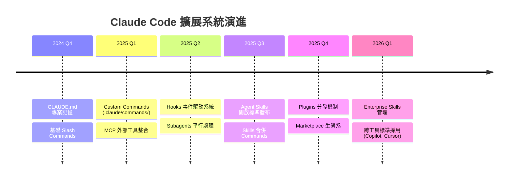

---

## 目錄

1. [什麼是 Skill？](#1-什麼是-skill)
2. [Skill 的架構與運作原理](#2-skill-的架構與運作原理)
3. [建立你的第一個 Skill](#3-建立你的第一個-skill)
4. [SKILL.md 完整格式規範](#4-skillmd-完整格式規範)
5. [內建 Skills vs 自定義 Skills](#5-內建-skills-vs-自定義-skills)
6. [實戰範例集](#6-實戰範例集)
7. [Skills 在 Claude Code 生態系中的定位](#7-skills-在-claude-code-生態系中的定位)
8. [Skills vs 其他 AI 工具的指令系統](#8-skills-vs-其他-ai-工具的指令系統)
9. [進階功能](#9-進階功能)
10. [最佳實踐](#10-最佳實踐)
11. [常見陷阱與限制](#11-常見陷阱與限制)
12. [社群生態與資源](#12-社群生態與資源)
13. [參考文獻](#13-參考文獻)

---

## 1. 什麼是 Skill？

### 1.1 一句話定義

**Skill 是一組指令、腳本和資源的集合，封裝在一個目錄中，Claude 會根據任務需要動態載入並執行。**

把它想成是「教 Claude 一項新技能」——你只需教一次，它就會在所有相關場景中自動運用。

### 1.2 核心價值

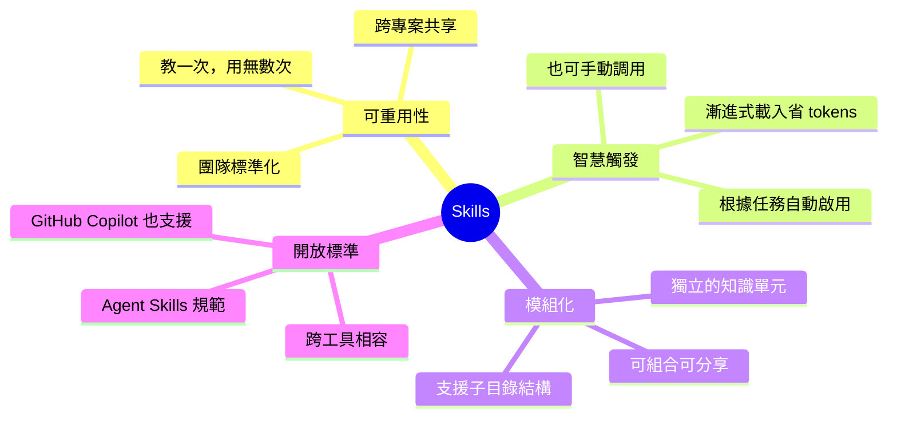

### 1.3 Skill 解決了什麼問題？

| 問題 | 沒有 Skill | 有 Skill |
|------|-----------|---------|
| 重複的提示詞 | 每次都要手動輸入相同的指令 | 寫一次，`/skill-name` 調用 |
| 專案慣例遺忘 | Claude 不記得你的 API 風格、命名規範 | Skill 自動套用專案慣例 |
| 團隊知識散落 | 每人各自提示，品質不一 | 統一的 Skill 確保一致性 |
| Context 浪費 | 所有指令都塞進 CLAUDE.md | 按需載入，只消耗必要的 tokens |
| 複雜工作流程 | 每次手動拆解步驟 | 封裝成 Skill，一鍵執行 |

---

## 2. Skill 的架構與運作原理

### 2.1 三層漸進式載入（Progressive Disclosure）

這是 Skill 系統最精妙的設計——不是一次把所有東西都塞進 context，而是分層按需載入：

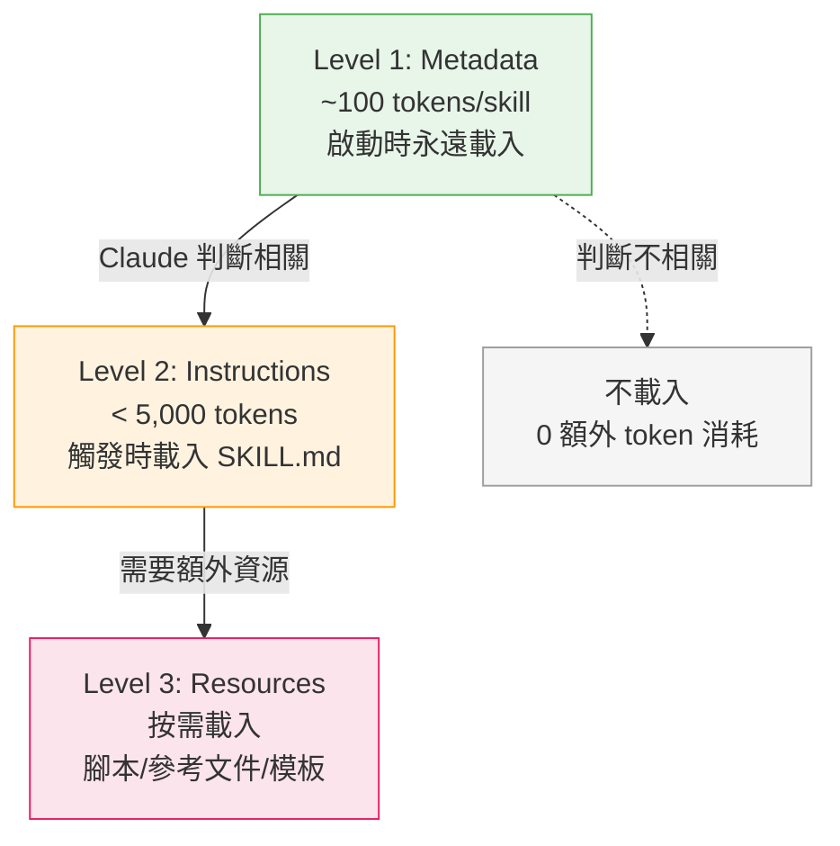

**實際意義**：你可以安裝 50 個 Skills，但每次對話可能只觸發 1-2 個，其餘的幾乎零成本。

### 2.2 Skill 觸發流程

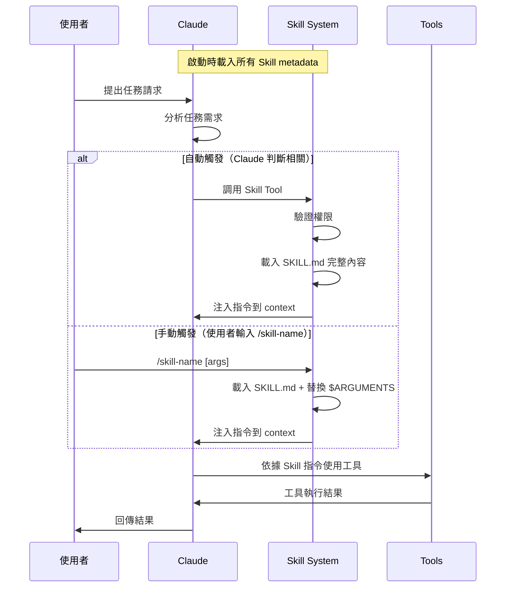

### 2.3 雙訊息注入機制

Skill 觸發時，系統實際注入**兩條訊息** [^1]：

1. **Message 1（使用者可見）**：
   ```xml
   <command-message>The "pdf" skill is loading</command-message>
   <command-name>pdf</command-name>
   ```

2. **Message 2（使用者不可見，`isMeta: true`）**：包含完整的 SKILL.md 內容（去除 frontmatter），通常 500-5,000+ tokens 的指令集。

**關鍵設計決策**：沒有算法路由、沒有 embeddings、沒有分類器。純粹靠 Claude 的 LLM 推理能力讀取 `<available_skills>` 列表來決定用哪個 skill。

---

## 3. 建立你的第一個 Skill

### 3.1 最小結構

一個 Skill 只需要**一個目錄**和**一個 `SKILL.md` 檔案**：

```
.claude/skills/my-first-skill/
└── SKILL.md
```

### 3.2 SKILL.md 基本格式

```markdown
---
name: my-first-skill
description: 在這裡描述 skill 做什麼以及何時使用它。
---

# 指令標題

這裡寫 Claude 應該遵循的指令。
```

### 3.3 快速實作：建立一個 Code Review Skill

```markdown
---
name: quick-review
description: Quick code review focusing on bugs and security. Use when reviewing code changes or before committing.
argument-hint: "[file-or-directory]"
---

Review the code in $ARGUMENTS with these priorities:

1. **Security vulnerabilities** - SQL injection, XSS, hardcoded secrets
2. **Bug risks** - null references, race conditions, off-by-one errors
3. **Error handling** - silent failures, missing catch blocks

Format findings as:
- **CRITICAL**: Must fix before merge
- **WARNING**: Should fix
- **INFO**: Nice to have

Skip style issues. Focus only on correctness and safety.
```

**使用方式**：

```bash
# 手動觸發
/quick-review src/auth/

# 或者 Claude 在你說「幫我看一下這段程式碼」時自動觸發
```

### 3.4 存放位置

| 層級 | 路徑 | 適用範圍 | 推薦場景 |
|------|------|---------|---------|
| **Personal** | `~/.claude/skills/<name>/SKILL.md` | 你的所有專案 | 個人偏好、通用工作流程 |
| **Project** | `.claude/skills/<name>/SKILL.md` | 僅此專案 | 專案特定慣例、團隊共享 |
| **Enterprise** | 透過 managed settings 配置 | 組織所有使用者 | 公司標準、安全策略 |
| **Plugin** | `<plugin>/skills/<name>/SKILL.md` | 啟用 plugin 之處 | 第三方工具整合 |

**優先順序**：Enterprise > Personal > Project。同名時 Skill 優先於舊版 Command。

> **歷史注意事項**：Custom commands（`.claude/commands/`）已正式合併進 Skills 系統。你現有的 `.claude/commands/*.md` 檔案仍然有效，但建議遷移到 `.claude/skills/` 目錄結構 [^2]。

---

## 4. SKILL.md 完整格式規範

### 4.1 目錄結構

```
my-skill/
├── SKILL.md              # 主要指令（必要）
├── references/
│   ├── REFERENCE.md      # 詳細 API 文件（按需載入）
│   └── examples.md       # 範例集
├── scripts/
│   ├── validate.py       # 驗證腳本
│   └── generate.sh       # 生成腳本
├── assets/
│   └── template.json     # 模板檔案
└── LICENSE               # 授權（可選）
```

### 4.2 YAML Frontmatter 完整參考

```yaml
---
# === 必要欄位 ===
name: my-skill                          # 小寫+數字+連字號，最長 64 字元
description: >                          # 最長 1024 字元
  Extract text from PDF files and fill forms.
  Use when working with PDF documents.

# === 調用控制 ===
disable-model-invocation: false         # true = 只有使用者能觸發（預設 false）
user-invocable: true                    # false = 使用者不能觸發，僅 Claude 可用（預設 true）
argument-hint: "[file-path] [options]"  # 自動完成時的參數提示

# === 工具與模型 ===
allowed-tools:                          # Skill 啟用時免確認的工具
  - Read
  - Grep
  - Glob
  - Bash(python *)
model: claude-sonnet-4-20250514         # 指定使用的模型

# === 子代理執行 ===
context: fork                           # 在隔離的 subagent 中執行
agent: Explore                          # subagent 類型（Explore/Plan/general-purpose/自訂）

# === Skill 生命周期 Hooks ===
hooks:
  PostToolUse:
    - matcher: Write
      command: "npx prettier --write $TOOL_INPUT_path"

# === 其他（Agent Skills 開放標準擴展）===
license: MIT
compatibility: Requires git and Node.js
metadata:
  author: your-name
  version: "1.0"
---
```

### 4.3 調用控制矩陣

| Frontmatter 設定 | 使用者可觸發 | Claude 可觸發 | Context 載入時機 |
|---|---|---|---|
| （預設） | `/skill-name` | 自動判斷 | description 始終在 context，完整內容觸發時載入 |
| `disable-model-invocation: true` | `/skill-name` | 不可 | description 不在 context，使用者觸發時才載入 |
| `user-invocable: false` | 不可 | 自動判斷 | description 始終在 context，觸發時載入 |

### 4.4 字串替換變數

| 變數 | 說明 | 範例 |
|------|------|------|
| `$ARGUMENTS` | 所有傳入參數 | `/deploy staging --verbose` → `"staging --verbose"` |
| `$ARGUMENTS[N]` | 第 N 個參數（0-based） | `$ARGUMENTS[0]` → `"staging"` |
| `$N`（簡寫） | 等同 `$ARGUMENTS[N]` | `$0` → `"staging"`, `$1` → `"--verbose"` |
| `${CLAUDE_SESSION_ID}` | 當前 session ID | `"abc-123-def"` |

### 4.5 `name` 命名規則

| 規則 | 有效 | 無效 |
|------|------|------|
| 只能小寫字母+數字+連字號 | `pdf-processing` | `PDF-Processing`（大寫） |
| 不能以連字號開頭/結尾 | `code-review` | `-code-review`（開頭連字號） |
| 不能連續連字號 | `my-skill` | `my--skill`（連續連字號） |
| 最長 64 字元 | `analyze` | 超過 64 字元的名稱 |
| 必須與目錄名一致 | `my-skill/SKILL.md` 中 name: `my-skill` | name 與目錄名不符 |

---

## 5. 內建 Skills vs 自定義 Skills

### 5.1 Claude Code 內建命令（固定邏輯，非 Prompt-based）

這些是硬編碼的命令，不透過 Skill 系統：

| 類別 | 命令 | 用途 |
|------|------|------|
| **對話管理** | `/clear`, `/compact`, `/fork` | 清除/壓縮對話、分支對話 |
| **專案設定** | `/init`, `/permissions`, `/config` | 初始化、權限管理、設定 |
| **狀態查看** | `/context`, `/cost`, `/status`, `/usage` | 查看 context、費用、狀態 |
| **工具管理** | `/mcp`, `/hooks`, `/skills`, `/plugin` | 管理 MCP/Hooks/Skills/Plugins |
| **版本控制** | `/diff`, `/pr-comments` | 查看差異、PR 評論 |
| **其他** | `/help`, `/doctor`, `/model`, `/vim` | 幫助、診斷、切換模型、Vim 模式 |

### 5.2 Bundled Skills（隨附 Skills，Prompt-based）

這些是 Claude Code 自帶的 Skills，每個 session 中都可用：

| Skill | 用途 | 使用方式 |
|-------|------|---------|
| **`/simplify`** | 審查最近修改的檔案，平行啟動三個 review agent 檢查 code reuse、quality、efficiency | `/simplify` 或 `/simplify focus on memory` |
| **`/batch`** | 跨 codebase 的大規模平行變更，分解為 5-30 個獨立工作單元，各自在隔離的 git worktree 中執行 | `/batch migrate src/ from Solid to React` |
| **`/debug`** | 讀取 session debug log 來排除 Claude Code 本身的問題 | `/debug session keeps crashing` |
| **Developer Platform** | 當程式碼 import Anthropic SDK 時**自動啟動** | 自動觸發 |

### 5.3 自定義 Skills 的兩種類型

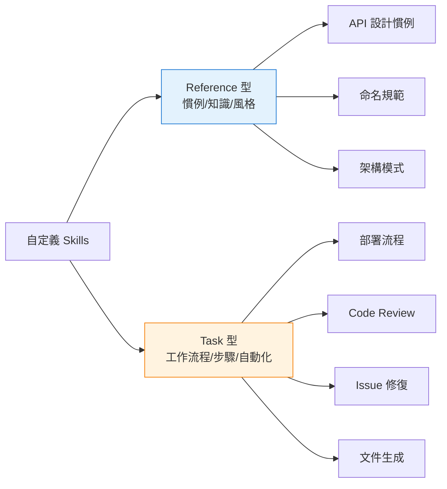

---

## 6. 實戰範例集

### 6.1 基礎範例：修復 GitHub Issue

```markdown
---
name: fix-issue
description: Analyze and fix a GitHub issue with tests. Use when the user mentions fixing an issue or provides an issue number.
disable-model-invocation: true
argument-hint: "[issue-number]"
allowed-tools: Bash(gh *), Read, Grep, Glob, Edit, Write
---

Fix GitHub issue #$0 following this workflow:

## Step 1: Understand the Issue
- Run: `gh issue view $0`
- Read the issue description, labels, and comments
- Identify the root cause

## Step 2: Locate Relevant Code
- Search for related files using Grep and Glob
- Read the identified files to understand current behavior

## Step 3: Implement the Fix
- Make minimal, focused changes
- Follow existing code patterns and conventions

## Step 4: Write Tests
- Add tests that would have caught this bug
- Verify existing tests still pass

## Step 5: Create Commit
- Stage only the relevant files
- Write a clear commit message referencing the issue: "fix: <description> (#$0)"
```

**使用**：`/fix-issue 42`

---

### 6.2 動態 Context 注入：PR 摘要

```markdown
---
name: pr-summary
description: Generate a comprehensive PR summary with context
context: fork
agent: Explore
allowed-tools: Bash(gh *)
---

## Pull Request Context

- PR diff: !`gh pr diff`
- PR comments: !`gh pr view --comments`
- Changed files: !`gh pr diff --name-only`
- PR metadata: !`gh pr view --json title,body,labels,milestone`

## Your Task

Based on the above context, generate a summary that includes:

1. **Overview**: What this PR does in 2-3 sentences
2. **Key Changes**: Bullet list of significant modifications
3. **Risk Assessment**: Potential issues or areas needing careful review
4. **Testing Suggestions**: What should be tested before merging
```

**亮點**：`!`command`` 語法會在 Skill 送給 Claude 之前先執行 shell 命令，將輸出直接替換進去。

---

### 6.3 多語言元件遷移

```markdown
---
name: migrate-component
description: Migrate a component from one framework to another while preserving behavior
argument-hint: "[component-name] [source-framework] [target-framework]"
---

Migrate the **$0** component from **$1** to **$2**.

## Requirements
- Preserve all existing behavior and edge cases
- Maintain the same public API/props interface
- Convert framework-specific patterns:
  - State management
  - Lifecycle hooks
  - Event handling
  - Styling approach
- Update import statements
- Adapt tests to the new framework

## Verification
After migration, ensure:
1. All existing tests pass (adapted for new framework)
2. No TypeScript/type errors
3. Component renders correctly
```

**使用**：`/migrate-component SearchBar React Vue`
- `$0` = `SearchBar`, `$1` = `React`, `$2` = `Vue`

---

### 6.4 帶腳本的 Skill：資料庫遷移

```markdown
---
name: db-migrate
description: Safe database migration with validation and rollback plan
disable-model-invocation: true
argument-hint: "[migration-name]"
allowed-tools: Bash(python *), Bash(psql *), Read, Write
---

# Database Migration: $ARGUMENTS

## Step 1: Generate Migration
Create migration file in `migrations/` directory.

## Step 2: Validate
Run the validation script:
```bash
python scripts/validate_migration.py migrations/$0.sql
```

## Step 3: Dry Run
```bash
python scripts/dry_run.py migrations/$0.sql --database=$DB_URL
```

## Step 4: Generate Rollback
Create a corresponding rollback script in `migrations/rollback/`.

## Step 5: Apply (ONLY after user confirmation)
**STOP AND ASK USER BEFORE PROCEEDING**
```bash
python scripts/apply_migration.py migrations/$0.sql
```

## Step 6: Verify
```bash
python scripts/verify_migration.py $0
```
```

---

### 6.5 Reference 型 Skill：API 設計慣例

```markdown
---
name: api-conventions
description: REST API design conventions for this project. Activates when creating or modifying API endpoints.
---

## API Design Standards

### URL Patterns
- Resources: `/api/v1/{resource}` (plural nouns)
- Sub-resources: `/api/v1/{resource}/{id}/{sub-resource}`
- Actions: `/api/v1/{resource}/{id}/actions/{action}` (POST only)

### Response Format
All responses follow this envelope:
```json
{
  "data": {},
  "meta": { "timestamp": "ISO-8601", "requestId": "uuid" },
  "errors": [{ "code": "string", "message": "string", "field": "string" }]
}
```

### Status Codes
| Code | Usage |
|------|-------|
| 200 | Success (GET, PUT, PATCH) |
| 201 | Created (POST) |
| 204 | No Content (DELETE) |
| 400 | Validation error |
| 401 | Authentication required |
| 403 | Forbidden |
| 404 | Not found |
| 409 | Conflict |
| 422 | Unprocessable entity |
| 500 | Internal server error |

### Naming
- camelCase for JSON fields
- kebab-case for URL paths
- UPPER_SNAKE_CASE for constants/enums
```

---

### 6.6 Hookify 整合：自動格式化

```markdown
---
name: format-on-save
description: Auto-format code files after edits
hooks:
  PostToolUse:
    - matcher: Write|Edit
      command: |
        if echo "$TOOL_INPUT_path" | grep -qE '\.(ts|tsx|js|jsx)$'; then
          npx prettier --write "$TOOL_INPUT_path" 2>/dev/null
        elif echo "$TOOL_INPUT_path" | grep -qE '\.(py)$'; then
          black "$TOOL_INPUT_path" 2>/dev/null
        elif echo "$TOOL_INPUT_path" | grep -qE '\.(go)$'; then
          gofmt -w "$TOOL_INPUT_path" 2>/dev/null
        fi
---

This skill automatically formats code after Claude edits files.
No action needed - formatting happens transparently.
```

---

### 6.7 Git 提交（官方 Plugin 範例）

以下是 Anthropic 官方 plugin 中 commit skill 的精簡寫法 [^3]：

```markdown
---
allowed-tools: Bash(git add:*), Bash(git status:*), Bash(git commit:*)
description: Create a git commit
---

## Context

- Current git status: !`git status`
- Current git diff (staged and unstaged changes): !`git diff HEAD`
- Current branch: !`git branch --show-current`
- Recent commits: !`git log --oneline -10`

## Your task

Based on the above changes, create a single git commit.
Stage and create the commit using a single message.
Do not use any other tools or do anything else.
```

**設計亮點**：
- `allowed-tools` 精確限制只能用 git 命令
- `!`command`` 預先注入所有必要 context
- 指令極簡，不做多餘的事

---

### 6.8 Feature Development 完整工作流程

```markdown
---
name: feature-dev
description: Guided feature development with codebase understanding and architecture focus
argument-hint: "Optional feature description"
---

# Feature Development

Follow a systematic approach: understand → clarify → design → implement → review.

## Phase 1: Discovery
Initial request: $ARGUMENTS

1. If feature unclear, ask user for requirements
2. Summarize understanding and confirm

## Phase 2: Codebase Exploration
1. Launch 2-3 explorer agents in parallel to:
   - Find similar features and trace their implementation
   - Map the architecture for the relevant area
   - Identify UI patterns and testing approaches
2. Read all key files identified by agents

## Phase 3: Clarifying Questions
**CRITICAL: DO NOT SKIP.**
Identify all underspecified aspects and ask the user before proceeding.

## Phase 4: Architecture Design
1. Design 2-3 implementation approaches with trade-offs
2. Present recommendation with reasoning
3. Wait for user decision

## Phase 5: Implementation
**DO NOT START WITHOUT USER APPROVAL**
Follow chosen architecture, maintain conventions, update progress.

## Phase 6: Quality Review
Launch 3 review agents: simplicity/DRY, bugs/correctness, conventions.

## Phase 7: Summary
Document what was built, decisions made, files modified, next steps.
```

---

## 7. Skills 在 Claude Code 生態系中的定位

### 7.1 完整生態系架構

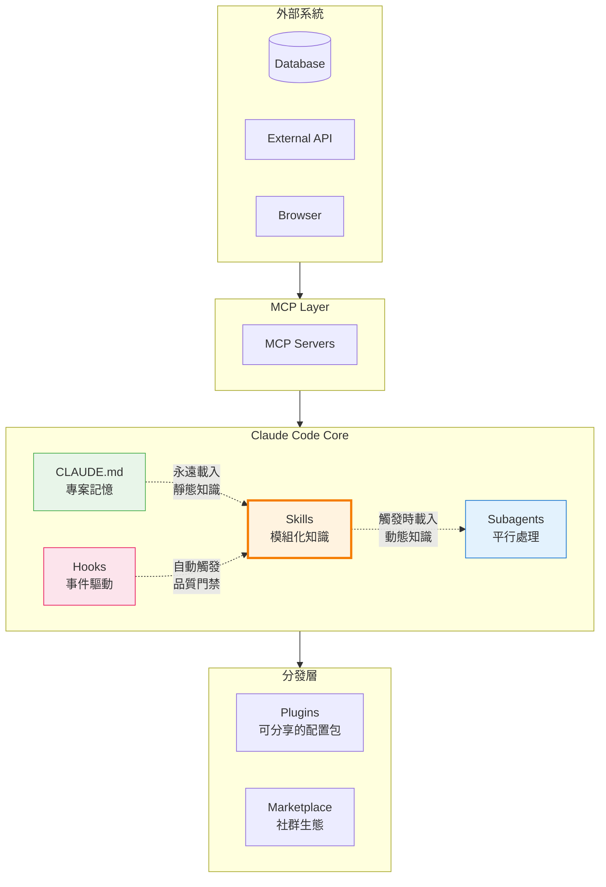

### 7.2 各機制比較

| 機制 | 觸發方式 | 載入時機 | 最佳用途 | Context 成本 |
|------|---------|---------|---------|-------------|
| **CLAUDE.md** | 永遠載入 | 每次對話 | 架構、慣例、建構命令 | 每次都消耗 |
| **Skills** | 自動 / 手動 | 按需載入 | 可重用工作流程、領域知識 | 觸發時才消耗 |
| **Hooks** | 事件自動觸發 | 工具調用前/後 | 格式化、驗證、品質門禁 | 極低（shell 命令） |
| **Subagents** | Claude 委派 / 手動 | 建立時 | 重型隔離任務、平行處理 | 獨立 context |
| **MCP** | 雙向 | 啟動時連接 | 外部工具整合 | 工具描述常駐 |
| **Plugins** | 安裝時啟用 | 包含的組件各自載入 | 團隊標準化分發 | 取決於內容 |

### 7.3 CLAUDE.md vs Skills：何時用哪個？

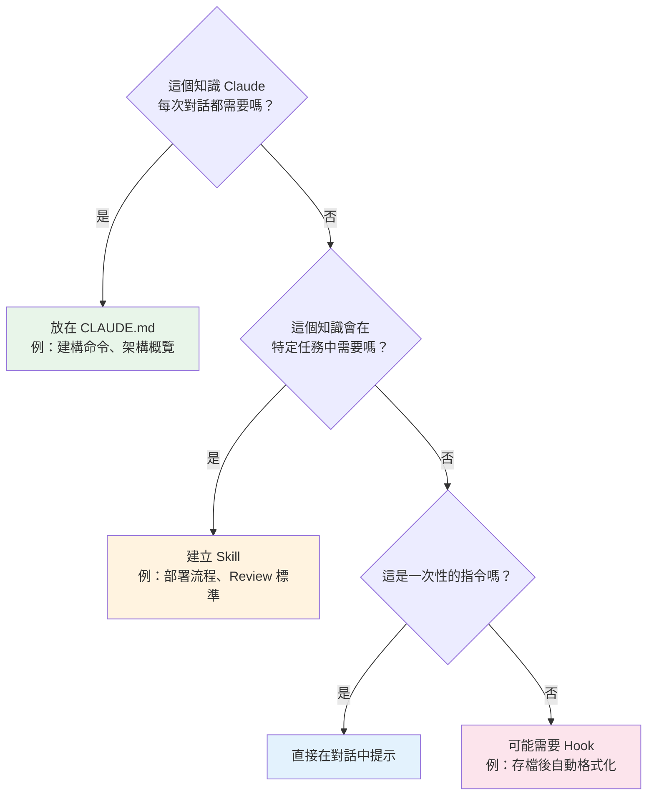

| CLAUDE.md | Skills |
|-----------|--------|
| 專案的「README for AI」 | 專案的「工具箱」 |
| 永遠載入，消耗固定 tokens | 按需載入，只在相關時消耗 |
| 適合靜態知識（架構、命名規範） | 適合動態工作流程（部署、Review） |
| 一個專案一份 | 可以有多個，各自獨立 |
| 不能帶附屬檔案 | 可以帶腳本、模板、參考文件 |

---

## 8. Skills vs 其他 AI 工具的指令系統

### 8.1 跨工具比較

| 面向 | Claude Code Skills | Cursor Rules | GitHub Copilot | Windsurf |
|------|-------------------|--------------|----------------|----------|
| **檔案格式** | `SKILL.md`（YAML frontmatter + Markdown） | `.mdc`（YAML frontmatter + Markdown） | `SKILL.md`（已支援 Agent Skills 標準） | `.windsurfrules`（純 Markdown） |
| **存放位置** | `.claude/skills/` 目錄 | `.cursor/rules/` 目錄 | `.github/skills/` 目錄 | 專案根目錄單一檔案 |
| **載入機制** | 三層漸進式載入 | 三種模式（always/auto/agent-requested）+ glob | 按需載入 | 每次 prompt 全部載入 |
| **自動觸發** | Claude 根據 description 判斷 | glob 檔案匹配 + auto 模式 | 類似 Claude Code | 無（永遠載入） |
| **擴展性** | 50+ skills 不會 context 壓力 | 以檔案類型定向 | 遵循 Agent Skills 標準 | context 快速填滿 |
| **子目錄支援** | 支援（腳本、參考文件） | 不支援 | 支援（遵循標準） | 不支援 |
| **開放標準** | Agent Skills 標準（發起者） | 無 | Agent Skills 標準 | 無 |

### 8.2 收斂趨勢

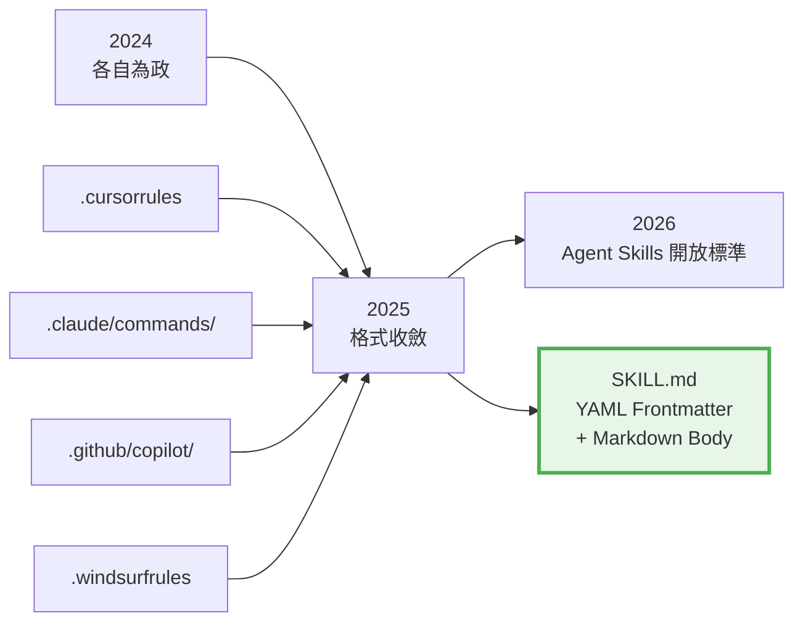

**關鍵趨勢**：各平台正在收斂到「帶 frontmatter 的 Markdown 指令檔」這個格式。[Agent Skills](https://agentskills.io) 開放標準正在推動統一，GitHub Copilot 已經支援 SKILL.md 格式 [^4]。

---

## 9. 進階功能

### 9.1 在 Subagent 中執行 Skill

```yaml
---
name: deep-research
description: Research a topic thoroughly using an isolated agent
context: fork
agent: Explore
---

Research $ARGUMENTS thoroughly:
1. Find relevant files using Glob and Grep
2. Read and analyze the code
3. Summarize findings with specific file references
```

`context: fork` 讓 Skill 在一個隔離的 subagent 中執行，有獨立的 context window，不會污染主對話。

`agent` 選項：
- `Explore`：唯讀工具（Glob, Grep, Read）
- `Plan`：規劃工具
- `general-purpose`：完整工具集
- 自訂 subagent 名稱（`.claude/agents/` 中定義）

### 9.2 Skill 內嵌 Hooks

```yaml
---
name: strict-mode
description: Enforce strict coding standards during development
hooks:
  PostToolUse:
    - matcher: Write|Edit
      command: "npx eslint --fix $TOOL_INPUT_path"
    - matcher: Bash
      command: |
        if echo "$TOOL_INPUT" | grep -q "rm -rf"; then
          echo "BLOCKED: rm -rf is not allowed" >&2
          exit 1
        fi
---
```

Hooks 的作用域限於此 Skill 的生命周期。

### 9.3 動態 Context 注入

```yaml
---
name: daily-standup
description: Generate daily standup notes from git history
allowed-tools: Bash(git *)
---

## Today's Context
- Recent commits: !`git log --oneline --since="yesterday" --author="$(git config user.name)"`
- Current branch: !`git branch --show-current`
- Uncommitted changes: !`git status --short`

## Task
Generate a standup update covering:
1. What was done (from commits)
2. What's in progress (from uncommitted changes)
3. Any blockers
```

### 9.4 權限精細控制

```bash
# 在 /permissions 中配置
# 允許
Skill(quick-review)        # 精確匹配
Skill(review-pr *)         # 前綴匹配

# 拒絕
Skill(deploy *)            # 拒絕 deploy 相關 skills
Skill                      # 完全停用所有 skills
```

### 9.5 從 Marketplace 安裝 Skills

```bash
# 安裝官方 Skills 套件
/plugin marketplace add anthropics/skills

# 安裝特定 skill set
/plugin install document-skills@anthropic-agent-skills
/plugin install example-skills@anthropic-agent-skills
```

---

## 10. 最佳實踐

### 10.1 Description 決定一切

Description 是 Claude 判斷是否啟用 Skill 的**唯一依據**。寫好 description 是最重要的事。

| 品質 | 範例 | 問題 |
|------|------|------|
| **差** | `Helps with PDFs.` | 太模糊，Claude 不知何時啟用 |
| **好** | `Extract text and tables from PDF files, fill forms, merge documents. Use when working with PDF files or when the user mentions PDFs, forms, or document extraction.` | 具體、包含關鍵詞、說明何時使用 |

### 10.2 SKILL.md 保持精簡

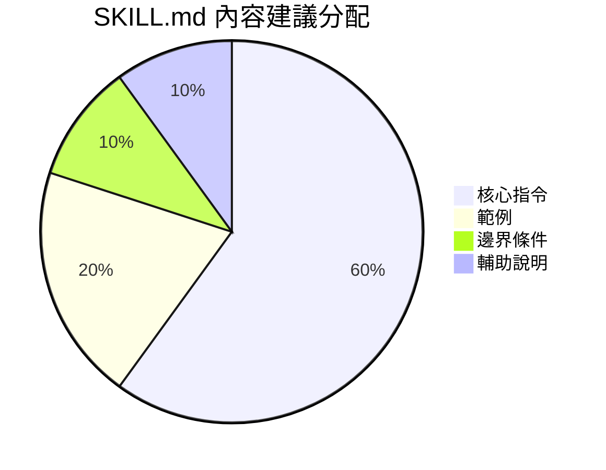

- **500 行以下**為最佳
- 詳細的參考資料放 `references/` 目錄
- 大型範例放 `examples/` 目錄
- Claude 本來就知道的東西不要重複寫

### 10.3 適當的自由度

| 自由度等級 | 適用場景 | Skill 風格 |
|-----------|---------|-----------|
| **高**（鬆散指引） | Code review、文件撰寫 | 只提供原則和格式，Claude 自行發揮 |
| **中**（結構化流程） | Feature 開發、重構 | 定義階段和步驟，但允許靈活調整 |
| **低**（精確腳本） | DB 遷移、部署、安全掃描 | 每一步都精確定義，用腳本驗證 |

### 10.4 腳本優於生成

| 方式 | Token 成本 | 可靠性 | 一致性 |
|------|-----------|--------|--------|
| Claude 每次生成驗證邏輯 | 高 | 中（可能有偏差） | 低 |
| 預寫好的 `scripts/validate.py` | 低（只看輸出） | 高 | 高 |

### 10.5 Evaluation-Driven Development


**不要先寫文件，先建立評估。** 用 evaluation-driven development 確保 Skill 解決的是真正的問題。

### 10.6 迭代開發建議

1. **Claude A 建立 Skill**：與一個 Claude instance 合作設計
2. **Claude B 測試 Skill**：在新的 session 中測試
3. **觀察 Claude B 的行為**：看它如何使用 Skill、在哪裡失敗
4. **回到 Claude A 改進**：根據觀察修正
5. **重複**：直到行為符合期望

---

## 11. 常見陷阱與限制

### 11.1 技術限制

| 限制 | 說明 | 應對方式 |
|------|------|---------|
| **每 turn 只能一個 Skill** | Skills 不是並發安全的，每個 turn 只能執行一個 | 用 subagents 實現平行處理 |
| **Description 總預算** | Context window 的 2%，後備值 16,000 字元 | 用 `/context` 檢查，減少 skill 數量或精簡 description |
| **SKILL.md 建議 < 500 行** | 過長會消耗過多 context | 將細節移到 `references/` |
| **`context: fork` 需要明確任務** | 純 guidelines 的 skill 在 subagent 中可能無所作為 | 確保 Skill 有具體可行動的指令 |
| **自動壓縮閾值** | 200K context window 在約 167K tokens 時觸發 compaction | 無法調整，注意 context 使用量 |

### 11.2 常見錯誤

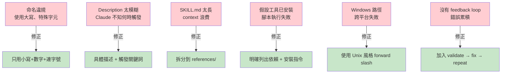

### 11.3 `user-invocable: false` 的陷阱

`user-invocable: false` 只控制 `/` 選單的可見性，**不阻擋** Skill tool 的程式化調用。如果要完全阻止 Claude 自動調用，需要使用 `disable-model-invocation: true`。

### 11.4 `allowed-tools` 是實驗性功能

在 Agent Skills 標準中標記為 `experimental`，不同 agent 實作的支援程度可能不同。在 Claude Code 中運作良好，但不保證在其他平台上的行為一致。

---

## 12. 社群生態與資源

### 12.1 官方資源

| 資源 | 連結 |
|------|------|
| **Anthropic Skills Repository** (82.8k stars) | [github.com/anthropics/skills](https://github.com/anthropics/skills) |
| **Claude Code Skills 官方文件** | [code.claude.com/docs/en/skills](https://code.claude.com/docs/en/skills) |
| **Agent Skills 開放標準** | [agentskills.io](https://agentskills.io) |
| **Skill 撰寫最佳實踐** | [platform.claude.com/.../best-practices](https://platform.claude.com/docs/en/agents-and-tools/agent-skills/best-practices) |

### 12.2 社群精選

| 倉庫 | 說明 |
|------|------|
| [travisvn/awesome-claude-skills](https://github.com/travisvn/awesome-claude-skills) | 精選 Claude Skills 資源列表 |
| [hesreallyhim/awesome-claude-code](https://github.com/hesreallyhim/awesome-claude-code) | 含 Trail of Bits 安全 skills |
| [VoltAgent/awesome-agent-skills](https://github.com/VoltAgent/awesome-agent-skills) | 500+ agent skills，相容 Codex, Cursor, Gemini CLI |
| [wshobson/commands](https://github.com/wshobson/commands) | 57 個生產級 slash commands |
| [SuperClaude-Org/SuperClaude_Framework](https://github.com/SuperClaude-Org/SuperClaude_Framework) | 30 個 commands + 16 個 personas 的框架 |

### 12.3 實用 Skill 集合分類

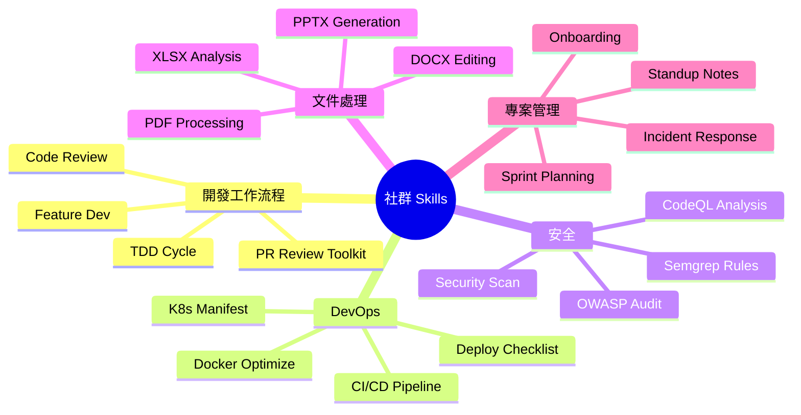

---

## 13. 參考文獻

### 官方文件

1. Anthropic, "Claude Code Skills Documentation," [code.claude.com/docs/en/skills](https://code.claude.com/docs/en/skills)
2. Anthropic, "Agent Skills Overview," [platform.claude.com/docs/en/agents-and-tools/agent-skills/overview](https://platform.claude.com/docs/en/agents-and-tools/agent-skills/overview)
3. Anthropic, "Best Practices for Authoring Skills," [platform.claude.com/docs/en/agents-and-tools/agent-skills/best-practices](https://platform.claude.com/docs/en/agents-and-tools/agent-skills/best-practices)
4. Anthropic, "Agent Skills Specification," [agentskills.io/specification](https://agentskills.io/specification)
5. Anthropic, "Equipping agents for the real world with Agent Skills," [anthropic.com/engineering/equipping-agents-for-the-real-world-with-agent-skills](https://www.anthropic.com/engineering/equipping-agents-for-the-real-world-with-agent-skills)
6. Anthropic, "anthropics/skills GitHub Repository," [github.com/anthropics/skills](https://github.com/anthropics/skills)

### 深度技術分析

7. Mikhail Shilkov, "Inside Claude Code Skills: Structure, prompts, invocation," [mikhail.io/2025/10/claude-code-skills/](https://mikhail.io/2025/10/claude-code-skills/) [^1]
8. Lee Han Chung, "Claude Agent Skills: A First Principles Deep Dive," [leehanchung.github.io/blogs/2025/10/26/claude-skills-deep-dive/](https://leehanchung.github.io/blogs/2025/10/26/claude-skills-deep-dive/)
9. alexop.dev, "Understanding Claude Code Full Stack," [alexop.dev/posts/understanding-claude-code-full-stack/](https://alexop.dev/posts/understanding-claude-code-full-stack/)

### 社群教學與指南

10. alexop.dev, "Claude Code Slash Commands Guide," [alexop.dev/posts/claude-code-slash-commands-guide/](https://alexop.dev/posts/claude-code-slash-commands-guide/)
11. alexop.dev, "Claude Code Customization Guide," [alexop.dev/posts/claude-code-customization-guide-claudemd-skills-subagents/](https://alexop.dev/posts/claude-code-customization-guide-claudemd-skills-subagents/)
12. builder.io, "How I use Claude Code," [builder.io/blog/claude-code](https://www.builder.io/blog/claude-code)
13. Shipyard, "Claude Code CLI Cheatsheet," [shipyard.build/blog/claude-code-cheat-sheet/](https://shipyard.build/blog/claude-code-cheat-sheet/)
14. blog.sshh.io, "How I Use Every Claude Code Feature," [blog.sshh.io/p/how-i-use-every-claude-code-feature](https://blog.sshh.io/p/how-i-use-every-claude-code-feature)
15. oneaway.io, "Skills vs Slash Commands Complete Guide," [oneaway.io/blog/claude-code-skills-slash-commands](https://oneaway.io/blog/claude-code-skills-slash-commands)

### 比較文章

16. killer-skills.com, "Claude Code vs Cursor vs Windsurf," [killer-skills.com/en/blog/claude-code-vs-cursor-vs-windsurf/](https://killer-skills.com/en/blog/claude-code-vs-cursor-vs-windsurf/) [^4]
17. egghead.io, "Claude Skills Compared to Slash Commands," [egghead.io/claude-skills-compared-to-slash-commands~lhdor](https://egghead.io/claude-skills-compared-to-slash-commands~lhdor)
18. PinkLime, "Claude Code vs Copilot vs Cursor 2026," [pinklime.io/blog/claude-code-vs-copilot-vs-cursor](https://pinklime.io/blog/claude-code-vs-copilot-vs-cursor)

### 社群專案

19. wshobson/commands, [github.com/wshobson/commands](https://github.com/wshobson/commands)
20. hesreallyhim/awesome-claude-code, [github.com/hesreallyhim/awesome-claude-code](https://github.com/hesreallyhim/awesome-claude-code)
21. travisvn/awesome-claude-skills, [github.com/travisvn/awesome-claude-skills](https://github.com/travisvn/awesome-claude-skills)
22. VoltAgent/awesome-agent-skills, [github.com/VoltAgent/awesome-agent-skills](https://github.com/VoltAgent/awesome-agent-skills)
23. SuperClaude-Org/SuperClaude_Framework, [github.com/SuperClaude-Org/SuperClaude_Framework](https://github.com/SuperClaude-Org/SuperClaude_Framework)

---

[^1]: Mikhail Shilkov 的分析揭示了 Skill 觸發時的雙訊息注入機制和 LLM-based 選擇器設計。
[^2]: Claude Code 官方文件明確指出 "Custom commands have been merged into skills"。
[^3]: 來自 Anthropic 官方 commit-commands plugin 的精簡 commit skill。
[^4]: GitHub Copilot 已支援 Agent Skills 標準的 SKILL.md 格式。

---

*最後更新：2026-03-04 | 基於 Claude Code v2.1+ 和 Agent Skills 開放標準*
