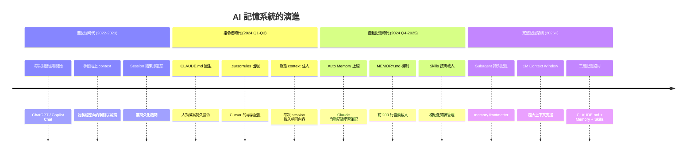
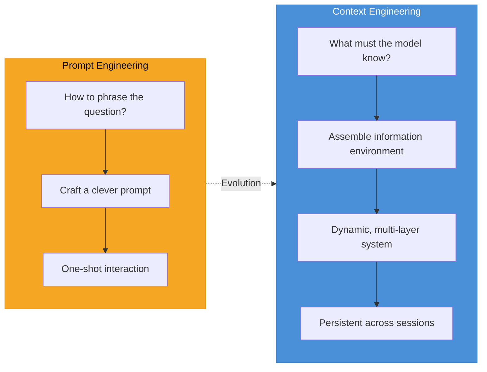
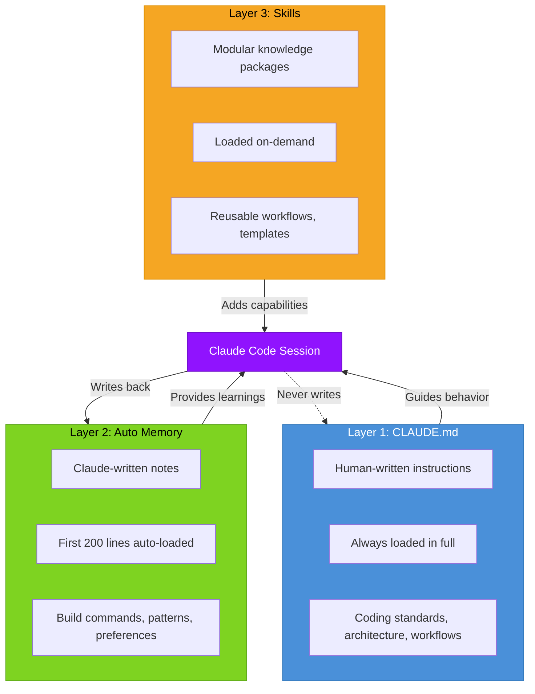
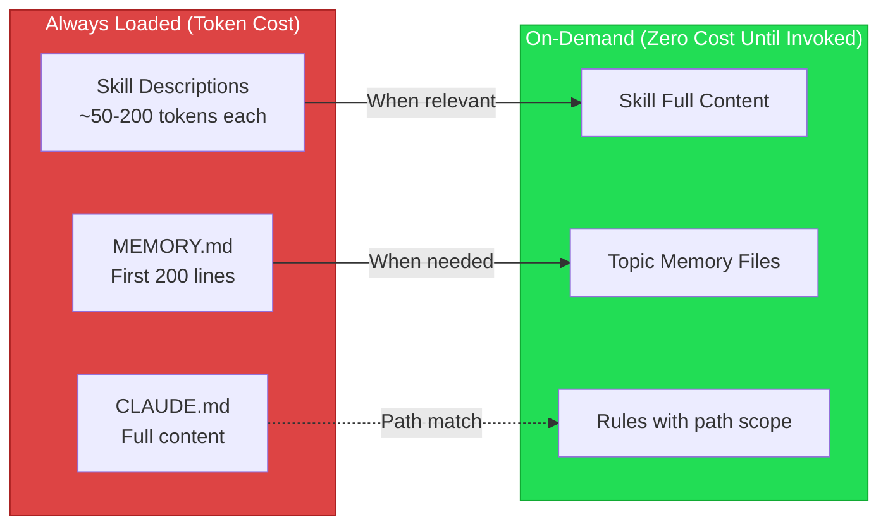
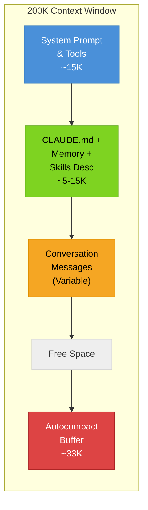
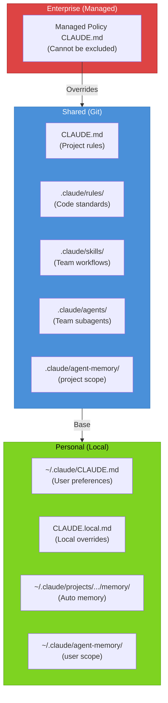

# Context Engineering：AI 輔助開發的記憶架構

> **「Prompt engineering 是想出一句神奇的話，Context engineering 是為 AI 寫好完整的劇本。」**
> 當你的 AI 助手不再「一次性用完即丟」，而是能記住你的專案、你的偏好、你的修正——開發效率的天花板被徹底打破。



---

## 目錄

1. [Context Engineering 的定義與演進](#1-context-engineering-的定義與演進)
2. [Claude Code 三層記憶架構](#2-claude-code-三層記憶架構)
3. [Layer 1：CLAUDE.md 撰寫最佳實踐](#3-layer-1claudemd-撰寫最佳實踐)
4. [Layer 2：Auto Memory 深度解析](#4-layer-2auto-memory-深度解析)
5. [Layer 3：Skills 按需載入](#5-layer-3skills-按需載入)
6. [Subagent 持久記憶](#6-subagent-持久記憶)
7. [Context Window 管理策略](#7-context-window-管理策略)
8. [實戰：設計你的專案記憶架構](#8-實戰設計你的專案記憶架構)
9. [與其他工具的記憶系統比較](#9-與其他工具的記憶系統比較)
10. [常見陷阱與疑難排解](#10-常見陷阱與疑難排解)
11. [參考文獻](#11-參考文獻)

---

## 1. Context Engineering 的定義與演進

### 1.1 從 Prompt Engineering 到 Context Engineering

2025 年中，Shopify CEO Tobi Lutke 在 X 上發文：

> 「我真的很喜歡 'context engineering' 這個詞勝過 prompt engineering。它更精確地描述了核心技能：**提供所有必要的 context 使任務可以被 LLM 合理解決的藝術**。」
> — [Tobi Lutke, X post (2025-06)](https://x.com/tobi/status/1935533422589399127)

隨後，前 Tesla/OpenAI 研究員 Andrej Karpathy 回應：

> 「+1 for 'context engineering' over 'prompt engineering'。人們把 prompt 聯想成日常使用中給 LLM 的簡短任務描述。但在每一個工業級 LLM 應用中，**context engineering 是一門精細的藝術與科學——用恰到好處的資訊填滿 context window**。」
> — [Andrej Karpathy, X post (2025-06)](https://x.com/karpathy/status/1937902205765607626)

這段討論標誌了一個典範轉移的時刻。

### 1.2 核心區別



| 面向 | Prompt Engineering | Context Engineering |
|------|-------------------|-------------------|
| **焦點** | 如何措辭問題 | 模型需要知道什麼 |
| **範圍** | 單一提示詞 | 整個資訊環境 |
| **持續性** | 一次性 | 跨 session 持久化 |
| **複雜度** | 手動調整 | 系統化工程 |
| **核心技能** | 語言技巧 | 資訊架構設計 |
| **適用場景** | 日常聊天 | 工業級 AI 應用 |

Simon Willison（Django 共同創辦人）也支持這個術語轉換，因為「context engineering」的隱含意義更接近從業者實際在做的事：**精密的資訊架構設計，而非隨意的聊天互動**。

### 1.3 Context Engineering 的三大挑戰

Karpathy 在 2025 年底的討論中指出，context engineering 面臨三個關鍵失敗模式：

| 失敗模式 | 描述 | 實例 |
|---------|------|------|
| **Context Poisoning** | 錯誤資訊透過記憶向前傳播 | 過時的 API 用法被記錄在 MEMORY.md 中 |
| **Context Distraction** | 不相關資訊壓過有用資訊 | CLAUDE.md 塞了 500 行導致關鍵指令被忽略 |
| **Context Clash** | 互相矛盾的指令產生不一致輸出 | 不同層級的 CLAUDE.md 規定了相反的命名慣例 |

這些挑戰正是 Claude Code 三層記憶架構要解決的問題。

---

## 2. Claude Code 三層記憶架構

### 2.1 架構總覽

Claude Code 的記憶系統由三個互補的層次組成，各自解決不同的問題：



### 2.2 三層比較

| 面向 | CLAUDE.md | Auto Memory | Skills |
|------|-----------|-------------|--------|
| **撰寫者** | 人類 | Claude | 人類 |
| **內容** | 指令與規則 | 學習筆記與模式 | 工作流程與知識模組 |
| **範圍** | 專案 / 使用者 / 組織 | 每個 working tree | 專案 / 使用者 / 插件 |
| **載入時機** | 每次 session 完整載入 | 每次 session 載入前 200 行 | 按需載入（相關時自動、手動 `/skill`） |
| **適合用途** | 編碼標準、架構決策、工作流程 | 建置指令、偵錯洞見、偏好 |可重用任務、模板、領域知識 |
| **版本控制** | 通常納入 Git | 僅存在本機 | 可納入 Git |
| **Token 消耗** | 永遠佔用（建議 < 200 行） | 固定佔用前 200 行 | 描述常駐 + 內容按需載入 |

### 2.3 何時用哪個？決策流程

**用 CLAUDE.md 當你想要：**
- 所有 session 都遵守的硬性規則（如「永遠用 pnpm 不用 npm」）
- 團隊共享的專案架構文件
- 編碼標準與命名慣例

**用 Auto Memory 當你想要：**
- Claude 自動學習你的修正模式
- 累積專案特有的偵錯經驗
- 不需要手動維護的知識

**用 Skills 當你想要：**
- 可重用的工作流程（如 `/deploy`、`/review`）
- 按需載入的領域知識（不浪費常駐 token）
- 跨專案共享的指令模板

---

## 3. Layer 1：CLAUDE.md 撰寫最佳實踐

### 3.1 CLAUDE.md 層級系統

CLAUDE.md 可以存在於多個層級，優先順序由高到低：

| 層級 | 位置 | 用途 | 共享範圍 |
|------|------|------|---------|
| **Managed Policy** | `/Library/Application Support/ClaudeCode/CLAUDE.md` (macOS) | 組織級指令，IT/DevOps 管理 | 所有使用者 |
| **User** | `~/.claude/CLAUDE.md` | 個人偏好 | 僅自己（所有專案） |
| **Project** | `./CLAUDE.md` 或 `./.claude/CLAUDE.md` | 專案指令 | 團隊（透過版本控制） |
| **Local** | `./CLAUDE.local.md` | 個人專案偏好，不入 Git | 僅自己（當前專案） |
| **Directory** | 子目錄中的 `CLAUDE.md` | 子模組特定指令 | 隨檔案讀取時載入 |

> 較具體的層級會覆蓋較廣泛的層級。如果兩個層級的指令互相矛盾，Claude 可能會任意選擇其中一個。

### 3.2 撰寫原則

**大小控制：目標 200 行以內。** 官方文件明確建議 "target under 200 lines per CLAUDE.md file"。超過此長度會消耗更多 context 並降低遵循度。如果指令增長過大，使用 `@import` 或 `.claude/rules/` 拆分。

**結構化：** 使用 markdown 標題和列表分組相關指令。Claude 掃描結構的方式跟人類一樣——有組織的區段比密集段落更容易遵循。

**具體性：** 寫出可驗證的具體指令。

```markdown
# Good - Specific and verifiable
- Use 2-space indentation
- Run `npm test` before committing
- API handlers live in `src/api/handlers/`

# Bad - Vague and unverifiable
- Format code properly
- Test your changes
- Keep files organized
```

### 3.3 結構化模板

以下是一個經過驗證的 CLAUDE.md 模板，涵蓋了 WHAT、WHY、HOW 三個核心面向：

```markdown
# Project: <project-name>

## WHAT - Tech Stack & Structure
- Language: TypeScript (strict mode)
- Framework: Next.js 15 with App Router
- Database: PostgreSQL via Prisma ORM
- Testing: Vitest + Playwright

## WHY - Project Purpose
This is an internal admin dashboard for managing user accounts and billing.
The API layer follows RESTful conventions with OpenAPI documentation.

## HOW - Build & Test
- Install: `pnpm install`
- Dev: `pnpm dev`
- Test: `pnpm test` (unit) / `pnpm e2e` (integration)
- Lint: `pnpm lint` (do NOT fix style issues manually, use the linter)

## Architecture
- `src/app/` — Next.js App Router pages
- `src/api/` — API route handlers
- `src/lib/` — Shared utilities and database client
- `src/components/` — React components (collocated with tests)

## Conventions
- Use named exports, not default exports
- Error responses follow RFC 7807 Problem Details format
- Database migrations must be reversible
- All API endpoints require input validation with Zod

## DO NOT
- Never commit .env files
- Never use `any` type
- Never skip the test step before committing
```

### 3.4 @import 與 .claude/rules 拆分策略

當指令超過 200 行時，有兩種拆分方式：

**方式一：`@import` 引用外部檔案**

```markdown
# CLAUDE.md
See @README for project overview and @package.json for npm commands.
Follow the git workflow at @docs/git-instructions.md.
```

引用的檔案會在 session 啟動時展開載入，支援最多 5 層遞迴引用。

**方式二：`.claude/rules/` 目錄（推薦）**

```
.claude/
├── CLAUDE.md              # Main instructions (concise)
└── rules/
    ├── code-style.md      # Always loaded
    ├── testing.md          # Always loaded
    └── api-design.md      # Path-scoped, loaded on demand
```

Path-scoped rules 只在 Claude 讀取匹配檔案時才載入，有效節省 context：

```yaml
---
paths:
  - "src/api/**/*.ts"
---

# API Development Rules
- All API endpoints must include input validation
- Use the standard error response format
- Include OpenAPI documentation comments
```

### 3.5 多語言專案的 CLAUDE.md 範例

以下展示不同語言專案的 CLAUDE.md 核心結構：

**Python 專案**

```markdown
## Build & Test
- Install: `uv sync`
- Test: `uv run pytest -x`
- Lint: `uv run ruff check . --fix`
- Type check: `uv run mypy src/`

## Conventions
- Use type hints everywhere (Python 3.12+ syntax)
- Prefer dataclasses over plain dicts for domain objects
- Use `pathlib.Path` instead of `os.path`
```

**Go 專案**

```markdown
## Build & Test
- Build: `go build ./...`
- Test: `go test ./... -race -count=1`
- Lint: `golangci-lint run`

## Conventions
- Follow Effective Go and Go Proverbs
- Error handling: always wrap errors with `fmt.Errorf("context: %w", err)`
- Use table-driven tests
```

**Kotlin 專案**

```markdown
## Build & Test
- Build: `./gradlew build`
- Test: `./gradlew test`
- Lint: `./gradlew detekt`

## Conventions
- Use data classes for DTOs
- Prefer sealed classes for domain state
- Coroutines for async operations (no callbacks)
```

**Swift 專案**

```markdown
## Build & Test
- Build: `swift build`
- Test: `swift test`
- Lint: `swiftlint`

## Conventions
- Use Swift Concurrency (async/await) over completion handlers
- Prefer value types (struct) over reference types (class)
- Use SwiftUI for new views, UIKit only for legacy
```

---

## 4. Layer 2：Auto Memory 深度解析

### 4.1 運作機制

Auto Memory 是 Claude Code 在工作過程中自動記錄學習筆記的系統。它不是每次 session 都會寫入——Claude 會根據資訊是否在未來對話中有用來決定是否值得記住。

**觸發儲存的情境：**
- 你反覆修正相同的錯誤模式
- 你明確告訴 Claude「記住這個」
- Claude 發現了專案特有的建置模式或架構決策
- 偵錯過程中找到了重要的根因分析

**不會觸發的情境：**
- 一次性的簡單問答
- 與專案無關的通用知識
- 已經記錄過的重複資訊

### 4.2 目錄結構

```
~/.claude/projects/<project-path>/memory/
├── MEMORY.md              # Main index (first 200 lines auto-loaded)
├── debugging.md           # Debugging patterns and solutions
├── api-conventions.md     # API design decisions discovered
├── build-setup.md         # Build configuration insights
└── team-preferences.md    # Coding style preferences learned
```

**`<project-path>` 的推導規則：**
- 在 Git repo 中：使用 repo root path（所有 worktree 和子目錄共享同一個記憶目錄）
- 不在 Git repo 中：使用專案根目錄路徑

### 4.3 MEMORY.md 的 200 行限制

每次 session 啟動時，**只有 MEMORY.md 的前 200 行**會被載入到 context 中。超過 200 行的內容不會在啟動時載入。

Claude 會自動維護這個邊界——當 MEMORY.md 增長過大時，它會將詳細筆記移到獨立的主題檔案中，保持 MEMORY.md 作為精簡的索引。

```markdown
# MEMORY.md (Example - kept under 200 lines)

## Project Overview
- Next.js 15 admin dashboard
- Prisma ORM with PostgreSQL
- Auth via NextAuth.js v5

## Build Notes
- Must run `pnpm db:generate` after schema changes
- E2E tests require local Redis: `docker compose up redis -d`

## Debugging Insights
- See debugging.md for the auth token refresh race condition fix
- See api-conventions.md for pagination cursor implementation details

## Code Patterns
- All API handlers use the `withAuth()` wrapper
- Form validation is centralized in `src/lib/validators/`
```

**主題檔案（如 `debugging.md`）不會在啟動時載入**。Claude 在需要時會使用標準檔案工具按需讀取它們。

### 4.4 手動存取與編輯

Auto Memory 檔案是純 markdown，你可以隨時編輯或刪除：

```bash
# Browse memory directory
ls ~/.claude/projects/<project>/memory/

# Read what Claude has learned
cat ~/.claude/projects/<project>/memory/MEMORY.md

# Open in editor
code ~/.claude/projects/<project>/memory/

# Or use the built-in command
# In Claude Code session: /memory
```

`/memory` 指令會列出所有載入的 CLAUDE.md 和 rules 檔案、切換 auto memory 開關、以及提供連結開啟 auto memory 資料夾。

### 4.5 設定控制

```json
// Project settings (.claude/settings.json)
{
  "autoMemoryEnabled": false  // Disable for this project
}
```

```bash
# Environment variable override (highest priority)
export CLAUDE_CODE_DISABLE_AUTO_MEMORY=1  # Force off globally

# Useful in CI/CD environments to prevent memory accumulation
CLAUDE_CODE_DISABLE_AUTO_MEMORY=1 claude --headless "run tests"
```

### 4.6 Auto Memory 最佳實踐

| 實踐 | 說明 |
|------|------|
| **定期審查** | 重大重構後檢查 MEMORY.md 是否有過時資訊 |
| **不要重複 CLAUDE.md** | Auto memory 記學到的模式，CLAUDE.md 記規則 |
| **明確儲存關鍵知識** | 主動告訴 Claude「記住這個」，不要假設它什麼都能自動發現 |
| **CI 中禁用** | 在自動化環境中設定環境變數防止累積 |
| **保持 MEMORY.md 精簡** | 讓 Claude 自動拆分主題，不要手動把所有東西塞進去 |

---

## 5. Layer 3：Skills 按需載入

### 5.1 Skills 在記憶架構中的角色

Skills 解決了一個核心問題：**CLAUDE.md 是永遠佔用 context 的，但不是所有知識都需要常駐。**



| 載入模式 | CLAUDE.md | Rules (no path) | Rules (path-scoped) | Skill Descriptions | Skill Content |
|---------|-----------|-----------------|--------------------|--------------------|---------------|
| **Session start** | Full | Full | No | Yes (~50-200 tokens) | No |
| **On file match** | - | - | Yes | - | - |
| **On relevance** | - | - | - | - | Yes |
| **On `/skill-name`** | - | - | - | - | Yes |

### 5.2 Skill vs CLAUDE.md vs Rules 的選擇

- **CLAUDE.md**：每次 session 都需要的硬性規則（建置指令、命名慣例）
- **Rules（無 path）**：每次 session 都需要但想分檔管理的指令
- **Rules（有 path）**：只在特定檔案類型相關時才需要的指令
- **Skills**：可重用的工作流程、任務模板、領域知識

### 5.3 實戰範例：用 Skill 封裝 API 開發知識

```yaml
# .claude/skills/api-endpoint/SKILL.md
---
name: api-endpoint
description: Create a new API endpoint following project conventions. Use when building new API routes or endpoints.
---

When creating a new API endpoint:

1. **Create route handler** in `src/api/handlers/`
2. **Define Zod schema** for request validation
3. **Add OpenAPI comments** above the handler
4. **Write tests** in `src/api/__tests__/`
5. **Update API docs** in `docs/api/`

Follow the patterns in @src/api/handlers/users.ts as reference.

## Error Response Format (RFC 7807)
```json
{
  "type": "https://api.example.com/errors/not-found",
  "title": "Resource Not Found",
  "status": 404,
  "detail": "User with ID 123 was not found"
}
```
```

這個 Skill 的描述（約 100 tokens）會常駐在每次 session 的 context 中，但完整內容只在 Claude 判斷相關或你輸入 `/api-endpoint` 時才載入。

---

## 6. Subagent 持久記憶

### 6.1 Memory Frontmatter

Claude Code v2.1.33（2026 年 2 月）引入了 subagent 持久記憶功能，透過 frontmatter 中的 `memory` 欄位啟用：

```markdown
---
name: code-reviewer
description: Reviews code for quality and best practices
memory: user
---

You are a code reviewer. As you review code, update your agent memory with
patterns, conventions, and recurring issues you discover.
```

### 6.2 記憶範圍

| 範圍 | 儲存位置 | 適用場景 |
|------|---------|---------|
| `user` | `~/.claude/agent-memory/<agent-name>/` | 跨專案累積知識（推薦預設） |
| `project` | `.claude/agent-memory/<agent-name>/` | 專案特定知識，可透過版本控制共享 |
| `local` | `.claude/agent-memory-local/<agent-name>/` | 專案特定知識，不入版本控制 |

### 6.3 運作方式

當 `memory` 被啟用時：

1. Subagent 的系統提示會包含讀寫記憶目錄的指示
2. 記憶目錄中的 `MEMORY.md` 前 200 行會被注入到系統提示
3. `Read`、`Write`、`Edit` 工具會自動啟用
4. Subagent 可以在執行過程中讀取和更新記憶檔案

### 6.4 多語言實戰：Subagent 記憶配置範例

**TypeScript 程式碼審查員**

```markdown
---
name: ts-reviewer
description: TypeScript code reviewer with persistent learning
tools: Read, Grep, Glob, Bash
model: sonnet
memory: project
---

You are a TypeScript expert reviewer. Focus on:
- Type safety and proper generic usage
- Avoiding `any` and `unknown` abuse
- React hooks dependency arrays
- Proper error boundary placement

Update your agent memory as you discover codebase patterns,
recurring issues, and architectural decisions.
```

**Python 安全審計員**

```python
# Example: .claude/agents/security-auditor.md
```

```markdown
---
name: security-auditor
description: Security audit specialist for Python applications
tools: Read, Grep, Glob
model: inherit
memory: user
---

You are a security auditor for Python applications. Check for:
- SQL injection (especially raw queries bypassing ORM)
- SSRF vulnerabilities in HTTP clients
- Insecure deserialization (pickle, yaml.load)
- Hardcoded secrets and credentials
- Improper input validation

Maintain a knowledge base of common vulnerability patterns
you discover across projects in your agent memory.
```

**Go 效能分析員**

```markdown
---
name: go-perf-analyzer
description: Go performance analyzer with memory of optimization patterns
tools: Read, Grep, Glob, Bash
model: sonnet
memory: user
---

You are a Go performance specialist. Analyze code for:
- Goroutine leaks and channel misuse
- Excessive allocations (escape analysis issues)
- Inefficient string concatenation
- Missing sync.Pool for frequent allocations
- Database connection pool sizing

Record optimization patterns and benchmarking insights
in your agent memory for cross-project reference.
```

### 6.5 持久記憶使用建議

1. **`user` 是推薦預設範圍**。除非知識只適用於特定 codebase，否則使用 `user` 讓記憶跨專案累積。
2. **要求 subagent 在開始前查閱記憶**：「Review this PR, and check your memory for patterns you've seen before.」
3. **要求 subagent 在完成後更新記憶**：「Now that you're done, save what you learned to your memory.」
4. **在 subagent 的 prompt 中直接包含記憶指示**，讓它主動維護知識庫。

---

## 7. Context Window 管理策略

### 7.1 Context Window 基礎

Claude Code 運作在一個 **200K token 的 context window** 中（Opus 4.6 和 Sonnet 4.6 支援 1M token beta），其中約 33K token（16.5%）被保留作為 compaction buffer。



實際可用的 context 在 auto-compaction 觸發前約為 **167K tokens**。

### 7.2 /context 監控

`/context` 指令顯示即時的 token 分配：

```
System prompt and tools:    14,832 tokens
Custom agents:               2,100 tokens
Memory files:                1,560 tokens
Skills descriptions:           890 tokens
Messages:                   48,200 tokens
Free space:                 99,418 tokens
Autocompact buffer:         33,000 tokens
─────────────────────────────────────────
Total:                     200,000 tokens
```

定期執行 `/context` 來了解你的 token 花在哪裡。如果 CLAUDE.md 和 memory 佔用了超過 10% 的 context，考慮精簡。

### 7.3 /compact 壓縮策略

`/compact` 手動觸發對話歷史的摘要壓縮。與 `/clear`（完全清除歷史）不同，`/compact` 會保留摘要作為新的 context。

**關鍵特性：**
- CLAUDE.md 在 compaction 後會完整存活——它從磁碟重新讀取並重新注入
- 只有對話中口頭提供的指令會在 compaction 中丟失
- 可以提供自訂焦點：`/compact focus on the API changes`

**策略性使用 /compact：**

| 場景 | 建議 |
|------|------|
| 完成一個重要功能後 | `/compact keep the architecture decisions` |
| 長時間偵錯結束後 | `/compact summarize only the root cause and fix` |
| 切換到新任務前 | `/compact summarize completed work as bullet points` |
| Context 快滿時 | 在邏輯斷點處主動 compact，別等 auto-compact |

### 7.4 Auto-Compaction 機制

當 context 使用量達到約 **83.5%** 時，auto-compaction 自動觸發：

1. 對話歷史被摘要壓縮
2. 較早的訊息被替換為濃縮版本
3. 早期 session 的細節會丟失
4. Session 繼續，但歷史 context 減少

```bash
# Override auto-compaction trigger percentage (1-100)
export CLAUDE_AUTOCOMPACT_PCT_OVERRIDE=70  # Trigger earlier

# Disable auto-compaction (use with caution)
# export CLAUDE_AUTOCOMPACT_PCT_OVERRIDE=100
```

### 7.5 1M Context Window

Opus 4.6 和 Sonnet 4.6 支援 1M token context window（beta 中）。適用於需要處理大量程式碼的場景。

**重要注意：**
- 超過 200K token 的請求會以 **premium 費率**計費（輸入 2x，輸出 1.5x）
- 1M 並不代表你應該把所有東西都塞進去——Karpathy 的研究顯示，過多噪音會**降低**模型效能
- 策略性使用：大型程式碼審查、跨模組重構、複雜偵錯

```bash
# Use 1M context with Sonnet
claude --model sonnet[1m]
```

### 7.6 CLAUDE.md 與 Compaction 的交互

一個常見的困惑：「為什麼 compaction 後我的指令似乎消失了？」

**CLAUDE.md 指令永遠不會因 compaction 而消失**。Compaction 後，Claude 從磁碟重新讀取 CLAUDE.md 並重新注入。如果一個指令在 compaction 後消失了，那是因為它只在對話中口頭提供，而沒有寫進 CLAUDE.md。

> 重要的指令永遠要寫進 CLAUDE.md，不要只在對話中提及。

---

## 8. 實戰：設計你的專案記憶架構

### 8.1 小型專案（1-3 人，< 10K LOC）

```
my-small-project/
├── CLAUDE.md                    # 60-100 lines, covers everything
├── CLAUDE.local.md              # Personal preferences (gitignored)
└── .claude/
    └── skills/
        └── deploy/
            └── SKILL.md         # Deployment workflow
```

**CLAUDE.md 範例（精簡版）：**

```markdown
# Small Project CLAUDE.md

## Stack
Python 3.12, FastAPI, SQLAlchemy, PostgreSQL, Pytest

## Commands
- Dev: `uv run uvicorn app.main:app --reload`
- Test: `uv run pytest -x --tb=short`
- Migrate: `uv run alembic upgrade head`

## Key Decisions
- Alembic for migrations (not raw SQL)
- Pydantic v2 for request/response models
- All endpoints require API key auth header

## Do Not
- Never use `from app import *`
- Never skip type hints
```

### 8.2 大型 Monorepo（10+ 人，100K+ LOC）

```
monorepo/
├── CLAUDE.md                          # Top-level: 50 lines, just overview
├── .claude/
│   ├── CLAUDE.md                      # More detailed project-wide rules
│   ├── settings.json                  # Claude settings
│   ├── settings.local.json            # Per-user settings (gitignored)
│   ├── rules/
│   │   ├── code-style.md              # Universal code style
│   │   ├── git-workflow.md            # Git conventions
│   │   ├── frontend-api.md            # Path-scoped to frontend
│   │   └── backend-api.md             # Path-scoped to backend
│   ├── skills/
│   │   ├── deploy/SKILL.md
│   │   ├── review-pr/SKILL.md
│   │   └── migrate-db/SKILL.md
│   └── agents/
│       ├── code-reviewer.md           # With memory: project
│       └── security-auditor.md        # With memory: user
├── packages/
│   ├── frontend/
│   │   └── CLAUDE.md                  # Frontend-specific instructions
│   ├── backend/
│   │   └── CLAUDE.md                  # Backend-specific instructions
│   └── shared/
│       └── CLAUDE.md                  # Shared library instructions
```

**Monorepo 頂層 CLAUDE.md（精簡）：**

```markdown
# Monorepo Root CLAUDE.md

This is a monorepo with frontend (React), backend (Go), and shared libs.
See package-specific CLAUDE.md files for detailed instructions.

## Global Rules
- Always run tests for affected packages before committing
- Use conventional commits: `feat:`, `fix:`, `chore:`
- Never modify `packages/shared/` without updating all consumers

## Quick Reference
- Frontend: `cd packages/frontend && pnpm dev`
- Backend: `cd packages/backend && go run ./cmd/server`
- All tests: `./scripts/test-all.sh`
```

**排除不相關的 CLAUDE.md：**

```json
// .claude/settings.local.json (for a frontend developer)
{
  "claudeMdExcludes": [
    "**/packages/backend/CLAUDE.md",
    "**/packages/mobile/CLAUDE.md"
  ]
}
```

### 8.3 團隊協作的記憶分層策略



### 8.4 從零開始的設定 Checklist

#### Step 1: 初始化 CLAUDE.md

```bash
# Option A: Let Claude generate a starting point
claude
> /init

# Option B: Create manually with the WHY/WHAT/HOW structure
touch CLAUDE.md
```

#### Step 2: 設定 Auto Memory

```bash
# Auto memory is on by default
# Verify it's working:
claude
> /memory
# Check auto memory toggle is ON
```

#### Step 3: 建立常用 Skills

```bash
# Create project skills directory
mkdir -p .claude/skills/deploy
mkdir -p .claude/skills/review

# Create a deploy skill
cat > .claude/skills/deploy/SKILL.md << 'EOF'
---
name: deploy
description: Deploy to production environment
disable-model-invocation: true
---

Deploy the application:
1. Run full test suite
2. Build production bundle
3. Deploy to staging first
4. Run smoke tests on staging
5. Promote to production
6. Verify health checks
EOF
```

#### Step 4: 配置 Subagent（如需要）

```bash
mkdir -p .claude/agents

cat > .claude/agents/code-reviewer.md << 'EOF'
---
name: code-reviewer
description: Reviews code for quality and best practices
tools: Read, Grep, Glob
model: sonnet
memory: project
---

Review code focusing on:
- Correctness and edge cases
- Performance implications
- Security vulnerabilities
- Test coverage gaps

Update your agent memory with recurring patterns you discover.
EOF
```

#### Step 5: 驗證設定

```bash
# Start a session and verify everything loads
claude
> /memory     # Check CLAUDE.md and memory files
> /context    # Check token allocation
> /agents     # Check subagent configuration
```

### 8.5 Kotlin Android 專案完整記憶架構範例

以下是一個 Kotlin Android 專案的完整記憶架構設計：

```
android-app/
├── CLAUDE.md                        # See below
├── .claude/
│   ├── rules/
│   │   ├── compose-patterns.md      # Jetpack Compose conventions
│   │   └── testing.md               # Test conventions
│   ├── skills/
│   │   ├── new-feature/SKILL.md     # Feature scaffold workflow
│   │   └── release/SKILL.md         # Release workflow
│   └── agents/
│       └── ui-reviewer.md           # Compose UI review specialist
```

```markdown
# CLAUDE.md for Android App

## Stack
Kotlin 2.1, Jetpack Compose, Hilt DI, Room DB, Retrofit

## Commands
- Build: `./gradlew assembleDebug`
- Test: `./gradlew testDebugUnitTest`
- Lint: `./gradlew detekt`
- UI Tests: `./gradlew connectedDebugAndroidTest`

## Architecture
MVVM + Clean Architecture
- `app/` — Main application module
- `core/` — Shared utilities, network, database
- `feature/` — Feature modules (each self-contained)
  - `feature/<name>/data/` — Repository implementations
  - `feature/<name>/domain/` — Use cases and models
  - `feature/<name>/ui/` — Composables and ViewModels

## Conventions
- ViewModels expose StateFlow, not LiveData
- Navigation uses type-safe routes (Kotlin Serialization)
- All Composables are stateless; state hoisting required
- Use `remember` and `derivedStateOf` appropriately
```

---

## 9. 與其他工具的記憶系統比較

### 9.1 AI 指令檔案格式比較

| 面向 | CLAUDE.md | .cursorrules / .mdc | AGENTS.md | .github/copilot/ |
|------|-----------|-------------------|-----------|-----------------|
| **支援工具** | Claude Code | Cursor | 多工具 (emerging standard) | GitHub Copilot |
| **格式** | Markdown | Markdown (.mdc with YAML frontmatter) | Markdown | Markdown |
| **層級系統** | Enterprise > User > Project > Directory | Global > Project | Project only | Organization > Repo |
| **Path scoping** | `.claude/rules/` with `paths` frontmatter | `.mdc` activation modes | No | `*.md` files in folder |
| **自動記憶** | Auto Memory (MEMORY.md) | No | No | No |
| **模組化知識** | Skills (SKILL.md) | No | No | No |
| **Import 語法** | `@path/to/file` | No | No | No |

### 9.2 多工具相容策略

如果你的團隊同時使用多個 AI 工具，推薦以下策略：

```
project/
├── AGENTS.md           # Shared instructions for all AI tools
├── CLAUDE.md           # Claude-specific: @AGENTS.md + Claude features
├── .cursor/
│   └── rules/          # Cursor-specific rules
├── .github/
│   └── copilot/        # Copilot-specific instructions
```

```markdown
# CLAUDE.md (lean, points to shared instructions)
Follow the shared instructions at @AGENTS.md.

## Claude-Specific
- Use /compact after completing each major feature
- Prefer spawning Explore subagent for codebase research
```

> **最佳實踐**：把共享指令放在 `AGENTS.md` 中，把 Claude 特有功能（@imports、Skills 引用、Subagent 指示）放在 `CLAUDE.md` 中。

---

## 10. 常見陷阱與疑難排解

### 10.1 Claude 不遵循 CLAUDE.md 指令

CLAUDE.md 是 context，不是強制配置。Claude 會讀取並嘗試遵循，但沒有 100% 合規的保證，尤其對模糊或衝突的指令。

**排解步驟：**

1. 執行 `/memory` 確認 CLAUDE.md 被載入
2. 確認檔案位置正確（參見 [3.1 層級系統](#31-claudemd-層級系統)）
3. 讓指令更具體：「Use 2-space indentation」比「format code nicely」有效得多
4. 檢查跨 CLAUDE.md 檔案是否有矛盾指令
5. 考慮精簡：指令越多，遵循品質越均勻下降

### 10.2 CLAUDE.md 過大

```
Symptom: Claude inconsistently follows instructions
Root cause: CLAUDE.md exceeds 200+ lines, causing context dilution
```

**解法：**
- 移動細節到 `@import` 引用的外部檔案
- 使用 `.claude/rules/` 搭配 path scoping
- 將非常駐知識改為 Skills
- 刪除可以用 linter/formatter 處理的風格指令（不要用 LLM 做 linter 的工作）

### 10.3 Auto Memory 記了過時的資訊

```
Symptom: Claude keeps using old API patterns or outdated build commands
Root cause: Stale entries in MEMORY.md or topic files
```

**解法：**

```bash
# Open and edit memory files directly
code ~/.claude/projects/<project>/memory/

# Or tell Claude to forget
> "Forget the old build process. We now use pnpm instead of npm."

# Or delete and let Claude rebuild
rm ~/.claude/projects/<project>/memory/MEMORY.md
```

### 10.4 Context 快速耗盡

| 原因 | 解法 |
|------|------|
| CLAUDE.md 太長 | 精簡到 200 行以內 |
| 太多 Skills 描述 | 用 `disable-model-invocation: true` 隱藏不常用的 |
| 讀取大檔案 | 讓 Claude 使用 subagent 隔離大量輸出 |
| 長時間偵錯 | 在邏輯斷點主動 `/compact` |
| 多次 tool 調用 | Tool results 超過 50K 會自動持久化到磁碟 |

### 10.5 Compaction 後指令丟失

**這不是 CLAUDE.md 的問題——是你的指令只在對話中口頭提供了。**

CLAUDE.md 完整存活 compaction。如果指令消失了，把它加進 CLAUDE.md 使其跨 session 持久化。

---

## 11. 參考文獻

### 官方文件

1. Anthropic — [How Claude Remembers Your Project (Memory Documentation)](https://code.claude.com/docs/en/memory)
2. Anthropic — [Extend Claude with Skills](https://code.claude.com/docs/en/skills)
3. Anthropic — [Create Custom Subagents](https://code.claude.com/docs/en/sub-agents)
4. Anthropic — [Claude Code: Best Practices for Agentic Coding](https://www.anthropic.com/engineering/claude-code-best-practices)
5. Anthropic — [Context Windows Documentation](https://platform.claude.com/docs/en/build-with-claude/context-windows)
6. Anthropic — [Compaction (API Documentation)](https://platform.claude.com/docs/en/build-with-claude/compaction)

### Context Engineering 論述

7. Andrej Karpathy — [+1 for "context engineering" over "prompt engineering" (X post)](https://x.com/karpathy/status/1937902205765607626)
8. Tobi Lutke — [I really like the term "context engineering" (X post)](https://x.com/tobi/status/1935533422589399127)
9. Addy Substack — [Context Engineering: Bringing Engineering Discipline to Prompts](https://addyo.substack.com/p/context-engineering-bringing-engineering)
10. Zep Blog — [What is Context Engineering, Anyway?](https://blog.getzep.com/what-is-context-engineering/)
11. Simon Willison — [Context Engineering](https://simonwillison.net/2025/Jun/27/context-engineering/)
12. Pure AI — [Karpathy Puts Context at the Core of AI Coding](https://pureai.com/articles/2025/09/23/karpathy-puts-context-at-the-core-of-ai-coding.aspx)
13. The Decoder — [Shopify CEO and ex-OpenAI Researcher Agree that Context Engineering Beats Prompt Engineering](https://the-decoder.com/shopify-ceo-and-ex-openai-researcher-agree-that-context-engineering-beats-prompt-engineering/)

### CLAUDE.md 與記憶系統

14. HumanLayer Blog — [Writing a Good CLAUDE.md](https://www.humanlayer.dev/blog/writing-a-good-claude-md)
15. Dometrain Blog — [Creating the Perfect CLAUDE.md for Claude Code](https://dometrain.com/blog/creating-the-perfect-claudemd-for-claude-code/)
16. ClaudeFast — [Claude Code Auto Memory: Complete Guide](https://claudefa.st/blog/guide/mechanics/auto-memory)
17. ClaudeFast — [Context Buffer Management](https://claudefa.st/blog/guide/mechanics/context-buffer-management)
18. SFEIR Institute — [The CLAUDE.md Memory System Deep Dive](https://institute.sfeir.com/en/claude-code/claude-code-memory-system-claude-md/deep-dive/)
19. Medium (Joe Njenga) — [Anthropic Just Added Auto-Memory to Claude Code (I Tested It)](https://medium.com/@joe.njenga/anthropic-just-added-auto-memory-to-claude-code-memory-md-i-tested-it-0ab8422754d2)

### 比較與生態系

20. Medium (Data Science Collective) — [The Complete Guide to AI Agent Memory Files](https://medium.com/data-science-collective/the-complete-guide-to-ai-agent-memory-files-claude-md-agents-md-and-beyond-49ea0df5c5a9)
21. Builder.io — [Claude Code vs Cursor: What to Choose in 2026](https://www.builder.io/blog/cursor-vs-claude-code)
22. shanraisshan — [Claude Code Best Practice (GitHub)](https://github.com/shanraisshan/claude-code-best-practice)
23. Morph LLM — [Claude Code Context Window: Limits, Compaction & Management Guide](https://www.morphllm.com/claude-code-context-window)

### 延伸閱讀

24. Anthropic — [Effective Context Engineering for AI Agents](https://www.anthropic.com/engineering/effective-context-engineering-for-ai-agents)
25. Karpathy Blog — [2025 LLM Year in Review](https://karpathy.bearblog.dev/year-in-review-2025/)
26. Policy Center — [Beyond the Prompt: Why Context Engineering is the Real AI Revolution](https://www.policycenter.ma/publications/beyond-prompt-why-context-engineering-real-ai-revolution)

---

*最後更新：2026-03-04 | 基於 Claude Code v2.1+*
