# Agent Army 系統設計文件

> **版本**: 1.3.0 | **最後更新**: 2026-03-04
> **目標**: 讓單人開發者透過 Claude Code CLI 指揮 AI Agent 大軍，實現從規劃到部署的全自動化軟體開發流程

---

## 目錄

1. [設計哲學](#1-設計哲學)
2. [系統架構](#2-系統架構)
3. [Agent 角色定義](#3-agent-角色定義)
4. [Skill 系統設計](#4-skill-系統設計)
5. [工作流程編排](#5-工作流程編排)
6. [Context 管理策略](#6-context-管理策略)
7. [報告與文件管理](#7-報告與文件管理)
8. [品質保證機制](#8-品質保證機制)
9. [成本與效能優化](#9-成本與效能優化)
10. [可攜性與複製](#10-可攜性與複製)

---

## 1. 設計哲學

### 1.1 核心理念：Symbiotic Engineering

人機共生工程的三大支柱：

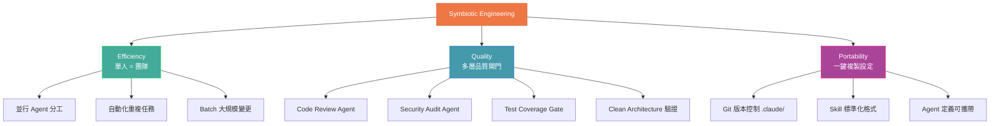
```mermaid
graph TD
    A[Symbiotic Engineering] --> B[Efficiency<br/>單人 = 團隊]
    A --> C[Quality<br/>多層品質閘門]
    A --> D[Portability<br/>一鍵複製設定]

    B --> B1[並行 Agent 分工]
    B --> B2[自動化重複任務]
    B --> B3[Batch 大規模變更]

    C --> C1[Code Review Agent]
    C --> C2[Security Audit Agent]
    C --> C3[Test Coverage Gate]
    C --> C4[Clean Architecture 驗證]

    D --> D1[Git 版本控制 .claude/]
    D --> D2[Skill 標準化格式]
    D --> D3[Agent 定義可攜帶]

    style A fill:#e74,stroke:#c52,color:#fff
    style B fill:#4a9,stroke:#2d7,color:#fff
    style C fill:#49a,stroke:#27d,color:#fff
    style D fill:#a49,stroke:#d27,color:#fff
```

### 1.2 設計原則

| 原則 | 說明 | 實現方式 |
|------|------|----------|
| **職責分離** | 每個 Agent 只做一件事 | 10 個專責 Agent 定義 |
| **並行最大化** | 獨立任務同時執行 | Subagent 背景模式 + Agent Teams |
| **Context 節約** | 不浪費 Token 在不需要的 context | 按需載入 Skill + 精簡 spawn prompt |
| **歷史保留** | 所有報告和決策永不刪除 | `docs/reports/` + `docs/archive/` |
| **Clean Architecture** | 程式碼依賴只向內 | dev-standards skill + quality-gate |
| **漸進式披露** | 從簡單到複雜，按需深入 | Skill 三層載入（描述 → 指令 → 參考） |

---

## 2. 系統架構

### 2.1 整體架構圖

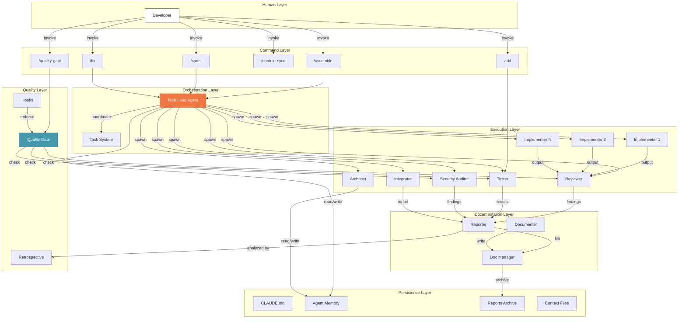
```mermaid
graph TB
    subgraph "Human Layer"
        U[Developer]
    end

    subgraph "Command Layer"
        S1["/assemble"]
        S2["/sprint"]
        S3["/quality-gate"]
        S4["/context-sync"]
        S5t["/tdd"]
        S6f["/fix"]
    end

    subgraph "Orchestration Layer"
        TL[Tech Lead Agent]
        TS[Task System]
    end

    subgraph "Execution Layer"
        AR[Architect]
        IM1[Implementer 1]
        IM2[Implementer 2]
        IM3[Implementer N]
        TE[Tester]
        RV[Reviewer]
        SA[Security Auditor]
        IN[Integrator]
    end

    subgraph "Documentation Layer"
        DC[Documenter]
        DM[Doc Manager]
        RP[Reporter]
    end

    subgraph "Quality Layer"
        QG[Quality Gate]
        HK[Hooks]
        RT[Retrospective]
    end

    subgraph "Persistence Layer"
        CM[CLAUDE.md]
        MEM[Agent Memory]
        RPT[Reports Archive]
        CTX[Context Files]
    end

    U -->|invoke| S1
    U -->|invoke| S2
    U -->|invoke| S3
    U -->|invoke| S4
    U -->|invoke| S5t
    U -->|invoke| S6f

    S1 --> TL
    S2 --> TL
    S5t --> TE
    S6f --> TL

    TL -->|spawn| AR
    TL -->|spawn| IM1
    TL -->|spawn| IM2
    TL -->|spawn| IM3
    TL -->|spawn| TE
    TL -->|spawn| RV
    TL -->|spawn| SA
    TL -->|spawn| IN
    TL -->|coordinate| TS

    IM1 -->|output| RV
    IM2 -->|output| RV
    IM3 -->|output| RV
    RV -->|findings| RP
    TE -->|results| RP
    SA -->|findings| RP
    IN -->|report| RP

    RP -->|"analyzed by"| RT
    RP -->|file| DM
    DC -->|write| DM
    DM -->|archive| RPT

    S3 --> QG
    QG -->|check| RV
    QG -->|check| TE
    QG -->|check| SA

    HK -->|enforce| QG

    TL -->|read/write| MEM
    AR -->|read/write| MEM

    style U fill:#fff,stroke:#333
    style TL fill:#e74,stroke:#c52,color:#fff
    style QG fill:#49a,stroke:#27d,color:#fff
```

### 2.2 檔案結構

```
.claude/
├── CLAUDE.md                          # 專案規範（Clean Architecture + 人機協作標準）
├── settings.json                      # Agent Teams 啟用 + Hooks + 權限
├── agents/                            # 10 個專責 Agent 定義
│   ├── tech-lead.md                   # 團隊指揮官
│   ├── architect.md                   # 系統架構師
│   ├── implementer.md                 # 程式碼實作者
│   ├── tester.md                      # 測試專家
│   ├── reviewer.md                    # 程式碼審查員
│   ├── documenter.md                  # 文件撰寫者
│   ├── security-auditor.md            # 安全審計員
│   ├── integrator.md                  # 整合專家
│   ├── doc-manager.md                 # 文件生命週期管理員
│   └── reporter.md                    # 報告產生器
├── skills/                            # 10 個核心 Skill（不含 setup）
│   ├── assemble/                      # Agent 大軍集結器
│   │   ├── SKILL.md
│   │   └── references/
│   │       ├── role-catalog.md        # 角色完整目錄
│   │       └── workflow-patterns.md   # 工作流程模式
│   ├── dev-standards/                 # 開發標準（自動載入）
│   │   ├── SKILL.md
│   │   └── references/
│   │       └── code-conventions.md    # 詳細程式碼規範
│   ├── sprint/                        # Sprint 規劃與執行
│   │   └── SKILL.md
│   ├── quality-gate/                  # 品質閘門
│   │   └── SKILL.md
│   ├── context-sync/                  # Context 同步管理
│   │   └── SKILL.md
│   ├── integration-test/              # 整合測試編排
│   │   └── SKILL.md
│   ├── code-review/                   # 程式碼審查編排
│   │   └── SKILL.md
│   ├── retrospective/                 # Mission 回顧學習
│   │   └── SKILL.md
│   ├── tdd/                           # TDD 測試驅動開發
│   │   └── SKILL.md
│   └── fix/                           # 智慧問題修復
│       └── SKILL.md
└── hooks/                             # 品質保證 Hooks
    └── scripts/
        └── (hook scripts as needed)

plugins/agent-army/                    # Plugin 封裝（GitHub 分發用）
├── .claude-plugin/plugin.json         # Plugin manifest
├── agents/                            # (與 .claude/agents/ 相同)
├── skills/                            # (與 .claude/skills/ 相同 + setup)
├── hooks/hooks.json                   # Clean Architecture hooks
├── settings.json                      # Default agent settings
└── README.md                          # 安裝說明

.claude-plugin/marketplace.json        # Marketplace 定義（讓 repo 可作為 marketplace）

docs/                                  # 文件與報告（歷史保留）
├── INDEX.md                           # 文件總索引
├── reports/                           # 開發報告
│   ├── code-review/
│   ├── test/
│   ├── security/
│   ├── fix/
│   └── integration/
├── architecture/                      # 架構決策記錄
└── archive/                           # 歸檔（永不刪除）
```

### 2.3 技術選型依據

| 技術 | 選擇 | 原因 |
|------|------|------|
| Agent 定義 | `.claude/agents/*.md` | Claude Code 原生支援、可版控、可攜帶 |
| Skill 格式 | `.claude/skills/*/SKILL.md` | Agent Skills 開放標準、漸進式披露 |
| 工作協調 | Subagents + Task System | 內建支援、無需額外基礎設施 |
| Context 管理 | CLAUDE.md + Agent Memory + Skills | 三層記憶架構、自動載入 |
| 品質保證 | Hooks + Quality Gate Skill | 事件驅動、自動觸發 |
| 報告儲存 | Git-tracked `docs/reports/` | 版本控制、歷史保留 |

### 2.4 任務複雜度分級（v1.3 新增）

在啟動 Agent 前，先對任務進行 S/A/B/C 分級，避免小任務啟動完整大軍造成 token 浪費。

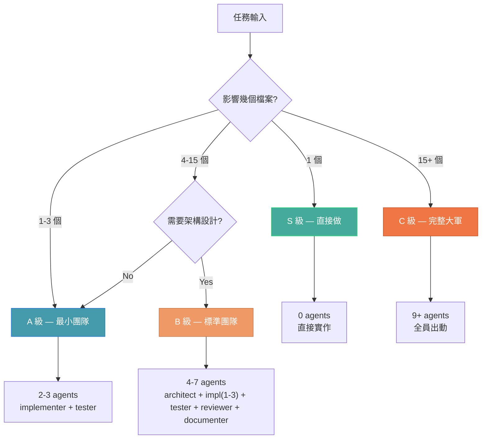
```mermaid
graph TD
    START[任務輸入] --> Q1{影響幾個檔案?}

    Q1 -->|1 個| S[S 級 — 直接做]
    Q1 -->|1-3 個| A[A 級 — 最小團隊]
    Q1 -->|4-15 個| Q2{需要架構設計?}
    Q1 -->|15+ 個| C[C 級 — 完整大軍]

    Q2 -->|No| A
    Q2 -->|Yes| B[B 級 — 標準團隊]

    S --> S_TEAM["0 agents<br/>直接實作"]
    A --> A_TEAM["2-3 agents<br/>implementer + tester"]
    B --> B_TEAM["4-7 agents<br/>architect + impl(1-3) + tester + reviewer + documenter"]
    C --> C_TEAM["9+ agents<br/>全員出動"]

    style S fill:#4a9,stroke:#2d7,color:#fff
    style A fill:#49a,stroke:#27d,color:#fff
    style B fill:#e96,stroke:#c74,color:#fff
    style C fill:#e74,stroke:#c52,color:#fff
```

| 級別 | 範圍 | 檔案數 | Agent 數 | 文件策略 | Token 估算 |
|------|------|--------|---------|---------|-----------|
| **S** | 修 typo、改設定值 | 1 | 0 | 無需 | ~5K |
| **A** | 小功能、修 bug | 1-3 | 2-3 | implementer 順手更新 | ~50-100K |
| **B** | 新 API、模組重構 | 4-15 | 4-7 | 單一 documenter 統包 | ~200-400K |
| **C** | 新子系統、大型重構 | 15+ | 9+ | documenter + reporter + doc-manager | ~500K-1M |

**成本最佳化規則**: 絕不使用 C 級團隊執行 B 級任務。額外 agent 的協調稅會抵消並行收益。

---

## 3. Agent 角色定義

### 3.1 角色矩陣

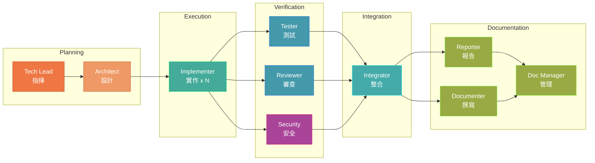
```mermaid
graph LR
    subgraph "Planning"
        TL[Tech Lead<br/>指揮]
        AR[Architect<br/>設計]
    end

    subgraph "Execution"
        IM[Implementer<br/>實作 x N]
    end

    subgraph "Verification"
        TE[Tester<br/>測試]
        RV[Reviewer<br/>審查]
        SA[Security<br/>安全]
    end

    subgraph "Documentation"
        DC[Documenter<br/>撰寫]
        DM[Doc Manager<br/>管理]
        RP[Reporter<br/>報告]
    end

    subgraph "Integration"
        IN[Integrator<br/>整合]
    end

    TL --> AR
    AR --> IM
    IM --> TE
    IM --> RV
    IM --> SA
    TE --> IN
    RV --> IN
    SA --> IN
    IN --> DC
    IN --> RP
    RP --> DM
    DC --> DM

    style TL fill:#e74,stroke:#c52,color:#fff
    style AR fill:#e96,stroke:#c74,color:#fff
    style IM fill:#4a9,stroke:#2d7,color:#fff
    style TE fill:#49a,stroke:#27d,color:#fff
    style RV fill:#49a,stroke:#27d,color:#fff
    style SA fill:#a49,stroke:#d27,color:#fff
    style DC fill:#9a4,stroke:#7d2,color:#fff
    style DM fill:#9a4,stroke:#7d2,color:#fff
    style RP fill:#9a4,stroke:#7d2,color:#fff
    style IN fill:#4aa,stroke:#2dd,color:#fff
```

### 3.2 角色詳細對照

| 角色 | 類比（傳統團隊） | 核心職責 | Model | 可並行 | Memory |
|------|------------------|----------|-------|--------|--------|
| Tech Lead | 技術經理 | 任務分解、協調、委派（不寫碼） | inherit | 單例 | project |
| Architect | 架構師 | 系統設計、介面定義（plan mode） | inherit | 單例 | project |
| Implementer | 工程師 | 寫程式碼 | inherit | x1-5 | project |
| Tester | QA 工程師 | 寫測試、跑測試 | inherit | x1-2 | project |
| Reviewer | Senior Engineer | Code Review + 對抗式審查 | inherit | x1-3 | project |
| Security Auditor | 安全工程師 | 安全掃描 + 對抗式審查 | inherit | 單例 | project |
| Integrator | DevOps | 合併、驗證 | inherit | 單例 | project |
| Documenter | Technical Writer | 寫文件 | sonnet | 單例 | project |
| Doc Manager | Librarian | 歸檔、索引 | sonnet | 單例 | project |
| Reporter | Analyst | 產生報告 | sonnet | 單例 | project |

> **v1.3 變更**: B 級任務中，Documenter 同時承擔 Reporter 和 Doc Manager 的職責（撰寫文件 + 產生報告 + 歸檔索引），僅在 C 級任務才分別生成三個獨立的文件 Agent。

### 3.3 Clean Architecture 在 Agent 中的體現

每個 Agent 都預載 `dev-standards` skill，確保：

1. **Architect** 設計時遵循分層架構
2. **Implementer** 寫程式碼時遵循依賴規則
3. **Reviewer** 審查時檢驗 Clean Architecture 合規性
4. **Tester** 按層測試（Unit → Integration → E2E）
5. **Quality Gate** 執行自動化 Clean Architecture 審計

---

## 4. Skill 系統設計

### 4.1 Skill 載入流程

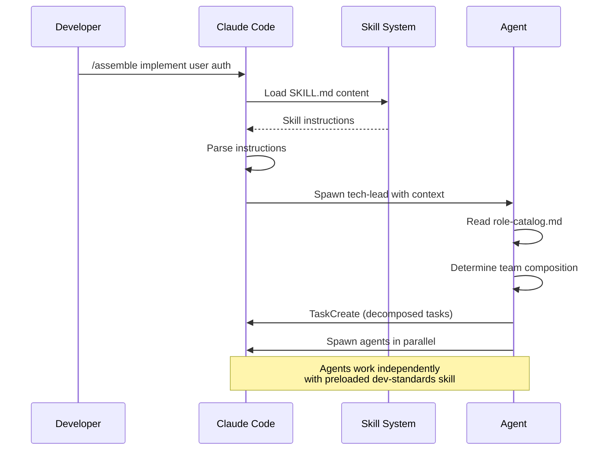
```mermaid
sequenceDiagram
    participant U as Developer
    participant CC as Claude Code
    participant SK as Skill System
    participant AG as Agent

    U->>CC: /assemble implement user auth
    CC->>SK: Load SKILL.md content
    SK-->>CC: Skill instructions
    CC->>CC: Parse instructions
    CC->>AG: Spawn tech-lead with context
    AG->>AG: Read role-catalog.md
    AG->>AG: Determine team composition
    AG->>CC: TaskCreate (decomposed tasks)
    AG->>CC: Spawn agents in parallel
    Note over CC,AG: Agents work independently<br/>with preloaded dev-standards skill
```

### 4.2 Skill 清單與用途

| Skill | 觸發方式 | 執行環境 | 用途 |
|-------|----------|----------|------|
| `/assemble` | 手動 (`/assemble [feature]`) | Main context | 集結 Agent 大軍 |
| `/sprint` | 手動 (`/sprint [feature]`) | Main context | Sprint 規劃 |
| `/quality-gate` | 手動 (`/quality-gate [scope]`) | Main context | 品質檢查 |
| `/context-sync` | 手動 (`/context-sync [action]`) | Main context | Context 管理 |
| `/integration-test` | 手動 (`/integration-test [scope]`) | Main context | 整合測試編排 |
| `/code-review` | 手動 (`/code-review [scope]`) | Main context | 程式碼審查編排 |
| `/retrospective` | 手動 (`/retrospective`) | Main context | Mission 回顧學習 |
| `/tdd` | 手動 (`/tdd [feature]`) | Main context / Preloaded in tester | TDD Red-Green-Refactor 強制 |
| `/fix` | 手動 (`/fix [error]`) | Main context | 智慧問題診斷與修復 |
| `dev-standards` | 自動（Claude 判斷載入） | Preloaded in agents | 開發標準 |

### 4.3 Skill 與 Agent 的關係

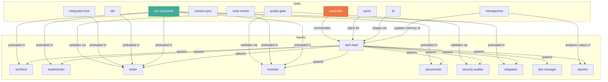
```mermaid
graph TD
    subgraph "Skills"
        S1[assemble]
        S2[sprint]
        S3[quality-gate]
        S4[context-sync]
        S5[dev-standards]
        S6[integration-test]
        S7[code-review]
        S8[retrospective]
        S9[tdd]
        S10[fix]
    end

    subgraph "Agents"
        A1[tech-lead]
        A2[architect]
        A3[implementer]
        A4[tester]
        A5[reviewer]
        A6[documenter]
        A7[security-auditor]
        A8[integrator]
        A9[doc-manager]
        A10[reporter]
    end

    S1 -->|orchestrates| A1
    S2 -->|plans for| A1
    S3 -->|validates via| A5
    S3 -->|validates via| A4
    S3 -->|validates via| A7
    S6 -->|preloaded in| A4
    S7 -->|preloaded in| A5
    S9 -->|preloaded in| A4
    S10 -->|"triages via"| A1

    S8 -->|"analyzes output of"| A10
    S8 -->|"updates memory of"| A1

    S5 -->|preloaded in| A2
    S5 -->|preloaded in| A3
    S5 -->|preloaded in| A4
    S5 -->|preloaded in| A5
    S5 -->|preloaded in| A6
    S5 -->|preloaded in| A8

    A1 -->|spawns| A2
    A1 -->|spawns| A3
    A1 -->|spawns| A4
    A1 -->|spawns| A5
    A1 -->|spawns| A7
    A1 -->|spawns| A8
    A1 -->|spawns| A6
    A1 -->|spawns| A9
    A1 -->|spawns| A10

    style S1 fill:#e74,stroke:#c52,color:#fff
    style S5 fill:#4a9,stroke:#2d7,color:#fff
```

---

## 5. 工作流程編排

### 5.1 標準開發流程

> **注意**: 以下流程圖為 C 級完整流程。B 級任務中，Phase 5 的 Doc/DM/Reporter 三個角色由單一 Documenter 統包。A 級任務不需要獨立文件 Agent。

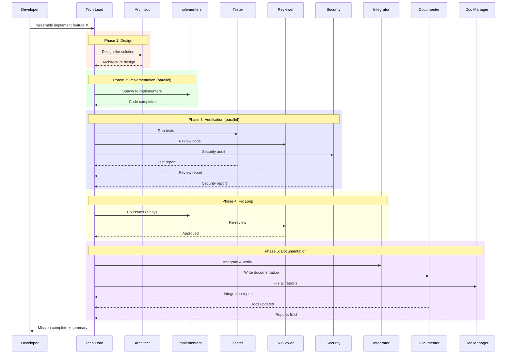
```mermaid
sequenceDiagram
    participant Dev as Developer
    participant Lead as Tech Lead
    participant Arch as Architect
    participant Impl as Implementers
    participant Test as Tester
    participant Rev as Reviewer
    participant Sec as Security
    participant Int as Integrator
    participant Doc as Documenter
    participant DM as Doc Manager

    Dev->>Lead: /assemble implement feature X

    rect rgb(255, 240, 230)
        Note over Lead,Arch: Phase 1: Design
        Lead->>Arch: Design the solution
        Arch-->>Lead: Architecture design
    end

    rect rgb(230, 255, 230)
        Note over Lead,Impl: Phase 2: Implementation (parallel)
        Lead->>Impl: Spawn N implementers
        Impl-->>Lead: Code completed
    end

    rect rgb(230, 230, 255)
        Note over Lead,Sec: Phase 3: Verification (parallel)
        Lead->>Test: Run tests
        Lead->>Rev: Review code
        Lead->>Sec: Security audit
        Test-->>Lead: Test report
        Rev-->>Lead: Review report
        Sec-->>Lead: Security report
    end

    rect rgb(255, 255, 230)
        Note over Lead,Int: Phase 4: Fix Loop
        Lead->>Impl: Fix issues (if any)
        Impl-->>Rev: Re-review
        Rev-->>Lead: Approved
    end

    rect rgb(245, 230, 255)
        Note over Lead,DM: Phase 5: Documentation
        Lead->>Int: Integrate & verify
        Lead->>Doc: Write documentation
        Lead->>DM: File all reports
        Int-->>Lead: Integration report
        Doc-->>Lead: Docs updated
        DM-->>Lead: Reports filed
    end

    Lead-->>Dev: Mission complete + summary
```

### 5.2 並行策略決策樹

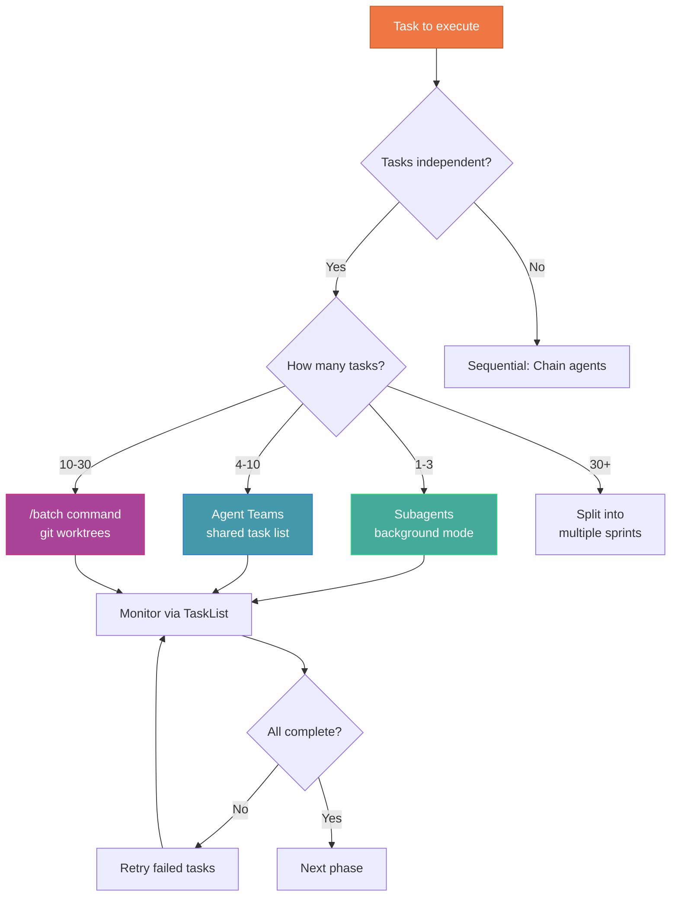
```mermaid
graph TD
    START[Task to execute] --> Q1{Tasks independent?}

    Q1 -->|Yes| Q2{How many tasks?}
    Q1 -->|No| SEQ[Sequential: Chain agents]

    Q2 -->|1-3| SUB[Subagents<br/>background mode]
    Q2 -->|4-10| TEAM[Agent Teams<br/>shared task list]
    Q2 -->|10-30| BATCH["/batch command<br/>git worktrees"]
    Q2 -->|30+| SPLIT["Split into<br/>multiple sprints"]

    SUB --> MONITOR[Monitor via TaskList]
    TEAM --> MONITOR
    BATCH --> MONITOR

    MONITOR --> DONE{All complete?}
    DONE -->|No| RETRY[Retry failed tasks]
    DONE -->|Yes| NEXT[Next phase]
    RETRY --> MONITOR

    style START fill:#e74,stroke:#c52,color:#fff
    style SUB fill:#4a9,stroke:#2d7,color:#fff
    style TEAM fill:#49a,stroke:#27d,color:#fff
    style BATCH fill:#a49,stroke:#d27,color:#fff
```

### 5.3 三種並行機制比較

| 機制 | 適用場景 | 並行數 | Agent 間溝通 | Context | Token 成本 |
|------|----------|--------|-------------|---------|-----------|
| **Subagents** | 獨立短任務 | ≤10 | 透過主 agent | 共享主 context | 低-中 |
| **Agent Teams** | 需協作的任務 | 無硬限制 | 直接訊息/共享任務 | 獨立 context | 高 |
| **`/batch`** | 大規模相同變更 | 5-30 | 無（各自獨立） | Git worktree 隔離 | 中-高 |

### 5.4 失敗恢復協議（v1.3 新增）

當 Agent 失敗時的處理流程：

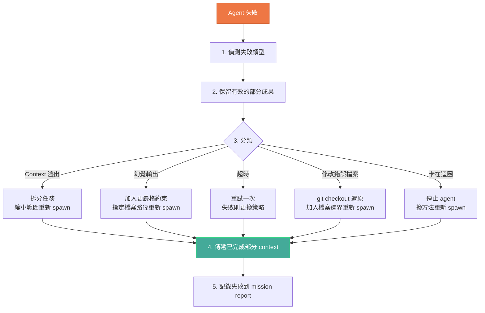
```mermaid
graph TD
    FAIL[Agent 失敗] --> DETECT[1. 偵測失敗類型]
    DETECT --> PRESERVE[2. 保留有效的部分成果]
    PRESERVE --> CLASSIFY{3. 分類}

    CLASSIFY -->|Context 溢出| R1[拆分任務<br/>縮小範圍重新 spawn]
    CLASSIFY -->|幻覺輸出| R2[加入更嚴格約束<br/>指定檔案路徑重新 spawn]
    CLASSIFY -->|超時| R3[重試一次<br/>失敗則更換策略]
    CLASSIFY -->|修改錯誤檔案| R4[git checkout 還原<br/>加入檔案邊界重新 spawn]
    CLASSIFY -->|卡在迴圈| R5[停止 agent<br/>換方法重新 spawn]

    R1 --> RESUME[4. 傳遞已完成部分 context]
    R2 --> RESUME
    R3 --> RESUME
    R4 --> RESUME
    R5 --> RESUME

    RESUME --> LOG[5. 記錄失敗到 mission report]

    style FAIL fill:#e74,stroke:#c52,color:#fff
    style RESUME fill:#4a9,stroke:#2d7,color:#fff
```

**升級規則**:
- 1 次重試 → 可接受（暫時性失敗）
- 2 次重試 → 重新思考任務分解方式
- 3+ 次重試 → 停止，請求開發者指導

### 5.5 Agent 直接通訊（v1.3 新增）

在 Agent Teams 模式下，定義哪些溝通應路由回 Tech Lead，哪些允許直接通訊。

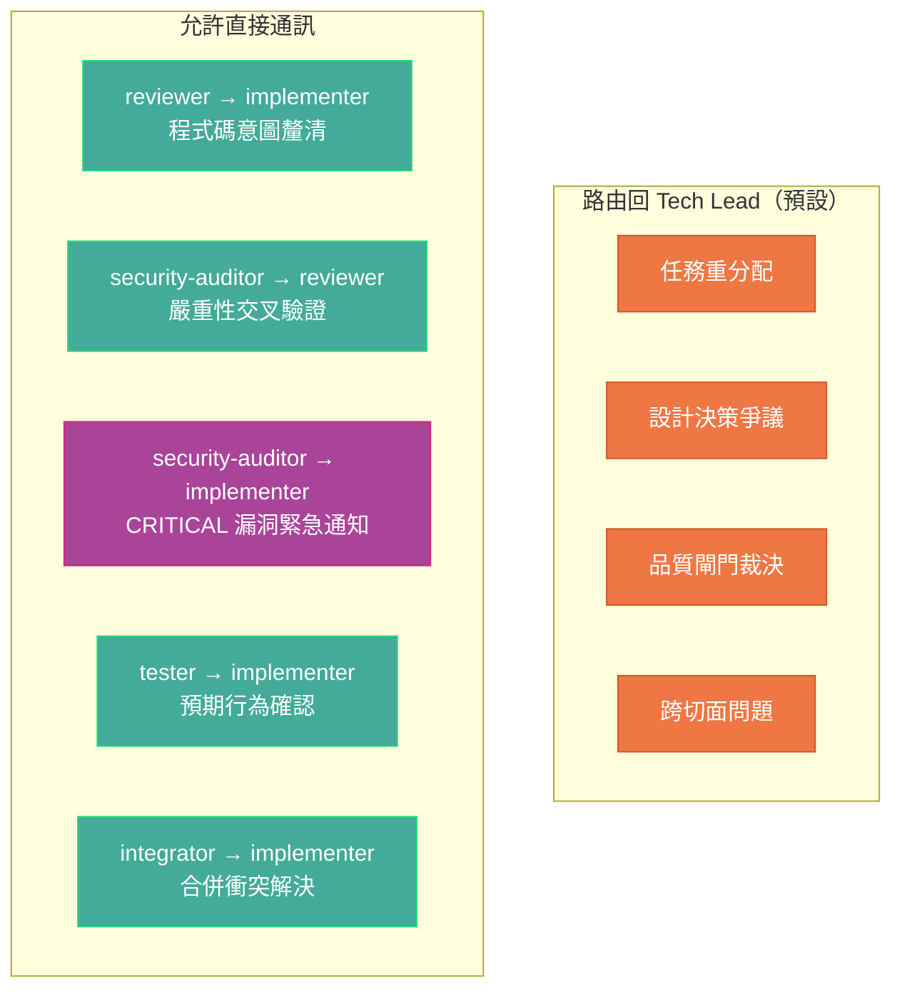
```mermaid
graph TD
    subgraph "路由回 Tech Lead（預設）"
        TL1[任務重分配]
        TL2[設計決策爭議]
        TL3[品質閘門裁決]
        TL4[跨切面問題]
    end

    subgraph "允許直接通訊"
        DC1["reviewer → implementer<br/>程式碼意圖釐清"]
        DC2["security-auditor → reviewer<br/>嚴重性交叉驗證"]
        DC3["security-auditor → implementer<br/>CRITICAL 漏洞緊急通知"]
        DC4["tester → implementer<br/>預期行為確認"]
        DC5["integrator → implementer<br/>合併衝突解決"]
    end

    style TL1 fill:#e74,stroke:#c52,color:#fff
    style TL2 fill:#e74,stroke:#c52,color:#fff
    style TL3 fill:#e74,stroke:#c52,color:#fff
    style TL4 fill:#e74,stroke:#c52,color:#fff
    style DC1 fill:#4a9,stroke:#2d7,color:#fff
    style DC2 fill:#4a9,stroke:#2d7,color:#fff
    style DC3 fill:#a49,stroke:#d27,color:#fff
    style DC4 fill:#4a9,stroke:#2d7,color:#fff
    style DC5 fill:#4a9,stroke:#2d7,color:#fff
```

**規則**: 直接通訊僅限於釐清和緊急通知。任務分配、範圍變更、設計決策必須透過 Tech Lead。

### 5.6 子協調者模式（v1.3 新增）

C 級任務（15+ 檔案、7+ agents）時，將 Integrator 提升為子協調者，避免 Tech Lead context window 溢出。

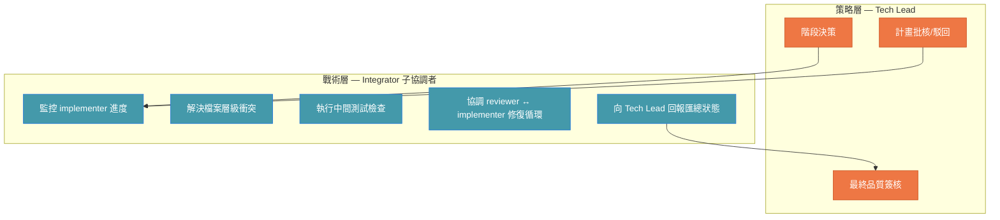
```mermaid
graph TB
    subgraph "策略層 — Tech Lead"
        S1[階段決策]
        S2[計畫批核/駁回]
        S3[最終品質簽核]
    end

    subgraph "戰術層 — Integrator 子協調者"
        T1[監控 implementer 進度]
        T2[解決檔案層級衝突]
        T3[執行中間測試檢查]
        T4["協調 reviewer ↔ implementer 修復循環"]
        T5[向 Tech Lead 回報匯總狀態]
    end

    S1 --> T1
    S2 --> T1
    T5 --> S3

    style S1 fill:#e74,stroke:#c52,color:#fff
    style S2 fill:#e74,stroke:#c52,color:#fff
    style S3 fill:#e74,stroke:#c52,color:#fff
    style T1 fill:#49a,stroke:#27d,color:#fff
    style T2 fill:#49a,stroke:#27d,color:#fff
    style T3 fill:#49a,stroke:#27d,color:#fff
    style T4 fill:#49a,stroke:#27d,color:#fff
    style T5 fill:#49a,stroke:#27d,color:#fff
```

**啟動條件**: 任務為 C 級、3+ implementer 並行、Tech Lead context 壓力大時由 Tech Lead 顯式啟動。

---

## 6. Context 管理策略

### 6.1 三層記憶架構

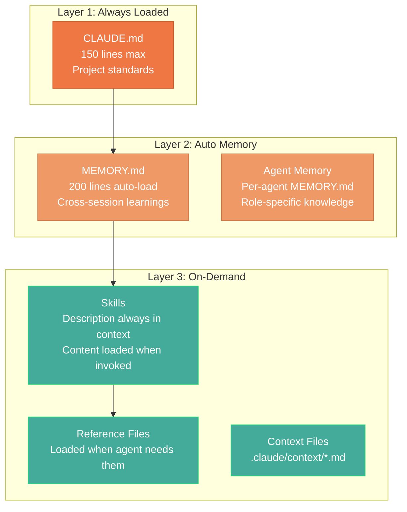
```mermaid
graph TB
    subgraph "Layer 1: Always Loaded"
        CM[CLAUDE.md<br/>150 lines max<br/>Project standards]
    end

    subgraph "Layer 2: Auto Memory"
        MM[MEMORY.md<br/>200 lines auto-load<br/>Cross-session learnings]
        AM[Agent Memory<br/>Per-agent MEMORY.md<br/>Role-specific knowledge]
    end

    subgraph "Layer 3: On-Demand"
        SK[Skills<br/>Description always in context<br/>Content loaded when invoked]
        RF[Reference Files<br/>Loaded when agent needs them]
        CF[Context Files<br/>.claude/context/*.md]
    end

    CM --> MM
    MM --> SK
    SK --> RF

    style CM fill:#e74,stroke:#c52,color:#fff
    style MM fill:#e96,stroke:#c74,color:#fff
    style AM fill:#e96,stroke:#c74,color:#fff
    style SK fill:#4a9,stroke:#2d7,color:#fff
    style RF fill:#4a9,stroke:#2d7,color:#fff
    style CF fill:#4a9,stroke:#2d7,color:#fff
```

### 6.2 Context Budget 分配

| 組件 | 預算 | 載入時機 |
|------|------|----------|
| CLAUDE.md | ≤ 150 行 | 永遠載入 |
| Skill 描述 | ≤ 16KB 總計 | 永遠載入（描述部分） |
| Skill 內容 | 按需 | 被觸發時載入 |
| Agent Memory | ≤ 200 行 MEMORY.md | Agent 啟動時 |
| Reference 檔案 | 無限制 | Agent 決定讀取時 |
| Spawn Prompt | ≤ 2000 tokens | Spawn 時 |

### 6.3 Agent Spawn Context 策略

```
高效 Spawn Prompt 結構：
┌────────────────────────────────┐
│ 1. 角色定義（from agent.md）    │ ← 自動
│ 2. 預載 Skills（from skills:） │ ← 自動
│ 3. 任務描述                     │ ← Tech Lead 提供
│ 4. 檔案範圍                     │ ← Tech Lead 指定
│ 5. 關鍵決策 context             │ ← 從 DECISION-LOG.md
│ 6. 邊界限制                     │ ← 不要碰的檔案
└────────────────────────────────┘
```

---

## 7. 報告與文件管理

### 7.1 文件生命週期

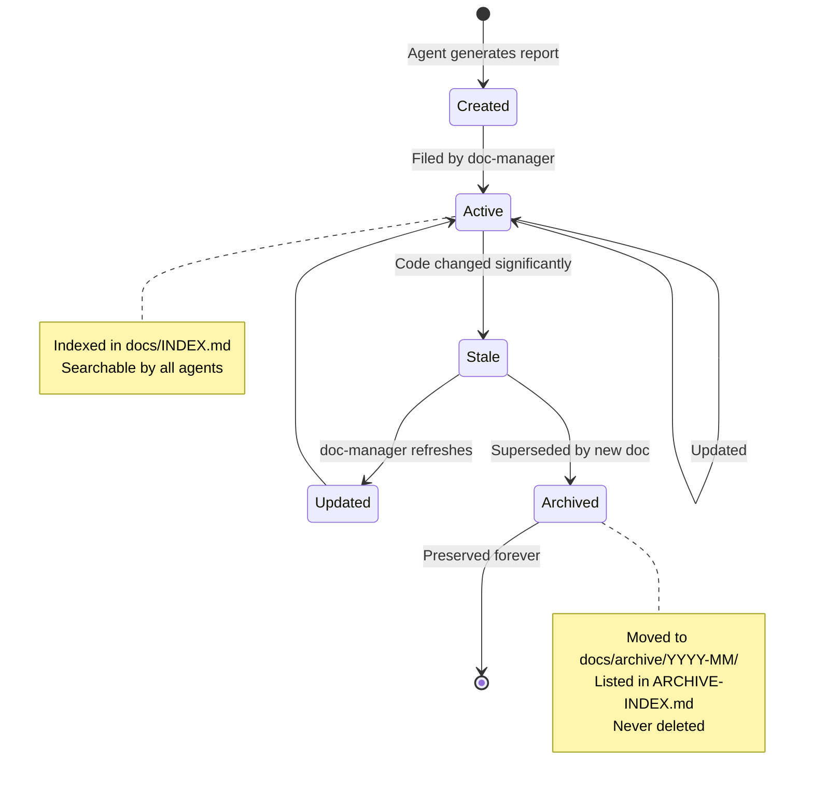
```mermaid
stateDiagram-v2
    [*] --> Created: Agent generates report
    Created --> Active: Filed by doc-manager
    Active --> Active: Updated
    Active --> Stale: Code changed significantly
    Stale --> Updated: doc-manager refreshes
    Stale --> Archived: Superseded by new doc
    Updated --> Active
    Archived --> [*]: Preserved forever

    note right of Active
        Indexed in docs/INDEX.md
        Searchable by all agents
    end note

    note right of Archived
        Moved to docs/archive/YYYY-MM/
        Listed in ARCHIVE-INDEX.md
        Never deleted
    end note
```

### 7.2 報告類型與觸發

| 報告類型 | 產生者 | 觸發時機 | 儲存位置 |
|----------|--------|----------|----------|
| Code Review | reviewer → reporter | 每次 Review 後 | `docs/reports/code-review/` |
| Test Report | tester → reporter | 每次測試後 | `docs/reports/test/` |
| Security Audit | security-auditor → reporter | 每次審計後 | `docs/reports/security/` |
| Fix Report | implementer → reporter | 修復 bug 後 | `docs/reports/fix/` |
| Integration Report | integrator → reporter | 整合完成後 | `docs/reports/integration/` |
| Quality Gate | quality-gate skill | 手動觸發 | `docs/reports/quality-gate/` |

### 7.3 命名規範

```
docs/reports/[type]/YYYY-MM-DD-[subject]-[type]-report.md

範例：
docs/reports/code-review/2026-03-04-user-auth-review-report.md
docs/reports/test/2026-03-04-payment-module-test-report.md
docs/reports/fix/2026-03-04-xss-vulnerability-fix-report.md
docs/reports/security/2026-03-04-api-endpoints-security-report.md
```

---

## 8. 品質保證機制

### 8.1 多層品質閘門

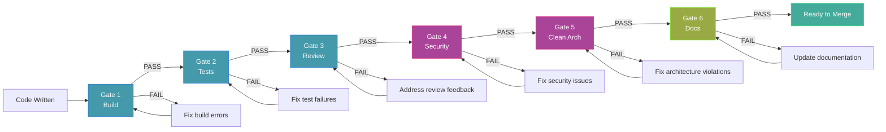
```mermaid
graph LR
    CODE[Code Written] --> G1[Gate 1<br/>Build]
    G1 -->|PASS| G2[Gate 2<br/>Tests]
    G2 -->|PASS| G3[Gate 3<br/>Review]
    G3 -->|PASS| G4[Gate 4<br/>Security]
    G4 -->|PASS| G5[Gate 5<br/>Clean Arch]
    G5 -->|PASS| G6[Gate 6<br/>Docs]
    G6 -->|PASS| DONE[Ready to Merge]

    G1 -->|FAIL| FIX1[Fix build errors]
    G2 -->|FAIL| FIX2[Fix test failures]
    G3 -->|FAIL| FIX3[Address review feedback]
    G4 -->|FAIL| FIX4[Fix security issues]
    G5 -->|FAIL| FIX5[Fix architecture violations]
    G6 -->|FAIL| FIX6[Update documentation]

    FIX1 --> G1
    FIX2 --> G2
    FIX3 --> G3
    FIX4 --> G4
    FIX5 --> G5
    FIX6 --> G6

    style DONE fill:#4a9,stroke:#2d7,color:#fff
    style G1 fill:#49a,stroke:#27d,color:#fff
    style G2 fill:#49a,stroke:#27d,color:#fff
    style G3 fill:#49a,stroke:#27d,color:#fff
    style G4 fill:#a49,stroke:#d27,color:#fff
    style G5 fill:#a49,stroke:#d27,color:#fff
    style G6 fill:#9a4,stroke:#7d2,color:#fff
```

### 8.2 Hooks 自動化

| Hook 事件 | 觸發行為 | 目的 |
|-----------|----------|------|
| `PostToolUse(Write/Edit)` | 提醒 Clean Architecture 合規 | 預防性品質檢查 |
| `Stop` | 確認報告已歸檔 | 確保文件完整性 |

### 8.3 Clean Architecture 自動審計項目

```
✓ Domain 層沒有外部 import
✓ Use Case 只依賴 Port（介面）
✓ Adapter 正確實現 Port
✓ 沒有循環依賴
✓ DI Container 在 Composition Root 組裝
✓ DTO 用於邊界（Entity 不外洩）
✓ 檔案大小 ≤ 300 行
✓ 函數長度 ≤ 50 行
```

---

## 9. 成本與效能優化

### 9.1 Model 分層策略

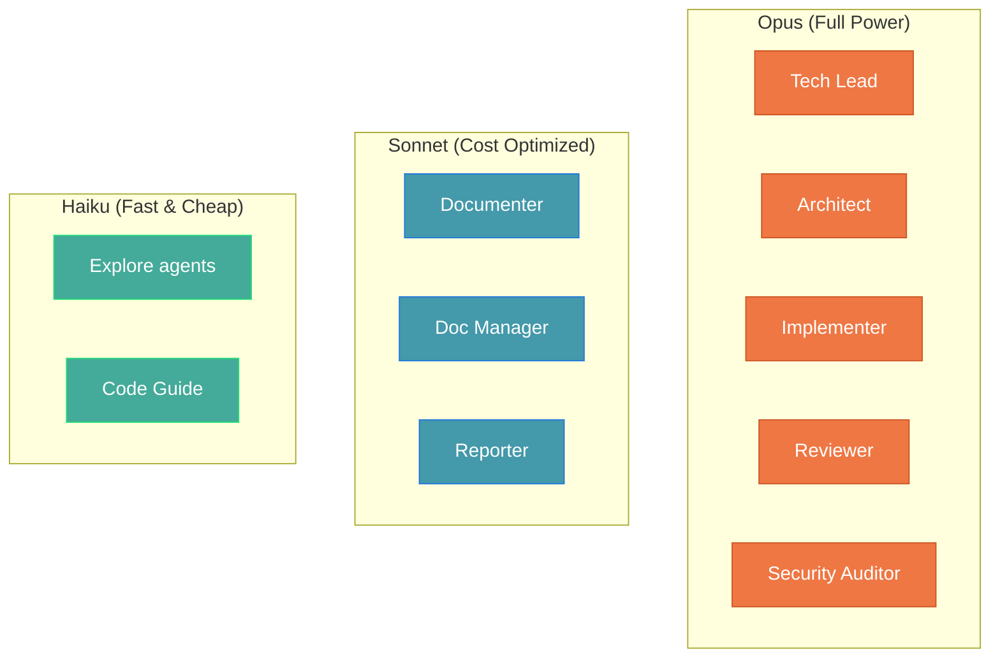
```mermaid
graph TD
    subgraph "Opus (Full Power)"
        O1[Tech Lead]
        O2[Architect]
        O3[Implementer]
        O4[Reviewer]
        O5[Security Auditor]
    end

    subgraph "Sonnet (Cost Optimized)"
        S1[Documenter]
        S2[Doc Manager]
        S3[Reporter]
    end

    subgraph "Haiku (Fast & Cheap)"
        H1[Explore agents]
        H2[Code Guide]
    end

    style O1 fill:#e74,stroke:#c52,color:#fff
    style O2 fill:#e74,stroke:#c52,color:#fff
    style O3 fill:#e74,stroke:#c52,color:#fff
    style O4 fill:#e74,stroke:#c52,color:#fff
    style O5 fill:#e74,stroke:#c52,color:#fff
    style S1 fill:#49a,stroke:#27d,color:#fff
    style S2 fill:#49a,stroke:#27d,color:#fff
    style S3 fill:#49a,stroke:#27d,color:#fff
    style H1 fill:#4a9,stroke:#2d7,color:#fff
    style H2 fill:#4a9,stroke:#2d7,color:#fff
```

### 9.2 Token 使用估算

| 工作規模 | Agent 數 | 預估 Token | 成本估算 (Opus) |
|----------|---------|-----------|----------------|
| 小功能 (3 agents) | 3 | ~100K | ~$1-3 |
| 中功能 (5-7 agents) | 7 | ~300K | ~$5-10 |
| 大功能 (9+ agents) | 9+ | ~500K-1M | ~$15-30 |
| Batch 遷移 (20 workers) | 20 | ~1-2M | ~$30-60 |

### 9.3 優化技巧

1. **不需要的 Agent 不要 spawn** — 小改動不需要 architect
2. **用 Sonnet 做文件工作** — documenter, doc-manager, reporter 用 sonnet
3. **用 Haiku 做搜尋** — Explore agent 自動用 haiku
4. **控制 spawn prompt 大小** — ≤ 2000 tokens
5. **善用 Agent Memory** — 跨 session 不重複學習

---

## 10. 可攜性與分發

### 10.1 Plugin 分發架構

Agent Army 以 **Claude Code Plugin** 形式封裝，可透過 GitHub Marketplace 一鍵安裝。

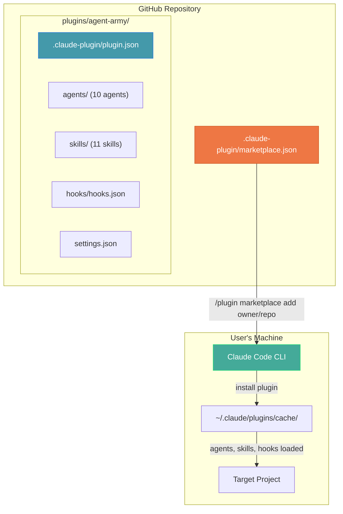
```mermaid
graph TB
    subgraph "GitHub Repository"
        MK[".claude-plugin/marketplace.json"]
        subgraph "plugins/agent-army/"
            PJ[".claude-plugin/plugin.json"]
            AG["agents/ (10 agents)"]
            SK["skills/ (11 skills)"]
            HK["hooks/hooks.json"]
            ST["settings.json"]
        end
    end

    subgraph "User's Machine"
        CC[Claude Code CLI]
        CACHE["~/.claude/plugins/cache/"]
        PROJ["Target Project"]
    end

    MK -->|"/plugin marketplace add owner/repo"| CC
    CC -->|"install plugin"| CACHE
    CACHE -->|"agents, skills, hooks loaded"| PROJ

    style MK fill:#e74,stroke:#c52,color:#fff
    style PJ fill:#49a,stroke:#27d,color:#fff
    style CC fill:#4a9,stroke:#2d7,color:#fff
```

### 10.2 Plugin 目錄結構

```
plugins/agent-army/                    # Plugin Root
├── .claude-plugin/
│   └── plugin.json                    # Plugin manifest
├── agents/                            # 10 Agent definitions
│   ├── tech-lead.md
│   ├── architect.md
│   ├── implementer.md
│   ├── tester.md
│   ├── reviewer.md
│   ├── documenter.md
│   ├── security-auditor.md
│   ├── integrator.md
│   ├── doc-manager.md
│   └── reporter.md
├── skills/                            # 10 Skills
│   ├── assemble/                      # Agent army orchestrator
│   │   ├── SKILL.md
│   │   └── references/
│   ├── sprint/                        # Sprint planning
│   │   └── SKILL.md
│   ├── quality-gate/                  # Quality checkpoints
│   │   └── SKILL.md
│   ├── context-sync/                  # Context management
│   │   └── SKILL.md
│   ├── integration-test/             # Integration test orchestrator
│   │   └── SKILL.md
│   ├── code-review/                  # Code review orchestrator
│   │   └── SKILL.md
│   ├── retrospective/                 # Mission retrospective
│   │   └── SKILL.md
│   ├── tdd/                           # TDD enforcement
│   │   └── SKILL.md
│   ├── fix/                           # Smart problem resolution
│   │   └── SKILL.md
│   ├── dev-standards/                 # Coding standards (auto)
│   │   ├── SKILL.md
│   │   └── references/
│   └── setup/                         # Project initialization
│       └── SKILL.md
├── hooks/
│   └── hooks.json                     # Clean Arch enforcement
├── settings.json                      # Default agent settings
└── README.md                          # Installation guide
```

### 10.3 三種安裝方式

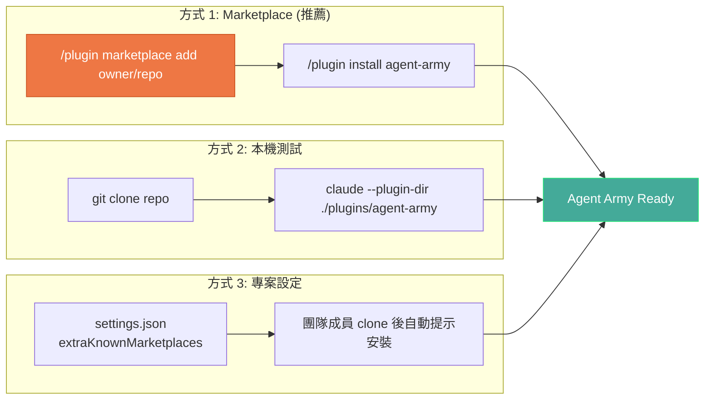
```mermaid
graph LR
    subgraph "方式 1: Marketplace (推薦)"
        A1["/plugin marketplace add owner/repo"] --> B1["/plugin install agent-army"]
    end

    subgraph "方式 2: 本機測試"
        A2["git clone repo"] --> B2["claude --plugin-dir ./plugins/agent-army"]
    end

    subgraph "方式 3: 專案設定"
        A3["settings.json<br/>extraKnownMarketplaces"] --> B3["團隊成員 clone 後自動提示安裝"]
    end

    B1 --> C[Agent Army Ready]
    B2 --> C
    B3 --> C

    style C fill:#4a9,stroke:#2d7,color:#fff
    style A1 fill:#e74,stroke:#c52,color:#fff
```

### 10.4 安裝流程

```bash
# 方式 1: Marketplace（推薦 — 適合任何人）
/plugin marketplace add Muheng1992/symbiotic-engineering
/plugin install agent-army@symbiotic-engineering
/agent-army:setup my-project

# 方式 2: 本機測試（開發者）
git clone https://github.com/Muheng1992/symbiotic-engineering.git
claude --plugin-dir ./symbiotic-engineering/plugins/agent-army

# 方式 3: 專案設定（團隊）
# 在 .claude/settings.json 加入：
{
  "extraKnownMarketplaces": {
    "symbiotic-engineering": {
      "source": { "source": "github", "repo": "Muheng1992/symbiotic-engineering" }
    }
  },
  "enabledPlugins": {
    "agent-army@symbiotic-engineering": true
  }
}
```

### 10.5 可攜組件

| 組件 | 位置 | 可攜性 | 安裝方式 |
|------|------|--------|----------|
| Agent 定義 | `agents/*.md` | 完全可攜 | Plugin 自動 |
| Skills | `skills/*/SKILL.md` | 完全可攜 | Plugin 自動 |
| Hooks | `hooks/hooks.json` | 完全可攜 | Plugin 自動 |
| CLAUDE.md | `.claude/CLAUDE.md` | 需初始化 | `/agent-army:setup` 產生 |
| Settings | `.claude/settings.json` | 需初始化 | `/agent-army:setup` 配置 |
| docs/ 結構 | `docs/reports/` | 需初始化 | `/agent-army:setup` 建立 |
| Context | `.claude/context/` | 專案特定 | `/agent-army:context-sync init` |

### 10.6 團隊分享與自動安裝

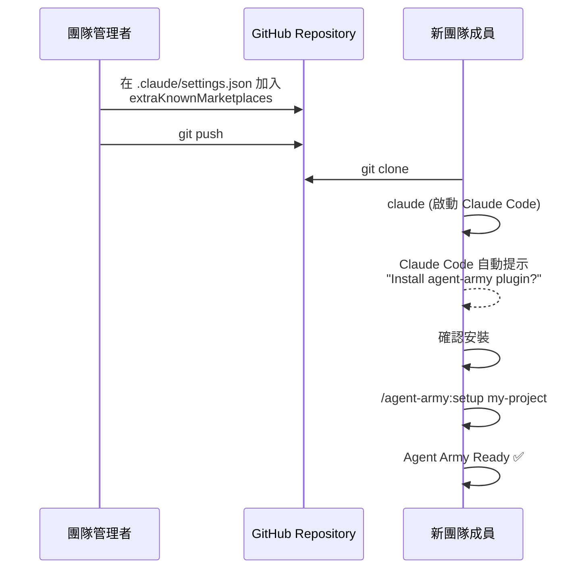
```mermaid
sequenceDiagram
    participant Admin as 團隊管理者
    participant Repo as GitHub Repository
    participant Dev as 新團隊成員

    Admin->>Repo: 在 .claude/settings.json 加入<br/>extraKnownMarketplaces
    Admin->>Repo: git push

    Dev->>Repo: git clone
    Dev->>Dev: claude (啟動 Claude Code)
    Dev-->>Dev: Claude Code 自動提示<br/>"Install agent-army plugin?"
    Dev->>Dev: 確認安裝
    Dev->>Dev: /agent-army:setup my-project
    Dev->>Dev: Agent Army Ready ✅
```

---

## 參考來源

- [Claude Code Subagents 官方文件](https://code.claude.com/docs/en/sub-agents)
- [Claude Code Skills 官方文件](https://code.claude.com/docs/en/slash-commands)
- [Claude Code Agent Teams 官方文件](https://code.claude.com/docs/en/agent-teams)
- [Agent Skills 開放標準](https://agentskills.io)
- [Claude Code Swarm Orchestration](https://gist.github.com/kieranklaassen/4f2aba89594a4aea4ad64d753984b2ea)
- [Agentic SDLC: Autonomous Software Delivery](https://www.pwc.com/m1/en/publications/2026/docs/future-of-solutions-dev-and-delivery-in-the-rise-of-gen-ai.pdf)
- [Building the Agentic SDLC](https://earezki.com/ai-news/2026-02-25-the-agentic-sdlc-how-ai-teams-debate-code-and-secure-enterprise-infrastructure/)
- [Claude Code Agent Teams Complete Guide](https://claudefa.st/blog/guide/agents/agent-teams)
- [Multi-Agent Development (VS Code)](https://code.visualstudio.com/blogs/2026/02/05/multi-agent-development)
- [Claude Code Sub-Agent Best Practices](https://claudefa.st/blog/guide/agents/sub-agent-best-practices)

---

*Agent Army System v1.3.0 | Symbiotic Engineering | 2026-03-04*
