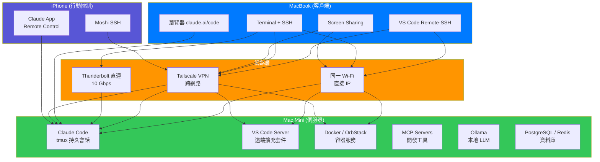
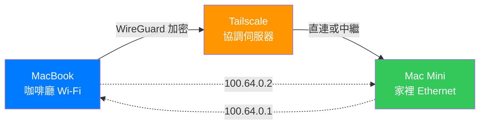
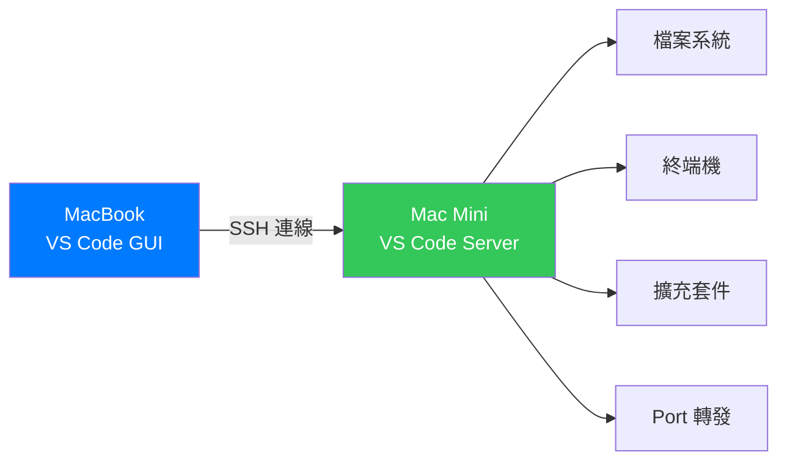
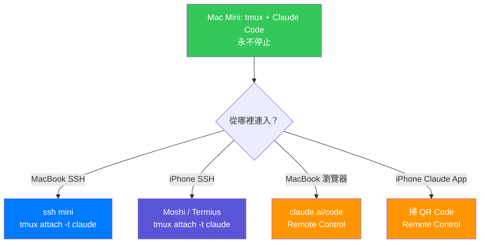
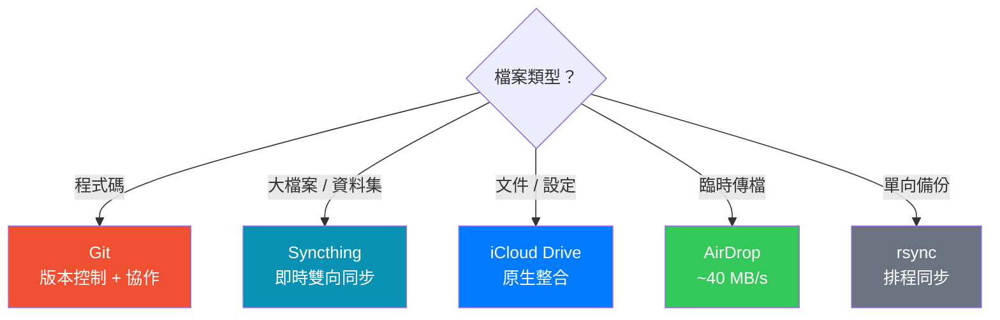
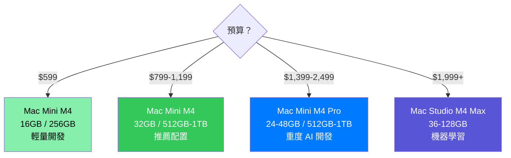

# 雙 Mac 遠端開發完全指南

> Mac Mini 當伺服器 + MacBook 當客戶端 — 打造個人開發雲 (2026)

**最後更新**: 2026-03-05
**前置閱讀**: [iPhone 遠端開發完全指南](./IPHONE-REMOTE-DEV-GUIDE.md)

---

## 目錄

- [為什麼要用兩台 Mac？](#為什麼要用兩台-mac)
- [架構總覽](#架構總覽)
- [第一步：Headless Mac Mini 伺服器設定](#第一步headless-mac-mini-伺服器設定)
- [第二步：網路連線設定](#第二步網路連線設定)
- [第三步：SSH 遠端終端機](#第三步ssh-遠端終端機)
- [第四步：螢幕共享（GUI 遠端桌面）](#第四步螢幕共享gui-遠端桌面)
- [第五步：VS Code Remote 開發](#第五步vs-code-remote-開發)
- [第六步：Claude Code 跨機工作流](#第六步claude-code-跨機工作流)
- [第七步：檔案同步](#第七步檔案同步)
- [第八步：開發服務部署](#第八步開發服務部署)
- [第九步：自動化與維護](#第九步自動化與維護)
- [第十步：安全性強化](#第十步安全性強化)
- [硬體推薦與成本分析](#硬體推薦與成本分析)
- [推薦配置方案](#推薦配置方案)
- [常見問題 FAQ](#常見問題-faq)
- [資料來源](#資料來源)

---

## 為什麼要用兩台 Mac？

| 場景 | 單 Mac | 雙 Mac |
|------|--------|--------|
| Claude Code 跑 30 分鐘的重構任務 | 等它跑完才能做其他事 | Mac Mini 跑任務，MacBook 繼續寫 code |
| 跑完整測試套件 | CPU 滿載，IDE 卡頓 | 測試在 Mac Mini 跑，MacBook 不受影響 |
| 長時間 AI Agent 會話 | 筆電不能合蓋、不能帶走 | Mac Mini 永不休眠，隨時從任何裝置連回 |
| 出門在外緊急修 bug | 只能用手機湊合 | SSH 到 Mac Mini，完整開發環境隨時可用 |
| Docker / 資料庫 / MCP Server | 吃記憶體，拖慢日常使用 | 全部丟到 Mac Mini，MacBook 保持清爽 |

**核心概念：Mac Mini = 你的個人開發雲，MacBook = 輕量客戶端**

---

## 架構總覽



---

## 第一步：Headless Mac Mini 伺服器設定

### 1.1 首次開機（需要螢幕）

首次設定需要暫時接上螢幕、鍵盤、滑鼠：

1. 接上 HDMI 螢幕（M4 Mac Mini 用**背面** Thunderbolt 4 埠，前置不支援顯示器）
2. 完成 macOS 初始設定
3. 建立使用者帳號
4. 連接 Wi-Fi 或 Ethernet
5. 完成以下所有設定後，拔掉螢幕

### 1.2 啟用遠端存取

```bash
# 啟用 SSH（遠端登入）
# 系統設定 > 一般 > 共享 > 遠端登入 → 開啟

# 啟用螢幕共享（VNC）
# 系統設定 > 一般 > 共享 > 螢幕共享 → 開啟
```

### 1.3 Dummy HDMI（模擬螢幕）

拔掉螢幕後，macOS 可能不會正確初始化 GPU，導致螢幕共享解析度異常。解決方案：

#### 方案 A：實體 HDMI 假顯示器（$5-10，推薦）

插一個 HDMI Dummy Plug 到背面 HDMI 埠，macOS 會以為有螢幕接著。

- **DTECH HDMI Dummy Plug 4K**（Amazon ~$8）— 支援 4K@60Hz
- **NewerTech HDMI Headless 4K Display Emulator**（~$15）

#### 方案 B：軟體虛擬螢幕（免費）

- **[BetterDummy](https://github.com/waydabber/BetterDisplay)**（開源免費）— 建立虛擬 HiDPI 螢幕
- **[BetterDisplay](https://github.com/waydabber/BetterDisplay)**（$18 Pro 版）— 更完整的顯示管理

> **如果只用 SSH 不用螢幕共享，可以跳過這步。**

### 1.4 防止休眠與自動重啟

```bash
# 方法 1：系統設定 GUI
# 系統設定 > 電池 > 選項 > 「電源故障後自動啟動」→ 開啟
# 系統設定 > 電池 > 電源轉接器 > 關閉「自動休眠」

# 方法 2：終端機指令
# 防止休眠
sudo pmset -a sleep 0
sudo pmset -a disablesleep 1

# 電源故障後自動重啟
sudo pmset -a autorestart 1

# 當機後自動重啟
sudo systemsetup -setrestartfreeze on

# 確認設定
pmset -g
```

### 1.5 自動登入

遠端存取需要使用者已登入：

```
系統設定 > 使用者與群組 > 自動登入 → 選擇你的帳號
```

> **注意**：啟用 FileVault 會停用自動登入。macOS 26 (Tahoe) 新增了 SSH 遠端解鎖 FileVault 功能（僅 Apple Silicon），但仍需在重啟時手動輸入密碼。建議 headless 伺服器**不要啟用 FileVault**。

### 1.6 電力消耗

Mac Mini M4 的功耗極低：

| 狀態 | 功耗 |
|------|------|
| 閒置 | 3-4W |
| 一般開發（編譯、測試） | 15-30W |
| 滿載（AI 推論、重度編譯） | 60-75W |
| **24/7 運行月電費** | **< $2 美元** |

相比雲端伺服器（$50-200/月），Mac Mini 一年電費 < $24，硬體 12 個月內回本。

---

## 第二步：網路連線設定

### 情境 A：同一個 Wi-Fi（最簡單）

```bash
# 查詢 Mac Mini IP
# 系統設定 > Wi-Fi > 詳細資料 > TCP/IP
# 或終端機：
ifconfig | grep "inet " | grep -v 127.0.0.1

# 從 MacBook SSH 連入
ssh username@192.168.1.100
```

> **建議**：在路由器上為 Mac Mini 設定**固定 IP**，避免 DHCP 換 IP。

也可用 Bonjour 自動發現：
```bash
ssh username@mac-mini.local
```

### 情境 B：不同地點 — Tailscale VPN（推薦）

兩台 Mac 不在同一網路時，用 Tailscale 建立安全隧道：



**兩台 Mac 都安裝 Tailscale**：
```bash
# 方法 A：Homebrew
brew install --cask tailscale

# 方法 B：Mac App Store 下載

# 安裝後：開啟 Tailscale → 登入同一帳號
# 兩台 Mac 自動獲得 100.x.x.x 的虛擬 IP
```

之後所有連線都用 Tailscale IP：
```bash
ssh username@100.64.0.1    # Mac Mini 的 Tailscale IP
```

**免費版**：3 使用者、100 台裝置 — 個人完全夠用。

### 情境 C：同一張桌子 — Thunderbolt 直連（最快）

用一條 Thunderbolt 線直接連兩台 Mac：

- **速度**：10 Gbps（IP over Thunderbolt）
- **延遲**：< 1ms
- **適合**：大量檔案傳輸、高頻寬螢幕共享

**設定**：
1. Thunderbolt 線連接兩台 Mac
2. 系統設定 > 網路 → 自動出現「Thunderbolt Bridge」介面
3. 兩台 Mac 自動分配 IP（通常 169.254.x.x）
4. 從 Finder 側邊欄可直接看到另一台 Mac

### 情境 D：Apple Universal Control（同桌共用鍵鼠）

如果兩台 Mac 放在同一張桌上：

**需求**：
- 兩台 Mac 都是 macOS Monterey 12.3+
- 登入同一個 Apple ID
- Wi-Fi、Bluetooth、Handoff 都開啟
- 距離 ≤ 10 公尺

**啟用**：
```
系統設定 > 顯示器 > 進階 > 開啟「允許游標和鍵盤在任何附近的 Mac 或 iPad 之間移動」
```

**功能**：
- 滑鼠直接推到另一台螢幕邊緣即可跳過去
- 鍵盤跟著滑鼠走
- 可跨裝置拖放檔案
- 最多控制 3 台裝置

---

## 第三步：SSH 遠端終端機

### 3.1 SSH 金鑰設定（免密碼登入）

```bash
# 在 MacBook 上產生金鑰（如果還沒有）
ssh-keygen -t ed25519 -C "macbook"

# 將公鑰複製到 Mac Mini
ssh-copy-id username@mac-mini.local

# 測試免密碼登入
ssh username@mac-mini.local
# 應該直接進入，不需要密碼
```

### 3.2 SSH Config 快捷設定

編輯 MacBook 上的 `~/.ssh/config`：

```ssh
Host mini
    HostName mac-mini.local          # 或 Tailscale IP: 100.64.0.1
    User your-username
    IdentityFile ~/.ssh/id_ed25519
    ServerAliveInterval 60           # 每 60 秒發送心跳
    ServerAliveCountMax 3            # 3 次失敗後斷線
    ForwardAgent yes                 # 轉發 SSH agent（git push 用）
```

之後只需：
```bash
ssh mini
```

### 3.3 tmux 持久會話

```bash
# Mac Mini 上安裝 tmux
brew install tmux

# 建立命名會話
tmux new -s dev

# 分離會話（Ctrl+B, D）
# 會話在背景持續運行

# 從 MacBook 連入並恢復
ssh mini
tmux attach -t dev
```

**tmux 常用操作速查**：

| 操作 | 快捷鍵 |
|------|--------|
| 分離（detach） | `Ctrl+B`, `D` |
| 新建視窗 | `Ctrl+B`, `C` |
| 切換視窗 | `Ctrl+B`, `0-9` |
| 水平分割 | `Ctrl+B`, `%` |
| 垂直分割 | `Ctrl+B`, `"` |
| 切換窗格 | `Ctrl+B`, 方向鍵 |
| 列出會話 | `tmux ls` |
| 恢復會話 | `tmux attach -t name` |

---

## 第四步：螢幕共享（GUI 遠端桌面）

### 4.1 macOS 內建 High Performance Screen Sharing

Apple Silicon Mac 支援**高效能螢幕共享**（macOS Sonoma 14+）：

- **幀率**：高達 60fps
- **延遲**：接近本機操作
- **支援**：HDR、立體聲音訊
- **需求**：建議有線網路，至少 75Mbps（單一 4K 螢幕）

**連線方式**（在 MacBook 上）：

```bash
# 方法 A：Finder 側邊欄
# Finder > 網路 > 點擊 Mac Mini > 共享螢幕

# 方法 B：直接 URL
open vnc://mac-mini.local

# 方法 C：Screen Sharing App
# Spotlight 搜尋「螢幕共享」> 輸入 Mac Mini IP
```

### 4.2 vs 第三方工具

| 功能 | macOS 內建 | Screens 5 | Chrome Remote Desktop |
|------|-----------|-----------|----------------------|
| 價格 | 免費 | $24.99/年 或 $74 買斷 | 免費 |
| 幀率 | 60fps (Apple Silicon) | 依網路 | 依網路 |
| 跨網路 | 需 VPN | 內建穿透 | Google 帳號即可 |
| 檔案拖放 | 有限 | 完整支援 | 不支援 |
| iPhone 支援 | 不支援 | 支援 | 支援 |

**建議**：同一網路用內建螢幕共享（免費、60fps），跨網路用 Tailscale + 內建螢幕共享。

---

## 第五步：VS Code Remote 開發

### 5.1 設定 Remote-SSH

這是**最推薦的雙 Mac 開發方式** — 完整 IDE 在 MacBook 上，程式在 Mac Mini 上執行。



**MacBook 上操作**：

1. 安裝 VS Code 擴充套件：**Remote - SSH**（Microsoft 官方）
2. `Cmd+Shift+P` → `Remote-SSH: Connect to Host`
3. 輸入 `mini`（如果已設定 SSH config）或 `username@mac-mini.local`
4. VS Code 會自動在 Mac Mini 上安裝 server component
5. 開啟遠端資料夾，開始開發

### 5.2 整合 tmux（防斷線）

VS Code 的終端機預設不會在斷線後保留。加上 tmux：

```json
// MacBook 的 VS Code settings.json
{
  "terminal.integrated.profiles.osx": {
    "tmux": {
      "path": "tmux",
      "args": ["new-session", "-A", "-s", "${workspaceFolderBasename}"]
    }
  },
  "terminal.integrated.defaultProfile.osx": "tmux"
}
```

這樣每次開終端機都自動進入以專案名稱命名的 tmux 會話。MacBook 休眠再醒來後，重連 SSH，tmux 裡的程序都還在跑。

### 5.3 Port 轉發

VS Code Remote-SSH 自動轉發遠端 port 到本機：

```
# Mac Mini 上跑了 dev server (port 3000)
# VS Code 自動偵測並轉發
# MacBook 瀏覽器開 http://localhost:3000 即可看到
```

也可手動設定：
```json
// .vscode/settings.json
{
  "remote.autoForwardPorts": true,
  "remote.autoForwardPortsSource": "process"
}
```

### 5.4 Cursor IDE 注意事項

- Cursor 支援 Remote-SSH，但使用自己的實作（非 Microsoft 官方）
- Windows 上有已知的 SSH control socket 問題
- **macOS 上基本可用**，但 VS Code 的 Remote-SSH 更成熟穩定
- 建議：遠端開發優先用 VS Code

---

## 第六步：Claude Code 跨機工作流

### 6.1 SSH + tmux（免費，最推薦）



**在 Mac Mini 上設定（一次性）**：
```bash
# 建立 Claude Code 專用 tmux 會話
tmux new -s claude

# 啟動 Claude Code
claude

# 分離會話 (Ctrl+B, D)
# Claude Code 在背景持續運行
```

**從 MacBook 連入**：
```bash
ssh mini
tmux attach -t claude
# 你回到了正在跑的 Claude Code 會話
```

**從 iPhone 連入**：
```bash
# Moshi / Termius
ssh username@100.64.0.1   # Tailscale IP
tmux attach -t claude
```

### 6.2 多個 Claude Code 實例平行運行

在 Mac Mini 上同時跑多個 Claude Code 處理不同專案：

```bash
# 會話 1：前端開發
tmux new -s frontend
cd ~/projects/web-app && claude

# 會話 2：後端開發
tmux new -s backend
cd ~/projects/api-server && claude

# 會話 3：AI 代理開發
tmux new -s agent
cd ~/projects/agent-army && claude

# 列出所有會話
tmux ls
# frontend: 1 windows
# backend: 1 windows
# agent: 1 windows

# 隨時切換
tmux attach -t frontend
```

### 6.3 Claude Code Remote Control（需 Max 訂閱）

如果你有 Claude Max 訂閱（$100-200/月）：

```bash
# Mac Mini 上
tmux new -s rc
claude
/rc    # 啟動 Remote Control

# MacBook 上
# 開瀏覽器到 claude.ai/code
# 或掃描 QR Code
```

**Remote Control vs SSH+tmux**：

| 特性 | Remote Control | SSH + tmux |
|------|---------------|------------|
| 成本 | $100-200/月 | $0 |
| 操作介面 | 圖形化、友善 | 純文字終端 |
| MCP Servers | 完整支援 | 完整支援 |
| 語音輸入 | 支援 (/voice) | 不支援 |
| 多會話 | 每實例 1 個 | 無限 |
| 離線工作 | 需網路 | 需網路 |

### 6.4 Agent Army 跨機部署

你的 Agent Army 系統可以這樣分配：

```bash
# Mac Mini（算力機）：跑 tech-lead + implementer + tester
ssh mini
tmux new -s army
claude
/assemble "implement user authentication"

# MacBook（輕量機）：寫文件、監控進度
# VS Code Remote-SSH 看程式碼
# 或 SSH 到 Mac Mini 看 agent 進度
```

---

## 第七步：檔案同步

### 方案比較



| 方案 | 適合內容 | 雙向 | 即時 | 成本 |
|------|---------|------|------|------|
| **Git** | 程式碼 | 是（push/pull） | 手動 | 免費 |
| **Syncthing** | 大檔案、資料集 | 是 | 即時 | 免費（開源） |
| **iCloud Drive** | 文件、設定檔 | 是 | 幾乎即時 | $0.99/月 (50GB) |
| **rsync** | 單向備份 | 單向 | 排程 | 免費 |
| **AirDrop** | 臨時傳檔 | 手動 | 手動 | 免費 |
| **SMB 共享** | 共用資料夾 | 是 | 即時 | 免費 |

### Git（程式碼同步，推薦）

兩台 Mac 都 clone 同一個 repo，用 git push/pull 同步：

```bash
# Mac Mini
cd ~/projects/my-app
git push

# MacBook
cd ~/projects/my-app
git pull
```

> **最佳實踐**：程式碼用 Git，不用檔案同步工具（避免衝突和 `.git` 損壞）。

### Syncthing（大檔案即時同步）

```bash
# 兩台 Mac 都安裝
brew install syncthing

# 啟動
brew services start syncthing

# 開啟 Web UI
open http://localhost:8384

# 在 Web UI 中：
# 1. 添加遠端裝置（輸入對方的 Device ID）
# 2. 共享資料夾
# 3. 即時雙向同步
```

### Homebrew Bundle 同步開發環境

確保兩台 Mac 安裝相同的工具：

```bash
# Mac Mini：匯出目前安裝的套件
brew bundle dump --file=~/dotfiles/Brewfile --force

# 推到 Git
cd ~/dotfiles && git add Brewfile && git commit -m "update" && git push

# MacBook：安裝相同套件
cd ~/dotfiles && git pull
brew bundle --file=~/dotfiles/Brewfile
```

---

## 第八步：開發服務部署

### 在 Mac Mini 上運行常駐服務

#### Docker / OrbStack

```bash
# 推薦 OrbStack（比 Docker Desktop 更輕量）
brew install --cask orbstack

# 或 Docker Desktop
brew install --cask docker

# 啟動容器
docker compose up -d
```

> **OrbStack vs Docker Desktop**：OrbStack 啟動快 10 倍、記憶體用量低 50%、原生 Apple Silicon 支援。免費版個人使用完全夠。

#### Ollama（本地 LLM）

```bash
# 安裝
brew install ollama

# 啟動服務
brew services start ollama

# 下載模型
ollama pull llama3.1:8b
ollama pull codellama:13b

# 從 MacBook 存取（設定 OLLAMA_HOST）
# 在 Mac Mini 上設定環境變數讓 Ollama 監聽所有介面：
# OLLAMA_HOST=0.0.0.0 ollama serve
```

> **注意**：Ollama 必須原生運行，不要在 Docker 裡跑 — Docker 無法存取 GPU，效能差 5-6 倍。

#### PostgreSQL / Redis

```bash
# 安裝
brew install postgresql@16 redis

# 啟動為常駐服務
brew services start postgresql@16
brew services start redis

# 從 MacBook 連線
psql -h mac-mini.local -U username -d mydb
redis-cli -h mac-mini.local
```

#### MCP Servers

```bash
# 在 Mac Mini 的 tmux 會話中啟動 MCP servers
tmux new -s mcp
# 啟動你需要的 MCP servers...
```

---

## 第九步：自動化與維護

### launchd 自動啟動服務

讓 Mac Mini 開機後自動啟動開發環境：

建立 `~/Library/LaunchAgents/com.dev.tmux-claude.plist`：

```xml
<?xml version="1.0" encoding="UTF-8"?>
<!DOCTYPE plist PUBLIC "-//Apple//DTD PLIST 1.0//EN"
  "http://www.apple.com/DTDs/PropertyList-1.0.dtd">
<plist version="1.0">
<dict>
    <key>Label</key>
    <string>com.dev.tmux-claude</string>
    <key>ProgramArguments</key>
    <array>
        <string>/opt/homebrew/bin/tmux</string>
        <string>new-session</string>
        <string>-d</string>
        <string>-s</string>
        <string>claude</string>
    </array>
    <key>RunAtLoad</key>
    <true/>
    <key>KeepAlive</key>
    <false/>
</dict>
</plist>
```

```bash
# 載入
launchctl load ~/Library/LaunchAgents/com.dev.tmux-claude.plist
```

### 遠端監控

```bash
# 從 MacBook 檢查 Mac Mini 狀態
ssh mini "top -l 1 | head -10"          # CPU / 記憶體
ssh mini "df -h"                         # 磁碟空間
ssh mini "uptime"                        # 運行時間
ssh mini "tmux ls"                       # tmux 會話列表
ssh mini "brew services list"            # Homebrew 服務狀態
```

### 自動更新腳本

```bash
#!/bin/bash
# ~/scripts/update-server.sh
# 每週在 Mac Mini 上執行

brew update && brew upgrade
brew cleanup

# 更新 Claude Code
npm update -g @anthropic-ai/claude-code

# 更新 Ollama 模型
ollama pull llama3.1:8b
```

排程執行：
```bash
# crontab -e
0 3 * * 0 ~/scripts/update-server.sh  # 每週日凌晨 3 點
```

---

## 第十步：安全性強化

### SSH 強化

在 Mac Mini 的 `/etc/ssh/sshd_config` 中：

```
PasswordAuthentication no          # 僅允許金鑰驗證
PermitRootLogin no                 # 禁止 root 登入
MaxAuthTries 3                     # 最多 3 次嘗試
ClientAliveInterval 300            # 5 分鐘心跳
ClientAliveCountMax 2              # 2 次失敗後斷線
AllowUsers yourusername            # 僅允許特定使用者
```

重啟 SSH：
```bash
sudo launchctl unload /System/Library/LaunchDaemons/ssh.plist
sudo launchctl load /System/Library/LaunchDaemons/ssh.plist
```

### 防火牆

```
系統設定 > 網路 > 防火牆 → 開啟
```

僅允許必要服務：
- SSH (port 22)
- Screen Sharing (port 5900)
- 開發用 ports（按需開放）

### FileVault 考量

| 選項 | 安全性 | 便利性 |
|------|--------|--------|
| **不啟用 FileVault** | 中 | 高（自動登入、遠端重啟無障礙） |
| **啟用 FileVault** | 高 | 低（重啟需手動輸入密碼或 SSH 解鎖） |
| **啟用 + macOS 26 SSH 解鎖** | 高 | 中（SSH 遠端解鎖，僅 Apple Silicon） |

**建議**：家用伺服器不啟用 FileVault（除非有高安全需求）。用實體安全（鎖在櫃子裡）替代磁碟加密。

---

## 硬體推薦與成本分析

### Mac Mini 伺服器選擇



| 配置 | 價格 | RAM | SSD | 適合用途 |
|------|------|-----|-----|---------|
| Mac Mini M4 基本 | $599 | 16GB | 256GB | SSH + Claude Code + 輕量服務 |
| **Mac Mini M4 推薦** | **$799-1,199** | **32GB** | **512GB-1TB** | **Claude Code + Docker + Ollama 8B** |
| Mac Mini M4 Pro | $1,399+ | 24-48GB | 512GB+ | 多個 AI Agent + Ollama 13B+ |
| Mac Studio M4 Max | $1,999+ | 36-128GB | 512GB+ | 機器學習、大型模型、影片剪輯 |

> **推薦**：**Mac Mini M4, 32GB RAM, 1TB SSD ($1,199)** — 涵蓋 99% 的個人開發需求。

### 散熱注意

- **Mac Mini M4**：一般開發完全沒問題
- **Mac Mini M4 Pro**：CPU 超過 60% 持續負載時可達 100°C — 24/7 高負載建議選 Mac Studio（更好的散熱設計）

### 完整方案成本

| 方案 | 硬體成本 | 月度成本 | 適合 |
|------|---------|---------|------|
| **入門** | MacBook Air $1,099 + Mac Mini M4 $599 = **$1,698** | ~$2（電費） | 學生、個人開發 |
| **推薦** | MacBook Pro $1,599 + Mac Mini M4 32GB $1,199 = **$2,798** | ~$2（電費） | 全端開發、AI 開發 |
| **專業** | MacBook Pro $1,999 + Mac Mini M4 Pro $1,399 = **$3,398** | ~$3（電費） | 重度 AI、多 Agent |
| **極致** | MacBook Pro $2,499 + Mac Studio $1,999 = **$4,498** | ~$5（電費） | 機器學習、大型模型 |

---

## 推薦配置方案

### 方案 A：預算入門（$1,698 + $0/月）

```
伺服器：Mac Mini M4 基本款（$599, 16GB, 256GB）
客戶端：MacBook Air M3（$1,099）
網路：Tailscale 免費版
工具：SSH + tmux + VS Code Remote-SSH
```

### 方案 B：全端推薦（$2,798 + $0/月）

```
伺服器：Mac Mini M4（$1,199, 32GB, 1TB）
客戶端：MacBook Pro M4（$1,599）
網路：Tailscale 免費版
工具：SSH + tmux + VS Code Remote-SSH + Ollama + Docker
服務：Claude Code + MCP Servers 常駐
```

### 方案 C：AI 開發者（$3,398 + $100-200/月）

```
伺服器：Mac Mini M4 Pro（$1,399, 24GB, 512GB）
客戶端：MacBook Pro M4 Pro（$1,999）
網路：Tailscale 免費版
工具：Claude Code Remote Control + Agent Army + Ollama 13B+
訂閱：Claude Max（$100-200/月）
```

---

## 常見問題 FAQ

### Q1：Mac Mini 真的可以 24/7 運行嗎？

**可以。** Mac Mini M4 閒置僅 3-4W，一年電費 < $24。Apple 官方支援 Mac Mini 作為伺服器使用。只要設定好自動重啟和防止休眠，非常穩定。

### Q2：不接螢幕真的能用嗎？

**可以，但建議買一個 HDMI Dummy Plug（$8）。** 純 SSH 使用完全不需要螢幕。但如果要用螢幕共享（VNC），沒有 Dummy Plug 可能解析度異常。

### Q3：VS Code Remote-SSH 和直接 SSH+vim 該選哪個？

- **VS Code Remote-SSH**：適合需要 GUI IDE 功能（語法高亮、IntelliSense、Debug、Git 整合）
- **SSH + vim/Claude Code**：適合快速操作、低頻寬環境、手機上使用
- **建議兩者都設定**，按場景切換

### Q4：檔案該放在哪台 Mac？

- **程式碼**：放在 Mac Mini（用 Git 同步到 MacBook）
- **文件**：iCloud Drive（兩台自動同步）
- **大型資料集**：放在 Mac Mini，不同步
- **建議**：Mac Mini 是 single source of truth，MacBook 隨時可重建

### Q5：兩台 Mac 可以同時跑 Claude Code 嗎？

**可以。** 兩台各自的 Claude Code 實例獨立運行。你也可以：
- Mac Mini 跑 Agent Army（/assemble），MacBook 跑獨立的 Claude Code 做其他任務
- Mac Mini 跑多個 tmux 會話，每個跑一個 Claude Code

### Q6：Thunderbolt 直連和 Wi-Fi 差多少？

| 方式 | 速度 | 延遲 |
|------|------|------|
| Thunderbolt | 10 Gbps | < 1ms |
| Gigabit Ethernet | 1 Gbps | 1-2ms |
| Wi-Fi 6E | ~1 Gbps | 2-10ms |
| Tailscale (跨網路) | 依 ISP | 10-50ms |

**日常 SSH/VS Code**：Wi-Fi 完全夠用。**大量檔案傳輸**：Thunderbolt 或 Ethernet 更快。

### Q7：需要 UPS（不斷電系統）嗎？

**建議有**，但不必要。Mac Mini 設定「電源故障後自動重啟」後，停電→來電→自動開機→自動登入→launchd 自動啟動服務。UPS 主要防止頻繁斷電損壞 SSD。推薦 APC Back-UPS（~$100-150）。

---

## 資料來源

### Apple 官方
- [Use Mac mini as a server - Apple Support](https://support.apple.com/guide/mac-mini/use-mac-mini-as-a-server-apd05a94454f/mac)
- [Universal Control - Apple Support](https://support.apple.com/en-us/102459)
- [Turn screen sharing on or off - Apple Support](https://support.apple.com/guide/mac-help/turn-screen-sharing-on-or-off-mh11848/mac)
- [High Performance Screen Sharing - Apple Support](https://support.apple.com/guide/remote-desktop/use-high-performance-screen-sharing-apdf8e09f5a9/mac)
- [Mac Mini M4 Specs](https://support.apple.com/en-us/103253)

### 遠端開發
- [VS Code Remote-SSH](https://code.visualstudio.com/docs/remote/ssh)
- [Persistent VS Code Remote Terminals with tmux](https://www.wenbo.io/en-US/Tools/Persistent-VSCode-Remote-Terminals)
- [VS Code and tmux Integration](https://george.honeywood.org.uk/blog/vs-code-and-tmux/)
- [Claude Code Remote Control](https://code.claude.com/docs/en/remote-control)
- [Remote AI Development with Tailscale](https://tsoporan.com/blog/remote-ai-development-claude-code-tailscale/)
- [Anthropic Engineers Running Claude Code with Coder](https://coder.com/blog/building-for-2026-why-anthropic-engineers-are-running-claude-code-remotely-with-c)

### Headless 設定
- [Headless Mode Setup - Astropad](https://support.astropad.com/en/articles/11835379-headless-mode-setup-how-do-i-use-a-mac-mini-or-mac-studio-without-a-monitor)
- [NewerTech HDMI Headless 4K Display Emulator](https://eshop.macsales.com/item/NewerTech/ADP4KHEAD/)
- [BetterDisplay](https://github.com/waydabber/BetterDisplay)
- [Mac Mini M4 Home Server](https://hostbor.com/mac-mini-m4-home-server/)
- [M4 Mac Mini Efficiency - Jeff Geerling](https://www.jeffgeerling.com/blog/2024/m4-mac-minis-efficiency-incredible/)

### 網路
- [Tailscale Install Mac](https://tailscale.com/docs/install/mac)
- [Thunderbolt Bridge Guide - Astropad](https://astropad.com/blog/thunderbolt-bridge/)
- [Thunderbolt Bridge Speeds - MacRumors](https://forums.macrumors.com/threads/thunderbolt-bridge-speeds.2429917/)
- [macOS Screen Sharing Guide](https://mac.install.guide/screensharing/)
- [High Performance Screen Sharing - 9to5Mac](https://9to5mac.com/2026/02/05/how-to-use-macos-high-performance-screen-sharing-for-lower-latency-and-better-color-video/)

### 開發服務
- [OrbStack](https://orbstack.dev/)
- [Ollama](https://ollama.ai/)
- [Syncthing](https://syncthing.net/)
- [Homebrew Bundle](https://github.com/Homebrew/homebrew-bundle)

### 安全性
- [SSH Hardening 2025](https://www.msbiro.net/posts/back-to-basics-sshd-hardening/)
- [FileVault SSH Unlock on macOS Tahoe - Jeff Geerling](https://www.jeffgeerling.com/blog/2025/you-can-finally-manage-macs-filevault-remotely-tahoe/)
- [FileVault via SSH - Der Flounder](https://derflounder.wordpress.com/2025/10/11/unlocking-filevault-via-ssh-on-macos-tahoe/)

### 硬體比較
- [Mac Mini vs Mac Studio - MacRumors](https://www.macrumors.com/guide/mac-mini-vs-mac-studio/)
- [Mac Mini M4 Power Consumption](https://www.sust-it.net/power-consumption-price-comparison/apple/MacminiM4Pro/desktop-computers)
- [Mac Mini Colocation - Macminicolo](https://macminicolo.net/)

### 自動化
- [launchd Script Management - Apple](https://support.apple.com/guide/terminal/script-management-with-launchd-apdc6c1077b-5d5d-4d35-9c19-60f2397b2369/mac)
- [Automating Login Events - MacStadium](https://macstadium.com/blog/automating-login-and-startup-events-in-macos)
- [Homebrew Bundle Sync](https://gist.github.com/ShawnCorey/a97f4fc1c473fc1ed64e6166792d8ae8)
