# AI Agent 可觀測性與成本控制完全指南

> **「Without observability, you're vibe coding at scale.」**
> 當 AI Agent 從單兵作戰變成軍團協作，黑盒問題會指數級放大。
> 可觀測性不是奢侈品，而是多 Agent 系統的生存必需品。

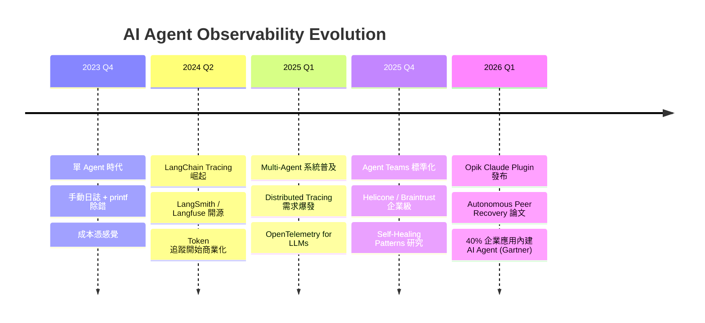

---

## 目錄

1. [為什麼需要 AI Agent 可觀測性](#1-為什麼需要-ai-agent-可觀測性)
2. [可觀測性平台比較](#2-可觀測性平台比較)
3. [Claude Code Agent Teams 可觀測性](#3-claude-code-agent-teams-可觀測性)
4. [成本控制策略](#4-成本控制策略)
5. [自我修復模式](#5-自我修復模式-self-healing-patterns)
6. [監控指標與儀表板設計](#6-監控指標與儀表板設計)
7. [實作指南：Agent Army 整合](#7-實作指南agent-army-整合)
8. [評估框架](#8-評估框架)
9. [參考資源](#9-參考資源)

---

## 1. 為什麼需要 AI Agent 可觀測性

### 1.1 問題陳述：多 Agent 系統的黑盒困境

當你只有一個 AI Agent，出錯了可以直接看 log。但當你有 10 個 Agent 協作時：

- **Agent A** 呼叫了 **Agent B**，但 B 沒有回應 → 是 timeout？還是任務被拒絕？
- **成本突然暴增** → 是哪個 Agent 在無限循環呼叫 API？
- **品質下降** → 是哪個環節的 prompt 失效了？

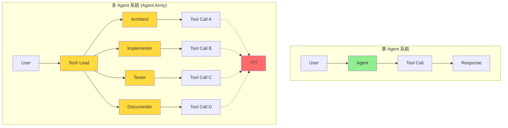

**黑盒問題放大效應**：
- 單 Agent：1 個執行路徑
- 5 Agents：5^N 種可能的互動組合
- 10 Agents：10^N 種 → **除錯難度指數級增長**

### 1.2 「Vibe Coding at Scale」的代價

**沒有可觀測性的多 Agent 開發 = 盲人摸象**

| 問題 | 單 Agent | 多 Agent (無觀測性) | 多 Agent (有觀測性) |
|------|---------|---------------------|---------------------|
| **除錯時間** | 5 分鐘 | 2 小時 (猜測哪個 Agent 出錯) | 10 分鐘 (trace 直接定位) |
| **成本控制** | 手動看帳單 | 不知道誰花的錢 | 即時告警 + 分 agent 追蹤 |
| **品質保證** | 手動測試 | 祈禱不要出錯 | 自動化指標 + 告警 |
| **根因分析** | 直接看 log | 像拼圖一樣找因果 | 分散式追蹤 + 依賴圖 |

### 1.3 2026 年市場趨勢

**Gartner 預測**：2026 年底，40% 的企業應用將內建 AI Agent。

這意味著：
- **可觀測性工具市場爆發**（AI Observability 市場 CAGR 約 36%，持續高速成長）
- **OpenTelemetry for LLMs** 成為事實標準
- **成本優化成為核心競爭力**（token 成本是傳統 API 的 100-1000 倍）

### 1.4 單 Agent vs 多 Agent 可觀測性差異

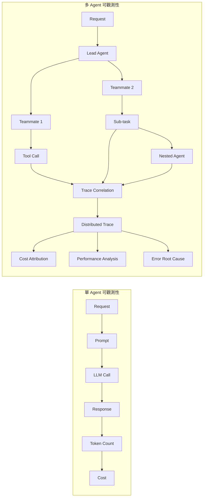

**多 Agent 系統額外需要**：
1. **Trace 關聯**：如何追蹤 Agent A → B → C 的完整調用鏈？
2. **成本歸因**：這 1000 個 tokens 是哪個 Agent 用的？為了哪個任務？
3. **依賴拓撲**：Agent 之間的調用關係是什麼？
4. **並行監控**：5 個 Agent 同時執行，如何區分日誌？

---

## 2. 可觀測性平台比較

### 2.1 開源平台

#### Langfuse — 自託管、全功能、免費

```yaml
核心特性:
  - 自託管 (Docker / Kubernetes)
  - OpenTelemetry 整合
  - Multi-agent distributed tracing
  - Token 追蹤 + 成本計算
  - Prompt versioning & A/B testing
  - 免費 tier (無限 traces)

定價:
  - 自託管: 完全免費
  - 雲端版: $49/月起 (10M traces)

適用場景:
  - 企業內部部署
  - 需要完全資料控制
  - 預算有限的研究團隊
```

**優點**：
- ✅ 完全開源 (MIT License)
- ✅ 支援 Claude / OpenAI / Gemini / Llama
- ✅ 內建 Prompt Management
- ✅ Python / TypeScript / REST API

**缺點**：
- ❌ 需要自行維運 (DB + Redis + Worker)
- ❌ UI 較陽春（但持續改進中）

#### Helicone — 一行整合、成本儀表板

```yaml
核心特性:
  - Proxy 模式 (改 API endpoint 就能用)
  - 即時成本儀表板
  - Rate limiting + caching
  - 支援 50+ LLM providers

定價:
  - 免費: 10K requests/月
  - Growth: $20/月起
  - Enterprise: 客製

適用場景:
  - 快速整合 (5 分鐘上線)
  - 成本追蹤優先
  - 中小型團隊
```

**優點**：
- ✅ 零程式碼改動（Proxy 模式）
- ✅ 成本追蹤極佳（自動按模型計費）
- ✅ 內建 Rate Limiting

**缺點**：
- ❌ Multi-agent tracing 支援較弱
- ❌ 資料儲存在 Helicone 雲端

---

### 2.2 商業平台

#### Braintrust — 企業級評估 + Fine-tuning

```yaml
核心特性:
  - AI 模型評估平台 (Evals as Code)
  - A/B Testing for Prompts
  - Dataset versioning
  - Fine-tuning pipeline
  - Multi-agent orchestration

定價:
  - 免費: 個人專案 (有限制)
  - Pro: 按用量計費
  - Enterprise: 客製

適用場景:
  - 需要嚴謹評估流程
  - Prompt 工程團隊
  - 企業級合規要求
```

**優點**：
- ✅ 評估框架強大（支援自定義 scorer）
- ✅ 與 LangChain / LlamaIndex 深度整合
- ✅ 支援 Claude / OpenAI / Azure

**缺點**：
- ❌ 定價較高
- ❌ 學習曲線陡峭

#### Datadog LLM Observability — APM 整合

```yaml
核心特性:
  - 與 Datadog APM 無縫整合
  - 異常偵測 (Anomaly Detection)
  - 分散式追蹤 (Distributed Tracing)
  - 自動 instrumentation

定價:
  - 按 trace 計費
  - 約 $0.15 per 1M spans

適用場景:
  - 已使用 Datadog
  - 需要 APM + LLM 統一監控
  - 大型企業
```

**優點**：
- ✅ APM 級別的可觀測性
- ✅ 異常偵測自動化
- ✅ 企業級支援

**缺點**：
- ❌ 必須使用 Datadog 生態系
- ❌ 成本隨規模快速增長

#### Opik (Comet) — Claude Code Plugin

```yaml
核心特性:
  - Claude Code Plugin 自動 instrumentation
  - 支援 Agent Teams tracing
  - Session-based 追蹤
  - 免費 tier

定價:
  - 免費: 1M traces/月
  - Pro: $99/月起

適用場景:
  - Claude Code 用戶
  - Agent Teams 開發
  - 快速原型開發
```

**優點**：
- ✅ Claude Code 原生整合（零配置）
- ✅ Agent Teams 自動追蹤
- ✅ Session ID 自動關聯

**缺點**：
- ❌ 僅支援 Claude Code（其他平台需手動 SDK）
- ❌ 功能較新，生態系尚未成熟

---

### 2.3 平台比較總表

| 平台 | 整合方式 | Multi-Agent | 成本追蹤 | 定價 | 適用場景 |
|------|---------|------------|---------|------|---------|
| **Langfuse** | SDK | ✅✅✅ | ✅✅ | 免費 (自託管) | 企業內部部署 |
| **Helicone** | Proxy | ✅ | ✅✅✅ | 免費 10K/月起 | 快速整合、成本優先 |
| **Braintrust** | SDK | ✅✅ | ✅✅ | 免費 + 按用量 | 評估 + Fine-tuning |
| **Datadog** | Auto | ✅✅ | ✅ | 按用量計費 | 已用 Datadog 的企業 |
| **Opik** | Plugin | ✅✅✅ | ✅✅ | 免費 + Pro | Claude Code 用戶 |

**選擇建議**：
- **預算有限 + 技術能力強** → Langfuse (自託管)
- **快速上線 + 成本追蹤** → Helicone
- **企業級評估流程** → Braintrust
- **已用 Datadog APM** → Datadog LLM Observability
- **Claude Code Agent Teams** → Opik Plugin

---

### 2.4 架構差異圖

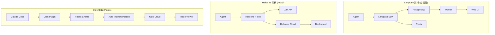

---

## 3. Claude Code Agent Teams 可觀測性

### 3.1 Hooks 事件追蹤

Claude Code 提供 **18 個**生命週期 hook 事件，可用於追蹤 Agent 行為。Hook 腳本透過 **stdin 接收 JSON 資料**，而非環境變數。

**與可觀測性最相關的事件**：

| Hook 事件 | 觸發時機 | stdin JSON 包含 |
|-----------|---------|----------------|
| `PreToolUse` | 工具執行前 | `tool_name`, `tool_input` |
| `PostToolUse` | 工具執行後 | `tool_name`, `tool_input`, `tool_output` |
| `SubagentStart` | 子 Agent 啟動 | `agent_name`, `session_id` |
| `SubagentStop` | 子 Agent 結束 | `agent_name`, `exit_reason` |
| `TeammateIdle` | 隊友閒置 | `teammate_name` |
| `Stop` | 會話結束 | `stop_reason`, `summary` |
| `Notification` | 系統通知 | `title`, `message` |

其他事件包括：`SessionStart`, `UserPromptSubmit`, `PermissionRequest`, `PostToolUseFailure`, `TaskCompleted`, `InstructionsLoaded`, `ConfigChange`, `WorktreeCreate`, `WorktreeRemove`, `PreCompact`, `SessionEnd`。

**配置範例**：

```json
{
  "hooks": {
    "PreToolUse": [{
      "command": "python log_tool_use.py pre",
      "timeout": 5000
    }],
    "PostToolUse": [{
      "command": "python log_tool_use.py post",
      "timeout": 5000
    }]
  }
}
```

**Hook 腳本接收 stdin JSON**：
```python
import sys, json
data = json.load(sys.stdin)  # 從 stdin 讀取 JSON
tool_name = data.get("tool_name")
tool_input = data.get("tool_input")
```

> **注意**：Hook 資料透過 stdin JSON 傳遞，不是環境變數。這是 Claude Code hooks 的設計方式。

### 3.2 Opik Claude Code Plugin 自動 Instrumentation

**安裝**：
```bash
/plugin marketplace add comet
/plugin install opik@comet
```

**自動追蹤內容**：
- ✅ 所有 Tool Calls（Read / Write / Bash / Grep）
- ✅ Agent Teams 調用鏈（Lead → Teammate）
- ✅ Session 關聯（同一任務的所有 Agent 調用）
- ✅ Token 使用量（自動計算）
- ✅ Latency（每個 Tool Call 的執行時間）

**無需額外程式碼**：Plugin 自動攔截 hooks 事件並發送到 Opik Cloud。

### 3.3 Session ID 追蹤與關聯

**問題**：Agent A 呼叫 Agent B，如何在 trace 中關聯它們？

**解決方案**：Session ID Propagation

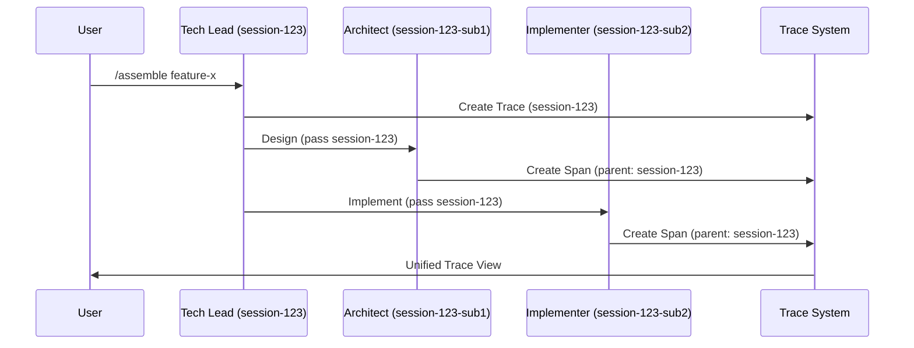

**實作**：
```python
# log_agent_start.py
import os
import json
from datetime import datetime

def log_agent_start(agent_name: str, session_id: str):
    trace_event = {
        "timestamp": datetime.utcnow().isoformat(),
        "event": "agent_start",
        "agent": agent_name,
        "session_id": session_id,
        "parent_session": os.getenv("PARENT_SESSION_ID"),  # 傳遞上層 session
    }

    # 發送到 Langfuse / Helicone / Opik
    send_to_observability_platform(trace_event)
```

### 3.4 Agent Teams Trace 結構

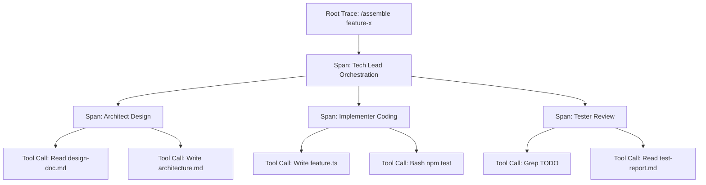

**Trace 層級**：
1. **Root Trace**：整個任務（如 `/assemble feature-x`）
2. **Span (Agent)**：每個 Agent 的執行（如 Architect）
3. **Span (Tool Call)**：每個工具調用（如 Read / Write）

**資料結構**（OpenTelemetry 格式）：
```json
{
  "trace_id": "550e8400-e29b-41d4-a716-446655440000",
  "spans": [
    {
      "span_id": "span-001",
      "name": "Tech Lead Orchestration",
      "parent_span_id": null,
      "attributes": {
        "agent.name": "tech-lead",
        "agent.role": "orchestrator"
      }
    },
    {
      "span_id": "span-002",
      "name": "Architect Design",
      "parent_span_id": "span-001",
      "attributes": {
        "agent.name": "architect",
        "agent.role": "designer",
        "tool_calls": 2
      }
    }
  ]
}
```

### 3.5 參考實作：Hooks + Langfuse 整合

**核心實作** — Hook 腳本從 stdin 讀取 JSON 並發送到 Langfuse：

```python
# hook_trace.py — 作為 PostToolUse hook 使用
import sys, json, os
from langfuse import Langfuse

langfuse = Langfuse(
    public_key=os.getenv("LANGFUSE_PUBLIC_KEY"),
    secret_key=os.getenv("LANGFUSE_SECRET_KEY"),
    host=os.getenv("LANGFUSE_HOST", "http://localhost:3000")
)

# 從 stdin 讀取 hook 資料
data = json.load(sys.stdin)
tool_name = data.get("tool_name", "unknown")

trace = langfuse.trace(
    name=f"tool_use_{tool_name}",
    metadata={"tool": tool_name, "input": str(data.get("tool_input", ""))[:200]}
)
trace.flush()
```

**配置到 Hooks**：
```json
{
  "hooks": {
    "PostToolUse": [{
      "command": "python hook_trace.py",
      "timeout": 5000
    }]
  }
}
```

---

## 4. 成本控制策略

### 4.1 Token 優化技術

#### 4.1.1 Prompt 壓縮

**問題**：System prompt 通常 2000-5000 tokens，每次調用都計費。

**解決方案**：將冗長的 prompt 精簡為結構化關鍵字格式，可從 3500 tokens 壓縮到 800 tokens（節省 ~77%）。

**工具**：
- [LLMLingua](https://github.com/microsoft/LLMLingua)：Microsoft 開源，可自動壓縮 50-70%

#### 4.1.2 System Prompt Caching (Anthropic API)

Anthropic 在 2024 年 8 月推出 **Prompt Caching** (Beta)，可將 system prompt 快取 5 分鐘。

```python
import anthropic

client = anthropic.Anthropic(api_key="sk_xxx")

# 第一次調用：完整計費
response1 = client.messages.create(
    model="claude-opus-4-6",
    max_tokens=1024,
    system=[
        {
            "type": "text",
            "text": "You are a senior architect...",  # 3500 tokens
            "cache_control": {"type": "ephemeral"}  # 啟用快取
        }
    ],
    messages=[{"role": "user", "content": "Design a user service"}]
)

# 5 分鐘內的第二次調用：system prompt 只收 10% 費用
response2 = client.messages.create(
    model="claude-opus-4-6",
    max_tokens=1024,
    system=[
        {
            "type": "text",
            "text": "You are a senior architect...",  # 快取命中，僅收 350 tokens
            "cache_control": {"type": "ephemeral"}
        }
    ],
    messages=[{"role": "user", "content": "Design a payment service"}]
)
```

**節省**：快取命中時，input tokens 減少 90%。

#### 4.1.3 Context Window 管理

**問題**：Context 累積導致 token 用量爆炸。

**解決方案**：滾動窗口 + 摘要 — 保留最近 3 輪對話，舊的用 LLM 摘要替換。Claude Code 自身也使用類似的自動壓縮機制。

---

### 4.2 快取策略（三層架構）

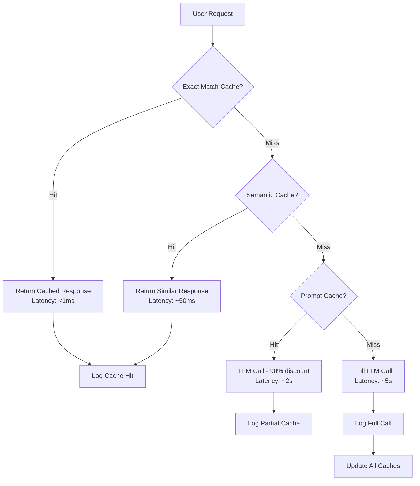

#### 4.2.1 Exact Match Caching

**適用場景**：完全相同的 prompt（如 help 命令、常見問題）

**實作**：用 Redis + SHA-256 hash 作為 cache key，TTL 1 小時。
- 命中率 10-20%，命中時節省 100% LLM 成本。

#### 4.2.2 Semantic Caching

**適用場景**：語義相似的 prompt（如「如何設計用戶服務」vs「用戶服務架構設計」）

**實作**：用 Sentence Transformers (`all-MiniLM-L6-v2`) 計算 embedding 相似度，閾值 0.90。
- 命中率 5-15%，命中時節省 100% LLM 成本。
- 開源方案：[GPTCache](https://github.com/zilliztech/GPTCache)

#### 4.2.3 Prompt Caching (API 層級)

前面已介紹 Anthropic Prompt Caching，快取命中時 system prompt 費用降 90%。

**三層快取整合流程**：Exact Match → Semantic Cache → Prompt Cache → Full LLM Call

---

### 4.3 Rate Limiting

#### 4.3.1 Token Bucket 演算法

**概念**：每秒補充 N 個 tokens，超過容量時拒絕請求。

| Agent | Bucket 容量 | 補充率 (tokens/s) | 設計理由 |
|-------|-----------|------------------|---------|
| Tech Lead | 5,000 | 500 | 主要是協調，調用量低 |
| Architect | 3,000 | 300 | 設計階段，調用量低 |
| Implementer | 10,000 | 1,000 | 編碼任務，調用量高 |
| Tester | 8,000 | 800 | 測試分析需較多 tokens |
| Documenter | 5,000 | 500 | 文件生成，中等調用量 |

#### 4.3.2 Circuit Breaker 模式

**概念**：連續失敗 N 次後暫停調用（OPEN 狀態），避免浪費成本。timeout 後進入 HALF_OPEN 試探性恢復。

三態：`CLOSED`（正常）→ `OPEN`（斷路）→ `HALF_OPEN`（試探）→ `CLOSED`

失敗時自動降級到更便宜的模型（如 Opus → Sonnet → Haiku）。

---

### 4.4 模型分層使用

**策略**：根據任務複雜度選擇模型。

| 任務類型 | 模型 | 成本 (per 1M tokens) | 適用 Agent |
|---------|------|---------------------|-----------|
| **複雜推理** | Opus 4.6 | $15 input / $75 output | Tech Lead, Architect |
| **一般開發** | Sonnet 4.5 | $3 input / $15 output | Implementer, Tester |
| **文件生成** | Sonnet 4.5 | $3 input / $15 output | Documenter |
| **簡單任務** | Haiku 4.5 | $0.25 input / $1.25 output | 資料處理、日誌分析 |

**Agent Army 配置**：

```json
{
  "agents": {
    "tech-lead": {
      "model": "claude-opus-4-6",
      "rationale": "需要高層次推理能力"
    },
    "architect": {
      "model": "claude-opus-4-6",
      "rationale": "系統設計需要深度思考"
    },
    "implementer": {
      "model": "claude-sonnet-4-5",
      "rationale": "編碼任務平衡性能與成本"
    },
    "tester": {
      "model": "claude-sonnet-4-5",
      "rationale": "測試分析需要中等推理"
    },
    "documenter": {
      "model": "claude-sonnet-4-5",
      "rationale": "文件生成平衡品質與成本"
    }
  }
}
```

**成本影響**：
- 全用 Opus：$15/1M input tokens
- 分層使用：加權平均 ~$7/1M input tokens
- **節省約 50%**

---

### 4.5 成本追蹤實作

#### 4.5.1 Gateway 層成本追蹤

**概念**：在 Gateway 層攔截所有 LLM 調用，用 `response.usage.input_tokens` / `output_tokens` 乘以定價自動計算成本。

**定價參考（2026 Q1 Anthropic API）**：

| 模型 | Input (per 1M) | Output (per 1M) |
|------|----------------|-----------------|
| Opus 4.6 | $15 | $75 |
| Sonnet 4.5 | $3 | $15 |
| Haiku 4.5 | $0.25 | $1.25 |

#### 4.5.2 Helicone Cost Dashboard

**整合**（僅需改 endpoint）：

```python
import anthropic

# 原本
# client = anthropic.Anthropic(api_key="sk_xxx")

# 改用 Helicone Proxy
client = anthropic.Anthropic(
    api_key="sk_xxx",
    base_url="https://anthropic.helicone.ai",
    default_headers={
        "Helicone-Auth": "Bearer sk_helicone_xxx"
    }
)

# 正常使用，Helicone 自動追蹤成本
response = client.messages.create(
    model="claude-sonnet-4-5",
    messages=[{"role": "user", "content": "Hello"}]
)
```

**Dashboard 功能**：
- 即時成本（今日 / 本週 / 本月）
- 按模型分類
- 按 Agent 分類（需在 header 加 `Helicone-User-Id`）
- 成本趨勢圖

#### 4.5.3 自建成本追蹤

**核心 Schema**：`llm_calls` 表記錄 `agent_id`, `model`, `input_tokens`, `output_tokens`, `cost_usd`, `session_id`, `timestamp`。搭配 `GROUP BY agent_id` 的日報查詢即可產生每日成本報告。

---

## 5. 自我修復模式 (Self-Healing Patterns)

### 5.1 Circuit Breaker 三態機

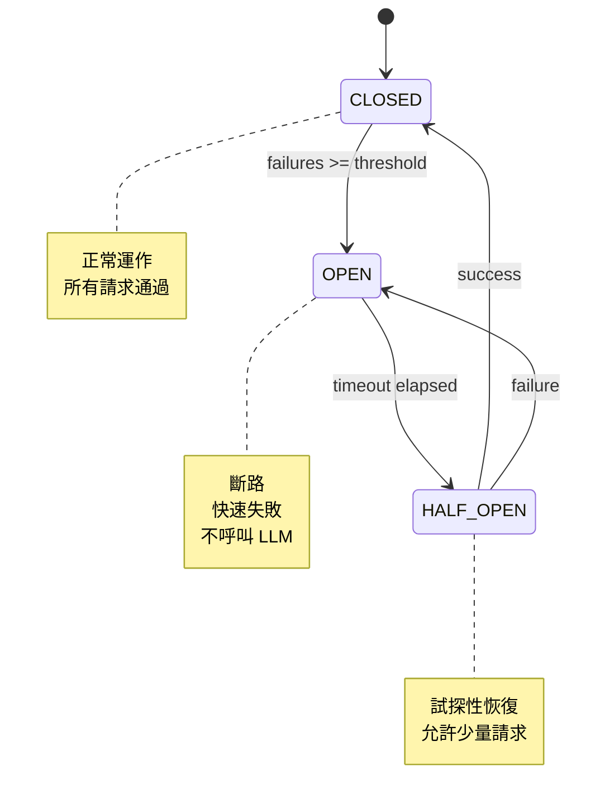

**進階策略**：`AdaptiveCircuitBreaker` — OPEN 狀態時自動降級到更便宜的 fallback 模型（如 `claude-haiku-4-5`），HALF_OPEN 時試探性恢復。結合模型分層策略可同時保證可用性和成本控制。

---

### 5.2 Graph-Based Self-Healing Tool Routing

**核心概念**：Agent 遇到錯誤時，自動重新路由到備用工具。

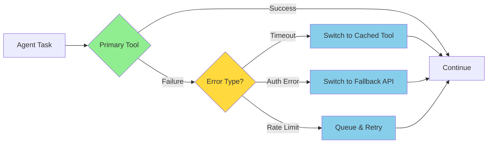

**實作要點**：
- 建立 Tool Graph：每個工具定義 primary + fallback + error_mapping
- 例如 `llm_call`：primary=`opus` → rate_limit 時降級 `sonnet` → overload 時降級 `haiku`
- 錯誤分類後自動路由到對應的 fallback tool

---

### 5.3 Agentic SRE — 分角色自治修復

**概念**：多個 SRE Agent 分工協作，自動診斷與修復。

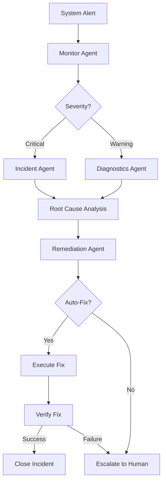

**Agent 角色**：
1. **Monitor Agent**：接收告警，分類嚴重性
2. **Diagnostics Agent**：收集日誌、metrics，初步診斷
3. **Incident Agent**：重大事件協調（critical only）
4. **Remediation Agent**：執行修復動作（重啟服務、擴容、回滾）
5. **Verification Agent**：驗證修復是否成功

**流程**：Alert → 分類嚴重性 → 診斷 → 自動修復（如可行）→ 驗證 → 關閉 or 升級人工。

---

### 5.4 Autonomous Peer Recovery

**核心概念**：Agent A 檢測到 Agent B 失敗，自動接管 B 的任務。

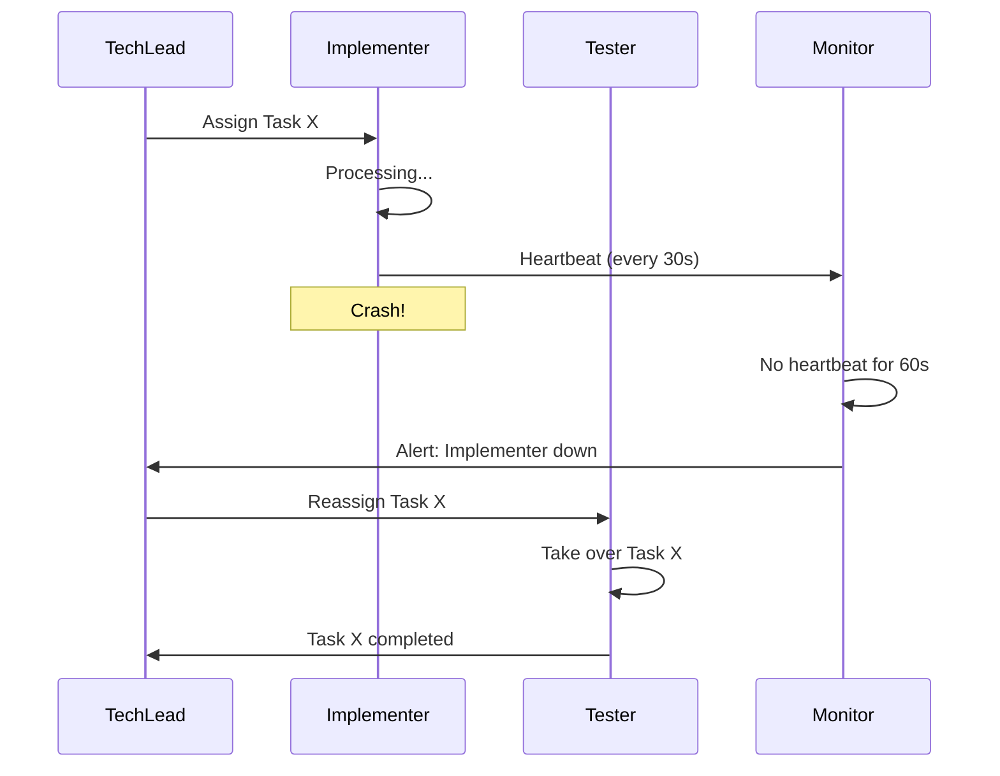

**實作要點**：
- Heartbeat 機制：每 30s 發送心跳，60s 無回應視為失敗
- 任務重分配：Monitor 檢測到失敗後，Tech Lead 將任務重新分配給同角色的備用 Agent
- 在 Claude Code Agent Teams 中，SubagentStop hook 可用於檢測子 Agent 異常退出

---

---

## 6. 監控指標與儀表板設計

### 6.1 核心指標 (DORA-like for AI)

**DORA Metrics** (DevOps Research and Assessment) 是軟體交付的四大指標，我們將其改編為 AI Agent 系統。

| 傳統 DORA | AI Agent 版本 | 定義 | 目標 |
|-----------|--------------|------|------|
| **Deployment Frequency** | **Task Completion Rate** | 成功完成的任務 / 總任務 | ≥ 90% |
| **Lead Time for Changes** | **Mean Time to Completion** | 從任務分配到完成的平均時間 | < 10 分鐘 |
| **Change Failure Rate** | **Agent Error Rate** | 錯誤的 agent 調用 / 總調用 | < 5% |
| **Mean Time to Recovery** | **Mean Time to Recovery** | 從錯誤到修復的平均時間 | < 5 分鐘 |

**額外指標**：

| 指標 | 定義 | 目標 |
|------|------|------|
| **Token Usage per Task** | 每個任務平均消耗的 tokens | < 50K tokens |
| **Cost per Feature** | 每個 feature 的平均成本 | < $0.50 |
| **Tool Call Success Rate** | 成功的工具調用 / 總工具調用 | ≥ 95% |
| **Cache Hit Rate** | 快取命中次數 / 總請求 | ≥ 30% |
| **Agent Utilization** | Agent 忙碌時間 / 總時間 | 60-80% (平衡) |

---

### 6.2 儀表板設計

#### 6.2.1 即時總覽 Dashboard

```
┌─────────────────────────────────────────────────────────────┐
│ Agent Army - Real-time Overview                            │
├─────────────────────────────────────────────────────────────┤
│                                                             │
│  Active Agents: 5/5        Active Tasks: 3                 │
│  Total Cost Today: $12.45  Avg Task Time: 8m 32s          │
│                                                             │
├─────────────────────────────────────────────────────────────┤
│ Agent Status                                                │
├─────────────────────────────────────────────────────────────┤
│  ● Tech Lead       IDLE       Last task: 2m ago            │
│  ● Architect       WORKING    Task: Design payment service │
│  ● Implementer     WORKING    Task: Code user-repo         │
│  ● Tester          IDLE       Last task: 15m ago           │
│  ● Documenter      WORKING    Task: Write API docs         │
├─────────────────────────────────────────────────────────────┤
│ Recent Alerts                                               │
├─────────────────────────────────────────────────────────────┤
│  ⚠️  Implementer: High token usage (15K in 5m)             │
│  ✅  Tester: Code review completed                          │
└─────────────────────────────────────────────────────────────┘
```

**推薦實作工具**：Streamlit（快速原型）或 Grafana（生產環境）。

---

#### 6.2.2 成本趨勢 Dashboard

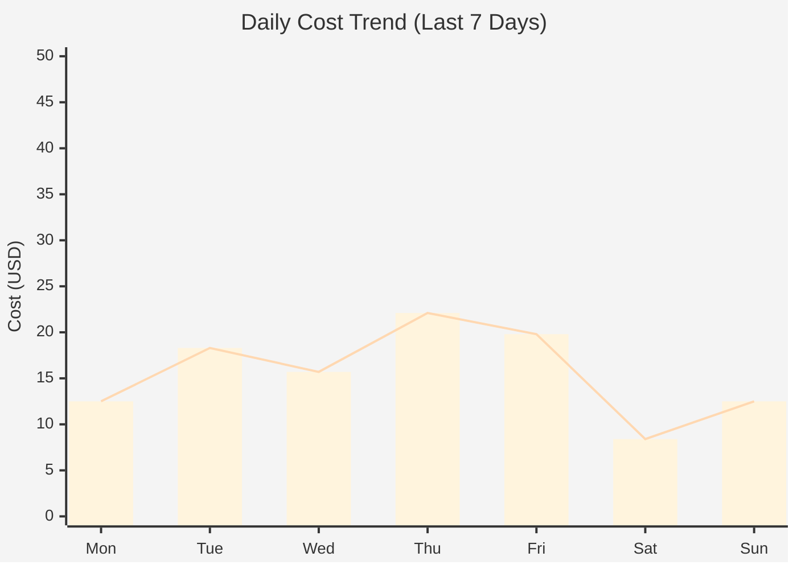

**按 Agent 分類**：

| Agent | Today | This Week | This Month | % of Total |
|-------|-------|-----------|------------|------------|
| Tech Lead | $2.50 | $15.80 | $62.30 | 25% |
| Architect | $3.20 | $18.90 | $78.40 | 32% |
| Implementer | $4.50 | $28.50 | $105.60 | 43% |
| Tester | $1.80 | $12.30 | $48.20 | 20% |
| Documenter | $0.45 | $3.50 | $15.50 | 6% |

**視覺化工具**：Plotly / Grafana / Streamlit 皆可，從 `llm_calls` 表 GROUP BY `agent_id`, `DATE(timestamp)` 繪製。

---

#### 6.2.3 錯誤分析 Dashboard

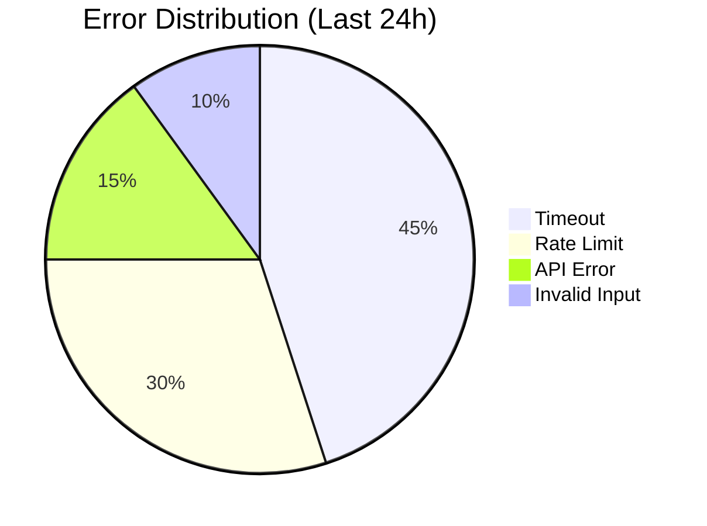

**根因分析表**：

| Error Type | Count | Root Cause | Mitigation |
|------------|-------|------------|------------|
| Timeout | 45 | LLM API 負載高 | 增加 timeout, 使用 cache |
| Rate Limit | 30 | Implementer 無限循環 | 加上 per-agent rate limit |
| API Error | 15 | Anthropic API 暫時性故障 | Circuit Breaker |
| Invalid Input | 10 | 前置驗證不足 | 加強 input validation |

---

#### 6.2.4 效能分佈 Dashboard

**Latency Percentiles**：

```
p50 (median):  2.3s
p95:           5.8s
p99:           12.1s
p99.9:         25.4s
```

**Heatmap (Tool Call Latency)**：

```
         Read   Write  Bash   Grep   LLM
Tech     0.1s   0.2s   1.5s   0.3s   3.2s
Arch     0.1s   0.3s   0.8s   0.2s   4.1s
Impl     0.2s   0.5s   2.1s   0.4s   2.8s
Test     0.1s   0.2s   1.8s   0.5s   3.5s
Doc      0.1s   0.4s   0.5s   0.2s   2.1s
```

---

### 6.3 告警策略

#### 6.3.1 告警規則

| 告警名稱 | 條件 | 嚴重性 | 通知方式 |
|---------|------|--------|---------|
| **Token Usage Spike** | 5 分鐘內消耗 > 50K tokens | Warning | Slack |
| **Error Rate High** | 錯誤率 > 10% (持續 5 分鐘) | Critical | Slack + PagerDuty |
| **Agent Stuck** | 單一任務執行 > 30 分鐘 | Warning | Slack |
| **Cost Threshold** | 日成本 > $50 | Critical | Email + Slack |
| **Cache Hit Rate Low** | 快取命中率 < 20% | Info | Email |
| **LLM API Down** | 連續 3 次調用失敗 | Critical | Slack + PagerDuty |

#### 6.3.2 告警整合

**Slack Webhook**：用 `requests.post(webhook_url, json=payload)` 發送，按 severity 設定顏色（info=綠、warning=橙、critical=紅）。

**告警抑制**：同一 alert_key 在 5 分鐘內不重複發送，避免告警疲勞。

---

## 7. 實作指南：Agent Army 整合

### 7.1 Step 1: Hooks 事件收集

**目標**：收集所有 Tool Use 事件並記錄到資料庫。

**settings.json**：

```json
{
  "hooks": {
    "PostToolUse": [{
      "command": "python .claude/hooks/log_tool_use.py",
      "timeout": 5000
    }],
    "SubagentStop": [{
      "command": "python .claude/hooks/log_agent_stop.py",
      "timeout": 3000
    }]
  }
}
```

**log_tool_use.py** — 從 stdin 讀取 JSON：

```python
#!/usr/bin/env python3
import sys, json, os, psycopg2
from datetime import datetime

data = json.load(sys.stdin)

conn = psycopg2.connect(
    dbname=os.getenv("DB_NAME", "observability"),
    user=os.getenv("DB_USER", "postgres"),
    password=os.getenv("DB_PASSWORD"),
    host=os.getenv("DB_HOST", "localhost")
)
cur = conn.cursor()
cur.execute("""
    INSERT INTO tool_events (timestamp, tool_name, tool_input_summary)
    VALUES (%s, %s, %s)
""", (datetime.utcnow(), data.get("tool_name"), str(data.get("tool_input", ""))[:500]))
conn.commit()
cur.close()
conn.close()
```

---

### 7.2 Step 2: Langfuse 整合（自託管）

**部署 Langfuse**：

```yaml
# docker-compose.yml
version: '3.8'

services:
  langfuse:
    image: langfuse/langfuse:latest
    ports:
      - "3000:3000"
    environment:
      DATABASE_URL: postgresql://postgres:password@db:5432/langfuse
      NEXTAUTH_URL: http://localhost:3000
      NEXTAUTH_SECRET: your-secret-key
    depends_on:
      - db

  db:
    image: postgres:15
    environment:
      POSTGRES_USER: postgres
      POSTGRES_PASSWORD: password
      POSTGRES_DB: langfuse
    volumes:
      - langfuse_data:/var/lib/postgresql/data

volumes:
  langfuse_data:
```

```bash
docker-compose up -d
```

**Python SDK 整合**：

```python
from langfuse import Langfuse
import os

langfuse = Langfuse(
    public_key=os.getenv("LANGFUSE_PUBLIC_KEY"),
    secret_key=os.getenv("LANGFUSE_SECRET_KEY"),
    host="http://localhost:3000"
)

def traced_llm_call(agent_id: str, prompt: str, model: str):
    trace = langfuse.trace(
        name="agent_task",
        metadata={
            "agent_id": agent_id,
            "model": model
        }
    )

    generation = trace.generation(
        name="llm_call",
        model=model,
        model_parameters={"temperature": 0.7},
        input=prompt
    )

    # 實際 LLM 調用
    response = call_llm(model, prompt)

    generation.end(
        output=response.content,
        usage={
            "input_tokens": response.usage.input_tokens,
            "output_tokens": response.usage.output_tokens
        }
    )

    trace.update(
        output=response.content
    )

    return response
```

**整合到 Agent Army**：

```python
# .claude/agents/implementer/agent.py
from langfuse_integration import traced_llm_call

def implement_feature(feature_description: str):
    response = traced_llm_call(
        agent_id="implementer",
        prompt=f"Implement the following feature: {feature_description}",
        model="claude-sonnet-4-5"
    )
    return response.content
```

---

### 7.3 Step 3: 成本追蹤 Dashboard

可使用以下方案建立成本追蹤 Dashboard：

| 方案 | 適用場景 | 開發量 |
|------|---------|--------|
| **Helicone** | 零開發，改 API endpoint 即可 | 5 分鐘 |
| **Langfuse Dashboard** | 自託管，內建 UI | 30 分鐘 |
| **Streamlit + SQL** | 需要客製化圖表 | 2-4 小時 |
| **Flask/React 自建** | 完全客製化需求 | 1-2 天 |

**推薦路徑**：先用 Helicone 或 Langfuse 內建 Dashboard 快速上線，有客製需求再用 Streamlit 擴展。

---

### 7.4 Step 4: 告警設定

**監控腳本核心檢查項**：

| 檢查項 | SQL 條件 | 告警嚴重性 |
|--------|---------|-----------|
| Token 用量飆升 | `SUM(tokens) > 50K` in 5 min per agent | Warning |
| 錯誤率過高 | `error_rate > 10%` 持續 5 min | Critical |
| Agent 卡住 | 單一任務 > 30 min | Warning |
| 日成本超限 | `SUM(cost_usd) > $50` today | Critical |

**實作方式**：用 cron 或背景 Python 腳本每分鐘查詢 DB，超過閾值時發送 Slack webhook 告警。搭配 `AlertManager` 做告警去重（5 分鐘抑制窗口）避免告警疲勞。

---

### 7.5 完整架構圖

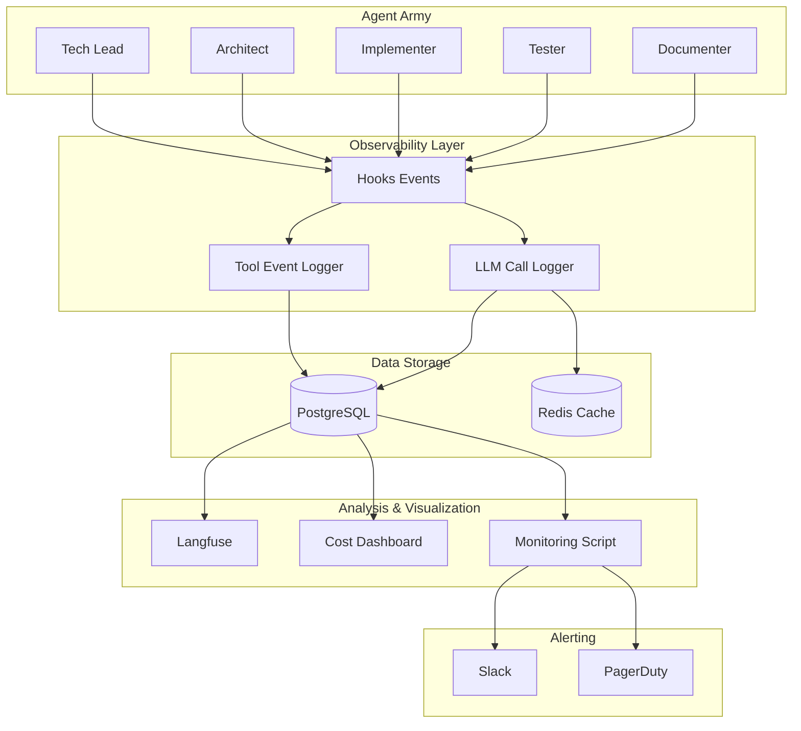

---

## 8. 評估框架

### 8.1 品質評估

| 評估維度 | 方法 | 指標 |
|---------|------|------|
| **Reasoning Coherence** | LLM-as-a-Judge（用 Opus 評分 0-1） | 目標 ≥ 0.8 |
| **Tool Selection Accuracy** | 比對選擇的工具 vs 預期工具 | 目標 ≥ 90% |
| **Task Completion Rate** | `completed / total` (過去 7 天) | 目標 ≥ 90% |

> **LLM-as-a-Judge** 參考：Zheng et al., *Judging LLM-as-a-Judge with MT-Bench and Chatbot Arena* (2023)

---

### 8.2 效能評估

| 指標 | Target | 說明 |
|------|--------|------|
| **p50 Latency** | < 3s | 中位數延遲 |
| **p95 Latency** | < 10s | 長尾延遲 |
| **p99 Latency** | < 20s | 極端延遲 |
| **Throughput** | 依場景而定 | tasks/hour (GROUP BY hour 統計) |
| **Agent Utilization** | 60-80% | 處理時間 / 總時間 |
| **Tokens per Task** | < 50K | 單任務 token 消耗 |
| **Cost per Feature** | < $0.50 | 單 feature 成本 |

---

---

### 8.4 企業採用路線圖

```mermaid
timeline
    title Enterprise AI Agent Observability Adoption Roadmap
    section Phase 1: Foundation (Month 1-2)
        日誌收集 : Hooks 事件追蹤
                 : 基礎資料庫建立
        成本追蹤 : Token 計數
                 : 簡易成本儀表板
    section Phase 2: Monitoring (Month 3-4)
        指標建立 : DORA-like metrics
                 : 效能分佈
        儀表板 : Real-time overview
               : Cost trend dashboard
    section Phase 3: Automation (Month 5-6)
        告警系統 : Slack integration
                 : Threshold 設定
        自動修復 : Circuit Breaker
                 : Rate Limiting
    section Phase 4: Intelligence (Month 7+)
        預測分析 : 成本預測
                 : 異常偵測
        自治運營 : Self-Healing
                 : Autonomous Recovery
```

**Phase 1: Foundation (1-2 個月)**
- ✅ 部署 Langfuse / Helicone
- ✅ 配置 Hooks 事件收集
- ✅ 建立基礎資料庫 schema
- ✅ 開始追蹤 token 使用量

**Phase 2: Monitoring (3-4 個月)**
- ✅ 建立核心指標（Task Completion Rate, Error Rate）
- ✅ 部署即時儀表板
- ✅ 成本趨勢分析
- ✅ 效能分佈圖表

**Phase 3: Automation (5-6 個月)**
- ✅ 告警系統上線（Slack / PagerDuty）
- ✅ 實作 Circuit Breaker
- ✅ Per-agent Rate Limiting
- ✅ 自動成本報告

**Phase 4: Intelligence (7 個月+)**
- ✅ 預測性成本分析（機器學習模型）
- ✅ 異常偵測（Anomaly Detection）
- ✅ Self-Healing Agents
- ✅ 全自治運營（Autonomous SRE）

---

## 9. 參考資源

### 9.1 可觀測性平台

| 平台 | 類型 | 網址 |
|------|------|------|
| **Langfuse** | 開源 | https://langfuse.com |
| **Helicone** | 商業 | https://helicone.ai |
| **Braintrust** | 商業 | https://braintrust.dev |
| **Datadog LLM Obs** | 商業 | https://datadoghq.com/llm-observability |
| **Opik** | 商業 | https://comet.com/opik |
| **LangSmith** | 商業 | https://smith.langchain.com |
| **Phoenix (Arize)** | 開源 | https://github.com/Arize-ai/phoenix |
| **PromptLayer** | 商業 | https://promptlayer.com |

---

### 9.2 開源專案

| 專案 | 描述 | GitHub |
|------|------|--------|
| **LLMLingua** | Microsoft 的 prompt 壓縮工具 | [microsoft/LLMLingua](https://github.com/microsoft/LLMLingua) |
| **OpenTelemetry for LLMs** | LLM 可觀測性標準 | [open-telemetry/opentelemetry-python](https://github.com/open-telemetry/opentelemetry-python) |
| **Phoenix (Arize AI)** | 開源 LLM 可觀測性平台 | [Arize-ai/phoenix](https://github.com/Arize-ai/phoenix) |
| **Langfuse** | 開源 LLM 可觀測性 + tracing | [langfuse/langfuse](https://github.com/langfuse/langfuse) |

---

### 9.3 學術論文與標準

| 資源 | 年份 | 主題 |
|------|------|------|
| *Judging LLM-as-a-Judge with MT-Bench and Chatbot Arena* (Zheng et al.) | 2023 | LLM 評估框架 |
| *GPTCache: An Open-Source Semantic Cache for LLM Applications* | 2023 | Semantic cache |
| *OpenTelemetry Semantic Conventions for Gen AI* | 2024+ | LLM 可觀測性標準 (進行中) |

---

### 9.4 工具比較速查表

**適用場景快速查詢**：

| 我想要... | 推薦方案 | 原因 |
|----------|---------|------|
| **5 分鐘內上線** | Helicone | Proxy 模式，零程式碼改動 |
| **完全免費 + 自託管** | Langfuse | 開源 MIT License |
| **Claude Code 原生整合** | Opik Plugin | 自動 instrumentation |
| **企業級合規** | Datadog / Braintrust | 已通過 SOC2 / GDPR |
| **最強評估框架** | Braintrust | Evals as Code |
| **成本追蹤優先** | Helicone | 即時成本儀表板 |
| **Multi-Agent Tracing** | Langfuse / Opik | OpenTelemetry 支援 |
| **自建客製化** | Langfuse (自託管) + 自建 Dashboard | 完全控制 |

---

### 9.5 延伸閱讀

1. **Gartner Report**: *Predicts 2026: AI Agents Will Transform Enterprise Software* (2025-11)
2. **Anthropic Docs**: *Prompt Caching* — https://docs.anthropic.com/claude/docs/prompt-caching
3. **OpenTelemetry Semantic Conventions for LLMs** — https://opentelemetry.io/docs/specs/semconv/gen-ai/
4. **Helicone Blog**: *How to Reduce LLM Costs by 70% with Caching* (2025-08)
5. **Langfuse Cookbook**: *Multi-Agent Tracing Best Practices* — https://langfuse.com/docs/tracing/multi-agent

---

## 總結

AI Agent 可觀測性不是奢侈品，而是多 Agent 系統的**生存必需品**。

當你的系統從單一 Agent 擴展到 5-10 個協作 Agents 時，沒有可觀測性就像在黑夜中開車——你不知道：
- 💸 錢花在哪裡（成本失控）
- 🐛 錯誤在哪個環節（除錯困難）
- ⏱️ 為什麼這麼慢（效能瓶頸）
- 🔄 哪些 Agent 在互相依賴（依賴關係）

**本指南的核心要點**：

1. **選對平台**：Langfuse (自託管免費) / Helicone (快速上線) / Opik (Claude Code 原生)
2. **追蹤成本**：三層快取 (Exact + Semantic + Prompt) + 模型分層使用 → 節省 50-70%
3. **監控指標**：DORA-like metrics (Task Completion, Error Rate, MTTR) + 告警
4. **自動修復**：Circuit Breaker + Rate Limiting + Self-Healing Patterns
5. **企業採用**：分 4 個階段，從基礎日誌到全自治運營

**開始行動**：
- 今天：安裝 Helicone 或 Langfuse
- 本週：配置 Hooks 事件收集
- 本月：建立成本儀表板 + 告警
- 下季：實作 Self-Healing

**記住**：可觀測性是 iterative 的過程，不是 one-time 的專案。從小範圍開始，逐步擴展。

---

*本文件由 Agent Army Documenter 撰寫 | 更新日期: 2026-03-05*
