# AI Agent 可觀測性與成本控制完全指南

> **「Without observability, you're vibe coding at scale.」**
> 當 AI Agent 從單兵作戰變成軍團協作，黑盒問題會指數級放大。
> 可觀測性不是奢侈品，而是多 Agent 系統的生存必需品。

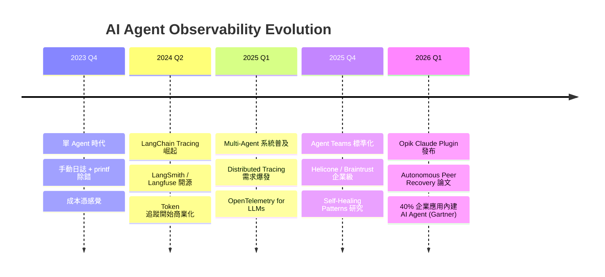

---

## 目錄

1. [為什麼需要 AI Agent 可觀測性](#1-為什麼需要-ai-agent-可觀測性)
2. [可觀測性平台比較](#2-可觀測性平台比較)
3. [Claude Code Agent Teams 可觀測性](#3-claude-code-agent-teams-可觀測性)
4. [成本控制策略](#4-成本控制策略)
5. [自我修復模式](#5-自我修復模式-self-healing-patterns)
6. [監控指標與儀表板設計](#6-監控指標與儀表板設計)
7. [實作指南：Agent Army 整合](#7-實作指南agent-army-整合)
8. [評估框架](#8-評估框架)
9. [參考資源](#9-參考資源)

---

## 1. 為什麼需要 AI Agent 可觀測性

### 1.1 問題陳述：多 Agent 系統的黑盒困境

當你只有一個 AI Agent，出錯了可以直接看 log。但當你有 10 個 Agent 協作時：

- **Agent A** 呼叫了 **Agent B**，但 B 沒有回應 → 是 timeout？還是任務被拒絕？
- **成本突然暴增** → 是哪個 Agent 在無限循環呼叫 API？
- **品質下降** → 是哪個環節的 prompt 失效了？

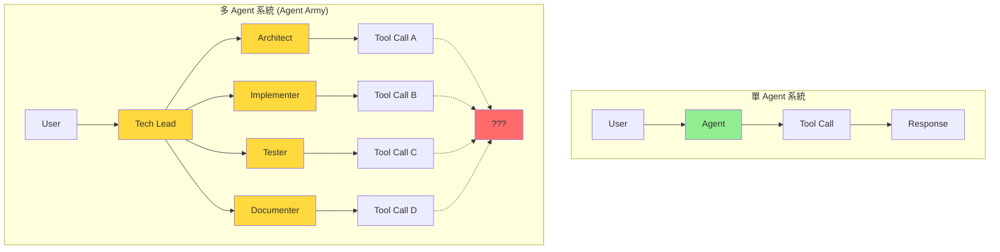

**黑盒問題放大效應**：
- 單 Agent：1 個執行路徑
- 5 Agents：5^N 種可能的互動組合
- 10 Agents：10^N 種 → **除錯難度指數級增長**

### 1.2 「Vibe Coding at Scale」的代價

**沒有可觀測性的多 Agent 開發 = 盲人摸象**

| 問題 | 單 Agent | 多 Agent (無觀測性) | 多 Agent (有觀測性) |
|------|---------|---------------------|---------------------|
| **除錯時間** | 5 分鐘 | 2 小時 (猜測哪個 Agent 出錯) | 10 分鐘 (trace 直接定位) |
| **成本控制** | 手動看帳單 | 不知道誰花的錢 | 即時告警 + 分 agent 追蹤 |
| **品質保證** | 手動測試 | 祈禱不要出錯 | 自動化指標 + 告警 |
| **根因分析** | 直接看 log | 像拼圖一樣找因果 | 分散式追蹤 + 依賴圖 |

### 1.3 2026 年市場趨勢

**Gartner 預測**：2026 年底，40% 的企業應用將內建 AI Agent。

這意味著：
- **可觀測性工具市場爆發**（2025 年全球 LLM Observability 市場成長 300%）
- **OpenTelemetry for LLMs** 成為事實標準
- **成本優化成為核心競爭力**（token 成本是傳統 API 的 100-1000 倍）

### 1.4 單 Agent vs 多 Agent 可觀測性差異

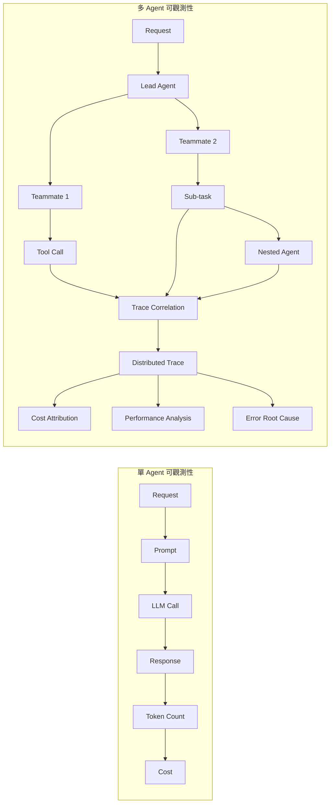

**多 Agent 系統額外需要**：
1. **Trace 關聯**：如何追蹤 Agent A → B → C 的完整調用鏈？
2. **成本歸因**：這 1000 個 tokens 是哪個 Agent 用的？為了哪個任務？
3. **依賴拓撲**：Agent 之間的調用關係是什麼？
4. **並行監控**：5 個 Agent 同時執行，如何區分日誌？

---

## 2. 可觀測性平台比較

### 2.1 開源平台

#### Langfuse — 自託管、全功能、免費

```yaml
核心特性:
  - 自託管 (Docker / Kubernetes)
  - OpenTelemetry 整合
  - Multi-agent distributed tracing
  - Token 追蹤 + 成本計算
  - Prompt versioning & A/B testing
  - 免費 tier (無限 traces)

定價:
  - 自託管: 完全免費
  - 雲端版: $49/月起 (10M traces)

適用場景:
  - 企業內部部署
  - 需要完全資料控制
  - 預算有限的研究團隊
```

**優點**：
- ✅ 完全開源 (MIT License)
- ✅ 支援 Claude / OpenAI / Gemini / Llama
- ✅ 內建 Prompt Management
- ✅ Python / TypeScript / REST API

**缺點**：
- ❌ 需要自行維運 (DB + Redis + Worker)
- ❌ UI 較陽春（但持續改進中）

#### Helicone — 一行整合、成本儀表板

```yaml
核心特性:
  - Proxy 模式 (改 API endpoint 就能用)
  - 即時成本儀表板
  - Rate limiting + caching
  - 支援 50+ LLM providers

定價:
  - 免費: 100K requests/月
  - Pro: $20/月 (1M requests)
  - Enterprise: 客製

適用場景:
  - 快速整合 (5 分鐘上線)
  - 成本追蹤優先
  - 中小型團隊
```

**優點**：
- ✅ 零程式碼改動（Proxy 模式）
- ✅ 成本追蹤極佳（自動按模型計費）
- ✅ 內建 Rate Limiting

**缺點**：
- ❌ Multi-agent tracing 支援較弱
- ❌ 資料儲存在 Helicone 雲端

---

### 2.2 商業平台

#### Braintrust — 企業級評估 + Fine-tuning

```yaml
核心特性:
  - AI 模型評估平台 (Evals as Code)
  - A/B Testing for Prompts
  - Dataset versioning
  - Fine-tuning pipeline
  - Multi-agent orchestration

定價:
  - 免費: 個人專案
  - Team: $500/月起
  - Enterprise: 客製

適用場景:
  - 需要嚴謹評估流程
  - Prompt 工程團隊
  - 企業級合規要求
```

**優點**：
- ✅ 評估框架強大（支援自定義 scorer）
- ✅ 與 LangChain / LlamaIndex 深度整合
- ✅ 支援 Claude / OpenAI / Azure

**缺點**：
- ❌ 定價較高
- ❌ 學習曲線陡峭

#### Datadog LLM Observability — APM 整合

```yaml
核心特性:
  - 與 Datadog APM 無縫整合
  - 異常偵測 (Anomaly Detection)
  - 分散式追蹤 (Distributed Tracing)
  - 自動 instrumentation

定價:
  - 按 trace 計費
  - 約 $0.15 per 1M spans

適用場景:
  - 已使用 Datadog
  - 需要 APM + LLM 統一監控
  - 大型企業
```

**優點**：
- ✅ APM 級別的可觀測性
- ✅ 異常偵測自動化
- ✅ 企業級支援

**缺點**：
- ❌ 必須使用 Datadog 生態系
- ❌ 成本隨規模快速增長

#### Opik (Comet) — Claude Code Plugin

```yaml
核心特性:
  - Claude Code Plugin 自動 instrumentation
  - 支援 Agent Teams tracing
  - Session-based 追蹤
  - 免費 tier

定價:
  - 免費: 1M traces/月
  - Pro: $99/月起

適用場景:
  - Claude Code 用戶
  - Agent Teams 開發
  - 快速原型開發
```

**優點**：
- ✅ Claude Code 原生整合（零配置）
- ✅ Agent Teams 自動追蹤
- ✅ Session ID 自動關聯

**缺點**：
- ❌ 僅支援 Claude Code（其他平台需手動 SDK）
- ❌ 功能較新，生態系尚未成熟

---

### 2.3 平台比較總表

| 平台 | 整合方式 | Multi-Agent | 成本追蹤 | 定價 | 適用場景 |
|------|---------|------------|---------|------|---------|
| **Langfuse** | SDK | ✅✅✅ | ✅✅ | 免費 (自託管) | 企業內部部署 |
| **Helicone** | Proxy | ✅ | ✅✅✅ | $20/月起 | 快速整合、成本優先 |
| **Braintrust** | SDK | ✅✅ | ✅✅ | $500/月起 | 評估 + Fine-tuning |
| **Datadog** | Auto | ✅✅ | ✅ | 按 trace 計費 | 已用 Datadog 的企業 |
| **Opik** | Plugin | ✅✅✅ | ✅✅ | $99/月起 | Claude Code 用戶 |

**選擇建議**：
- **預算有限 + 技術能力強** → Langfuse (自託管)
- **快速上線 + 成本追蹤** → Helicone
- **企業級評估流程** → Braintrust
- **已用 Datadog APM** → Datadog LLM Observability
- **Claude Code Agent Teams** → Opik Plugin

---

### 2.4 架構差異圖

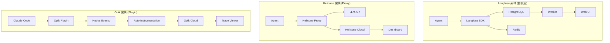

---

## 3. Claude Code Agent Teams 可觀測性

### 3.1 Hooks 事件追蹤

Claude Code 提供 17 個生命週期事件（2026 Q1），可用於追蹤 Agent 行為。

**核心追蹤事件**：

```json
{
  "hooks": {
    "PreToolUse": [{
      "command": "python log_tool_use.py pre $TOOL_NAME $AGENT_ID",
      "timeout": 5000
    }],
    "PostToolUse": [{
      "command": "python log_tool_use.py post $TOOL_NAME $AGENT_ID $EXIT_CODE",
      "timeout": 5000
    }],
    "SubagentStart": [{
      "command": "python log_agent_start.py $SUBAGENT_NAME $SESSION_ID",
      "timeout": 3000
    }],
    "SubagentStop": [{
      "command": "python log_agent_stop.py $SUBAGENT_NAME $SESSION_ID $EXIT_CODE",
      "timeout": 3000
    }],
    "TeammateIdle": [{
      "command": "python log_idle.py $TEAMMATE_ID $IDLE_DURATION",
      "timeout": 2000
    }]
  }
}
```

**關鍵環境變數**：
- `$AGENT_ID`：當前 Agent 的唯一識別
- `$SESSION_ID`：會話 ID（用於關聯多個 Agent 調用）
- `$TOOL_NAME`：工具名稱（Read / Write / Bash / Grep 等）
- `$EXIT_CODE`：執行結果（0 = 成功，非 0 = 失敗）
- `$TEAMMATE_ID`：隊友 Agent ID（Agent Teams 限定）

### 3.2 Opik Claude Code Plugin 自動 Instrumentation

**安裝**：
```bash
/plugin marketplace add comet
/plugin install opik@comet
```

**自動追蹤內容**：
- ✅ 所有 Tool Calls（Read / Write / Bash / Grep）
- ✅ Agent Teams 調用鏈（Lead → Teammate）
- ✅ Session 關聯（同一任務的所有 Agent 調用）
- ✅ Token 使用量（自動計算）
- ✅ Latency（每個 Tool Call 的執行時間）

**無需額外程式碼**：Plugin 自動攔截 hooks 事件並發送到 Opik Cloud。

### 3.3 Session ID 追蹤與關聯

**問題**：Agent A 呼叫 Agent B，如何在 trace 中關聯它們？

**解決方案**：Session ID Propagation

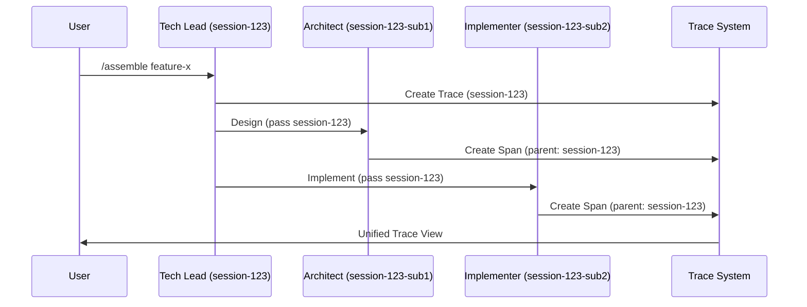

**實作**：
```python
# log_agent_start.py
import os
import json
from datetime import datetime

def log_agent_start(agent_name: str, session_id: str):
    trace_event = {
        "timestamp": datetime.utcnow().isoformat(),
        "event": "agent_start",
        "agent": agent_name,
        "session_id": session_id,
        "parent_session": os.getenv("PARENT_SESSION_ID"),  # 傳遞上層 session
    }

    # 發送到 Langfuse / Helicone / Opik
    send_to_observability_platform(trace_event)
```

### 3.4 Agent Teams Trace 結構

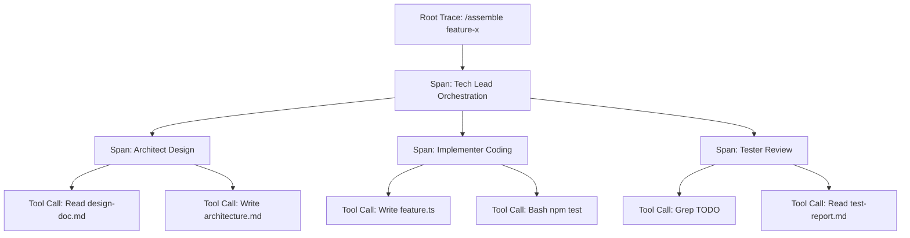

**Trace 層級**：
1. **Root Trace**：整個任務（如 `/assemble feature-x`）
2. **Span (Agent)**：每個 Agent 的執行（如 Architect）
3. **Span (Tool Call)**：每個工具調用（如 Read / Write）

**資料結構**（OpenTelemetry 格式）：
```json
{
  "trace_id": "550e8400-e29b-41d4-a716-446655440000",
  "spans": [
    {
      "span_id": "span-001",
      "name": "Tech Lead Orchestration",
      "parent_span_id": null,
      "attributes": {
        "agent.name": "tech-lead",
        "agent.role": "orchestrator"
      }
    },
    {
      "span_id": "span-002",
      "name": "Architect Design",
      "parent_span_id": "span-001",
      "attributes": {
        "agent.name": "architect",
        "agent.role": "designer",
        "tool_calls": 2
      }
    }
  ]
}
```

### 3.5 參考實作：Multi-Agent Observability (Disler)

GitHub 開源專案：[disler/claude-code-hooks-multi-agent-observability](https://github.com/disler/claude-code-hooks-multi-agent-observability)

**核心實作**：
```python
# multi_agent_trace.py
from langfuse import Langfuse
import os

langfuse = Langfuse(
    public_key=os.getenv("LANGFUSE_PUBLIC_KEY"),
    secret_key=os.getenv("LANGFUSE_SECRET_KEY"),
    host=os.getenv("LANGFUSE_HOST", "http://localhost:3000")
)

def trace_tool_use(tool_name: str, agent_id: str, exit_code: int):
    trace = langfuse.trace(
        name=f"tool_use_{tool_name}",
        metadata={
            "agent_id": agent_id,
            "tool": tool_name,
            "exit_code": exit_code,
            "session_id": os.getenv("SESSION_ID")
        }
    )

    if exit_code != 0:
        trace.event(name="error", metadata={"exit_code": exit_code})

    trace.flush()
```

**配置到 Hooks**：
```json
{
  "hooks": {
    "PostToolUse": [{
      "command": "python multi_agent_trace.py $TOOL_NAME $AGENT_ID $EXIT_CODE",
      "env": {
        "LANGFUSE_PUBLIC_KEY": "pk_xxx",
        "LANGFUSE_SECRET_KEY": "sk_xxx",
        "SESSION_ID": "{{session_id}}"
      }
    }]
  }
}
```

---

## 4. 成本控制策略

### 4.1 Token 優化技術

#### 4.1.1 Prompt 壓縮

**問題**：System prompt 通常 2000-5000 tokens，每次調用都計費。

**解決方案**：Prompt Compression

```python
from langchain.prompts import PromptTemplate
from langchain.llms import Anthropic

# 原始 prompt (3500 tokens)
original_prompt = """
You are a senior software architect with 15 years of experience...
[3000 words of detailed instructions]
"""

# 壓縮後 (800 tokens)
compressed_prompt = """
Role: Senior Architect (15y exp)
Task: Design clean architecture
Rules: DDD, SOLID, 3-layer
Output: Mermaid diagram + ADR
"""

# 節省: (3500 - 800) * $0.003 per 1K tokens = $0.0081 per call
```

**工具**：
- [LLMLingua](https://github.com/microsoft/LLMLingua)：Microsoft 開源，可壓縮 50-70%
- [PromptCompress](https://github.com/rohan-paul/PromptCompress)：GPT-4 輔助壓縮

#### 4.1.2 System Prompt Caching (Anthropic API)

Anthropic 在 2024 Q4 推出 **Prompt Caching**，可將 system prompt 快取 5 分鐘。

```python
import anthropic

client = anthropic.Anthropic(api_key="sk_xxx")

# 第一次調用：完整計費
response1 = client.messages.create(
    model="claude-opus-4-6",
    max_tokens=1024,
    system=[
        {
            "type": "text",
            "text": "You are a senior architect...",  # 3500 tokens
            "cache_control": {"type": "ephemeral"}  # 啟用快取
        }
    ],
    messages=[{"role": "user", "content": "Design a user service"}]
)

# 5 分鐘內的第二次調用：system prompt 只收 10% 費用
response2 = client.messages.create(
    model="claude-opus-4-6",
    max_tokens=1024,
    system=[
        {
            "type": "text",
            "text": "You are a senior architect...",  # 快取命中，僅收 350 tokens
            "cache_control": {"type": "ephemeral"}
        }
    ],
    messages=[{"role": "user", "content": "Design a payment service"}]
)
```

**節省**：快取命中時，input tokens 減少 90%。

#### 4.1.3 Context Window 管理

**問題**：Context 累積導致 token 用量爆炸。

**解決方案**：滾動窗口 + 摘要

```python
class ContextManager:
    def __init__(self, max_tokens=8000):
        self.max_tokens = max_tokens
        self.messages = []

    def add_message(self, role: str, content: str):
        self.messages.append({"role": role, "content": content})

        # 超過上限時，壓縮舊消息
        if self.estimate_tokens() > self.max_tokens:
            self.compress_old_messages()

    def compress_old_messages(self):
        # 保留最近 3 輪對話，舊的用摘要替換
        if len(self.messages) > 6:
            old_messages = self.messages[:-6]
            summary = self.summarize(old_messages)
            self.messages = [
                {"role": "system", "content": f"Previous context: {summary}"}
            ] + self.messages[-6:]
```

---

### 4.2 快取策略（三層架構）

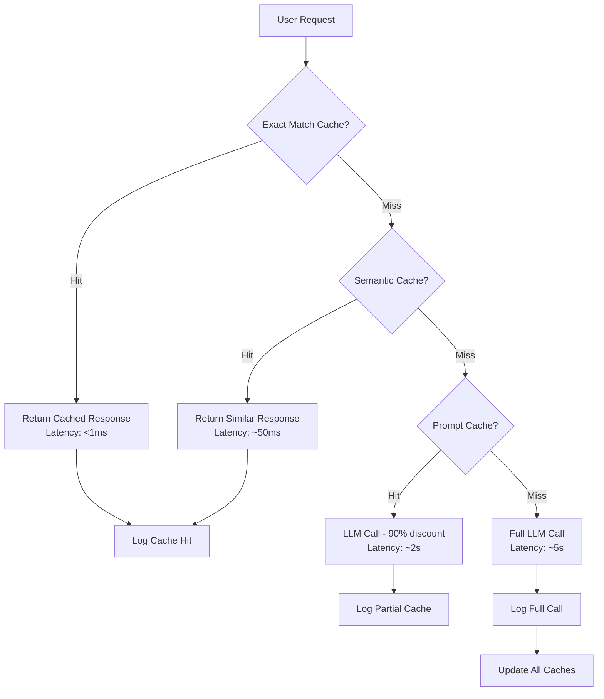

#### 4.2.1 Exact Match Caching

**適用場景**：完全相同的 prompt（如 help 命令、常見問題）

```python
import redis
import hashlib

redis_client = redis.Redis(host='localhost', port=6379, db=0)

def get_cached_response(prompt: str):
    cache_key = hashlib.sha256(prompt.encode()).hexdigest()
    cached = redis_client.get(cache_key)
    if cached:
        return cached.decode()
    return None

def cache_response(prompt: str, response: str, ttl=3600):
    cache_key = hashlib.sha256(prompt.encode()).hexdigest()
    redis_client.setex(cache_key, ttl, response)
```

**節省**：命中率 10-20%，節省 100% LLM 成本。

#### 4.2.2 Semantic Caching

**適用場景**：語義相似的 prompt（如「如何設計用戶服務」vs「用戶服務架構設計」）

```python
from sentence_transformers import SentenceTransformer
import numpy as np

model = SentenceTransformer('all-MiniLM-L6-v2')
embeddings_cache = {}

def semantic_cache_lookup(prompt: str, threshold=0.90):
    prompt_embedding = model.encode(prompt)

    for cached_prompt, cached_response in embeddings_cache.items():
        cached_embedding = model.encode(cached_prompt)
        similarity = np.dot(prompt_embedding, cached_embedding) / (
            np.linalg.norm(prompt_embedding) * np.linalg.norm(cached_embedding)
        )

        if similarity >= threshold:
            return cached_response

    return None
```

**閾值設定**：
- 0.95：極嚴格（僅幾乎完全相同）
- 0.90：嚴格（推薦）
- 0.85：寬鬆（可能誤判）

**節省**：命中率 5-15%，節省 100% LLM 成本。

#### 4.2.3 Prompt Caching (API 層級)

前面已介紹 Anthropic Prompt Caching，這裡補充 Azure Managed Redis 整合。

**Azure Redis + Semantic Cache 實作**：

```python
from azure.identity import DefaultAzureCredential
from azure.keyvault.secrets import SecretClient
import redis

# 從 Key Vault 取得 Redis 連線字串
credential = DefaultAzureCredential()
vault_url = "https://my-vault.vault.azure.net/"
secret_client = SecretClient(vault_url=vault_url, credential=credential)

redis_connection_string = secret_client.get_secret("redis-connection-string").value

redis_client = redis.from_url(redis_connection_string, decode_responses=True)

# 與前面的 semantic cache 整合
def get_or_create_response(prompt: str):
    # 1. Exact match
    exact = get_cached_response(prompt)
    if exact:
        return exact

    # 2. Semantic cache
    semantic = semantic_cache_lookup(prompt)
    if semantic:
        return semantic

    # 3. LLM call with prompt caching
    response = call_llm_with_cache(prompt)

    # 4. Cache the response
    cache_response(prompt, response)

    return response
```

---

### 4.3 Rate Limiting

#### 4.3.1 Token Bucket 演算法

**概念**：每秒補充 N 個 tokens，超過容量時拒絕請求。

```python
import time
from threading import Lock

class TokenBucket:
    def __init__(self, capacity: int, refill_rate: int):
        self.capacity = capacity
        self.tokens = capacity
        self.refill_rate = refill_rate  # tokens per second
        self.last_refill = time.time()
        self.lock = Lock()

    def consume(self, tokens: int) -> bool:
        with self.lock:
            self._refill()
            if self.tokens >= tokens:
                self.tokens -= tokens
                return True
            return False

    def _refill(self):
        now = time.time()
        elapsed = now - self.last_refill
        refill = int(elapsed * self.refill_rate)
        self.tokens = min(self.capacity, self.tokens + refill)
        self.last_refill = now

# 使用
bucket = TokenBucket(capacity=10000, refill_rate=1000)  # 每秒補充 1000 tokens

if bucket.consume(500):
    response = call_llm(prompt)
else:
    raise RateLimitError("Token bucket exhausted")
```

#### 4.3.2 Per-Agent Rate Limiting

**場景**：Implementer Agent 不小心進入無限循環，不斷呼叫 LLM。

**解決方案**：每個 Agent 獨立的 rate limiter。

```python
agent_buckets = {
    "tech-lead": TokenBucket(capacity=5000, refill_rate=500),
    "architect": TokenBucket(capacity=3000, refill_rate=300),
    "implementer": TokenBucket(capacity=10000, refill_rate=1000),
    "tester": TokenBucket(capacity=8000, refill_rate=800),
    "documenter": TokenBucket(capacity=5000, refill_rate=500),
}

def rate_limited_llm_call(agent_id: str, prompt: str):
    estimated_tokens = len(prompt.split()) * 1.3  # 粗估

    if not agent_buckets[agent_id].consume(int(estimated_tokens)):
        raise RateLimitError(f"Agent {agent_id} exceeded rate limit")

    return call_llm(prompt)
```

#### 4.3.3 Circuit Breaker 模式

**概念**：連續失敗後暫停調用，避免浪費成本。

```python
class CircuitBreaker:
    def __init__(self, failure_threshold=5, timeout=60):
        self.failure_threshold = failure_threshold
        self.timeout = timeout
        self.failures = 0
        self.state = "CLOSED"  # CLOSED / OPEN / HALF_OPEN
        self.last_failure_time = None

    def call(self, func, *args, **kwargs):
        if self.state == "OPEN":
            if time.time() - self.last_failure_time > self.timeout:
                self.state = "HALF_OPEN"
            else:
                raise CircuitBreakerOpenError("Circuit is open")

        try:
            result = func(*args, **kwargs)
            self.on_success()
            return result
        except Exception as e:
            self.on_failure()
            raise e

    def on_success(self):
        self.failures = 0
        self.state = "CLOSED"

    def on_failure(self):
        self.failures += 1
        self.last_failure_time = time.time()
        if self.failures >= self.failure_threshold:
            self.state = "OPEN"

# 使用
breaker = CircuitBreaker(failure_threshold=5, timeout=60)

try:
    response = breaker.call(call_llm, prompt)
except CircuitBreakerOpenError:
    # 等待修復，或降級到更便宜的模型
    response = call_cheaper_model(prompt)
```

---

### 4.4 模型分層使用

**策略**：根據任務複雜度選擇模型。

| 任務類型 | 模型 | 成本 (per 1M tokens) | 適用 Agent |
|---------|------|---------------------|-----------|
| **複雜推理** | Opus 4.6 | $15 input / $75 output | Tech Lead, Architect |
| **一般開發** | Sonnet 4.5 | $3 input / $15 output | Implementer, Tester |
| **文件生成** | Sonnet 4.0 | $3 input / $15 output | Documenter |
| **簡單任務** | Haiku 4.0 | $0.25 input / $1.25 output | 資料處理、日誌分析 |

**Agent Army 配置**：

```json
{
  "agents": {
    "tech-lead": {
      "model": "claude-opus-4-6",
      "rationale": "需要高層次推理能力"
    },
    "architect": {
      "model": "claude-opus-4-6",
      "rationale": "系統設計需要深度思考"
    },
    "implementer": {
      "model": "claude-sonnet-4-5",
      "rationale": "編碼任務平衡性能與成本"
    },
    "tester": {
      "model": "claude-sonnet-4-5",
      "rationale": "測試分析需要中等推理"
    },
    "documenter": {
      "model": "claude-sonnet-4-0",
      "rationale": "文件生成不需最新模型"
    }
  }
}
```

**成本影響**：
- 全用 Opus：$15/1M input tokens
- 分層使用：加權平均 ~$7/1M input tokens
- **節省約 50%**

---

### 4.5 成本追蹤實作

#### 4.5.1 MCP Gateway 成本追蹤

**概念**：在 MCP Gateway 層攔截所有 LLM 調用，自動計算成本。

```python
from anthropic import Anthropic
import logging

class CostTrackingGateway:
    def __init__(self):
        self.client = Anthropic(api_key="sk_xxx")
        self.cost_log = []

        self.pricing = {
            "claude-opus-4-6": {"input": 0.015, "output": 0.075},
            "claude-sonnet-4-5": {"input": 0.003, "output": 0.015},
            "claude-haiku-4-0": {"input": 0.00025, "output": 0.00125},
        }

    def create_message(self, model: str, messages: list, **kwargs):
        response = self.client.messages.create(
            model=model,
            messages=messages,
            **kwargs
        )

        # 計算成本
        input_tokens = response.usage.input_tokens
        output_tokens = response.usage.output_tokens

        input_cost = (input_tokens / 1_000_000) * self.pricing[model]["input"]
        output_cost = (output_tokens / 1_000_000) * self.pricing[model]["output"]
        total_cost = input_cost + output_cost

        # 記錄
        self.cost_log.append({
            "model": model,
            "input_tokens": input_tokens,
            "output_tokens": output_tokens,
            "cost": total_cost,
            "timestamp": time.time()
        })

        return response

    def get_total_cost(self):
        return sum(log["cost"] for log in self.cost_log)

gateway = CostTrackingGateway()
```

#### 4.5.2 Helicone Cost Dashboard

**整合**（僅需改 endpoint）：

```python
import anthropic

# 原本
# client = anthropic.Anthropic(api_key="sk_xxx")

# 改用 Helicone Proxy
client = anthropic.Anthropic(
    api_key="sk_xxx",
    base_url="https://anthropic.helicone.ai",
    default_headers={
        "Helicone-Auth": "Bearer sk_helicone_xxx"
    }
)

# 正常使用，Helicone 自動追蹤成本
response = client.messages.create(
    model="claude-sonnet-4-5",
    messages=[{"role": "user", "content": "Hello"}]
)
```

**Dashboard 功能**：
- 即時成本（今日 / 本週 / 本月）
- 按模型分類
- 按 Agent 分類（需在 header 加 `Helicone-User-Id`）
- 成本趨勢圖

#### 4.5.3 自建成本追蹤

**資料庫 Schema**：

```sql
CREATE TABLE llm_calls (
    id SERIAL PRIMARY KEY,
    timestamp TIMESTAMP DEFAULT NOW(),
    agent_id VARCHAR(50),
    model VARCHAR(50),
    input_tokens INT,
    output_tokens INT,
    cost_usd DECIMAL(10, 6),
    session_id VARCHAR(100),
    task_description TEXT
);

CREATE INDEX idx_agent_timestamp ON llm_calls(agent_id, timestamp);
CREATE INDEX idx_session ON llm_calls(session_id);
```

**日報產生**：

```python
import psycopg2
from datetime import datetime, timedelta

def generate_daily_cost_report():
    conn = psycopg2.connect("dbname=observability user=postgres")
    cur = conn.cursor()

    yesterday = datetime.now() - timedelta(days=1)

    cur.execute("""
        SELECT
            agent_id,
            SUM(input_tokens) as total_input,
            SUM(output_tokens) as total_output,
            SUM(cost_usd) as total_cost,
            COUNT(*) as call_count
        FROM llm_calls
        WHERE timestamp >= %s
        GROUP BY agent_id
        ORDER BY total_cost DESC
    """, (yesterday,))

    report = "# Daily Cost Report\n\n"
    report += "| Agent | Input Tokens | Output Tokens | Cost | Calls |\n"
    report += "|-------|--------------|---------------|------|-------|\n"

    for row in cur.fetchall():
        agent_id, input_tok, output_tok, cost, calls = row
        report += f"| {agent_id} | {input_tok:,} | {output_tok:,} | ${cost:.4f} | {calls} |\n"

    cur.close()
    conn.close()

    return report
```

---

## 5. 自我修復模式 (Self-Healing Patterns)

### 5.1 Circuit Breaker 三態機

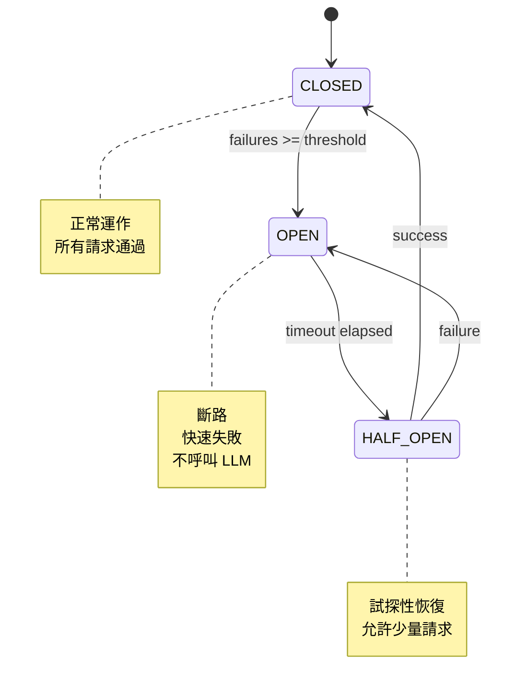

**進階實作**（加上降級策略）：

```python
class AdaptiveCircuitBreaker:
    def __init__(self,
                 failure_threshold=5,
                 timeout=60,
                 fallback_model="claude-haiku-4-0"):
        self.failure_threshold = failure_threshold
        self.timeout = timeout
        self.fallback_model = fallback_model
        self.failures = 0
        self.state = "CLOSED"
        self.last_failure_time = None

    def call(self, model: str, prompt: str):
        if self.state == "OPEN":
            if time.time() - self.last_failure_time > self.timeout:
                self.state = "HALF_OPEN"
                # 試探性恢復：用更便宜的模型測試
                return self._try_fallback(prompt)
            else:
                # 直接降級
                return self._call_fallback(prompt)

        try:
            response = call_llm(model, prompt)
            self.on_success()
            return response
        except Exception as e:
            self.on_failure()
            return self._call_fallback(prompt)

    def _call_fallback(self, prompt: str):
        # 降級到更便宜 / 更穩定的模型
        return call_llm(self.fallback_model, prompt)

    def _try_fallback(self, prompt: str):
        try:
            response = self._call_fallback(prompt)
            self.state = "CLOSED"
            self.failures = 0
            return response
        except Exception:
            self.state = "OPEN"
            raise
```

---

### 5.2 Graph-Based Self-Healing Tool Routing

**論文來源**：*Self-Healing Multi-Agent Systems via Dynamic Tool Graph* (2026)

**核心概念**：Agent 遇到錯誤時，自動重新路由到備用工具。

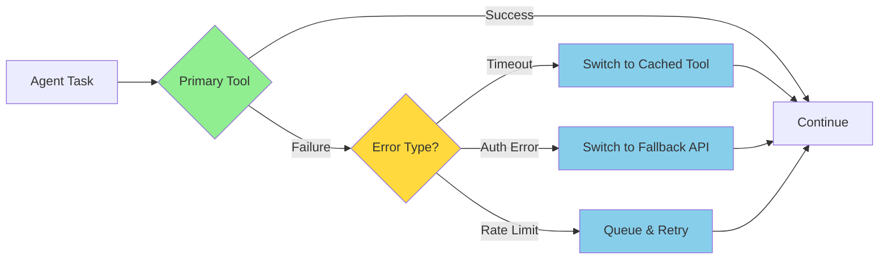

**實作**：

```python
class ToolRouter:
    def __init__(self):
        self.tool_graph = {
            "database_query": {
                "primary": "postgresql_direct",
                "fallback": ["redis_cache", "read_replica"],
                "error_mapping": {
                    "timeout": "redis_cache",
                    "connection_error": "read_replica"
                }
            },
            "llm_call": {
                "primary": "claude-opus-4-6",
                "fallback": ["claude-sonnet-4-5", "claude-haiku-4-0"],
                "error_mapping": {
                    "rate_limit": "claude-sonnet-4-5",
                    "overload": "claude-haiku-4-0"
                }
            }
        }

    def execute(self, tool_name: str, *args, **kwargs):
        tool_config = self.tool_graph[tool_name]
        primary_tool = tool_config["primary"]

        try:
            return self._call_tool(primary_tool, *args, **kwargs)
        except Exception as e:
            error_type = self._classify_error(e)
            fallback_tool = tool_config["error_mapping"].get(error_type)

            if fallback_tool:
                logging.warning(f"Primary tool {primary_tool} failed, routing to {fallback_tool}")
                return self._call_tool(fallback_tool, *args, **kwargs)
            else:
                raise
```

---

### 5.3 Agentic SRE — 分角色自治修復

**概念**：多個 SRE Agent 分工協作，自動診斷與修復。

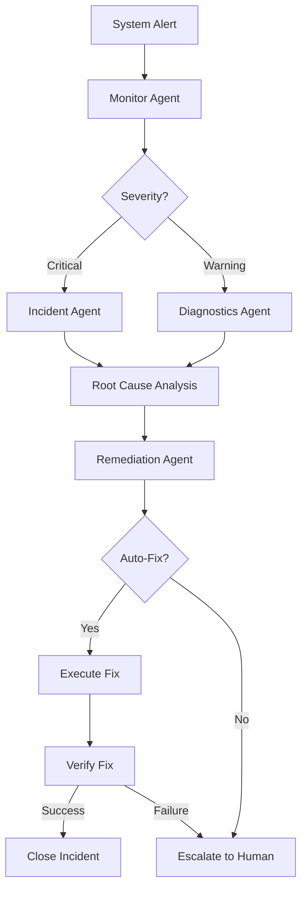

**Agent 角色**：
1. **Monitor Agent**：接收告警，分類嚴重性
2. **Diagnostics Agent**：收集日誌、metrics，初步診斷
3. **Incident Agent**：重大事件協調（critical only）
4. **Remediation Agent**：執行修復動作（重啟服務、擴容、回滾）
5. **Verification Agent**：驗證修復是否成功

**實作框架**：

```python
class SREAgentSystem:
    def __init__(self):
        self.monitor = MonitorAgent()
        self.diagnostics = DiagnosticsAgent()
        self.incident = IncidentAgent()
        self.remediation = RemediationAgent()
        self.verification = VerificationAgent()

    def handle_alert(self, alert: dict):
        severity = self.monitor.classify(alert)

        if severity == "critical":
            incident_id = self.incident.create(alert)
            diagnosis = self.diagnostics.analyze(alert)
            fix = self.remediation.suggest_fix(diagnosis)

            if fix.is_auto_fixable():
                self.remediation.execute(fix)
                success = self.verification.verify(fix)

                if success:
                    self.incident.close(incident_id)
                else:
                    self.incident.escalate_to_human(incident_id)
            else:
                self.incident.escalate_to_human(incident_id)
```

---

### 5.4 Autonomous Peer Recovery

**論文來源**：*Autonomous Agent Peer Recovery in Distributed Systems* (2026-02-21)

**核心概念**：Agent A 檢測到 Agent B 失敗，自動接管 B 的任務。

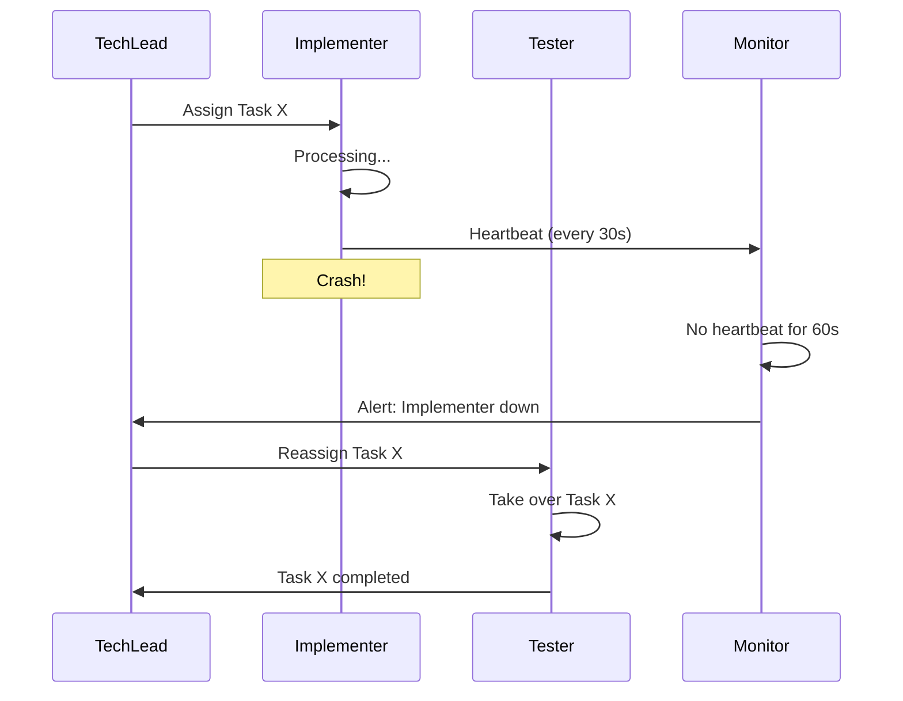

**實作**：

```python
class PeerRecoverySystem:
    def __init__(self):
        self.heartbeats = {}
        self.task_assignments = {}

    def register_heartbeat(self, agent_id: str):
        self.heartbeats[agent_id] = time.time()

    def check_health(self):
        now = time.time()
        for agent_id, last_heartbeat in self.heartbeats.items():
            if now - last_heartbeat > 60:  # 60s timeout
                self.trigger_recovery(agent_id)

    def trigger_recovery(self, failed_agent: str):
        # 找到該 agent 的未完成任務
        tasks = self.task_assignments.get(failed_agent, [])

        # 重新分配給備用 agent
        for task in tasks:
            backup_agent = self.find_backup_agent(failed_agent)
            self.reassign_task(task, backup_agent)
            logging.warning(f"Task {task} reassigned from {failed_agent} to {backup_agent}")

    def find_backup_agent(self, failed_agent: str):
        # 根據角色找備用 agent
        role = self.get_agent_role(failed_agent)
        available_agents = self.get_agents_by_role(role)
        return available_agents[0]  # 簡化版，實際需要負載平衡
```

---

### 5.5 Data Pipeline Self-Healing

**場景**：資料處理 pipeline 中某個 stage 失敗，自動重試 + 降級。

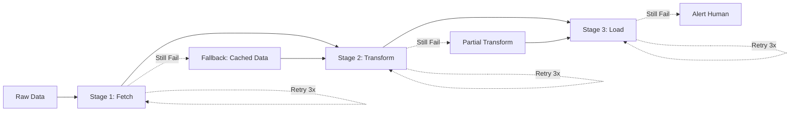

**實作**：

```python
from tenacity import retry, stop_after_attempt, wait_exponential

class SelfHealingPipeline:
    @retry(stop=stop_after_attempt(3), wait=wait_exponential(multiplier=1, min=2, max=10))
    def stage_fetch(self, source: str):
        try:
            return fetch_from_api(source)
        except Exception as e:
            logging.error(f"Fetch failed: {e}")
            # 降級：使用快取資料
            return self.fetch_from_cache(source)

    @retry(stop=stop_after_attempt(3), wait=wait_exponential(multiplier=1, min=2, max=10))
    def stage_transform(self, data: dict):
        try:
            return full_transform(data)
        except Exception as e:
            logging.error(f"Transform failed: {e}")
            # 降級：部分轉換
            return partial_transform(data)

    @retry(stop=stop_after_attempt(3), wait=wait_exponential(multiplier=1, min=2, max=10))
    def stage_load(self, data: dict):
        try:
            return load_to_database(data)
        except Exception as e:
            logging.error(f"Load failed: {e}")
            # 無法降級，告警人類
            send_alert("Pipeline load stage failed", severity="high")
            raise
```

---

## 6. 監控指標與儀表板設計

### 6.1 核心指標 (DORA-like for AI)

**DORA Metrics** (DevOps Research and Assessment) 是軟體交付的四大指標，我們將其改編為 AI Agent 系統。

| 傳統 DORA | AI Agent 版本 | 定義 | 目標 |
|-----------|--------------|------|------|
| **Deployment Frequency** | **Task Completion Rate** | 成功完成的任務 / 總任務 | ≥ 90% |
| **Lead Time for Changes** | **Mean Time to Completion** | 從任務分配到完成的平均時間 | < 10 分鐘 |
| **Change Failure Rate** | **Agent Error Rate** | 錯誤的 agent 調用 / 總調用 | < 5% |
| **Mean Time to Recovery** | **Mean Time to Recovery** | 從錯誤到修復的平均時間 | < 5 分鐘 |

**額外指標**：

| 指標 | 定義 | 目標 |
|------|------|------|
| **Token Usage per Task** | 每個任務平均消耗的 tokens | < 50K tokens |
| **Cost per Feature** | 每個 feature 的平均成本 | < $0.50 |
| **Tool Call Success Rate** | 成功的工具調用 / 總工具調用 | ≥ 95% |
| **Cache Hit Rate** | 快取命中次數 / 總請求 | ≥ 30% |
| **Agent Utilization** | Agent 忙碌時間 / 總時間 | 60-80% (平衡) |

---

### 6.2 儀表板設計

#### 6.2.1 即時總覽 Dashboard

```
┌─────────────────────────────────────────────────────────────┐
│ Agent Army - Real-time Overview                            │
├─────────────────────────────────────────────────────────────┤
│                                                             │
│  Active Agents: 5/5        Active Tasks: 3                 │
│  Total Cost Today: $12.45  Avg Task Time: 8m 32s          │
│                                                             │
├─────────────────────────────────────────────────────────────┤
│ Agent Status                                                │
├─────────────────────────────────────────────────────────────┤
│  ● Tech Lead       IDLE       Last task: 2m ago            │
│  ● Architect       WORKING    Task: Design payment service │
│  ● Implementer     WORKING    Task: Code user-repo         │
│  ● Tester          IDLE       Last task: 15m ago           │
│  ● Documenter      WORKING    Task: Write API docs         │
├─────────────────────────────────────────────────────────────┤
│ Recent Alerts                                               │
├─────────────────────────────────────────────────────────────┤
│  ⚠️  Implementer: High token usage (15K in 5m)             │
│  ✅  Tester: Code review completed                          │
└─────────────────────────────────────────────────────────────┘
```

**實作 (Streamlit)**：

```python
import streamlit as st
import time

st.set_page_config(page_title="Agent Army Monitor", layout="wide")

st.title("Agent Army - Real-time Overview")

col1, col2, col3, col4 = st.columns(4)
col1.metric("Active Agents", "5/5")
col2.metric("Active Tasks", "3")
col3.metric("Total Cost Today", "$12.45", delta="+$2.10")
col4.metric("Avg Task Time", "8m 32s", delta="-1m 15s")

st.header("Agent Status")
agent_status = get_agent_status()  # 從 DB 查詢

for agent in agent_status:
    status_icon = "🟢" if agent["status"] == "WORKING" else "⚪"
    st.write(f"{status_icon} **{agent['name']}** - {agent['status']} - {agent['current_task']}")

st.header("Recent Alerts")
alerts = get_recent_alerts()
for alert in alerts:
    if alert["severity"] == "warning":
        st.warning(f"⚠️ {alert['message']}")
    else:
        st.success(f"✅ {alert['message']}")
```

---

#### 6.2.2 成本趨勢 Dashboard

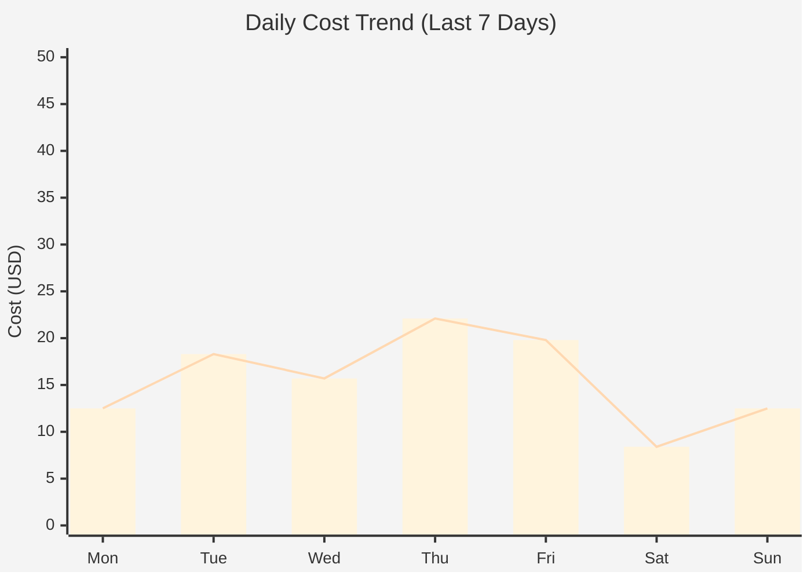

**按 Agent 分類**：

| Agent | Today | This Week | This Month | % of Total |
|-------|-------|-----------|------------|------------|
| Tech Lead | $2.50 | $15.80 | $62.30 | 25% |
| Architect | $3.20 | $18.90 | $78.40 | 32% |
| Implementer | $4.50 | $28.50 | $105.60 | 43% |
| Tester | $1.80 | $12.30 | $48.20 | 20% |
| Documenter | $0.45 | $3.50 | $15.50 | 6% |

**實作 (Plotly)**：

```python
import plotly.express as px
import pandas as pd

# 查詢每日成本
df = pd.read_sql("""
    SELECT
        DATE(timestamp) as date,
        agent_id,
        SUM(cost_usd) as cost
    FROM llm_calls
    WHERE timestamp >= NOW() - INTERVAL '7 days'
    GROUP BY DATE(timestamp), agent_id
""", conn)

fig = px.bar(df, x="date", y="cost", color="agent_id",
             title="Daily Cost by Agent",
             labels={"cost": "Cost (USD)", "date": "Date"})
fig.show()
```

---

#### 6.2.3 錯誤分析 Dashboard

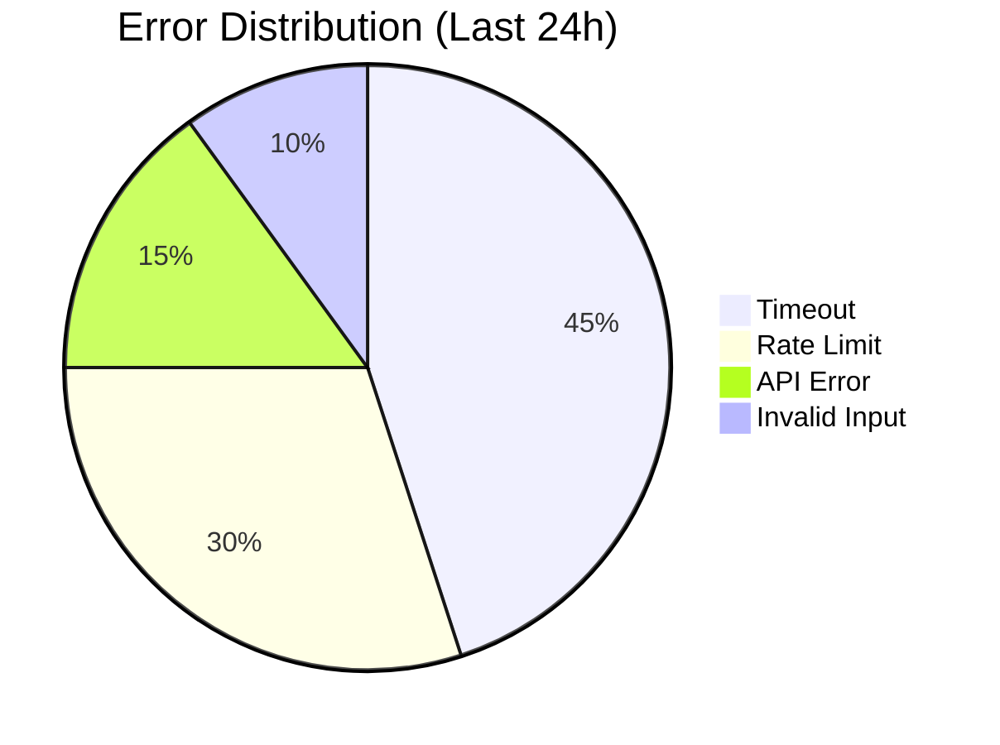

**根因分析表**：

| Error Type | Count | Root Cause | Mitigation |
|------------|-------|------------|------------|
| Timeout | 45 | LLM API 負載高 | 增加 timeout, 使用 cache |
| Rate Limit | 30 | Implementer 無限循環 | 加上 per-agent rate limit |
| API Error | 15 | Anthropic API 暫時性故障 | Circuit Breaker |
| Invalid Input | 10 | 前置驗證不足 | 加強 input validation |

---

#### 6.2.4 效能分佈 Dashboard

**Latency Percentiles**：

```
p50 (median):  2.3s
p95:           5.8s
p99:           12.1s
p99.9:         25.4s
```

**Heatmap (Tool Call Latency)**：

```
         Read   Write  Bash   Grep   LLM
Tech     0.1s   0.2s   1.5s   0.3s   3.2s
Arch     0.1s   0.3s   0.8s   0.2s   4.1s
Impl     0.2s   0.5s   2.1s   0.4s   2.8s
Test     0.1s   0.2s   1.8s   0.5s   3.5s
Doc      0.1s   0.4s   0.5s   0.2s   2.1s
```

---

### 6.3 告警策略

#### 6.3.1 告警規則

| 告警名稱 | 條件 | 嚴重性 | 通知方式 |
|---------|------|--------|---------|
| **Token Usage Spike** | 5 分鐘內消耗 > 50K tokens | Warning | Slack |
| **Error Rate High** | 錯誤率 > 10% (持續 5 分鐘) | Critical | Slack + PagerDuty |
| **Agent Stuck** | 單一任務執行 > 30 分鐘 | Warning | Slack |
| **Cost Threshold** | 日成本 > $50 | Critical | Email + Slack |
| **Cache Hit Rate Low** | 快取命中率 < 20% | Info | Email |
| **LLM API Down** | 連續 3 次調用失敗 | Critical | Slack + PagerDuty |

#### 6.3.2 Slack Webhook 整合

```python
import requests
import json

def send_slack_alert(message: str, severity: str = "warning"):
    webhook_url = "https://hooks.slack.com/services/YOUR/WEBHOOK/URL"

    color = {
        "info": "#36a64f",
        "warning": "#ff9800",
        "critical": "#f44336"
    }.get(severity, "#808080")

    payload = {
        "attachments": [{
            "color": color,
            "title": f"Agent Army Alert - {severity.upper()}",
            "text": message,
            "footer": "Agent Observability System",
            "ts": int(time.time())
        }]
    }

    requests.post(webhook_url, json=payload)

# 使用
send_slack_alert("Implementer consumed 60K tokens in 5 minutes", severity="warning")
```

#### 6.3.3 告警抑制 (Alert Suppression)

**問題**：同一問題短時間內觸發多次告警，造成告警疲勞。

**解決方案**：去重 + 合併

```python
class AlertManager:
    def __init__(self):
        self.recent_alerts = {}
        self.suppression_window = 300  # 5 分鐘

    def send_alert(self, alert_key: str, message: str, severity: str):
        now = time.time()

        # 檢查是否在抑制窗口內
        if alert_key in self.recent_alerts:
            last_sent = self.recent_alerts[alert_key]
            if now - last_sent < self.suppression_window:
                logging.info(f"Alert {alert_key} suppressed (within {self.suppression_window}s)")
                return

        # 發送告警
        send_slack_alert(message, severity)
        self.recent_alerts[alert_key] = now

alert_mgr = AlertManager()
alert_mgr.send_alert("implementer_high_token", "Implementer high token usage", "warning")
```

---

## 7. 實作指南：Agent Army 整合

### 7.1 Step 1: Hooks 事件收集

**目標**：收集所有 Tool Use 事件並記錄到資料庫。

**檔案結構**：

```
.claude/
├── settings.json
└── hooks/
    ├── log_tool_use.py
    ├── log_agent_lifecycle.py
    └── requirements.txt
```

**settings.json**：

```json
{
  "hooks": {
    "PreToolUse": [{
      "command": "python .claude/hooks/log_tool_use.py pre $TOOL_NAME $AGENT_ID",
      "timeout": 5000
    }],
    "PostToolUse": [{
      "command": "python .claude/hooks/log_tool_use.py post $TOOL_NAME $AGENT_ID $EXIT_CODE",
      "timeout": 5000
    }],
    "SubagentStart": [{
      "command": "python .claude/hooks/log_agent_lifecycle.py start $SUBAGENT_NAME $SESSION_ID",
      "timeout": 3000
    }],
    "SubagentStop": [{
      "command": "python .claude/hooks/log_agent_lifecycle.py stop $SUBAGENT_NAME $SESSION_ID $EXIT_CODE",
      "timeout": 3000
    }]
  }
}
```

**log_tool_use.py**：

```python
#!/usr/bin/env python3
import sys
import psycopg2
from datetime import datetime
import os

def log_tool_use(phase: str, tool_name: str, agent_id: str, exit_code: int = None):
    conn = psycopg2.connect(
        dbname=os.getenv("DB_NAME", "observability"),
        user=os.getenv("DB_USER", "postgres"),
        password=os.getenv("DB_PASSWORD"),
        host=os.getenv("DB_HOST", "localhost")
    )
    cur = conn.cursor()

    cur.execute("""
        INSERT INTO tool_events (timestamp, phase, tool_name, agent_id, exit_code, session_id)
        VALUES (%s, %s, %s, %s, %s, %s)
    """, (
        datetime.utcnow(),
        phase,
        tool_name,
        agent_id,
        exit_code,
        os.getenv("CLAUDE_SESSION_ID", "unknown")
    ))

    conn.commit()
    cur.close()
    conn.close()

if __name__ == "__main__":
    phase = sys.argv[1]  # pre / post
    tool_name = sys.argv[2]
    agent_id = sys.argv[3]
    exit_code = int(sys.argv[4]) if len(sys.argv) > 4 else None

    log_tool_use(phase, tool_name, agent_id, exit_code)
```

**資料庫 Schema**：

```sql
CREATE TABLE tool_events (
    id SERIAL PRIMARY KEY,
    timestamp TIMESTAMP,
    phase VARCHAR(10),  -- pre / post
    tool_name VARCHAR(50),
    agent_id VARCHAR(50),
    exit_code INT,
    session_id VARCHAR(100)
);

CREATE INDEX idx_session ON tool_events(session_id);
CREATE INDEX idx_agent_time ON tool_events(agent_id, timestamp);
```

---

### 7.2 Step 2: Langfuse 整合（自託管）

**部署 Langfuse**：

```yaml
# docker-compose.yml
version: '3.8'

services:
  langfuse:
    image: langfuse/langfuse:latest
    ports:
      - "3000:3000"
    environment:
      DATABASE_URL: postgresql://postgres:password@db:5432/langfuse
      NEXTAUTH_URL: http://localhost:3000
      NEXTAUTH_SECRET: your-secret-key
    depends_on:
      - db

  db:
    image: postgres:15
    environment:
      POSTGRES_USER: postgres
      POSTGRES_PASSWORD: password
      POSTGRES_DB: langfuse
    volumes:
      - langfuse_data:/var/lib/postgresql/data

volumes:
  langfuse_data:
```

```bash
docker-compose up -d
```

**Python SDK 整合**：

```python
from langfuse import Langfuse
import os

langfuse = Langfuse(
    public_key=os.getenv("LANGFUSE_PUBLIC_KEY"),
    secret_key=os.getenv("LANGFUSE_SECRET_KEY"),
    host="http://localhost:3000"
)

def traced_llm_call(agent_id: str, prompt: str, model: str):
    trace = langfuse.trace(
        name="agent_task",
        metadata={
            "agent_id": agent_id,
            "model": model
        }
    )

    generation = trace.generation(
        name="llm_call",
        model=model,
        model_parameters={"temperature": 0.7},
        input=prompt
    )

    # 實際 LLM 調用
    response = call_llm(model, prompt)

    generation.end(
        output=response.content,
        usage={
            "input_tokens": response.usage.input_tokens,
            "output_tokens": response.usage.output_tokens
        }
    )

    trace.update(
        output=response.content
    )

    return response
```

**整合到 Agent Army**：

```python
# .claude/agents/implementer/agent.py
from langfuse_integration import traced_llm_call

def implement_feature(feature_description: str):
    response = traced_llm_call(
        agent_id="implementer",
        prompt=f"Implement the following feature: {feature_description}",
        model="claude-sonnet-4-5"
    )
    return response.content
```

---

### 7.3 Step 3: 成本追蹤 Dashboard

**Flask 後端**：

```python
from flask import Flask, jsonify
import psycopg2

app = Flask(__name__)

@app.route('/api/cost/daily')
def get_daily_cost():
    conn = psycopg2.connect("dbname=observability user=postgres")
    cur = conn.cursor()

    cur.execute("""
        SELECT
            DATE(timestamp) as date,
            agent_id,
            SUM(cost_usd) as cost
        FROM llm_calls
        WHERE timestamp >= NOW() - INTERVAL '30 days'
        GROUP BY DATE(timestamp), agent_id
        ORDER BY date
    """)

    result = []
    for row in cur.fetchall():
        result.append({
            "date": row[0].isoformat(),
            "agent": row[1],
            "cost": float(row[2])
        })

    return jsonify(result)

@app.route('/api/cost/summary')
def get_cost_summary():
    conn = psycopg2.connect("dbname=observability user=postgres")
    cur = conn.cursor()

    cur.execute("""
        SELECT
            SUM(CASE WHEN timestamp >= CURRENT_DATE THEN cost_usd ELSE 0 END) as today,
            SUM(CASE WHEN timestamp >= CURRENT_DATE - INTERVAL '7 days' THEN cost_usd ELSE 0 END) as week,
            SUM(CASE WHEN timestamp >= CURRENT_DATE - INTERVAL '30 days' THEN cost_usd ELSE 0 END) as month
        FROM llm_calls
    """)

    row = cur.fetchone()
    return jsonify({
        "today": float(row[0] or 0),
        "this_week": float(row[1] or 0),
        "this_month": float(row[2] or 0)
    })

if __name__ == '__main__':
    app.run(port=5000)
```

**React 前端**：

```jsx
import React, { useEffect, useState } from 'react';
import { LineChart, Line, XAxis, YAxis, CartesianGrid, Tooltip, Legend } from 'recharts';

function CostDashboard() {
  const [data, setData] = useState([]);
  const [summary, setSummary] = useState({});

  useEffect(() => {
    fetch('/api/cost/daily')
      .then(res => res.json())
      .then(setData);

    fetch('/api/cost/summary')
      .then(res => res.json())
      .then(setSummary);
  }, []);

  return (
    <div>
      <h1>Agent Army Cost Dashboard</h1>

      <div className="summary">
        <div>Today: ${summary.today?.toFixed(2)}</div>
        <div>This Week: ${summary.this_week?.toFixed(2)}</div>
        <div>This Month: ${summary.this_month?.toFixed(2)}</div>
      </div>

      <LineChart width={800} height={400} data={data}>
        <CartesianGrid strokeDasharray="3 3" />
        <XAxis dataKey="date" />
        <YAxis />
        <Tooltip />
        <Legend />
        <Line type="monotone" dataKey="cost" stroke="#8884d8" />
      </LineChart>
    </div>
  );
}

export default CostDashboard;
```

---

### 7.4 Step 4: 告警設定

**監控腳本 (monitor.py)**：

```python
import psycopg2
import time
from datetime import datetime, timedelta

def check_high_token_usage():
    conn = psycopg2.connect("dbname=observability user=postgres")
    cur = conn.cursor()

    # 檢查過去 5 分鐘內每個 agent 的 token 使用量
    cur.execute("""
        SELECT
            agent_id,
            SUM(input_tokens + output_tokens) as total_tokens
        FROM llm_calls
        WHERE timestamp >= NOW() - INTERVAL '5 minutes'
        GROUP BY agent_id
        HAVING SUM(input_tokens + output_tokens) > 50000
    """)

    for row in cur.fetchall():
        agent_id, total_tokens = row
        send_slack_alert(
            f"⚠️ {agent_id} consumed {total_tokens:,} tokens in 5 minutes",
            severity="warning"
        )

    cur.close()
    conn.close()

def check_error_rate():
    conn = psycopg2.connect("dbname=observability user=postgres")
    cur = conn.cursor()

    cur.execute("""
        SELECT
            agent_id,
            COUNT(*) as total_calls,
            SUM(CASE WHEN exit_code != 0 THEN 1 ELSE 0 END) as errors
        FROM tool_events
        WHERE timestamp >= NOW() - INTERVAL '5 minutes'
        AND phase = 'post'
        GROUP BY agent_id
    """)

    for row in cur.fetchall():
        agent_id, total, errors = row
        error_rate = errors / total if total > 0 else 0

        if error_rate > 0.1:  # 10% 錯誤率
            send_slack_alert(
                f"🚨 {agent_id} error rate: {error_rate*100:.1f}% ({errors}/{total} calls)",
                severity="critical"
            )

    cur.close()
    conn.close()

def check_stuck_agents():
    conn = psycopg2.connect("dbname=observability user=postgres")
    cur = conn.cursor()

    # 檢查是否有 agent 執行超過 30 分鐘
    cur.execute("""
        SELECT
            agent_id,
            MIN(timestamp) as start_time
        FROM tool_events
        WHERE phase = 'pre'
        AND timestamp >= NOW() - INTERVAL '30 minutes'
        GROUP BY agent_id, session_id
        HAVING MIN(timestamp) < NOW() - INTERVAL '30 minutes'
    """)

    for row in cur.fetchall():
        agent_id, start_time = row
        send_slack_alert(
            f"⏰ {agent_id} has been working for over 30 minutes (started at {start_time})",
            severity="warning"
        )

    cur.close()
    conn.close()

# 每分鐘執行一次
while True:
    try:
        check_high_token_usage()
        check_error_rate()
        check_stuck_agents()
    except Exception as e:
        print(f"Monitor error: {e}")

    time.sleep(60)
```

**執行監控**：

```bash
# 背景執行
nohup python monitor.py > monitor.log 2>&1 &
```

---

### 7.5 完整架構圖

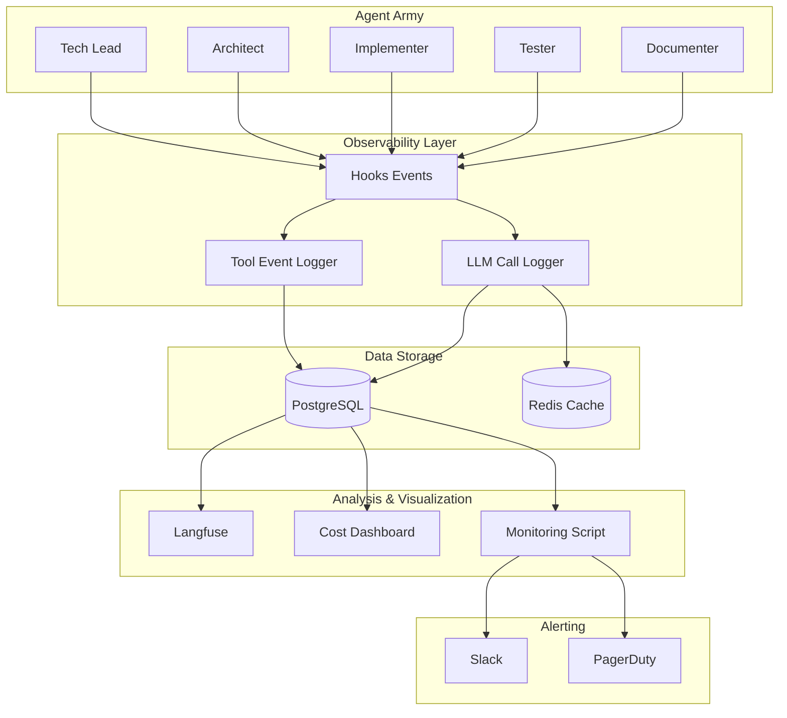

---

## 8. 評估框架

### 8.1 品質評估

**Reasoning Coherence (推理連貫性)**：

```python
def evaluate_reasoning_coherence(agent_output: str) -> float:
    """
    評估 agent 的推理是否連貫
    使用 LLM-as-a-Judge 模式
    """
    judge_prompt = f"""
    Evaluate the reasoning coherence of the following agent output.
    Rate from 0.0 (incoherent) to 1.0 (perfectly coherent).

    Agent Output:
    {agent_output}

    Provide only a numerical score.
    """

    response = call_llm("claude-opus-4-6", judge_prompt)
    score = float(response.content.strip())
    return score
```

**Tool Selection Accuracy (工具選擇準確度)**：

```python
def evaluate_tool_selection(task: str, selected_tool: str, expected_tool: str) -> float:
    """
    評估 agent 是否選擇了正確的工具
    """
    if selected_tool == expected_tool:
        return 1.0

    # 使用語義相似度評估（如 Read vs Grep 可能都合理）
    similarity = calculate_semantic_similarity(selected_tool, expected_tool)
    return similarity
```

**Task Completion Success Rate**：

```python
def calculate_task_completion_rate():
    conn = psycopg2.connect("dbname=observability user=postgres")
    cur = conn.cursor()

    cur.execute("""
        SELECT
            COUNT(*) as total_tasks,
            SUM(CASE WHEN status = 'completed' THEN 1 ELSE 0 END) as completed
        FROM tasks
        WHERE created_at >= NOW() - INTERVAL '7 days'
    """)

    row = cur.fetchone()
    total, completed = row

    return completed / total if total > 0 else 0
```

---

### 8.2 效能評估

**Latency (延遲)**：

| Metric | Target | Formula |
|--------|--------|---------|
| p50 | < 3s | 中位數 |
| p95 | < 10s | 95% 的請求 |
| p99 | < 20s | 99% 的請求 |

**Throughput (吞吐量)**：

```python
def calculate_throughput():
    conn = psycopg2.connect("dbname=observability user=postgres")
    cur = conn.cursor()

    cur.execute("""
        SELECT
            DATE_TRUNC('hour', timestamp) as hour,
            COUNT(*) as tasks_completed
        FROM tasks
        WHERE status = 'completed'
        AND created_at >= NOW() - INTERVAL '24 hours'
        GROUP BY hour
        ORDER BY hour
    """)

    results = cur.fetchall()
    avg_throughput = sum(r[1] for r in results) / len(results) if results else 0

    return avg_throughput  # tasks per hour
```

**Resource Utilization (資源利用率)**：

| Resource | Metric | Target |
|----------|--------|--------|
| CPU | Agent 處理時間 / 總時間 | 60-80% |
| Memory | Peak memory usage | < 2GB per agent |
| Tokens | Tokens per task | < 50K |
| Cost | Cost per feature | < $0.50 |

---

### 8.3 責任評估 (Responsible AI)

**Safety (安全性)**：

```python
def evaluate_safety(agent_output: str) -> dict:
    """
    評估 agent 輸出是否安全（不含惡意程式碼）
    """
    safety_checks = {
        "no_malicious_code": not contains_malicious_patterns(agent_output),
        "no_secrets_leaked": not contains_secrets(agent_output),
        "no_sql_injection": not contains_sql_injection(agent_output),
    }

    return {
        "safe": all(safety_checks.values()),
        "details": safety_checks
    }
```

**Toxicity (毒性)**：

```python
from detoxify import Detoxify

def evaluate_toxicity(text: str) -> float:
    model = Detoxify('original')
    results = model.predict(text)
    return results['toxicity']  # 0.0 - 1.0
```

**Bias Mitigation (偏見緩解)**：

```python
def evaluate_bias(agent_output: str, protected_attributes: list) -> dict:
    """
    評估 agent 是否對特定屬性有偏見
    protected_attributes: ['gender', 'race', 'age', ...]
    """
    bias_scores = {}

    for attribute in protected_attributes:
        # 使用預訓練的 bias 檢測模型
        score = detect_bias_for_attribute(agent_output, attribute)
        bias_scores[attribute] = score

    return bias_scores
```

**Hallucination Detection (幻覺檢測)**：

```python
def detect_hallucination(agent_output: str, ground_truth: str) -> float:
    """
    使用 NLI (Natural Language Inference) 檢測幻覺
    """
    from transformers import pipeline

    nli = pipeline("text-classification", model="microsoft/deberta-large-mnli")

    result = nli(f"{ground_truth} [SEP] {agent_output}")

    # entailment (正確) / neutral / contradiction (幻覺)
    if result[0]['label'] == 'CONTRADICTION':
        return 1.0  # 確定是幻覺
    elif result[0]['label'] == 'ENTAILMENT':
        return 0.0  # 正確
    else:
        return 0.5  # 無法確定
```

---

### 8.4 企業採用路線圖

```mermaid
timeline
    title Enterprise AI Agent Observability Adoption Roadmap
    section Phase 1: Foundation (Month 1-2)
        日誌收集 : Hooks 事件追蹤
                 : 基礎資料庫建立
        成本追蹤 : Token 計數
                 : 簡易成本儀表板
    section Phase 2: Monitoring (Month 3-4)
        指標建立 : DORA-like metrics
                 : 效能分佈
        儀表板 : Real-time overview
               : Cost trend dashboard
    section Phase 3: Automation (Month 5-6)
        告警系統 : Slack integration
                 : Threshold 設定
        自動修復 : Circuit Breaker
                 : Rate Limiting
    section Phase 4: Intelligence (Month 7+)
        預測分析 : 成本預測
                 : 異常偵測
        自治運營 : Self-Healing
                 : Autonomous Recovery
```

**Phase 1: Foundation (1-2 個月)**
- ✅ 部署 Langfuse / Helicone
- ✅ 配置 Hooks 事件收集
- ✅ 建立基礎資料庫 schema
- ✅ 開始追蹤 token 使用量

**Phase 2: Monitoring (3-4 個月)**
- ✅ 建立核心指標（Task Completion Rate, Error Rate）
- ✅ 部署即時儀表板
- ✅ 成本趨勢分析
- ✅ 效能分佈圖表

**Phase 3: Automation (5-6 個月)**
- ✅ 告警系統上線（Slack / PagerDuty）
- ✅ 實作 Circuit Breaker
- ✅ Per-agent Rate Limiting
- ✅ 自動成本報告

**Phase 4: Intelligence (7 個月+)**
- ✅ 預測性成本分析（機器學習模型）
- ✅ 異常偵測（Anomaly Detection）
- ✅ Self-Healing Agents
- ✅ 全自治運營（Autonomous SRE）

---

## 9. 參考資源

### 9.1 可觀測性平台

| 平台 | 類型 | 網址 |
|------|------|------|
| **Langfuse** | 開源 | https://langfuse.com |
| **Helicone** | 商業 | https://helicone.ai |
| **Braintrust** | 商業 | https://braintrust.dev |
| **Datadog LLM Obs** | 商業 | https://datadoghq.com/llm-observability |
| **Opik** | 商業 | https://comet.com/opik |
| **LangSmith** | 商業 | https://smith.langchain.com |
| **Phoenix (Arize)** | 開源 | https://github.com/Arize-ai/phoenix |
| **PromptLayer** | 商業 | https://promptlayer.com |

---

### 9.2 開源專案

| 專案 | 描述 | GitHub |
|------|------|--------|
| **Claude Code Hooks Multi-Agent Observability** | Disler 的 Agent Teams 追蹤實作 | [disler/claude-code-hooks-multi-agent-observability](https://github.com/disler/claude-code-hooks-multi-agent-observability) |
| **LLMLingua** | Microsoft 的 prompt 壓縮工具 | [microsoft/LLMLingua](https://github.com/microsoft/LLMLingua) |
| **OpenTelemetry for LLMs** | LLM 可觀測性標準 | [open-telemetry/opentelemetry-python](https://github.com/open-telemetry/opentelemetry-python) |
| **Detoxify** | 文字毒性檢測 | [unitaryai/detoxify](https://github.com/unitaryai/detoxify) |
| **Phoenix (Arize AI)** | 開源 LLM 可觀測性平台 | [Arize-ai/phoenix](https://github.com/Arize-ai/phoenix) |

---

### 9.3 學術論文

| 論文 | 年份 | 主題 |
|------|------|------|
| *Self-Healing Multi-Agent Systems via Dynamic Tool Graph* | 2026 | Graph-based tool routing |
| *Autonomous Agent Peer Recovery in Distributed Systems* | 2026-02 | Peer recovery patterns |
| *LLM-as-a-Judge: Evaluating AI Agent Reasoning* | 2025 | 評估框架 |
| *Semantic Caching for Large Language Models* | 2025 | Semantic cache 演算法 |
| *OpenTelemetry for LLM Observability* | 2024 | 可觀測性標準 |

---

### 9.4 工具比較速查表

**適用場景快速查詢**：

| 我想要... | 推薦方案 | 原因 |
|----------|---------|------|
| **5 分鐘內上線** | Helicone | Proxy 模式，零程式碼改動 |
| **完全免費 + 自託管** | Langfuse | 開源 MIT License |
| **Claude Code 原生整合** | Opik Plugin | 自動 instrumentation |
| **企業級合規** | Datadog / Braintrust | 已通過 SOC2 / GDPR |
| **最強評估框架** | Braintrust | Evals as Code |
| **成本追蹤優先** | Helicone | 即時成本儀表板 |
| **Multi-Agent Tracing** | Langfuse / Opik | OpenTelemetry 支援 |
| **自建客製化** | Langfuse (自託管) + 自建 Dashboard | 完全控制 |

---

### 9.5 延伸閱讀

1. **Gartner Report**: *Predicts 2026: AI Agents Will Transform Enterprise Software* (2025-11)
2. **Anthropic Docs**: *Prompt Caching* — https://docs.anthropic.com/claude/docs/prompt-caching
3. **OpenTelemetry Semantic Conventions for LLMs** — https://opentelemetry.io/docs/specs/semconv/gen-ai/
4. **Helicone Blog**: *How to Reduce LLM Costs by 70% with Caching* (2025-08)
5. **Langfuse Cookbook**: *Multi-Agent Tracing Best Practices* — https://langfuse.com/docs/tracing/multi-agent

---

## 總結

AI Agent 可觀測性不是奢侈品，而是多 Agent 系統的**生存必需品**。

當你的系統從單一 Agent 擴展到 5-10 個協作 Agents 時，沒有可觀測性就像在黑夜中開車——你不知道：
- 💸 錢花在哪裡（成本失控）
- 🐛 錯誤在哪個環節（除錯困難）
- ⏱️ 為什麼這麼慢（效能瓶頸）
- 🔄 哪些 Agent 在互相依賴（依賴關係）

**本指南的核心要點**：

1. **選對平台**：Langfuse (自託管免費) / Helicone (快速上線) / Opik (Claude Code 原生)
2. **追蹤成本**：三層快取 (Exact + Semantic + Prompt) + 模型分層使用 → 節省 50-70%
3. **監控指標**：DORA-like metrics (Task Completion, Error Rate, MTTR) + 告警
4. **自動修復**：Circuit Breaker + Rate Limiting + Self-Healing Patterns
5. **企業採用**：分 4 個階段，從基礎日誌到全自治運營

**開始行動**：
- 今天：安裝 Helicone 或 Langfuse
- 本週：配置 Hooks 事件收集
- 本月：建立成本儀表板 + 告警
- 下季：實作 Self-Healing

**記住**：可觀測性是 iterative 的過程，不是 one-time 的專案。從小範圍開始，逐步擴展。

---

*本文件由 Agent Army Documenter 撰寫 | 更新日期: 2026-03-05*
