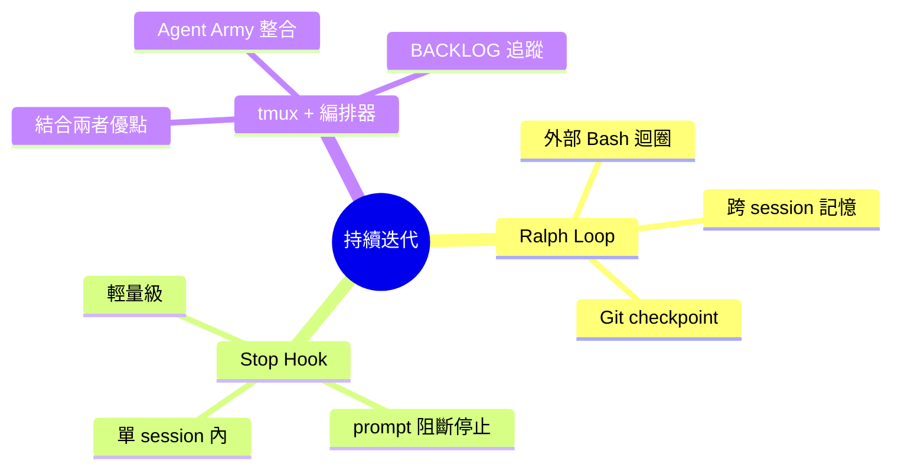
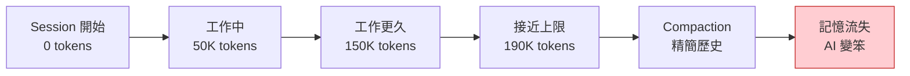
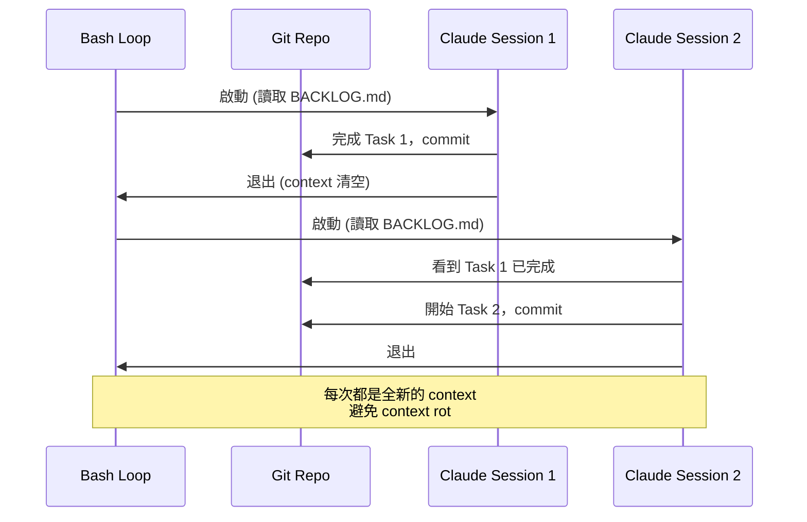
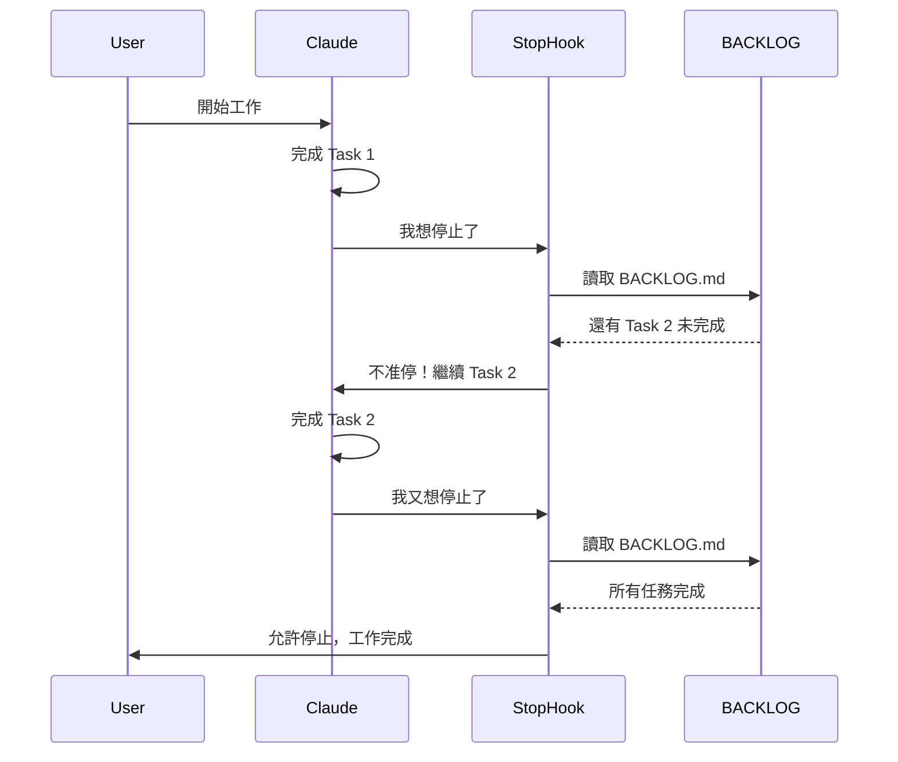
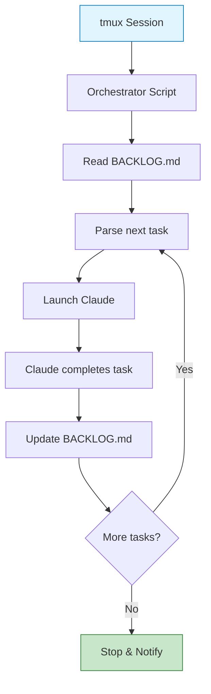
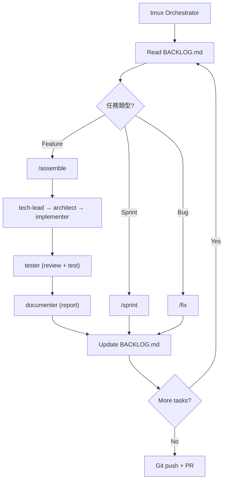

# 持續自主迭代研究報告：Claude Code 自動化開發模式

> **研究日期**：2026-03-06
> **適用版本**：Claude Code CLI 2026
> **研究範疇**：Autonomous agent loops, context management, multi-session orchestration



---

## 目錄

1. [摘要](#1-摘要)
2. [問題背景](#2-問題背景)
3. [方案一：Ralph Loop（外部 Bash 迴圈）](#3-方案一ralph-loop外部-bash-迴圈)
4. [方案二：Stop Hook 強制續行](#4-方案二stop-hook-強制續行)
5. [方案三：tmux + 外部編排器（推薦）](#5-方案三tmux--外部編排器推薦)
6. [Claude Code CLI 已知限制](#6-claude-code-cli-已知限制)
7. [安全建議](#7-安全建議)
8. [方案比較](#8-方案比較)
9. [與 Agent Army 整合](#9-與-agent-army-整合)
10. [參考資源](#10-參考資源)
11. [結論與建議](#11-結論與建議)

---

## 1. 摘要

### 1.1 研究目標

如何讓 Claude Code 像自動駕駛一樣持續工作，從一個功能完成後自動接續下一個任務，直到整個開發計畫完成？

### 1.2 三種主要方案

| 方案 | 核心機制 | 適用場景 | 推薦度 |
|------|---------|---------|-------|
| **Ralph Loop** | 外部 Bash 迴圈反覆啟動全新 session | 長時間運行、避免 context rot | ⭐⭐⭐⭐ |
| **Stop Hook** | 在 Claude 想停時用 hook 阻止它 | 輕量級任務、單 session 可完成 | ⭐⭐⭐ |
| **tmux + 編排器** | Ralph Loop + tmux 背景執行 + BACKLOG 追蹤 | **Agent Army 多代理協作** | ⭐⭐⭐⭐⭐ |

### 1.3 推薦結論

**推薦方案三（tmux + 編排器）**，理由：
1. 結合 Ralph Loop 的 context 乾淨優勢
2. tmux 背景執行讓監控更方便
3. 與 Agent Army 的 `/assemble`, `/sprint`, `/context-sync` 天然整合
4. BACKLOG.md 提供任務追蹤和斷點續傳

---

## 2. 問題背景

### 2.1 單次觸發的限制

Claude Code 預設行為：
```bash
claude --msg "實作用戶註冊功能"
# Claude 完成後就停止
# 需要手動下一條指令
```

問題：
- 開發者需要持續介入
- 無法在睡覺時讓 AI 工作
- 中斷了「自主性」的願景

### 2.2 Context Window Overflow



**問題**：單一 session 越長，AI 越容易：
- 忘記前面的決策
- 重複犯錯
- 理解力下降

### 2.3 人工介入成本

傳統開發流程：
```
開發者 → 寫 prompt → Claude 工作 → 停止 → 開發者檢查 → 下一個 prompt
```

理想流程：
```
開發者 → 寫開發計畫 (BACKLOG.md) → Claude 自動執行 → 完成後通知
```

---

## 3. 方案一：Ralph Loop（外部 Bash 迴圈）

### 3.1 核心概念

Ralph Loop 的核心思想：**用外部 Bash 迴圈反覆啟動全新的 Claude session**。

```bash
# 最簡版本
while true; do
  claude --msg "繼續未完成的工作，讀取 TODO.md"
  # 每次都是全新的 session，context 乾淨
  sleep 5
done
```

#### 為什麼叫 Ralph？

來自 Discord 社群的 meme，代表「反覆重新開始的 AI agent」。

### 3.2 運作原理



### 3.3 開源實作

#### 3.3.1 continuous-claude

**Repository**: [AnandChowdhary/continuous-claude](https://github.com/AnandChowdhary/continuous-claude)

**特色**：
- 支援 `--max-runs`, `--max-cost`, `--max-duration` 控制停止條件
- 自動讀取 Git status 和 TODO.md
- 支援 `--worktree` 在隔離的 Git worktree 中執行

**使用方式**：
```bash
npm install -g continuous-claude

continuous-claude \
  --max-runs 10 \
  --max-cost 5.00 \
  --max-duration 3600 \
  --msg "根據 BACKLOG.md 逐步完成開發任務"
```

**運作邏輯**：
```javascript
async function runLoop(options) {
  let iteration = 0;
  const startTime = Date.now();
  let totalCost = 0;

  while (true) {
    iteration++;

    // 檢查停止條件
    if (options.maxRuns && iteration > options.maxRuns) break;
    if (options.maxDuration && (Date.now() - startTime) > options.maxDuration * 1000) break;
    if (options.maxCost && totalCost > options.maxCost) break;

    // 啟動 Claude
    const result = await runClaude(options.msg);
    totalCost += result.cost;

    await sleep(5000); // 防止 API rate limit
  }
}
```

#### 3.3.2 ralph-claude-code

**Repository**: [frankbria/ralph-claude-code](https://github.com/frankbria/ralph-claude-code)

**特色**：
- 整合 tmux 監控
- 自動讀取 `RALPH_INSTRUCTIONS.md`
- 支援暫停和恢復

**使用方式**：
```bash
# 安裝
git clone https://github.com/frankbria/ralph-claude-code
cd ralph-claude-code
chmod +x ralph.sh

# 執行
./ralph.sh --task "Implement user authentication"
```

**核心腳本**：
```bash
#!/bin/bash
ITERATION=0
MAX_ITERATIONS=20

while [ $ITERATION -lt $MAX_ITERATIONS ]; do
  echo "=== Iteration $ITERATION ==="

  # 讀取指令檔
  INSTRUCTIONS=$(cat RALPH_INSTRUCTIONS.md)

  # 執行 Claude
  claude --msg "$INSTRUCTIONS. 這是第 $ITERATION 次迭代，繼續未完成的工作。"

  # 檢查退出碼
  if [ $? -ne 0 ]; then
    echo "Claude 執行失敗，停止迭代"
    break
  fi

  ITERATION=$((ITERATION + 1))
  sleep 10
done
```

#### 3.3.3 snarktank/ralph

**Repository**: [snarktank/ralph](https://github.com/snarktank/ralph)

**特色**：
- PRD-driven（Product Requirements Document）
- 支援 Claude Code 和 Amp
- 團隊協作友善

**使用方式**：
```bash
ralph init --prd "用戶認證系統.md"
ralph run
```

**檔案結構**：
```
project/
├── PRD.md                 # 產品需求文件
├── BACKLOG.md             # 任務清單
├── .ralph/
│   ├── config.json
│   ├── sessions/          # 每次 session 的記錄
│   └── checkpoints/       # Git checkpoint
```

### 3.4 優點

#### 3.4.1 避免 Context Rot

每次都是全新的 session，context window 重置：
- 不會累積錯誤的假設
- 不會忘記早期的決策（因為都記在 Git 裡）
- 保持最佳效能

#### 3.4.2 錯誤不跨迭代傳播

```
Session 1: 實作功能 A → 有 bug
Session 2: 全新開始 → 檢查發現 bug → 修正
```

在單一長 session 中，AI 可能會在錯誤的基礎上繼續工作。

#### 3.4.3 可長時間運行

只要 API quota 和成本允許，可以跑數小時甚至一整天：
```bash
continuous-claude \
  --max-cost 50.00 \
  --max-duration 28800 \  # 8 hours
  --msg "完成整個 feature branch"
```

### 3.5 缺點

#### 3.5.1 啟動延遲

每次啟動新 session 需要：
- 載入 CLAUDE.md（~10-50KB）
- 載入 skills metadata（~100 tokens/skill）
- API handshake overhead

單次迭代可能需要 5-15 秒啟動時間。

#### 3.5.2 跨 Session 記憶有限

AI 只能透過以下方式「記住」上一次的工作：
- Git commit messages
- BACKLOG.md 的狀態更新
- Code 本身

無法記住：
- 過程中的思考邏輯
- 為什麼選擇某種方案而非另一種

#### 3.5.3 適度粒度的任務拆解

需要在 BACKLOG.md 中把任務拆解到合適的粒度：
- 太大：單次 session 做不完
- 太小：啟動開銷比工作時間還長

---

## 4. 方案二：Stop Hook 強制續行

### 4.1 核心概念

利用 Claude Code 的 **Stop hook** 在 AI 想要停止時阻止它。

```json
{
  "hooks": {
    "stop": {
      "trigger": "always",
      "agentName": "continuator",
      "prompt": "等等，還有工作未完成。檢查 BACKLOG.md，繼續下一個任務。"
    }
  }
}
```

#### 運作流程



### 4.2 設定方式

#### 4.2.1 Prompt-based Hook

```json
{
  "hooks": {
    "stop": {
      "trigger": "always",
      "prompt": "在你停止之前，執行以下檢查：\n1. 讀取 BACKLOG.md\n2. 如果還有未完成的任務（標記為 [ ]），繼續執行下一個\n3. 只有當所有任務都標記為 [x] 時才允許停止"
    }
  }
}
```

**優點**：
- 不需要額外的 agent
- 設定簡單

**缺點**：
- Prompt 可能被 AI 忽略
- 沒有 `stop_hook_active` 保護，可能無限迴圈

#### 4.2.2 Agent-based Hook（推薦）

```json
{
  "agents": [
    {
      "name": "continuator",
      "role": "continuation-checker",
      "instructions": "檢查 BACKLOG.md 是否還有未完成任務。如果有，拒絕停止並指示繼續下一個任務。如果所有任務都完成，允許停止。",
      "autonomy": "full",
      "tools": ["Read", "Glob"]
    }
  ],
  "hooks": {
    "stop": {
      "trigger": "always",
      "agentName": "continuator"
    }
  }
}
```

#### 4.2.3 防止無限迴圈：stop_hook_active

Claude Code 內建保護機制：
```typescript
// 內部邏輯（偽代碼）
let stop_hook_active = false;

function onStopAttempt() {
  if (stop_hook_active) {
    // 防止無限迴圈，強制停止
    return FORCE_STOP;
  }

  stop_hook_active = true;
  runStopHook();
  stop_hook_active = false;
}
```

這避免了 stop hook 本身觸發另一個 stop，形成無限迴圈。

### 4.3 實戰範例

#### 範例：自動化測試驅動開發

```json
{
  "hooks": {
    "stop": {
      "trigger": "always",
      "prompt": "在停止前，執行以下檢查：\n1. 所有測試是否通過？（執行 npm test）\n2. BACKLOG.md 中是否還有 [ ] 未完成任務？\n3. 只有當測試全過且任務全完成時才停止"
    }
  }
}
```

#### 範例：Code Review 循環

```json
{
  "hooks": {
    "stop": {
      "trigger": "always",
      "agentName": "reviewer",
      "prompt": "在停止前，進行 code review：\n1. 檢查是否符合 Clean Architecture\n2. 是否有安全漏洞\n3. 如果發現問題，拒絕停止並要求修正"
    }
  }
}
```

### 4.4 優點

#### 4.4.1 輕量級

不需要外部腳本，純 Claude Code 內建功能。

#### 4.4.2 單 Session 內運作

所有工作在同一個 session，AI 能記住：
- 前面的思考邏輯
- 為什麼選擇某個方案
- 過程中的權衡決策

#### 4.4.3 快速迭代

沒有 session 啟動延遲，任務間切換幾乎無縫。

### 4.5 缺點

#### 4.5.1 受 Context Window 限制

即使有 stop hook，context window 還是會逐漸填滿：
```
開始: 0 tokens
Task 1: 30K tokens
Task 2: 60K tokens
Task 3: 90K tokens
...
Context full: 190K tokens → Compaction → 記憶流失
```

#### 4.5.2 長時間會觸發 Compaction

Claude Code 會在 context 接近上限時自動精簡歷史，可能導致：
- 忘記早期的決策
- 重複已解決的問題

#### 4.5.3 Stop Hook 可能被忽略

AI 有時會「堅持」停止，特別是：
- 遇到困難或錯誤時
- 覺得任務「已經完成得差不多」
- Context 很長時 reasoning 能力下降

---

## 5. 方案三：tmux + 外部編排器（推薦）

### 5.1 核心概念

結合 **Ralph Loop** 的外部迴圈 + **tmux** 背景執行 + **BACKLOG.md** 任務追蹤。



### 5.2 架構設計

#### 5.2.1 雙層架構

```
┌─────────────────────────────────────────┐
│  Layer 1: tmux Session (背景執行)        │
│  - 監控日誌                              │
│  - 支援 attach/detach                    │
│  - 可暫停/恢復                           │
└─────────────────────────────────────────┘
              ↓
┌─────────────────────────────────────────┐
│  Layer 2: Orchestrator (編排器)         │
│  - 讀取 BACKLOG.md                       │
│  - 解析下一個任務                         │
│  - 啟動 Claude session                   │
│  - 更新任務狀態                           │
└─────────────────────────────────────────┘
              ↓
┌─────────────────────────────────────────┐
│  Layer 3: Claude Session                │
│  - 執行單一任務                           │
│  - Git commit                            │
│  - 更新 BACKLOG.md                       │
└─────────────────────────────────────────┘
```

#### 5.2.2 檔案結構

```
project/
├── BACKLOG.md                 # 任務清單（狀態追蹤）
├── .autopilot/
│   ├── orchestrator.sh        # 編排器腳本
│   ├── config.json            # 設定檔
│   ├── logs/                  # 執行日誌
│   │   ├── 2026-03-06.log
│   │   └── errors.log
│   └── checkpoints/           # Git checkpoint
└── .claude/
    └── settings.json          # Claude 設定（hooks, agents）
```

### 5.3 實作範例

#### 5.3.1 orchestrator.sh

```bash
#!/bin/bash
# Autopilot Orchestrator for Agent Army

set -euo pipefail

# 設定
BACKLOG_FILE="BACKLOG.md"
LOG_DIR=".autopilot/logs"
MAX_ITERATIONS=50
ITERATION=0

# 初始化
mkdir -p "$LOG_DIR"
LOG_FILE="$LOG_DIR/$(date +%Y-%m-%d).log"

log() {
  echo "[$(date '+%Y-%m-%d %H:%M:%S')] $*" | tee -a "$LOG_FILE"
}

# 解析下一個任務
get_next_task() {
  grep -n "^- \[ \]" "$BACKLOG_FILE" | head -1 | sed 's/:/ /'
}

# 標記任務為進行中
mark_in_progress() {
  local line_num=$1
  sed -i.bak "${line_num}s/\[ \]/[~]/" "$BACKLOG_FILE"
}

# 標記任務為完成
mark_done() {
  local line_num=$1
  sed -i.bak "${line_num}s/\[~\]/[x]/" "$BACKLOG_FILE"
}

# 標記任務為失敗
mark_failed() {
  local line_num=$1
  sed -i.bak "${line_num}s/\[~\]/[!]/" "$BACKLOG_FILE"
}

# Git checkpoint
create_checkpoint() {
  local task_id=$1
  git add -A
  git commit -m "Autopilot checkpoint: $task_id" || true
}

# 主迴圈
log "🚀 Autopilot 啟動"

while [ $ITERATION -lt $MAX_ITERATIONS ]; do
  ITERATION=$((ITERATION + 1))
  log "=== Iteration $ITERATION ==="

  # 解析下一個任務
  NEXT_TASK=$(get_next_task)

  if [ -z "$NEXT_TASK" ]; then
    log "✅ 所有任務完成！"
    break
  fi

  LINE_NUM=$(echo "$NEXT_TASK" | awk '{print $1}')
  TASK_DESC=$(echo "$NEXT_TASK" | cut -d' ' -f2-)

  log "📋 開始任務: $TASK_DESC"
  mark_in_progress "$LINE_NUM"

  # 啟動 Claude
  if claude --msg "執行 BACKLOG.md 中的任務: $TASK_DESC。完成後更新 BACKLOG.md 狀態為 [x]" 2>&1 | tee -a "$LOG_FILE"; then
    log "✅ 任務完成: $TASK_DESC"
    mark_done "$LINE_NUM"
    create_checkpoint "task-${LINE_NUM}"
  else
    log "❌ 任務失敗: $TASK_DESC"
    mark_failed "$LINE_NUM"

    # 詢問是否繼續
    log "⚠️  任務失敗，暫停 30 秒後繼續下一個任務"
    sleep 30
  fi

  # 避免 API rate limit
  sleep 5
done

log "🏁 Autopilot 結束"
```

#### 5.3.2 啟動腳本

```bash
#!/bin/bash
# autopilot-start.sh

TMUX_SESSION="autopilot"

# 檢查 tmux session 是否已存在
if tmux has-session -t "$TMUX_SESSION" 2>/dev/null; then
  echo "❌ Autopilot 已在執行中"
  echo "使用 'tmux attach -t $TMUX_SESSION' 查看"
  exit 1
fi

# 啟動 tmux session
tmux new-session -d -s "$TMUX_SESSION" \
  "bash .autopilot/orchestrator.sh; exec bash"

echo "✅ Autopilot 已在背景啟動"
echo "查看: tmux attach -t $TMUX_SESSION"
echo "分離: Ctrl-B 然後按 D"
```

#### 5.3.3 監控腳本

```bash
#!/bin/bash
# autopilot-monitor.sh

TMUX_SESSION="autopilot"
LOG_FILE=".autopilot/logs/$(date +%Y-%m-%d).log"

if ! tmux has-session -t "$TMUX_SESSION" 2>/dev/null; then
  echo "❌ Autopilot 未執行"
  exit 1
fi

# 顯示即時日誌
tail -f "$LOG_FILE"
```

### 5.4 與 Agent Army 整合

#### 5.4.1 整合 /assemble

```bash
# 在 orchestrator.sh 中
claude --msg "/assemble $TASK_DESC"
```

這會啟動 tech-lead → architect → implementer → tester → documenter 的完整流程。

#### 5.4.2 整合 /sprint

```bash
# 每日 sprint 模式
claude --msg "/sprint BACKLOG.md"
```

#### 5.4.3 整合 /context-sync

```bash
# 每次迭代前同步 context
claude --msg "/context-sync load"

# 執行任務
claude --msg "執行任務 $TASK_DESC"

# 每次迭代後儲存 context
claude --msg "/context-sync save"
```

#### 5.4.4 Stop Hook 做品質閘門

```json
{
  "hooks": {
    "stop": {
      "trigger": "always",
      "agentName": "quality-gate-agent",
      "prompt": "在停止前執行 /quality-gate，確保：\n1. 所有測試通過\n2. 無安全漏洞\n3. Clean Architecture 驗證通過\n只有全部通過才允許停止"
    }
  }
}
```

### 5.5 優點

#### 5.5.1 結合兩者優點

- Ralph Loop 的 context 乾淨
- Stop Hook 的自動續行
- tmux 的背景執行和監控

#### 5.5.2 任務追蹤和斷點續傳

BACKLOG.md 提供：
- 任務進度可視化
- 失敗任務標記（不會無限重試）
- 可隨時暫停和恢復

#### 5.5.3 可觀測性

- 即時日誌 (`tail -f`)
- tmux 視窗監控
- Git checkpoint 可回溯

#### 5.5.4 安全性

- 每次迭代都有 Git checkpoint
- 可隨時 Ctrl-C 停止
- 失敗不會影響已完成的工作

### 5.6 缺點

#### 5.6.1 設定複雜度

需要：
- 撰寫 orchestrator 腳本
- 設定 tmux
- 撰寫 BACKLOG.md

#### 5.6.2 需要良好的任務拆解

BACKLOG.md 的品質直接影響執行效果。

---

## 6. Claude Code CLI 已知限制

### 6.1 Context Window

- **大小**：約 200K tokens (Claude 3.5 Sonnet)
- **影響**：長 session 會觸發 compaction
- **對策**：用 Ralph Loop 定期重置

### 6.2 --max-turns

```bash
claude --msg "完成任務" --max-turns 50
```

控制 API round-trips 次數，不是 tokens：
- 預設：100
- 每次 `claude` 和 API 的來回算一個 turn
- 達到上限後強制停止

### 6.3 --dangerously-skip-permissions

```bash
claude --dangerously-skip-permissions
```

**危險**：跳過所有權限檢查，適合自動化但有安全風險：
- 檔案操作不再詢問
- Git push 不再確認
- Shell 命令直接執行

**建議**：只在容器中或測試環境使用。

### 6.4 API Rate Limits

Anthropic API 限制：
- **Tier 1**（免費）：50 requests/min
- **Tier 2**（付費）：1000 requests/min
- **Tier 3**（企業）：自訂

**對策**：
```bash
# 在迭代間加入延遲
sleep 5
```

### 6.5 Stop Hook 的 stop_hook_active

防止無限迴圈的保護機制：
- stop hook 執行時，`stop_hook_active = true`
- 如果 stop hook 本身想停止，會被強制允許
- 避免 hook 觸發 hook

---

## 7. 安全建議

### 7.1 容器化執行

```dockerfile
# Dockerfile
FROM node:20-alpine

RUN npm install -g claude-code

WORKDIR /workspace

# 只掛載需要的目錄
VOLUME ["/workspace"]

CMD ["bash", ".autopilot/orchestrator.sh"]
```

執行：
```bash
docker run -v $(pwd):/workspace -it autopilot
```

### 7.2 安全限制設定

```json
{
  "security": {
    "allowedCommands": ["git", "npm", "pytest"],
    "blockedPaths": [".env", "secrets/", "*.key"],
    "maxCost": 10.00,
    "maxDuration": 7200
  }
}
```

### 7.3 Git Checkpoint

每次迭代都 commit：
```bash
git add -A
git commit -m "Autopilot checkpoint: iteration $N"
```

如果出錯可以：
```bash
git reset --hard HEAD~1  # 回到上一個 checkpoint
```

### 7.4 tmux 監控

實時監控 Claude 的輸出：
```bash
tmux attach -t autopilot
```

可隨時 Ctrl-C 停止。

### 7.5 PR Review 流程

Autopilot 只在 feature branch 執行：
```bash
git checkout -b feature/autopilot-work
# 執行 autopilot
git push origin feature/autopilot-work
gh pr create  # 人工 review 後才 merge
```

---

## 8. 方案比較

### 8.1 完整對比表

| 維度 | Ralph Loop | Stop Hook | tmux + 編排器 |
|------|-----------|-----------|--------------|
| **實作複雜度** | ⭐⭐（外部腳本） | ⭐（設定檔） | ⭐⭐⭐（腳本 + tmux） |
| **Context 管理** | ⭐⭐⭐⭐⭐（每次重置） | ⭐⭐（單 session） | ⭐⭐⭐⭐⭐（每次重置） |
| **長時間運行** | ⭐⭐⭐⭐⭐ | ⭐⭐（受限於 context） | ⭐⭐⭐⭐⭐ |
| **任務追蹤** | ⭐⭐⭐（Git + 檔案） | ⭐⭐（AI 記憶） | ⭐⭐⭐⭐⭐（BACKLOG.md） |
| **斷點續傳** | ⭐⭐⭐⭐ | ⭐⭐ | ⭐⭐⭐⭐⭐ |
| **可觀測性** | ⭐⭐（查日誌） | ⭐⭐（查日誌） | ⭐⭐⭐⭐⭐（tmux + 日誌） |
| **錯誤隔離** | ⭐⭐⭐⭐⭐（不跨迭代） | ⭐⭐（可能傳播） | ⭐⭐⭐⭐⭐（不跨迭代） |
| **啟動速度** | ⭐⭐（每次重啟） | ⭐⭐⭐⭐⭐（無重啟） | ⭐⭐（每次重啟） |
| **Agent Army 整合** | ⭐⭐⭐ | ⭐⭐⭐ | ⭐⭐⭐⭐⭐ |
| **社群成熟度** | ⭐⭐⭐⭐ | ⭐⭐ | ⭐⭐ |

### 8.2 使用場景推薦

| 場景 | 推薦方案 | 理由 |
|------|---------|------|
| **快速原型** | Stop Hook | 設定簡單，適合短期任務 |
| **長時間自動化** | Ralph Loop | Context 乾淨，不會 rot |
| **Agent Army 多代理** | **tmux + 編排器** | 與 /assemble, /sprint 天然整合 |
| **企業級生產** | tmux + 編排器 + 容器 | 安全、可觀測、可控 |
| **實驗性專案** | Ralph Loop | 社群工具成熟 |

---

## 9. 與 Agent Army 整合

### 9.1 整合架構



### 9.2 BACKLOG.md 格式

```markdown
# Autopilot Backlog

## Phase 1: Foundation
- [ ] **T01**: 建立 domain entities
  - Files: `src/domain/entities/user.ts`
  - Command: `/assemble user entity with email and password`

- [ ] **T02**: 建立 repository port
  - Files: `src/application/ports/outbound/user-repository.ts`
  - Command: `/assemble user repository port`

## Phase 2: Implementation
- [ ] **T03**: 實作 repository adapter
  - Files: `src/adapters/outbound/persistence/user-repository-impl.ts`
  - Command: `/assemble PostgreSQL user repository implementation`

## Phase 3: Testing
- [ ] **T04**: 執行完整測試
  - Command: `/quality-gate all`
```

### 9.3 Orchestrator 與 Skills 整合

```bash
# 解析任務中的 command
COMMAND=$(grep "Command:" <<< "$TASK_DESC" | cut -d':' -f2-)

if [[ $COMMAND == /assemble* ]]; then
  log "🚀 啟動 Agent Army"
  claude --msg "$COMMAND"
elif [[ $COMMAND == /sprint* ]]; then
  log "🏃 執行 Sprint"
  claude --msg "$COMMAND"
elif [[ $COMMAND == /quality-gate* ]]; then
  log "🚪 品質閘門"
  claude --msg "$COMMAND"
else
  log "💻 直接執行任務"
  claude --msg "$TASK_DESC"
fi
```

### 9.4 Context Sync 整合

每次 session 開始前載入 context：
```bash
# 在每次 claude 啟動前
claude --msg "/context-sync load"
claude --msg "$TASK_DESC"
claude --msg "/context-sync save"
```

---

## 10. 參考資源

### 10.1 開源專案

- [continuous-claude](https://github.com/AnandChowdhary/continuous-claude) — 功能最完整的 Ralph Loop 實作
- [ralph-claude-code](https://github.com/frankbria/ralph-claude-code) — 含 tmux 整合
- [snarktank/ralph](https://github.com/snarktank/ralph) — PRD-driven 方案

### 10.2 Claude Code 官方文件

- [Hooks Documentation](https://docs.anthropic.com/claude/docs/hooks)
- [Agent Teams](https://docs.anthropic.com/claude/docs/agent-teams)
- [Skills System](https://docs.anthropic.com/claude/docs/skills)

### 10.3 社群討論

- [Discord: Claude Code #autopilot](https://discord.gg/claude) — Ralph Loop 發源地
- [GitHub Discussions](https://github.com/anthropics/claude-code/discussions) — 官方討論區

### 10.4 相關研究

- [Context Engineering 記憶架構](context-engineering-memory-architecture.md)
- [Hooks 進階自動化](hooks-advanced-automation.md)
- [Agent Teams 平行開發實戰](agent-teams-parallel-development.md)

---

## 11. 結論與建議

### 11.1 總結

| 方案 | 核心優勢 | 最佳用途 |
|------|---------|---------|
| Ralph Loop | Context 乾淨、社群成熟 | 長時間運行、實驗性專案 |
| Stop Hook | 輕量級、快速 | 短期任務、原型開發 |
| **tmux + 編排器** | **可觀測、可控、與 Agent Army 整合** | **生產級自動化、多代理協作** |

### 11.2 推薦方案：tmux + 編排器

對於 Agent Army 系統，推薦 **方案三（tmux + 編排器）**，因為：

1. **完美整合**：與 `/assemble`, `/sprint`, `/context-sync` 天然配合
2. **任務追蹤**：BACKLOG.md 提供清晰的進度和狀態
3. **可觀測性**：tmux 即時監控 + 結構化日誌
4. **斷點續傳**：可隨時暫停和恢復
5. **錯誤隔離**：失敗的任務不影響已完成的工作

### 11.3 實施建議

#### Phase 1: 基礎設施（1 天）
1. 撰寫 `orchestrator.sh`
2. 建立 `BACKLOG.template.md`
3. 設定 tmux 環境

#### Phase 2: 整合 Agent Army（2 天）
1. 實作 `/assemble`, `/sprint` 調用
2. 整合 `/context-sync`
3. 設定 stop hook 品質閘門

#### Phase 3: 測試與優化（3 天）
1. 小範圍測試（5-10 個任務）
2. 監控和日誌優化
3. 錯誤處理加強

#### Phase 4: 生產部署（ongoing）
1. 容器化
2. CI/CD 整合
3. 監控和告警

### 11.4 成本估算

基於 Claude 3.5 Sonnet 定價（2026-03）：

| 工作量 | 任務數 | 預估 Tokens | 成本 |
|--------|-------|------------|------|
| 小功能 | 5-10 | 500K | $1.50 |
| 中功能 | 20-30 | 2M | $6.00 |
| 大功能 | 50-100 | 5M | $15.00 |

**建議**：設定 `--max-cost` 防止意外超支：
```bash
continuous-claude --max-cost 10.00
```

### 11.5 未來方向

1. **Agent Skills Marketplace**：分享 autopilot 相關 skills
2. **視覺化監控**：Web UI 顯示 BACKLOG 進度
3. **多專案並行**：tmux 管理多個 autopilot session
4. **智慧任務拆解**：AI 自動生成 BACKLOG.md

---

**下一步**：參考 `plugins/agent-army/templates/autopilot/BACKLOG.template.md` 開始你的第一個 autopilot 任務！

---

*本研究報告是 Symbiotic Engineering 系列的一部分。更多研究請見 [docs/INDEX.md](../INDEX.md)。*
