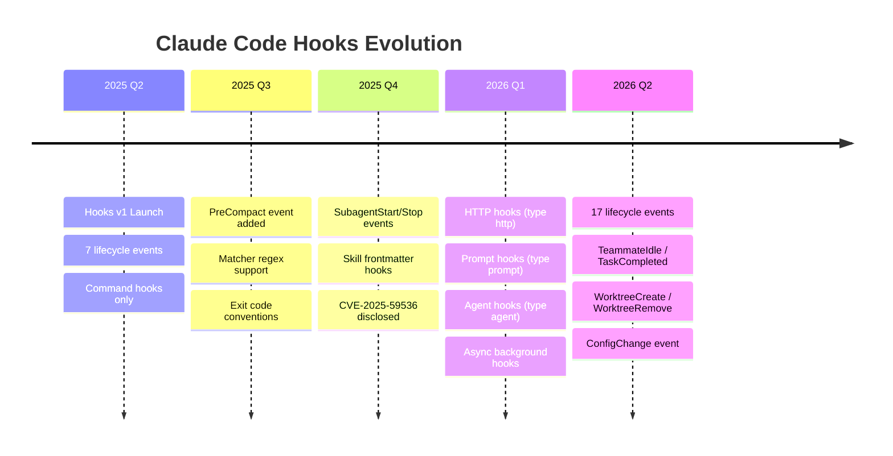
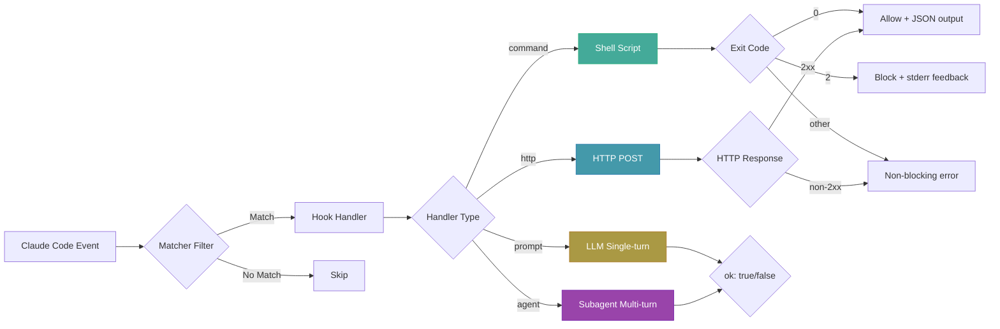
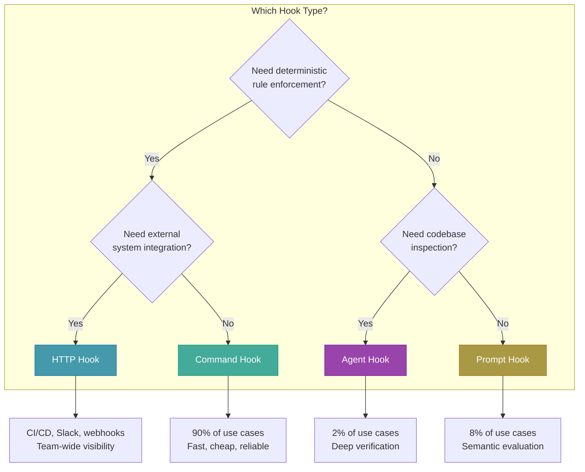
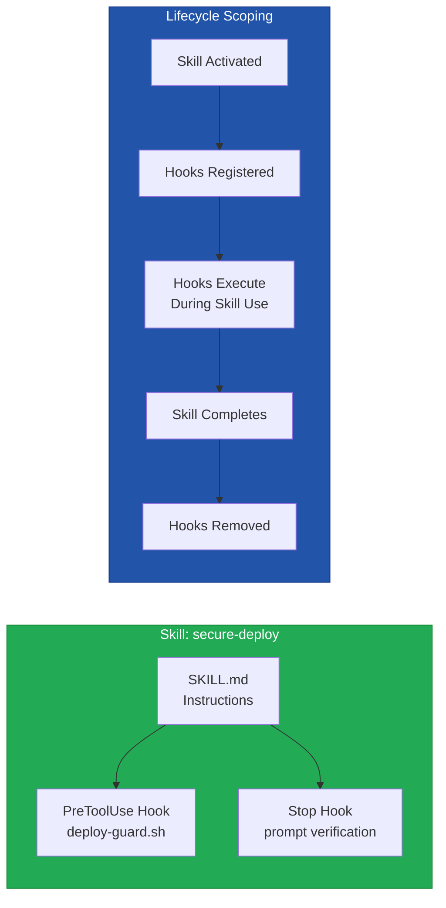
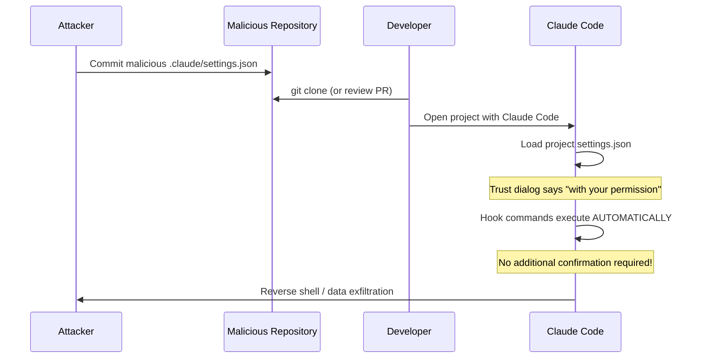

# Hooks 進階：事件驅動的 AI 工作流自動化

> **Hooks 是讓 AI 工作流從「請你記得做 X」變成「X 每次都會自動發生」的關鍵機制。**
> 當你不再依賴 LLM 的記憶力，而是用確定性的規則來約束它，AI 輔助開發才真正成熟。



---

## 目錄

1. [Hooks 基礎回顧](#1-hooks-基礎回顧)
2. [四種 Hook Handler 類型](#2-四種-hook-handler-類型)
3. [HTTP Hooks：外部系統整合](#3-http-hooks外部系統整合)
4. [Prompt Hooks：LLM 判斷閘門](#4-prompt-hooksllm-判斷閘門)
5. [Agent Hooks：多輪驗證引擎](#5-agent-hooks多輪驗證引擎)
6. [Async Hooks：非阻塞背景執行](#6-async-hooks非阻塞背景執行)
7. [Hooks in Skills & Subagents](#7-hooks-in-skills--subagents)
8. [安全考量與漏洞分析](#8-安全考量與漏洞分析)
9. [實戰食譜](#9-實戰食譜)
10. [除錯與疑難排解](#10-除錯與疑難排解)
11. [參考文獻](#11-參考文獻)

---

## 1. Hooks 基礎回顧

### 1.1 什麼是 Hook？

Hook 是使用者定義的自動化處理器，在 Claude Code 生命週期的特定時間點自動執行。它的核心價值在於提供**確定性控制**——不依賴 LLM 的判斷，而是用程式邏輯確保規則被嚴格執行。



### 1.2 十七個生命週期事件

截至 2026 年 Q2，Claude Code 提供 17 個 Hook 事件，覆蓋從 session 啟動到結束的完整生命週期：

| 分類 | 事件 | 觸發時機 | 可阻擋？ |
|------|------|----------|---------|
| **Session** | `SessionStart` | Session 開始或恢復 | No |
| | `SessionEnd` | Session 結束 | No |
| **User Input** | `UserPromptSubmit` | 使用者送出 prompt 後、Claude 處理前 | Yes |
| **Tool Lifecycle** | `PreToolUse` | 工具呼叫執行前 | Yes |
| | `PostToolUse` | 工具呼叫成功後 | No (reactive) |
| | `PostToolUseFailure` | 工具呼叫失敗後 | No (reactive) |
| | `PermissionRequest` | 權限對話框出現時 | Yes |
| **Agent Lifecycle** | `SubagentStart` | Subagent 產生時 | No |
| | `SubagentStop` | Subagent 完成時 | Yes |
| | `Stop` | Claude 完成回應時 | Yes |
| **Team Events** | `TeammateIdle` | Agent Team 成員即將閒置 | Yes |
| | `TaskCompleted` | Task 被標記為完成 | Yes |
| **Config** | `ConfigChange` | 設定檔變更時 | Yes* |
| **Worktree** | `WorktreeCreate` | Worktree 建立時 | Yes |
| | `WorktreeRemove` | Worktree 移除時 | No |
| **Maintenance** | `PreCompact` | Context 壓縮前 | No |
| | `Notification` | Claude Code 送出通知時 | No |

> *`ConfigChange` 可以阻擋 `user_settings`、`project_settings`、`local_settings`、`skills` 的變更，但**無法阻擋** `policy_settings`（企業級管理設定永遠生效）。

### 1.3 設定位置與層級

Hook 的設定位置決定了它的作用範圍：

| 位置 | 作用範圍 | 可分享 | 適用場景 |
|------|---------|--------|---------|
| `~/.claude/settings.json` | 所有專案 | 否（本機） | 個人偏好，如桌面通知 |
| `.claude/settings.json` | 單一專案 | 是（Git commit） | 團隊共享規則，如 lint |
| `.claude/settings.local.json` | 單一專案 | 否（gitignored） | 個人客製化覆蓋 |
| Managed Policy | 整個組織 | 是（管理員控制） | 企業安全策略 |
| Plugin `hooks/hooks.json` | Plugin 啟用時 | 是（隨 Plugin） | 可分發的擴展 |
| Skill/Agent frontmatter | 元件啟用期間 | 是（定義在元件中） | 範圍限定的檢查 |

### 1.4 Command Hook 基礎

最基本的 hook 類型是 command hook。它透過 `stdin` 接收 JSON 輸入，用 exit code 和 `stdout` 回傳結果：

```bash
#!/bin/bash
# .claude/hooks/block-dangerous-commands.sh

# Read JSON input from stdin
INPUT=$(cat)
COMMAND=$(echo "$INPUT" | jq -r '.tool_input.command // empty')

# Check for dangerous patterns
if echo "$COMMAND" | grep -qE 'rm -rf /|DROP TABLE|--force'; then
  echo "Blocked: dangerous command pattern detected" >&2
  exit 2  # Exit 2 = block the action
fi

exit 0  # Exit 0 = allow the action
```

對應的設定檔：

```json
{
  "hooks": {
    "PreToolUse": [
      {
        "matcher": "Bash",
        "hooks": [
          {
            "type": "command",
            "command": "\"$CLAUDE_PROJECT_DIR\"/.claude/hooks/block-dangerous-commands.sh"
          }
        ]
      }
    ]
  }
}
```

### 1.5 Matcher 正規表達式

Matcher 是一個 regex 字串，根據事件類型過濾不同的欄位：

```
# Tool events: match on tool_name
"Bash"              # Exact match
"Edit|Write"        # Either tool
"mcp__github__.*"   # All GitHub MCP tools
"mcp__.*__write.*"  # Any MCP write tool

# SessionStart: match on source
"startup"           # New session only
"resume"            # Resumed sessions
"compact"           # After compaction

# Notification: match on notification_type
"permission_prompt" # Permission dialogs only
"idle_prompt"       # Idle notifications only
```

> 注意：`UserPromptSubmit`、`Stop`、`TeammateIdle`、`TaskCompleted`、`WorktreeCreate`、`WorktreeRemove` **不支援** matcher，每次事件發生都會觸發。

---

## 2. 四種 Hook Handler 類型

2026 年的 Claude Code 支援四種 hook handler 類型，各有不同的適用場景：

| 類型 | 執行方式 | 決策機制 | 適用場景 | 預設 Timeout |
|------|---------|---------|---------|-------------|
| `command` | 執行 shell 指令 | Exit code + JSON | 格式化、lint、日誌、阻擋 | 600s |
| `http` | POST JSON 到 URL | HTTP Response Body | 外部 CI/CD、Slack、監控 | 30s |
| `prompt` | 送 prompt 給 LLM | `{ok: bool, reason}` | 語意判斷、安全分類 | 30s |
| `agent` | 產生多輪 subagent | `{ok: bool, reason}` | 深度驗證、程式碼審查 | 60s |



> 根據實務經驗，hook 類型的使用比例大約是：**command 90%、prompt 8%、agent 2%**。「確定性勝過智能」是大多數操作模式的最佳策略。

### 2.1 事件對 Handler 類型的支援矩陣

並非所有事件都支援全部四種 handler 類型：

| 支援全部四種 (`command`, `http`, `prompt`, `agent`) | 僅支援 `command` |
|-----------------------------------------------------|-------------------|
| `PreToolUse`, `PostToolUse`, `PostToolUseFailure` | `SessionStart`, `SessionEnd` |
| `PermissionRequest`, `UserPromptSubmit` | `SubagentStart`, `Notification` |
| `Stop`, `SubagentStop`, `TaskCompleted` | `TeammateIdle`, `ConfigChange` |
| | `PreCompact`, `WorktreeCreate`, `WorktreeRemove` |

---

## 3. HTTP Hooks：外部系統整合

HTTP Hooks 是 2026 年新增的 handler 類型，將 hook 事件以 HTTP POST 發送到外部端點，實現跨系統整合。

### 3.1 運作機制

```
Claude Code Event
    ↓
POST JSON → http://your-endpoint.com/hooks
    ↓
Endpoint processes event data
    ↓
Returns JSON response (same format as command hooks)
    ↓
Claude Code acts on the response
```

核心特性：
- **Content-Type**: `application/json`
- **請求 Body**: 與 command hook 的 stdin 相同的 JSON 結構
- **回應格式**: 與 command hook 的 stdout JSON 格式相同
- **錯誤處理**: non-2xx 和連線失敗是**非阻塞錯誤**，不會中斷 Claude

### 3.2 設定範例

```json
{
  "hooks": {
    "PreToolUse": [
      {
        "matcher": "Bash",
        "hooks": [
          {
            "type": "http",
            "url": "http://localhost:8080/hooks/validate-command",
            "timeout": 30,
            "headers": {
              "Authorization": "Bearer $HOOK_AUTH_TOKEN",
              "X-Project": "my-project"
            },
            "allowedEnvVars": ["HOOK_AUTH_TOKEN"]
          }
        ]
      }
    ]
  }
}
```

> **重要**：`headers` 中的環境變數**必須**在 `allowedEnvVars` 中明確列出，否則會被替換為空字串。這是一個安全設計，防止意外洩漏敏感環境變數。

### 3.3 與 Command Hook 的關鍵差異

| 特性 | Command Hook | HTTP Hook |
|------|-------------|-----------|
| 阻擋機制 | Exit code 2 | 2xx + JSON `decision: "block"` |
| 非阻塞錯誤 | 非 0/2 exit code | non-2xx / timeout / connection failure |
| 環境 | 本機 shell | 任何 HTTP server |
| 設定方式 | `/hooks` 選單 或 JSON | 僅 JSON（不支援互動選單） |
| 適用場景 | 本機自動化 | 團隊共享服務、雲端函式 |

### 3.4 實戰：Slack 通知整合

Python Flask 接收 `Stop` 事件並發送 Slack 通知：

```python
# webhook_server.py
from flask import Flask, request, jsonify
import requests, os

app = Flask(__name__)

@app.route("/hooks/stop", methods=["POST"])
def handle_stop():
    data = request.json
    summary = (data.get("last_assistant_message", ""))[:500]
    requests.post(os.environ["SLACK_WEBHOOK_URL"], json={
        "text": f"Claude Code completed (session `{data['session_id'][:8]}`): {summary}"
    })
    return jsonify({}), 200

if __name__ == "__main__":
    app.run(port=8080)
```

Hook 設定：`{"hooks":{"Stop":[{"hooks":[{"type":"http","url":"http://localhost:8080/hooks/stop","timeout":10}]}]}}`

### 3.5 HookLab：即時 Hook 監控面板

2026 年 2 月推出的 [HookLab](https://felipeelias.github.io/2026/02/28/hook-lab.html) 專案，提供一個即時儀表板，能在瀏覽器中觀察每個 hook 事件的觸發，支援按事件類型、工具、session 過濾，並可檢視完整 payload。這對於開發和調試 HTTP hooks 極為實用。

---

## 4. Prompt Hooks：LLM 判斷閘門

Prompt Hooks 使用 Claude 模型（預設為 Haiku，快速且成本低）進行單輪語意判斷，適合那些無法用簡單規則表達的決策。

### 4.1 運作機制

1. Claude Code 將 hook 的 JSON 輸入和你的 prompt 一起發送給 LLM
2. LLM 回傳結構化 JSON：`{"ok": true}` 或 `{"ok": false, "reason": "..."}`
3. Claude Code 根據 `ok` 值決定是否允許操作

### 4.2 `$ARGUMENTS` 佔位符

使用 `$ARGUMENTS` 佔位符將 hook 的 JSON 輸入注入 prompt 文字中：

```json
{
  "hooks": {
    "PreToolUse": [
      {
        "matcher": "Bash",
        "hooks": [
          {
            "type": "prompt",
            "prompt": "Evaluate if this Bash command is safe to execute in a production-adjacent environment. Command context: $ARGUMENTS\n\nCheck for:\n1. Destructive file operations (rm, truncate)\n2. Network access to external services\n3. Package installations without version pinning\n4. Database mutations\n\nRespond with {\"ok\": true} if safe, or {\"ok\": false, \"reason\": \"explanation\"} if risky.",
            "timeout": 15
          }
        ]
      }
    ]
  }
}
```

如果 prompt 中沒有 `$ARGUMENTS`，JSON 輸入會被自動附加到 prompt 末尾。

### 4.3 成本效益分析

Prompt hooks 使用 Haiku 級別的快速模型，成本非常低：

| 評估項目 | 估計值 |
|---------|--------|
| 每次呼叫的 token 量 | ~500-2000 tokens（prompt + 輸入 + 回應） |
| Haiku 3.5 價格 | $0.80/1M input, $4/1M output |
| 單次 prompt hook 成本 | ~$0.001-$0.005 |
| 一天 200 次觸發 | ~$0.20-$1.00 |

> 相比之下，一次 `rm -rf` 事故的損失可能是數小時的恢復時間。Prompt hooks 的 ROI 非常明確。

### 4.4 適用與不適用場景

| 適用 | 不適用 |
|------|--------|
| 語意安全分類（是否觸及 auth/payment/DB？） | 簡單的正規表達式匹配 |
| 程式碼品質主觀判斷 | 需要讀取檔案內容驗證 |
| 自然語言 prompt 過濾 | 需要執行指令確認結果 |
| 複雜的多條件評估 | 效能關鍵路徑（增加 1-3 秒延遲） |

---

## 5. Agent Hooks：多輪驗證引擎

Agent Hooks 是四種類型中最強大的——它產生一個 subagent，可以使用 `Read`、`Grep`、`Glob` 等工具進行多輪調查，最多支援 **50 個 tool turns**。

### 5.1 與 Prompt Hook 的核心差異

| 特性 | Prompt Hook | Agent Hook |
|------|------------|------------|
| 執行模式 | 單輪 LLM 呼叫 | 多輪 subagent + 工具存取 |
| 工具存取 | 無 | Read, Grep, Glob |
| 最大回合數 | 1 | 50 |
| 預設 Timeout | 30s | 60s |
| 成本 | 極低（~$0.003） | 中等（~$0.05-$0.50） |
| 適用場景 | 語意判斷 | 深度程式碼驗證 |

### 5.2 設定範例：測試覆蓋率驗證

```json
{
  "hooks": {
    "Stop": [
      {
        "hooks": [
          {
            "type": "agent",
            "prompt": "Before allowing Claude to stop, verify the quality of the work:\n\n1. Use Grep to find any TODO or FIXME comments that were added in this session\n2. Use Read to check that all modified files have proper error handling\n3. Use Glob to find test files corresponding to modified source files\n4. Verify test files exist for any new modules\n\nContext: $ARGUMENTS\n\nRespond with {\"ok\": true} if everything looks good, or {\"ok\": false, \"reason\": \"...\"} explaining what needs to be fixed.",
            "timeout": 120
          }
        ]
      }
    ]
  }
}
```

### 5.3 三種 Hook 類型比較總表

| 維度 | Command | Prompt | Agent |
|------|---------|--------|-------|
| 速度 | 最快（ms 級） | 快（1-3s） | 慢（10-60s） |
| 成本 | 零（本機執行） | 極低 | 中等 |
| 能力 | 確定性規則 | 語意判斷 | 深度分析 |
| 可靠性 | 最高 | 高 | 高 |
| 複雜度 | 需要 shell 腳本 | 只需寫 prompt | 只需寫 prompt |
| 建議比例 | 90% | 8% | 2% |

### 5.4 組合模式：多層防禦

在實務中，最佳策略是組合不同類型的 hook，形成多層防禦：

```json
{
  "hooks": {
    "PreToolUse": [
      {
        "matcher": "Bash",
        "hooks": [
          {
            "type": "command",
            "command": "\"$CLAUDE_PROJECT_DIR\"/.claude/hooks/blocklist-check.sh",
            "statusMessage": "Checking blocklist..."
          },
          {
            "type": "prompt",
            "prompt": "Evaluate if this command could have unintended side effects in a development environment: $ARGUMENTS. Focus on data loss, network calls, and system modifications.",
            "timeout": 10
          }
        ]
      }
    ]
  }
}
```

所有匹配的 hooks **平行執行**，任一返回阻擋，整個操作就會被阻止。

---

## 6. Async Hooks：非阻塞背景執行

### 6.1 背景執行模式

在 hook handler 中設定 `"async": true`，可以讓 hook 在背景執行而不阻擋 Claude 的工作流程。這對長時間運行的任務（測試套件、部署、外部 API 呼叫）特別有用。

```json
{
  "hooks": {
    "PostToolUse": [
      {
        "matcher": "Write|Edit",
        "hooks": [
          {
            "type": "command",
            "command": "\"$CLAUDE_PROJECT_DIR\"/.claude/hooks/run-tests-async.sh",
            "async": true,
            "timeout": 300
          }
        ]
      }
    ]
  }
}
```

### 6.2 運作流程

1. 事件觸發時，Claude Code 啟動 hook process
2. **立即繼續工作**，不等待 hook 完成
3. Hook 完成後，如果產生了 `systemMessage` 或 `additionalContext`，在**下一次對話 turn** 送回 Claude

### 6.3 限制

- **僅限** `type: "command"` hooks（HTTP、prompt、agent 不支援 async）
- **無法阻擋或控制** Claude 行為（`decision`、`permissionDecision`、`continue` 等欄位無效）
- 結果在下一個對話 turn 才送達
- 每次觸發都是獨立的背景 process（同一 hook 的多次觸發不會去重）

### 6.4 實戰：非同步測試回報

```bash
#!/bin/bash
# .claude/hooks/run-tests-async.sh - Multi-language async test runner
INPUT=$(cat)
FILE_PATH=$(echo "$INPUT" | jq -r '.tool_input.file_path // empty')

run_and_report() {
  local cmd="$1" label="$2"
  if RESULT=$($cmd 2>&1); then
    echo "{\"systemMessage\": \"$label passed after editing $FILE_PATH\"}"
  else
    echo "{\"systemMessage\": \"$label FAILED after editing $FILE_PATH\"}"
  fi
}

case "$FILE_PATH" in
  *.ts|*.tsx|*.js|*.jsx) run_and_report "npm test -- --reporter=dot" "Tests" ;;
  *.py)                  run_and_report "python -m pytest --tb=short" "pytest" ;;
  *.go)                  run_and_report "go test ./..." "go test" ;;
  *)                     exit 0 ;;
esac
```

---

## 7. Hooks in Skills & Subagents

### 7.1 Frontmatter 中的 Hook 定義

從 Claude Code 2.1 開始，你可以直接在 Skill 或 Subagent 的 YAML frontmatter 中定義 hooks。這些 hooks 的範圍限定在元件的生命週期內——元件啟用時生效，完成後清理。

**Skill 範例**：

```yaml
---
name: secure-deploy
description: Deploy with security checks enabled
hooks:
  PreToolUse:
    - matcher: "Bash"
      hooks:
        - type: command
          command: "./scripts/deploy-guard.sh"
          statusMessage: "Checking deployment safety..."
  Stop:
    - hooks:
        - type: prompt
          prompt: "Verify all deployment steps completed successfully: $ARGUMENTS"
---

When deploying, always run the security checks first...
```

**Subagent 範例**（Go 品質檢查 agent，`Stop` 自動轉為 `SubagentStop`）：

```yaml
---
name: go-quality-checker
description: Verify Go code quality before completion
model: sonnet
hooks:
  Stop:
    - hooks:
        - type: command
          command: "bash -c 'cd \"$CLAUDE_PROJECT_DIR\" && go vet ./... 2>&1 && staticcheck ./... 2>&1 || exit 2'"
---
You are a Go code quality checker. Ensure code follows Go best practices.
```

### 7.2 `once` 欄位

在 Skill frontmatter 中（不適用於 agent），可以使用 `once: true` 讓 hook 只在 session 中執行一次後自動移除。適合一次性的初始化檢查：

```yaml
---
name: environment-setup
hooks:
  SessionStart:
    - hooks:
        - type: command
          command: "./scripts/check-prerequisites.sh"
          once: true
          statusMessage: "Verifying environment prerequisites..."
---
```

### 7.3 Stop 事件的自動轉換

在 subagent frontmatter 中定義的 `Stop` hook 會自動轉換為 `SubagentStop`，因為 subagent 完成時觸發的是 `SubagentStop` 事件，而非主 agent 的 `Stop` 事件。

### 7.4 組合模式：Skill + Hook 的威力



將 hooks 嵌入 Skill 最大的價值是**治理隨 Skill 傳播**。當團隊成員安裝一個 Skill，對應的安全檢查會自動啟動，無需額外設定：

```
skill-directory/
├── SKILL.md          # Instructions + frontmatter hooks
├── scripts/
│   ├── lint-check.sh
│   └── security-scan.sh
└── templates/
    └── component.tsx
```

---

## 8. 安全考量與漏洞分析

### 8.1 Hook 的安全本質

> **Command hooks 以你的系統使用者的完整權限執行。** 它們可以修改、刪除或存取你的使用者帳號能存取的任何檔案。

這意味著 hooks 既是強大的自動化工具，也是潛在的攻擊向量。

### 8.2 CVE-2025-59536：路徑穿越 + RCE

2025 年 7 月，Check Point Research 揭露了一個嚴重漏洞，攻擊者可以透過惡意的 `.claude/settings.json` 在開發者機器上實現遠端程式碼執行。

**攻擊向量**：



**關鍵問題**：
1. **信任對話框的誤導**：初始對話框暗示需要「你的許可」，但 hook 指令實際上自動執行
2. **設定檔的認知偏差**：開發者傾向把 `.claude/settings.json` 當作元資料而非可執行程式碼
3. **供應鏈風險**：一個惡意 PR 可以影響所有使用該 repo 的開發者

**CVE-2026-21852（相關漏洞）**：攻擊者可以透過 `ANTHROPIC_BASE_URL` 環境變數重導 Claude Code 的 API 通訊，在使用者確認信任之前就竊取 API 金鑰。

**修復時間線**：
- 2025-07-21：Check Point 報告漏洞
- 2025-08-26：Anthropic 修復 hooks RCE（v1.0.111）
- 2025-12-28：修復 API 金鑰外洩（v2.0.65）
- 2026-02-25：公開揭露

### 8.3 安全最佳實踐

根據漏洞分析和官方建議，以下是 hook 安全的完整 checklist：

```python
# security_guard.py - PreToolUse hook for path/file validation
import os, re, sys, json

data = json.loads(sys.stdin.read())
file_path = data.get("tool_input", {}).get("file_path", "")
project_dir = os.environ.get("CLAUDE_PROJECT_DIR", data.get("cwd", ""))

# 1. Block path traversal
if file_path and ".." in file_path:
    print(f"Path traversal blocked: {file_path}", file=sys.stderr)
    sys.exit(2)

# 2. Ensure file is within project directory
if file_path:
    resolved = os.path.realpath(file_path)
    if not resolved.startswith(os.path.realpath(project_dir)):
        print(f"Outside project dir: {file_path}", file=sys.stderr)
        sys.exit(2)

# 3. Block sensitive file access
SENSITIVE = [r"\.env($|\.)", r"\.git/", r"id_rsa|id_ed25519",
             r"credentials\.json", r"\.pem$|\.key$", r"secrets?\.(json|ya?ml)"]
if file_path and any(re.search(p, file_path, re.I) for p in SENSITIVE):
    print(f"Sensitive file blocked: {file_path}", file=sys.stderr)
    sys.exit(2)

sys.exit(0)
```

**安全規則總結**：

| 規則 | 說明 |
|------|------|
| 永遠用引號包裹變數 | `"$VAR"` 而非 `$VAR`，防止 word splitting |
| 阻擋路徑穿越 | 檢查 `..` 和 symlink，確保在專案目錄內 |
| 使用絕對路徑 | 用 `$CLAUDE_PROJECT_DIR` 引用腳本 |
| 過濾敏感檔案 | 跳過 `.env`、`.git/`、金鑰檔案 |
| 審查 PR 中的設定變更 | 視 `.claude/settings.json` 為可執行程式碼 |
| 更新到最新版本 | 確保 CVE 修復已套用 |
| 使用 `allowManagedHooksOnly` | 企業環境中限制只允許管理員定義的 hooks |

---

## 9. 實戰食譜

### 食譜 1：自動 Lint/Format（PostToolUse:Write|Edit）

跨語言的自動格式化，根據檔案類型執行不同的 formatter：

```bash
#!/bin/bash
# .claude/hooks/auto-format.sh

INPUT=$(cat)
FILE_PATH=$(echo "$INPUT" | jq -r '.tool_input.file_path // empty')

if [ -z "$FILE_PATH" ] || [ ! -f "$FILE_PATH" ]; then
  exit 0
fi

case "$FILE_PATH" in
  # TypeScript / JavaScript
  *.ts|*.tsx|*.js|*.jsx)
    npx prettier --write "$FILE_PATH" 2>/dev/null
    npx eslint --fix "$FILE_PATH" 2>/dev/null
    ;;
  # Python
  *.py)
    ruff format "$FILE_PATH" 2>/dev/null
    ruff check --fix "$FILE_PATH" 2>/dev/null
    ;;
  # Go
  *.go)
    gofmt -w "$FILE_PATH" 2>/dev/null
    goimports -w "$FILE_PATH" 2>/dev/null
    ;;
  # Kotlin
  *.kt|*.kts)
    ktlint --format "$FILE_PATH" 2>/dev/null
    ;;
  # Swift
  *.swift)
    swift-format format --in-place "$FILE_PATH" 2>/dev/null
    ;;
esac

# Always succeed - formatting is best-effort
exit 0
```

設定：

```json
{
  "hooks": {
    "PostToolUse": [
      {
        "matcher": "Edit|Write",
        "hooks": [
          {
            "type": "command",
            "command": "\"$CLAUDE_PROJECT_DIR\"/.claude/hooks/auto-format.sh",
            "statusMessage": "Auto-formatting..."
          }
        ]
      }
    ]
  }
}
```

### 食譜 2：部署前安全門禁（PreToolUse:Bash）

使用 Kotlin Script 實作多層檢查，阻擋危險指令並對生產環境相關操作發出警告：

```kotlin
// deploy-guard.kts - Run with: kotlinc -script deploy-guard.kts
import java.io.BufferedReader; import java.io.InputStreamReader

val input = BufferedReader(InputStreamReader(System.`in`)).readText()
val command = """"command"\s*:\s*"([^"]+)"""".toRegex()
    .find(input)?.groupValues?.get(1) ?: ""

val blocked = listOf("rm -rf /", "DROP TABLE", "DROP DATABASE",
    "git push --force", "git push -f", "chmod 777",
    "curl.*\\|.*sh", "wget.*\\|.*sh", "mkfs\\.", "dd if=")

blocked.find { Regex(it, RegexOption.IGNORE_CASE).containsMatchIn(command) }
    ?.let {
        System.err.println("BLOCKED: matches '$it' — Command: $command")
        kotlin.system.exitProcess(2)
    }

// Warn (not block) for production-related commands
if (listOf("prod", "production", "deploy").any { command.lowercase().contains(it) }) {
    println("""{"hookSpecificOutput":{"hookEventName":"PreToolUse","additionalContext":"WARNING: production-related command detected."}}""")
}
```

### 食譜 3：Stop Hook 完成驗證（Agent Hook）

使用 agent hook 在 Claude 宣告完成前驗證工作品質：

```json
{
  "hooks": {
    "Stop": [
      {
        "hooks": [
          {
            "type": "agent",
            "prompt": "You are a quality gate agent. Before allowing Claude to stop, verify:\n\n1. Use Glob to find all *.test.* and *.spec.* files\n2. Use Grep to check for any 'TODO' or 'FIXME' added in this session\n3. Use Read on any recently modified test files to verify they have assertions\n4. Check that no console.log/print statements were left in source code\n\nConversation context: $ARGUMENTS\n\nIf the stop_hook_active field is true, allow stopping (respond {\"ok\": true}).\nOtherwise, verify the above and respond with {\"ok\": false, \"reason\": \"...\"} if issues found.",
            "timeout": 120,
            "statusMessage": "Running quality gate..."
          }
        ]
      }
    ]
  }
}
```

> **防止無限迴圈**：注意上面的 prompt 檢查了 `stop_hook_active` 欄位。這是關鍵——如果不檢查，Claude 可能永遠無法停止。

### 食譜 4：GitButler 自動版本控制

[GitButler](https://docs.gitbutler.com/features/ai-integration/claude-code-hooks) 透過三個 hooks 自動管理版本控制——`PreToolUse:Edit|Write` 執行 `but claude pre-tool`、`PostToolUse:Edit|Write` 執行 `but claude post-tool`、`Stop` 執行 `but claude stop`。效果包括：自動隔離不同 session 到獨立 branch、基於 prompt 產生 commit message、支援 stacked branches。

### 食譜 5：Agent Teams 品質閘門（TeammateIdle + TaskCompleted）

在 Agent Teams 工作流程中，使用 hooks 確保每個隊友的工作品質：

```bash
#!/bin/bash
# .claude/hooks/teammate-quality-gate.sh (TeammateIdle event)
INPUT=$(cat)
TEAMMATE=$(echo "$INPUT" | jq -r '.teammate_name // "unknown"')
cd "$(echo "$INPUT" | jq -r '.cwd // "."')" || exit 0

echo "Quality gate for: $TEAMMATE" >&2

# Language-specific lint checks
[ -f "package.json" ] && npx eslint --quiet . 2>&1 || { echo "ESLint errors" >&2; exit 2; }
[ -f "go.mod" ] && go vet ./... 2>&1 || { echo "go vet errors" >&2; exit 2; }
[ -f "pyproject.toml" ] && ruff check . 2>&1 || { echo "Ruff errors" >&2; exit 2; }

exit 0
```

搭配 `TaskCompleted` hook，在 task 標記完成前執行測試：

```bash
#!/bin/bash
# .claude/hooks/task-completion-gate.sh
INPUT=$(cat)
TASK=$(echo "$INPUT" | jq -r '.task_subject // "unknown"')

# Run test suite before allowing task completion
[ -f "package.json" ] && { npm test 2>&1 || { echo "Tests failed: $TASK" >&2; exit 2; }; }
[ -f "go.mod" ] && { go test ./... 2>&1 || { echo "Go tests failed: $TASK" >&2; exit 2; }; }
[ -f "pyproject.toml" ] && { python -m pytest 2>&1 || { echo "pytest failed: $TASK" >&2; exit 2; }; }

exit 0
```

### 食譜 6：SessionStart 環境與上下文注入

利用 `CLAUDE_ENV_FILE` 和 stdout 注入開發環境資訊（Swift 範例）：

```swift
#!/usr/bin/env swift
// .claude/hooks/session-context.swift
import Foundation

var inputData = Data()
while let line = readLine() { inputData.append(contentsOf: (line + "\n").utf8) }

guard let json = try? JSONSerialization.jsonObject(with: inputData) as? [String: Any],
      let source = json["source"] as? String else { exit(0) }

func shell(_ cmd: String) -> String {
    let task = Process(); let pipe = Pipe()
    task.standardOutput = pipe; task.standardError = FileHandle.nullDevice
    task.launchPath = "/bin/bash"; task.arguments = ["-c", cmd]
    task.launch(); task.waitUntilExit()
    return String(data: pipe.fileHandleForReading.readDataToEndOfFile(), encoding: .utf8)?
        .trimmingCharacters(in: .whitespacesAndNewlines) ?? ""
}

let branch = shell("git branch --show-current 2>/dev/null")
let commits = shell("git log --oneline -5 2>/dev/null")
print("## Session Context\n- Branch: \(branch)\n- Source: \(source)\n- Recent commits:\n\(commits)")
```

---

## 10. 除錯與疑難排解

### 10.1 常見問題

| 問題 | 原因 | 解決方案 |
|------|------|---------|
| Hook 不觸發 | Matcher 不匹配（區分大小寫） | 用 `/hooks` 選單確認設定 |
| JSON 解析失敗 | Shell profile 的 `echo` 汙染 stdout | 用 `[[ $- == *i* ]]` 保護 |
| Stop hook 無限迴圈 | 未檢查 `stop_hook_active` | 加入 `stop_hook_active` 檢查 |
| Hook 指令找不到 | 相對路徑問題 | 用 `$CLAUDE_PROJECT_DIR` |
| 手動修改設定不生效 | 設定快照機制 | 在 `/hooks` 選單中審查 |
| Permission hook 在 `-p` 模式無效 | 設計如此 | 改用 `PreToolUse` |

### 10.2 除錯指令

```bash
# Start with debug mode for full hook execution details
claude --debug

# Toggle verbose mode during session
# Press Ctrl+O to see hook output in transcript

# Test hook script manually
echo '{"tool_name":"Bash","tool_input":{"command":"ls"}}' | ./my-hook.sh
echo $?  # Check exit code
```

### 10.3 JSON 輸出除錯

如果 hook 的 JSON 輸出被 shell profile 的文字汙染，在 `~/.zshrc` 或 `~/.bashrc` 中用 `if [[ $- == *i* ]]; then echo "..."; fi` 包裹所有 `echo` 語句，確保只在互動式 shell 中輸出。

### 10.4 效能考量

| Hook 類型 | 延遲影響 | 建議 Timeout | 頻繁事件的注意事項 |
|-----------|---------|-------------|------------------|
| Command (sync) | 阻擋 Claude | 5-30s | `PostToolUse:Write` 需要快速 |
| Command (async) | 無阻擋 | 60-300s | 結果延遲到下一 turn |
| HTTP | 阻擋 Claude | 10-30s | 考慮使用 async |
| Prompt | 阻擋 1-3s | 15-30s | 頻繁觸發會累積成本 |
| Agent | 阻擋 10-60s | 60-120s | 僅用於關鍵閘門 |

---

## 11. 參考文獻

1. Anthropic. (2026). *Hooks reference*. Claude Code Documentation. https://code.claude.com/docs/en/hooks

2. Anthropic. (2026). *Automate workflows with hooks*. Claude Code Documentation. https://code.claude.com/docs/en/hooks-guide

3. Disler. (2026). *Claude Code Hooks Mastery*. GitHub Repository. https://github.com/disler/claude-code-hooks-mastery

4. GitButler. (2026). *Claude Code Hooks Integration*. GitButler Documentation. https://docs.gitbutler.com/features/ai-integration/claude-code-hooks

5. eesel.ai. (2026). *A complete guide to hooks in Claude Code*. eesel.ai Blog. https://www.eesel.ai/blog/hooks-in-claude-code

6. Check Point Research. (2026). *Caught in the Hook: RCE and API Token Exfiltration Through Claude Code Project Files (CVE-2025-59536)*. https://research.checkpoint.com/2026/rce-and-api-token-exfiltration-through-claude-code-project-files-cve-2025-59536/

7. Fryc, L. (2026). *Claude Code Hooks: Complete Guide with 20+ Ready-to-Use Examples*. DEV Community. https://dev.to/lukaszfryc/claude-code-hooks-complete-guide-with-20-ready-to-use-examples-2026-dcg

8. Pixelmojo. (2026). *Claude Code Hooks Guide: All 12 Lifecycle Events Explained*. https://www.pixelmojo.io/blogs/claude-code-hooks-production-quality-ci-cd-patterns

9. Caparas, J.P. (2026). *Claude Code async hooks: what they are and when to use them*. Dev Genius. https://blog.devgenius.io/claude-code-async-hooks-what-they-are-and-when-to-use-them-61b21cd71aad

10. marc0.dev. (2026). *Claude Code Hooks: Production Patterns Nobody Talks About*. https://www.marc0.dev/en/blog/claude-code-hooks-production-patterns-async-setup-guide-1770480024093

11. Elias, F. (2026). *HookLab - Watch your Claude Code hooks in real time*. DEV Community. https://dev.to/felipeelias/hooklab-watch-your-claude-code-hooks-in-real-time-42n3

12. DataCamp. (2026). *Claude Code Hooks: A Practical Guide to Workflow Automation*. https://www.datacamp.com/tutorial/claude-code-hooks

13. The Hacker News. (2026). *Claude Code Flaws Allow Remote Code Execution and API Key Exfiltration*. https://thehackernews.com/2026/02/claude-code-flaws-allow-remote-code.html

14. SmartScope Blog. (2026). *Claude Code Hooks Complete Guide (February 2026 Edition)*. https://smartscope.blog/en/generative-ai/claude/claude-code-hooks-guide/

15. wmedia. (2026). *Hooks in Claude Code: A Practical Guide with Real Examples*. https://wmedia.es/en/writing/claude-code-hooks-practical-guide

16. Morphllm. (2026). *Claude Code Hooks: Complete Guide to Workflow Automation*. https://www.morphllm.com/claude-code-hooks

17. Tanure, L. (2025). *Claude Code: Part 8 - Hooks for Automated Quality Checks*. https://www.letanure.dev/blog/2025-08-06--claude-code-part-8-hooks-automated-quality-checks

18. Anthropic. (2026). *Claude Code Skills Documentation*. https://code.claude.com/docs/en/skills

---

*最後更新：2026-03-04 | 基於 Claude Code v2.1+*
