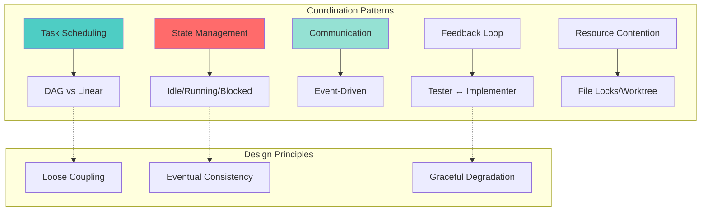
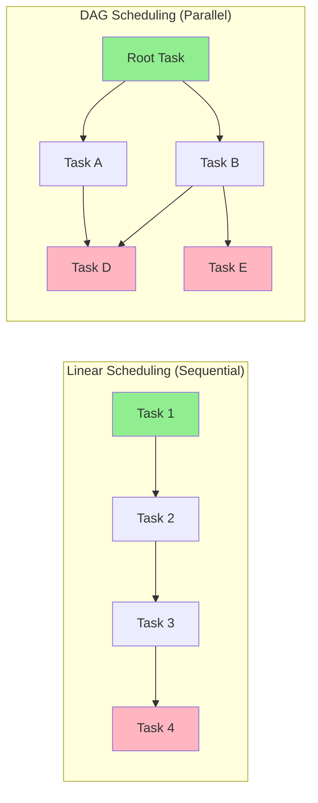
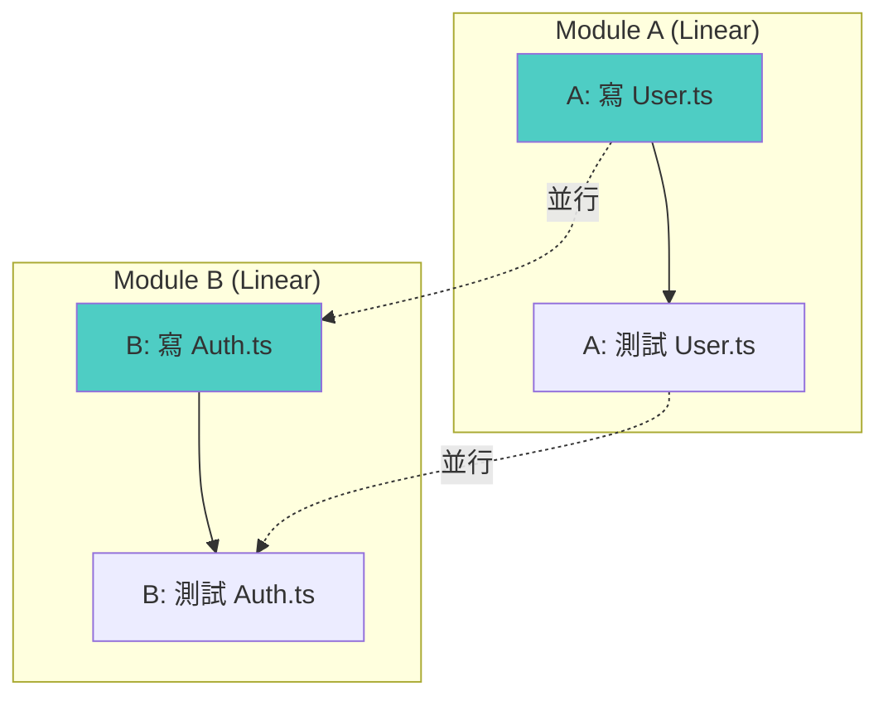
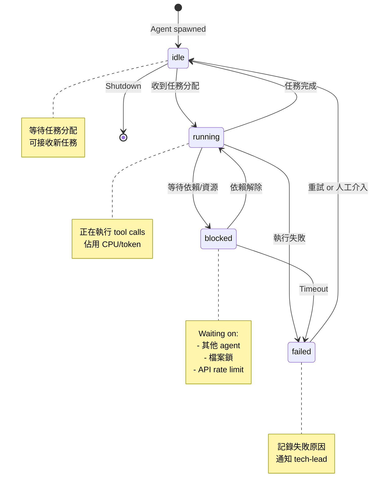
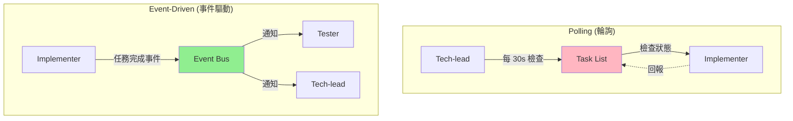
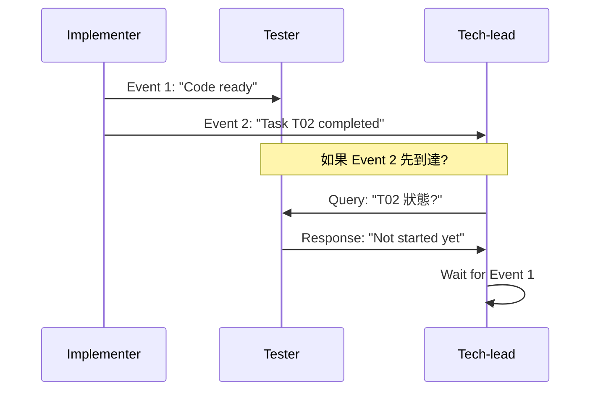
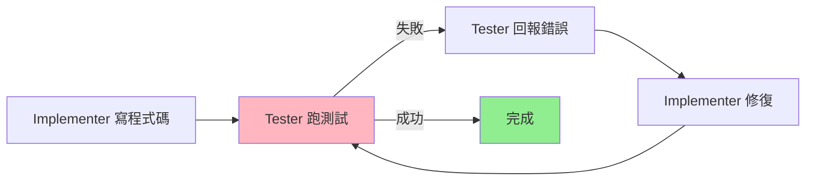
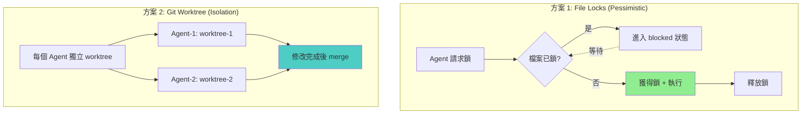
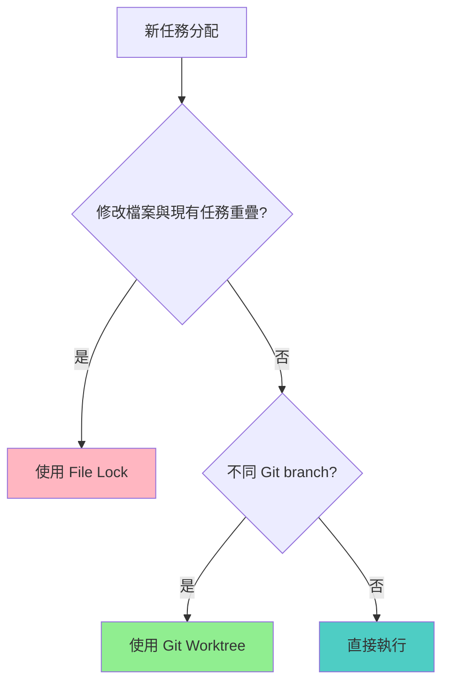
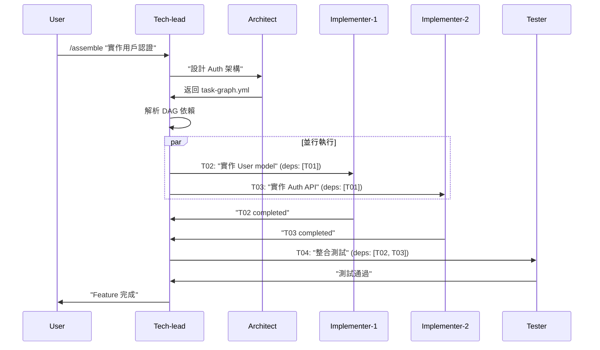

# 多代理協調設計模式完全指南

> **「When agents work in concert, coordination patterns are the sheet music.」**
> 當單一 AI Agent 進化為 Agent Army，我們需要的不只是技術實現，而是經過驗證的協調模式。
> 本指南基於 Claude Code Agent Teams、分散式系統理論、實務經驗，提供可執行的多代理協調架構。



---

## 目錄

1. [任務排程模式：DAG vs Linear](#1-任務排程模式dag-vs-linear)
2. [Agent 狀態機設計](#2-agent-狀態機設計)
3. [事件驅動通訊架構](#3-事件驅動通訊架構)
4. [回饋迴圈優化](#4-回饋迴圈優化)
5. [資源競爭策略](#5-資源競爭策略)
6. [與 Symbiotic Engineering 整合](#6-與-symbiotic-engineering-整合)
7. [最佳實踐檢查清單](#7-最佳實踐檢查清單)
8. [參考資源](#8-參考資源)

---

## 1. 任務排程模式：DAG vs Linear

### 1.1 設計空間對比



| 維度 | Linear (Sequential) | DAG (Directed Acyclic Graph) |
|------|---------------------|------------------------------|
| **並行度** | 低（一次一個任務） | 高（無依賴的任務可並行） |
| **複雜度** | 簡單（FIFO queue） | 複雜（需要依賴解析） |
| **適用場景** | 順序依賴強（寫 code → 測試 → 部署） | 獨立子任務多（前端 + 後端 + DB schema） |
| **死鎖風險** | 無 | 有（循環依賴檢測） |
| **Agent Army 應用** | `/sprint` 技能（功能開發流程） | `/assemble` 技能（大型 feature 拆解） |

### 1.2 實作對比

#### Linear Scheduling (Bash Queue)
```bash
# .claude/autopilot/backlog.sh
TASKS=(
  "T01: 設計資料庫 schema"
  "T02: 實作 API 端點"
  "T03: 撰寫測試"
)

for task in "${TASKS[@]}"; do
  claude --msg "$task"
done
```

**優點**：
- 實作簡單
- Context 累積清晰（每個任務基於前一個）

**缺點**：
- 浪費時間（前端和後端可並行，卻序列執行）
- 阻塞風險（Task 2 失敗會阻擋 Task 3）

#### DAG Scheduling (Agent Teams + Task List)
```yaml
# .claude/tasks/feature-auth/task-graph.yml
tasks:
  - id: T01
    name: "設計 Auth schema"
    agent: architect
    deps: []
  - id: T02
    name: "實作 User model"
    agent: implementer
    deps: [T01]
  - id: T03
    name: "實作 Login API"
    agent: implementer
    deps: [T01]
  - id: T04
    name: "整合測試"
    agent: tester
    deps: [T02, T03]
```

**並行執行決策**：
```mermaid
graph TD
    A[檢查 Task List] --> B{有無 deps=[] 的任務?}
    B -->|有| C[啟動所有無依賴任務]
    B -->|無| D[檢查已完成任務]
    D --> E{是否有任務的依賴都已完成?}
    E -->|是| F[啟動這些任務]
    E -->|否| G[等待 or 告警死鎖]
    C --> H[更新任務狀態為 running]
    F --> H
    H --> I[Agent 執行]
    I --> J{任務完成?}
    J -->|是| K[標記 completed]
    J -->|否| L{任務失敗?}
    L -->|是| M[標記 failed + 阻塞依賴它的任務]
    K --> A
    M --> A

    style C fill:#90EE90
    style G fill:#FF6B6B
    style M fill:#FFB6C1
```

**優點**：
- 最大化並行度（T02 和 T03 可同時執行）
- 失敗隔離（T02 失敗不影響 T03）

**缺點**：
- 需要任務依賴元資料（BACKLOG.md 需包含 `deps` 欄位）
- 並行 agent 可能產生衝突（需資源協調）

### 1.3 混合策略（Agent Army 推薦）

**階段一（Planning）**：DAG 模式
- Architect agent 分析需求
- 拆解為獨立子任務
- 生成 task-graph.yml

**階段二（Execution）**：DAG → Linear 混合
- 同一檔案的任務強制 linear（避免衝突）
- 不同模組/檔案的任務可 DAG 並行



**實作提示**：
```bash
# .claude/autopilot/scheduler.sh
# 從 task-graph.yml 解析依賴
# 同檔案任務加入 implicit 依賴
# 使用 tmux 並行啟動 independent agents
```

---

## 2. Agent 狀態機設計

### 2.1 Agent 生命週期狀態



### 2.2 狀態轉換規則

| 狀態 | 允許轉換 | 觸發條件 | Agent Army 範例 |
|------|---------|---------|-----------------|
| **idle** | → running | `TaskUpdate(owner: agent_name)` | Tech-lead 分配任務給 implementer |
| **running** | → idle | 任務標記 `completed` | Implementer 完成檔案修改 |
| **running** | → blocked | 依賴未完成 or 資源被佔用 | Tester 等待 implementer 完成程式碼 |
| **blocked** | → running | 依賴完成 or 資源釋放 | Implementer 完成後通知 tester |
| **running** | → failed | 執行錯誤 or timeout | 測試失敗、編譯錯誤 |
| **failed** | → idle | 重試 or 人工修正 | Tech-lead 收到告警後指派修復 |

### 2.3 實作：狀態持久化

**資料結構（`.claude/teams/{team-name}/agent-states.json`）**：
```json
{
  "agents": [
    {
      "name": "implementer-1",
      "agentId": "uuid-1234",
      "state": "running",
      "currentTask": "T02",
      "lastUpdated": "2026-03-06T17:00:00Z",
      "metadata": {
        "startedAt": "2026-03-06T16:55:00Z",
        "blockedReason": null,
        "retryCount": 0
      }
    },
    {
      "name": "tester-1",
      "agentId": "uuid-5678",
      "state": "blocked",
      "currentTask": "T03",
      "lastUpdated": "2026-03-06T17:02:00Z",
      "metadata": {
        "startedAt": "2026-03-06T17:00:00Z",
        "blockedReason": "waiting for T02 completion",
        "retryCount": 0
      }
    }
  ]
}
```

**更新機制**：
```bash
# Tech-lead agent 監控狀態
claude --msg "Check agent-states.json and reassign failed tasks"
```

### 2.4 閒置通知處理

**問題**：Agent 每個 turn 結束後都會自動進入 `idle` 狀態並發送通知。

**最佳實踐**：
- **不要反應過度**：Idle 通知是正常的（agent 發完訊息就 idle）
- **只在以下情況介入**：
  - Agent `failed` 狀態超過 5 分鐘
  - Agent `blocked` 狀態超過 15 分鐘
  - 所有 agent 都 `idle` 但任務未完成（可能需要新任務分配）

---

## 3. 事件驅動通訊架構

### 3.1 通訊模式對比



| 模式 | 優點 | 缺點 | Agent Army 應用 |
|------|------|------|-----------------|
| **Polling** | 簡單、無需事件系統 | 浪費資源、延遲高 | 不推薦（token 成本高） |
| **Event-Driven** | 即時、資源高效 | 需要事件基礎設施 | **推薦**（使用 SendMessage） |

### 3.2 事件類型定義

**Agent Army 核心事件**：

```typescript
// 事件類型定義
type AgentEvent =
  | { type: 'task_assigned'; taskId: string; agentName: string }
  | { type: 'task_completed'; taskId: string; agentName: string; result: string }
  | { type: 'task_failed'; taskId: string; agentName: string; error: string }
  | { type: 'agent_blocked'; agentName: string; reason: string }
  | { type: 'resource_locked'; resource: string; holder: string }
  | { type: 'resource_released'; resource: string };
```

### 3.3 實作：SendMessage 作為事件匯流排

**場景**：Implementer 完成程式碼後通知 Tester

**Implementer agent**：
```json
{
  "type": "message",
  "recipient": "tester-1",
  "content": "T02 completed. Files modified: src/auth/user.ts. Ready for testing.",
  "summary": "T02 完成，可開始測試"
}
```

**Tech-lead agent（監聽廣播事件）**：
```json
{
  "type": "broadcast",
  "content": "CRITICAL: T05 failed due to API timeout. All dependent tasks blocked.",
  "summary": "T05 失敗，阻塞下游任務"
}
```

**注意**：
- **優先使用 `message`（點對點）**：降低成本
- **僅在緊急情況使用 `broadcast`**：Critical failure, 全員需停止的場景

### 3.4 事件順序保證

**問題**：分散式系統中事件可能亂序到達。

**解決方案**：


**實作提示**：
- Task List 作為 **Single Source of Truth**
- Agent 先更新 Task List (`TaskUpdate`)，再發送訊息
- 接收方收到訊息後，先檢查 Task List 狀態

---

## 4. 回饋迴圈優化

### 4.1 Tester ↔ Implementer 回饋循環

**經典問題**：測試失敗 → 修程式碼 → 再測試 → 又失敗 → 無限循環



**優化策略**：

#### 4.1.1 限制回饋次數
```yaml
# .claude/skills/integration-test.yml
feedback_loop:
  max_iterations: 3
  on_max_reached:
    action: escalate_to_tech_lead
    message: "Tester and Implementer stuck in loop. Manual review needed."
```

#### 4.1.2 Root Cause Analysis
**Tester agent 不要只丟錯誤訊息，要提供 context**：

❌ **Bad**:
```
Test failed: AssertionError
```

✅ **Good**:
```
Test failed: `test_user_login`
Error: AssertionError: expected 200, got 401
Root cause: JWT token not included in request headers
Suggested fix: Check `auth.middleware.ts:42` - missing `req.headers.authorization`
```

#### 4.1.3 Diff-Aware Testing
**只重跑受影響的測試**：

```bash
# Tester agent 執行
git diff HEAD~1 --name-only | grep '.ts$' | xargs jest --findRelatedTests
```

### 4.2 回饋迴圈監控

**指標**：
- `feedback_loop_count`：同一任務的 tester ↔ implementer 往返次數
- `time_to_green`：從開始寫程式碼到測試通過的時間
- `test_flakiness_rate`：測試結果不穩定的比例

**告警規則**：
```yaml
alerts:
  - name: "Infinite feedback loop"
    condition: "feedback_loop_count > 5"
    action: "Notify tech-lead + pause task"
  - name: "Slow convergence"
    condition: "time_to_green > 30min"
    action: "Suggest breaking down task"
```

---

## 5. 資源競爭策略

### 5.1 問題場景

**Case 1: 檔案寫入衝突**
```
Implementer-1: 正在修改 `user.ts`
Implementer-2: 也要修改 `user.ts`
→ Git merge conflict
```

**Case 2: Git branch 競爭**
```
Tester: 在 `feature/auth` 跑測試
Implementer: 想 checkout 到 `main` 並 merge
→ Worktree busy
```

### 5.2 解決方案對比



| 方案 | 優點 | 缺點 | 適用場景 |
|------|------|------|---------|
| **File Locks** | 簡單、避免衝突 | 序列化執行、降低並行度 | 同一檔案頻繁修改 |
| **Git Worktree** | 完全隔離、高並行 | 需要 merge、可能有衝突 | 不同模組並行開發 |

### 5.3 實作：File Lock Manager

**檔案結構**：
```
.claude/teams/{team-name}/locks/
├── user.ts.lock          # 記錄持有者
└── auth.middleware.ts.lock
```

**Lock 內容**：
```json
{
  "holder": "implementer-1",
  "acquiredAt": "2026-03-06T17:00:00Z",
  "taskId": "T02",
  "ttl": 600
}
```

**Agent 請求流程**：
```bash
# 在 implementer agent 的 system prompt
# AI-BOUNDARY: 修改檔案前檢查鎖
if [ -f ".claude/teams/feature-auth/locks/user.ts.lock" ]; then
  HOLDER=$(jq -r '.holder' .claude/teams/feature-auth/locks/user.ts.lock)
  if [ "$HOLDER" != "$AGENT_NAME" ]; then
    # 進入 blocked 狀態
    SendMessage --type message --recipient tech-lead --content "Blocked on user.ts (held by $HOLDER)"
    exit 1
  fi
fi

# 獲得鎖
echo "{\"holder\":\"$AGENT_NAME\",\"acquiredAt\":\"$(date -u +%Y-%m-%dT%H:%M:%SZ)\",\"taskId\":\"$TASK_ID\",\"ttl\":600}" > .claude/teams/feature-auth/locks/user.ts.lock

# 執行修改
edit user.ts

# 釋放鎖
rm .claude/teams/feature-auth/locks/user.ts.lock
```

### 5.4 實作：Git Worktree 隔離

**設定**：
```bash
# Tech-lead agent 初始化
git worktree add ../worktree-implementer-1 -b task-T02
git worktree add ../worktree-tester-1 -b task-T03
```

**Agent 執行環境變數**：
```bash
# .claude/teams/feature-auth/config.json
{
  "members": [
    {
      "name": "implementer-1",
      "worktree": "/path/to/worktree-implementer-1"
    },
    {
      "name": "tester-1",
      "worktree": "/path/to/worktree-tester-1"
    }
  ]
}
```

**清理**：
```bash
# Tech-lead agent 任務完成後
git worktree remove ../worktree-implementer-1
```

### 5.5 混合策略（推薦）

**規則**：
- **同模組任務**：使用 File Locks（避免 merge conflict）
- **跨模組任務**：使用 Git Worktree（最大化並行）

**決策樹**：


---

## 6. 與 Symbiotic Engineering 整合

### 6.1 Agent Army 技能映射

| 協調模式 | Agent Army 技能 | 實作位置 |
|---------|----------------|---------|
| **DAG Scheduling** | `/assemble` | `.claude/skills/assemble.yml` |
| **Linear Scheduling** | `/sprint` | `.claude/skills/sprint.yml` |
| **狀態管理** | `tech-lead` agent | `.claude/agents/tech-lead.yml` |
| **事件驅動** | `SendMessage` | Claude Code CLI built-in |
| **回饋迴圈** | `/integration-test` | `.claude/skills/integration-test.yml` |
| **資源鎖** | `context-sync` | `.claude/skills/context-sync.yml` |

### 6.2 `/assemble` 技能增強建議

**現有實作**（基於記憶）：
```yaml
# .claude/skills/assemble.yml
agents:
  - tech-lead: 協調
  - architect: 設計
  - implementer: 編碼
  - tester: 測試
  - documenter: 文件
```

**增強點**：
1. **加入 DAG 排程**
   ```yaml
   task_scheduling:
     mode: dag  # 或 linear
     dag_resolver: ".claude/scripts/resolve-task-deps.sh"
   ```

2. **狀態監控**
   ```yaml
   monitoring:
     agent_states_file: ".claude/teams/{team-name}/agent-states.json"
     health_check_interval: 60  # seconds
   ```

3. **資源隔離**
   ```yaml
   resource_isolation:
     use_worktree: true
     worktree_prefix: "worktree-"
   ```

### 6.3 實作範例：`/assemble` with DAG

**使用者執行**：
```bash
/assemble "實作用戶認證系統 (User model + Auth API + 測試)"
```

**Tech-lead agent 執行流程**：


---

## 7. 最佳實踐檢查清單

### 7.1 任務設計
- [ ] 任務粒度適中（單個任務 < 30 分鐘）
- [ ] 明確定義依賴關係（在 BACKLOG.md 或 task-graph.yml）
- [ ] 避免循環依賴（DAG 檢測）
- [ ] 同檔案任務序列化（File Lock 或隱式依賴）

### 7.2 狀態管理
- [ ] 所有 agent 狀態持久化（`.claude/teams/{team-name}/agent-states.json`）
- [ ] 超時檢測（blocked > 15min, failed > 5min）
- [ ] 狀態轉換 audit log

### 7.3 通訊
- [ ] 優先使用點對點 `message`（非 broadcast）
- [ ] 事件包含足夠 context（taskId, agentName, timestamp）
- [ ] 訊息包含可執行建議（非僅錯誤訊息）

### 7.4 回饋迴圈
- [ ] 限制最大迴圈次數（建議 3-5 次）
- [ ] Tester 提供 Root Cause Analysis
- [ ] 只重跑受影響的測試（diff-aware）

### 7.5 資源競爭
- [ ] 同模組任務使用 File Lock
- [ ] 跨模組任務使用 Git Worktree
- [ ] Lock TTL 設定（避免死鎖）
- [ ] Worktree 清理機制

### 7.6 可觀測性
- [ ] 所有協調事件寫入 log（`.claude/autopilot/logs/coordination.log`）
- [ ] 監控關鍵指標（feedback_loop_count, time_to_green, lock_wait_time）
- [ ] 失敗告警（slack webhook or email）

---

## 8. 參考資源

### 8.1 學術論文

1. **分散式系統協調**
   - Leslie Lamport (1978). "Time, Clocks, and the Ordering of Events in a Distributed System"
   - 提供事件順序保證的理論基礎
   - [論文連結](https://lamport.azurewebsites.net/pubs/time-clocks.pdf)

2. **Multi-Agent Systems**
   - Wooldridge, M. (2009). "An Introduction to MultiAgent Systems" (2nd ed.)
   - 涵蓋 agent 通訊、協調、談判
   - [Google Scholar](https://scholar.google.com/scholar?q=wooldridge+multiagent+systems)

3. **Task Scheduling in Distributed Systems**
   - Coffman, E. G., & Graham, R. L. (1972). "Optimal scheduling for two-processor systems"
   - DAG 排程演算法理論
   - [IEEE Xplore](https://ieeexplore.ieee.org/)

### 8.2 開源專案

1. **Apache Airflow**
   - DAG-based task orchestration
   - [GitHub](https://github.com/apache/airflow)
   - 借鏡其 DAG 依賴解析和狀態機設計

2. **Temporal.io**
   - Workflow orchestration with state management
   - [Documentation](https://docs.temporal.io/)
   - 參考其 event-driven architecture

3. **LangGraph**
   - Multi-agent coordination for LLMs
   - [GitHub](https://github.com/langchain-ai/langgraph)
   - 研究其 graph-based agent flow

### 8.3 Symbiotic Engineering 內部文件

| 文件 | 相關章節 |
|------|---------|
| [Agent Teams 平行開發](agent-teams-parallel-development.md) | Git Worktree 實作 |
| [AI Agent 可觀測性](ai-agent-observability-guide.md) | 狀態監控、指標設計 |
| [持續自主迭代](continuous-iteration-research.md) | Ralph Loop、tmux 編排器 |
| [Agent 安全強化](agent-security-hardening-guide.md) | 權限管理、audit trail |

### 8.4 工具與函式庫

1. **jq** - JSON 處理（解析 task-graph.yml）
   ```bash
   brew install jq
   ```

2. **tmux** - 多 agent 並行執行
   ```bash
   brew install tmux
   ```

3. **flock** - File locking (Linux)
   ```bash
   # macOS 使用 shlock 替代
   ```

4. **graphviz** - DAG 視覺化
   ```bash
   brew install graphviz
   dot -Tpng task-graph.dot -o task-graph.png
   ```

---

## 結論

多代理協調是 **工程問題，不是魔法**。成功的關鍵在於：

1. **選對排程模式**：理解你的任務依賴（DAG vs Linear）
2. **嚴謹的狀態管理**：Agent 狀態是 Single Source of Truth
3. **高效的通訊**：Event-driven > Polling
4. **可控的回饋迴圈**：限制次數 + Root Cause Analysis
5. **智慧的資源協調**：File Lock + Git Worktree 混合策略

**下一步**：
- 實作 DAG 排程到 `/assemble` 技能
- 加入 agent-states.json 監控到 `tech-lead` agent
- 建立 File Lock Manager（`.claude/scripts/lock-manager.sh`）

---

**作者**: Symbiotic Engineering Team
**最後更新**: 2026-03-06
**版本**: 1.0.0
**授權**: MIT License

**引用格式**:
```
Symbiotic Engineering Team. (2026). 多代理協調設計模式完全指南.
Retrieved from https://github.com/OWNER/symbiotic-engineering
```
