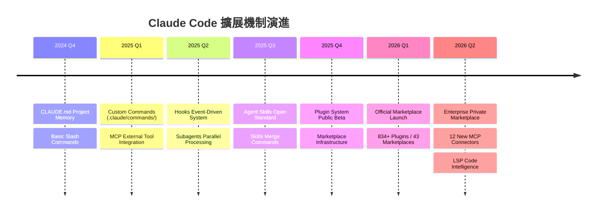
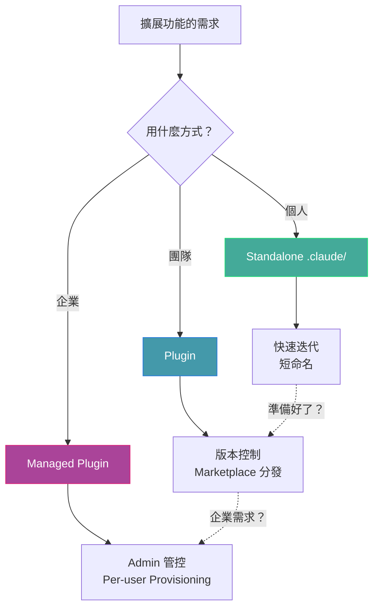
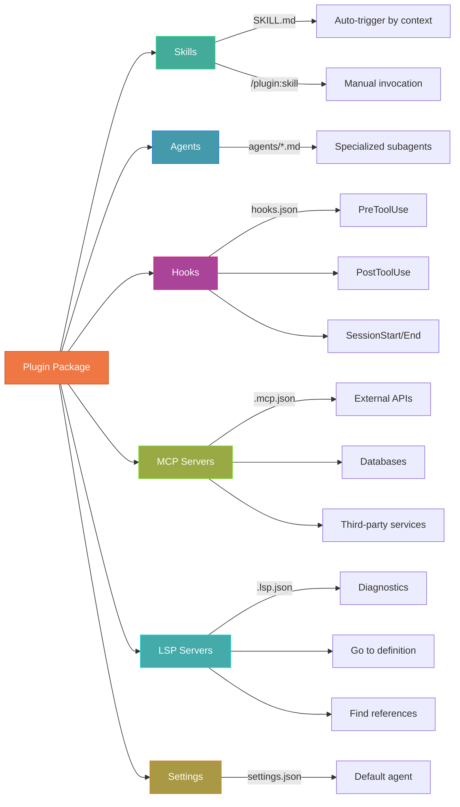
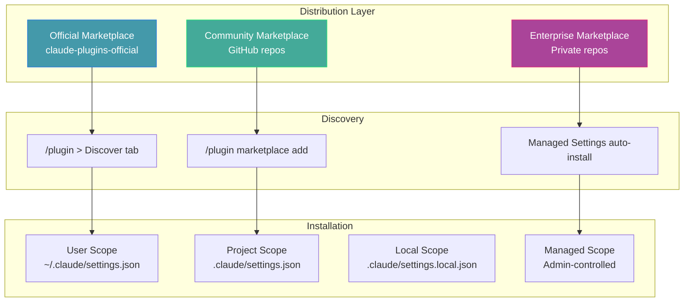
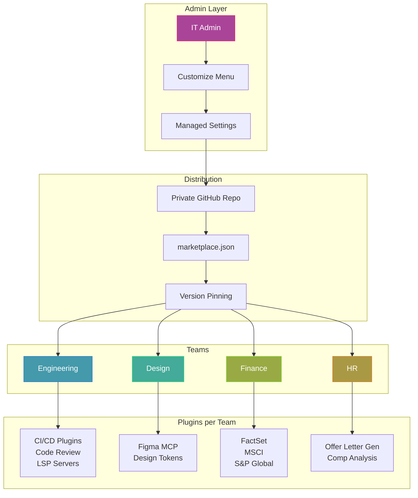

# Plugins 生態系完全指南：從開發到分發

> **當 Skills 學會了打包、Hooks 有了版本號、MCP Servers 能一鍵安裝——Plugin 就是讓一切可分享的那層封裝。**
> 它不只是功能的集合，而是一個完整的分發單位。



---

## 目錄

1. [什麼是 Plugin？](#1-什麼是-plugin)
2. [Plugin 架構深度解析](#2-plugin-架構深度解析)
3. [Plugin 開發實戰](#3-plugin-開發實戰)
4. [Marketplace 生態系](#4-marketplace-生態系)
5. [企業 Private Marketplace](#5-企業-private-marketplace)
6. [LSP 整合與 Code Intelligence](#6-lsp-整合與-code-intelligence)
7. [MCP Connectors 生態](#7-mcp-connectors-生態)
8. [實戰範例集](#8-實戰範例集)
9. [安全與合規](#9-安全與合規)
10. [最佳實踐與常見陷阱](#10-最佳實踐與常見陷阱)
11. [未來展望](#11-未來展望)
12. [參考文獻](#12-參考文獻)

---

## 1. 什麼是 Plugin？

### 1.1 一句話定義

**Plugin 是 Skills + Hooks + Commands + Agents + MCP Servers + LSP Servers 的標準化打包單位，透過 Marketplace 實現一鍵安裝與版本管理。**

如果 Skill 是教 Claude 一項技能，那 Plugin 就是把整套工具箱包好、貼上標籤、放上貨架。

### 1.2 Plugin vs Standalone 配置

| 面向 | Standalone (`.claude/`) | Plugin |
|------|------------------------|--------|
| **命名空間** | `/hello` | `/plugin-name:hello` |
| **分享性** | 手動複製 | Marketplace 一鍵安裝 |
| **版本管理** | 無 | Semantic Versioning |
| **適用場景** | 個人工作流、專案特定 | 團隊共享、社群分發 |
| **跨專案** | 需手動複製到每個專案 | 安裝一次，全域可用 |
| **更新機制** | 手動 | 自動更新通知 |
| **衝突管理** | 可能命名衝突 | Namespace 隔離 |

### 1.3 Plugin 解決的核心問題



> **升級路徑**：先在 `.claude/` 中快速實驗，打磨穩定後轉為 Plugin 發布到 Marketplace，企業則透過 Managed Settings 強制部署。

---

## 2. Plugin 架構深度解析

### 2.1 目錄結構規範

一個完整的 Plugin 遵循以下結構：

```
enterprise-plugin/
├── .claude-plugin/           # Metadata directory
│   └── plugin.json             # Plugin manifest (ONLY this file here)
├── commands/                 # Slash commands (legacy, use skills/)
│   ├── status.md
│   └── logs.md
├── agents/                   # Custom agent definitions
│   ├── security-reviewer.md
│   └── performance-tester.md
├── skills/                   # Agent Skills with SKILL.md
│   ├── code-reviewer/
│   │   └── SKILL.md
│   └── pdf-processor/
│       ├── SKILL.md
│       └── scripts/
├── hooks/                    # Event handlers
│   └── hooks.json
├── settings.json             # Default settings for the plugin
├── .mcp.json                 # MCP server configurations
├── .lsp.json                 # LSP server configurations
├── scripts/                  # Hook and utility scripts
│   ├── security-scan.sh
│   └── format-code.py
├── LICENSE
└── CHANGELOG.md
```

> **關鍵錯誤提醒**：只有 `plugin.json` 放在 `.claude-plugin/` 裡面。`commands/`、`agents/`、`skills/`、`hooks/` 等全部放在 Plugin 根目錄。這是最常見的初學者錯誤。

### 2.2 plugin.json Manifest 完整規格

```json
{ "name": "my-awesome-plugin",
  "version": "2.1.0",
  "description": "A comprehensive development toolkit",
  "author": { "name": "Dev Team", "email": "dev@company.com" },
  "homepage": "https://docs.example.com/plugin",
  "repository": "https://github.com/dev-team/plugin",
  "license": "MIT",
  "keywords": ["development", "automation", "testing"],
  "commands": ["./custom/commands/"],
  "agents": ["./agents/security-reviewer.md"],
  "skills": "./skills/",
  "hooks": "./hooks/hooks.json",
  "mcpServers": "./.mcp.json",
  "lspServers": "./.lsp.json"
}
```

| 欄位 | 類型 | 必填 | 說明 |
|------|------|------|------|
| `name` | string | Yes | 唯一識別碼（kebab-case），也是命名空間前綴 |
| `version` | string | No | 語意版本號（MAJOR.MINOR.PATCH） |
| `description` | string | No | 簡短描述，顯示在 Plugin Manager |
| `author` | object | No | 作者資訊（name, email, url） |
| `homepage` / `repository` | string | No | 文件 / 原始碼 URL |
| `license` / `keywords` | string/array | No | SPDX 授權 / 搜尋標籤 |
| `commands` / `agents` / `skills` | string/array | No | 組件路徑（補充預設目錄，不取代） |
| `hooks` / `mcpServers` / `lspServers` | string/object | No | 配置路徑或內嵌配置 |

### 2.3 六大組件架構圖



### 2.4 環境變數與路徑解析

Plugin 安裝後會被複製到 `~/.claude/plugins/cache`，因此不能用絕對路徑或 `../`。在 hooks 和 MCP 配置中使用 `${CLAUDE_PLUGIN_ROOT}` 引用 Plugin 內的檔案：

```json
{ "command": "${CLAUDE_PLUGIN_ROOT}/scripts/lint.sh" }
```

路徑規則：以 `./` 開頭（相對 Plugin 根目錄）、用 `${CLAUDE_PLUGIN_ROOT}` 引用腳本、如需外部檔案用 symlink。

---

## 3. Plugin 開發實戰

### 3.1 從 Skill 到 Plugin 的升級路徑

假設你已經有一個在 `.claude/skills/` 中運作良好的 Skill，以下是轉換步驟：

**Step 1：建立 Plugin 目錄結構**

```bash
mkdir -p my-plugin/.claude-plugin
mkdir -p my-plugin/skills/code-review
```

**Step 2：建立 Manifest**

```json
// my-plugin/.claude-plugin/plugin.json
{
  "name": "code-review-toolkit",
  "description": "Automated code review with best practices enforcement",
  "version": "1.0.0",
  "author": {
    "name": "Your Name"
  }
}
```

**Step 3：遷移 Skill**

```bash
# Copy from standalone to plugin
cp .claude/skills/code-review/SKILL.md my-plugin/skills/code-review/
```

**Step 4：本地測試**

```bash
claude --plugin-dir ./my-plugin
# Then try: /code-review-toolkit:code-review
```

### 3.2 遷移對照表

| Standalone (`.claude/`) | Plugin | 注意事項 |
|:----------------------|:-------|:---------|
| `.claude/commands/` | `plugin/commands/` | 直接複製 |
| `.claude/agents/` | `plugin/agents/` | 直接複製 |
| `.claude/skills/` | `plugin/skills/` | 直接複製 |
| `settings.json` 中的 hooks | `hooks/hooks.json` | 格式相同，抽出即可 |
| `.claude/settings.json` 中的 MCP | `plugin/.mcp.json` | 路徑改用 `${CLAUDE_PLUGIN_ROOT}` |

### 3.3 開發一個完整的 Plugin（TypeScript Linter）

以下示範一個整合 ESLint 自動修正的 Plugin：

**目錄結構：**

```
eslint-autofix/
├── .claude-plugin/
│   └── plugin.json
├── skills/
│   └── lint-fix/
│       └── SKILL.md
├── hooks/
│   └── hooks.json
└── scripts/
    └── run-eslint.sh
```

**plugin.json：**

```json
{
  "name": "eslint-autofix",
  "description": "Automatically runs ESLint fix after every file edit",
  "version": "1.0.0",
  "keywords": ["eslint", "linting", "autofix"]
}
```

**skills/lint-fix/SKILL.md：**

```markdown
---
description: Run ESLint with auto-fix on specified files
disable-model-invocation: true
---
Run ESLint with the --fix flag on the file specified by $ARGUMENTS.
Report any remaining issues that couldn't be auto-fixed.
```

**hooks/hooks.json（每次 Write/Edit 後自動觸發 ESLint）：**

```json
{ "hooks": { "PostToolUse": [{
    "matcher": "Write|Edit",
    "hooks": [{ "type": "command",
      "command": "jq -r '.tool_input.file_path' | xargs npx eslint --fix 2>/dev/null || true"
    }]
}]}}

### 3.4 開發一個 Python Plugin（Security Scanner）

```
security-scanner/
├── .claude-plugin/
│   └── plugin.json
├── agents/
│   └── security-reviewer.md
├── skills/
│   └── scan/
│       └── SKILL.md
└── scripts/
    └── scan.py
```

**agents/security-reviewer.md：**

```markdown
---
name: security-reviewer
description: Specialized agent for security code review. Invoked when reviewing code for vulnerabilities, checking for OWASP issues, or analyzing security posture.
---

You are a security-focused code reviewer. When analyzing code:
1. Check for OWASP Top 10 vulnerabilities
2. Look for hardcoded credentials or secrets
3. Verify input validation and sanitization
4. Check authentication and authorization patterns
Report findings with severity levels: CRITICAL, HIGH, MEDIUM, LOW.
```

**scripts/scan.py（核心片段）：**

```python
#!/usr/bin/env python3
"""Security scanner hook for Claude Code plugin."""
import json, re, sys

PATTERNS = {
    "hardcoded_secret": (r'(?:password|secret|api_key)\s*=\s*["\'][^"\']+["\']', "HIGH"),
    "sql_injection":    (r'f["\'].*(?:SELECT|INSERT|UPDATE|DELETE).*\{', "CRITICAL"),
    "eval_usage":       (r'\beval\s*\(', "HIGH"),
}

def scan_file(path: str) -> list[dict]:
    findings = []
    with open(path) as f:
        for num, line in enumerate(f, 1):
            for name, (pat, sev) in PATTERNS.items():
                if re.search(pat, line, re.IGNORECASE):
                    findings.append({"rule": name, "severity": sev, "line": num})
    return findings

if __name__ == "__main__":
    hook_input = json.load(sys.stdin)
    path = hook_input.get("tool_input", {}).get("file_path", "")
    if path:
        print(json.dumps(scan_file(path), indent=2))
```

### 3.5 測試與除錯

```bash
# Load plugin for testing
claude --plugin-dir ./my-plugin

# Load multiple plugins simultaneously
claude --plugin-dir ./plugin-one --plugin-dir ./plugin-two

# Debug mode - see plugin loading details
claude --debug

# Validate plugin structure
claude plugin validate .

# Or from within Claude Code TUI:
/plugin validate .
```

**除錯檢查清單：**

| 症狀 | 原因 | 解決方式 |
|:-----|:-----|:---------|
| Plugin 不載入 | `plugin.json` JSON 格式錯誤 | `claude plugin validate` |
| Commands 不出現 | 目錄放在 `.claude-plugin/` 裡面 | 移到 Plugin 根目錄 |
| Hooks 不觸發 | Script 沒有執行權限 | `chmod +x script.sh` |
| MCP Server 失敗 | 路徑未使用 `${CLAUDE_PLUGIN_ROOT}` | 改用環境變數 |
| LSP 找不到 | Language server binary 未安裝 | 安裝對應的二進位檔 |

---

## 4. Marketplace 生態系

### 4.1 Marketplace 運作機制



### 4.2 三類 Marketplace

#### Official Marketplace（官方）

由 Anthropic 維護的 `claude-plugins-official`，啟動 Claude Code 時自動可用。

```bash
# Browse official plugins
/plugin  # Go to "Discover" tab

# Install from official marketplace
/plugin install plugin-name@claude-plugins-official
```

**提交到官方 Marketplace：**
- Claude.ai：[claude.ai/settings/plugins/submit](https://claude.ai/settings/plugins/submit)
- Console：[platform.claude.com/plugins/submit](https://platform.claude.com/plugins/submit)

#### Community Marketplace（社群）

任何人都可以建立，託管在 GitHub、GitLab 或任何 Git 服務：

```bash
# Add from GitHub
/plugin marketplace add anthropics/claude-code

# Add from GitLab
/plugin marketplace add https://gitlab.com/company/plugins.git

# Add specific branch or tag
/plugin marketplace add https://gitlab.com/company/plugins.git#v1.0.0

# Add from local path
/plugin marketplace add ./my-marketplace
```

#### Enterprise Marketplace（企業）

私有部署，Admin 控制存取：

```json
// .claude/settings.json (project level)
{
  "extraKnownMarketplaces": {
    "company-tools": {
      "source": {
        "source": "github",
        "repo": "your-org/claude-plugins"
      }
    }
  }
}
```

### 4.3 官方 Marketplace 分類分析

截至 2026 年 3 月，官方 Marketplace 包含以下主要分類：

| 分類 | 代表 Plugin | 說明 |
|:-----|:-----------|:-----|
| **Code Intelligence** | `typescript-lsp`, `pyright-lsp`, `rust-analyzer-lsp` | LSP 整合，提供即時診斷 |
| **External Integrations** | `github`, `gitlab`, `slack`, `figma` | MCP Server 整合外部服務 |
| **Development Workflows** | `commit-commands`, `pr-review-toolkit` | Git 工作流自動化 |
| **Output Styles** | `explanatory-output-style`, `learning-output-style` | 自訂 Claude 回應風格 |
| **Security** | Security Guidance plugin | 程式碼安全掃描 |
| **Design** | Figma MCP | 設計稿轉程式碼 |

### 4.4 社群生態數據

截至 2026 年 Q1：

- **43** 個已知 Marketplace
- **834+** 個可安裝 Plugin
- **9,000+** 跨所有平台（含 ClaudePluginHub、claude-plugins.dev 等）
- **8,900+** 星標在 `anthropics/claude-plugins-official` repo

### 4.5 marketplace.json 與 Plugin Source 類型

```json
{ "name": "company-tools",
  "owner": { "name": "DevTools Team" },
  "metadata": { "description": "Internal development tools", "pluginRoot": "./plugins" },
  "plugins": [
    { "name": "formatter", "source": "./plugins/formatter", "version": "2.1.0" },
    { "name": "deploy",   "source": { "source": "github", "repo": "co/deploy", "ref": "v2.0" } },
    { "name": "npm-tool", "source": { "source": "npm", "package": "@acme/plugin", "version": "^2.0" } }
  ]
}
```

| Source 類型 | 格式 | 說明 |
|:-----------|:-----|:-----|
| Relative path | `"./plugins/my-plugin"` | 同 repo 內的相對路徑 |
| GitHub | `{"source": "github", "repo": "owner/repo"}` | 支援 `ref` 和 `sha` pin |
| Git URL | `{"source": "url", "url": "https://...git"}` | GitLab、Bitbucket 等 |
| npm | `{"source": "npm", "package": "@org/pkg"}` | 支援 `version` 和 `registry` |
| pip | `{"source": "pip", "package": "my-pkg"}` | Python 套件 |

---

## 5. 企業 Private Marketplace

### 5.1 企業部署架構



### 5.2 Per-user Provisioning 與 Auto-install

企業 Admin 可以透過 Managed Settings 自動為特定團隊安裝 Plugin：

```json
// Managed settings (admin-controlled, read-only for users)
{
  "extraKnownMarketplaces": {
    "engineering-tools": {
      "source": {
        "source": "github",
        "repo": "acme-corp/engineering-plugins"
      }
    }
  },
  "enabledPlugins": {
    "code-formatter@engineering-tools": true,
    "security-scanner@engineering-tools": true,
    "commit-commands@engineering-tools": true
  }
}
```

員工信任專案資料夾後，Claude Code 會自動提示安裝這些 Marketplace 和 Plugin。

### 5.3 Marketplace 存取限制（strictKnownMarketplaces）

企業可以限制員工只能新增經核准的 Marketplace：

```json
// Allow specific marketplaces only (set in Managed Settings)
{
  "strictKnownMarketplaces": [
    { "source": "github", "repo": "acme-corp/approved-plugins" },
    { "source": "github", "repo": "acme-corp/security-tools", "ref": "v2.0" },
    { "source": "hostPattern", "hostPattern": "^github\\.internal\\.com$" }
  ]
}
// Set to [] for complete lockdown (no new marketplaces allowed)
```

### 5.4 Release Channel 策略

企業可以設置 Stable 和 Latest 兩個發布頻道——建立兩個 Marketplace，指向同一 repo 的不同 branch：

```json
// stable-tools → ref: "stable"  |  latest-tools → ref: "latest"
{ "name": "stable-tools", "plugins": [{
    "name": "code-formatter",
    "source": { "source": "github", "repo": "acme-corp/code-formatter", "ref": "stable" }
}]}
```

然後透過 Managed Settings 將 `stable-tools` 分配給一般使用者、`latest-tools` 分配給 Early Access 群組。注意：兩個 branch 的 `plugin.json` 必須宣告不同的 `version`，否則 Claude Code 會跳過更新。

### 5.5 監控與可觀測性

Anthropic 的企業方案整合了 OpenTelemetry，讓 Admin 可以追蹤：

- Plugin 使用頻率與分佈
- AI 工具呼叫量
- 各團隊的成本資料
- 異常行為偵測

這些數據以標準格式輸出，可對接既有的監控基礎設施。

### 5.6 Department-Specific Plugin 範本

Anthropic 為不同職能提供了預建範本：

| 部門 | Plugin 範本 | 核心功能 |
|:-----|:-----------|:---------|
| HR | offer-letter-gen | 自動生成錄取通知、薪資分析 |
| Design | design-critique | 設計評論框架、無障礙審核 |
| Engineering | incident-response | Standup 摘要、事故回應自動化 |
| Operations | vendor-evaluation | 文件生成、供應商評估 |
| Finance | equity-research | 財務分析、建模、報告 |

---

## 6. LSP 整合與 Code Intelligence

### 6.1 LSP 在 Plugin 中的角色

Language Server Protocol (LSP) Plugin 讓 Claude 獲得 IDE 等級的程式碼智慧功能——這在終端機環境中尤其強大。

**Claude 透過 LSP 獲得兩個關鍵能力：**

1. **自動診斷（Automatic Diagnostics）**：每次 Claude 編輯檔案後，Language Server 自動分析變更並回報錯誤。如果 Claude 引入了錯誤，它會在同一輪對話中立即發現並修正。

2. **程式碼導覽（Code Navigation）**：跳轉到定義、查找引用、獲取型別資訊、列出符號、追蹤呼叫層級。這比 grep 搜尋精準得多。

### 6.2 官方 LSP Plugin 一覽

| 語言 | Plugin 名稱 | 所需 Binary |
|:-----|:-----------|:-----------|
| C/C++ | `clangd-lsp` | `clangd` |
| C# | `csharp-lsp` | `csharp-ls` |
| Go | `gopls-lsp` | `gopls` |
| Java | `jdtls-lsp` | `jdtls` |
| Kotlin | `kotlin-lsp` | `kotlin-language-server` |
| Lua | `lua-lsp` | `lua-language-server` |
| PHP | `php-lsp` | `intelephense` |
| Python | `pyright-lsp` | `pyright-langserver` |
| Rust | `rust-analyzer-lsp` | `rust-analyzer` |
| Swift | `swift-lsp` | `sourcekit-lsp` |
| TypeScript | `typescript-lsp` | `typescript-language-server` |

**社群 LSP Plugin（boostvolt/claude-code-lsps）還支援：**
Bash/Shell、Clojure、Dart/Flutter、Elixir、Gleam、Nix、OCaml、Ruby、Terraform、YAML、Zig 等。

### 6.3 建立自訂 LSP Plugin

如果你需要支援官方未涵蓋的語言，可以自行建立 LSP Plugin：

**Go 語言範例（`.lsp.json`）：**

```json
{
  "go": {
    "command": "gopls",
    "args": ["serve"],
    "extensionToLanguage": {
      ".go": "go"
    }
  }
}
```

**Kotlin / Swift 語言範例：**

```json
{
  "kotlin": {
    "command": "kotlin-language-server",
    "extensionToLanguage": { ".kt": "kotlin", ".kts": "kotlin" }
  },
  "swift": {
    "command": "sourcekit-lsp",
    "extensionToLanguage": { ".swift": "swift" }
  }
}
```

**關鍵 LSP 配置選項：**`command`（必填）、`extensionToLanguage`（必填）、`args`、`transport`（`stdio`/`socket`）、`env`、`initializationOptions`、`settings`、`restartOnCrash`、`maxRestarts`、`startupTimeout`。

### 6.4 LSP 常見問題

| 問題 | 解法 |
|:-----|:-----|
| `Executable not found in $PATH` | 安裝對應的 language server binary |
| 大型專案記憶體使用過高 | 停用 Plugin：`/plugin disable <name>` |
| Monorepo 出現假陽性錯誤 | 設定正確的 workspace 配置 |
| Language Server 不啟動 | 在終端機手動測試 binary 是否可執行 |

---

## 7. MCP Connectors 生態

### 7.1 官方 MCP Integration Plugins

官方 Marketplace 提供了預配置好的 MCP Server Plugin，讓你不需手動設定即可連接外部服務：

| 分類 | Plugin | 連接的服務 |
|:-----|:-------|:----------|
| Source Control | `github`, `gitlab` | 版本控制平台 |
| Project Management | `atlassian`, `asana`, `linear`, `notion` | 專案管理工具 |
| Design | `figma` | 設計工具 |
| Infrastructure | `vercel`, `firebase`, `supabase` | 雲端基礎設施 |
| Communication | `slack` | 通訊平台 |
| Monitoring | `sentry` | 錯誤追蹤 |

### 7.2 2026 Q1 新增企業 MCP Connectors

Anthropic 在 2026 年 2 月新增了 12 個企業級 MCP Connector：

| 分類 | Connector | 用途 |
|:-----|:----------|:-----|
| Google Workspace | Calendar, Drive, Gmail | 行事曆、文件、郵件 |
| Financial Data | FactSet, MSCI, S&P Global, LSEG | 金融數據 |
| Sales/Marketing | Apollo, Outreach, Clay, Common Room | 銷售自動化 |
| Legal/Document | DocuSign, LegalZoom, Harvey | 法律文件 |
| Content | WordPress | 內容管理 |

### 7.3 在 Plugin 中整合 MCP Server

兩種方式：**獨立 `.mcp.json` 檔案** 或 **內嵌在 `plugin.json`**。

```json
// .mcp.json（獨立檔案）
{ "mcpServers": {
    "custom-db": {
      "command": "${CLAUDE_PLUGIN_ROOT}/servers/db-server",
      "args": ["--config", "${CLAUDE_PLUGIN_ROOT}/config.json"],
      "env": { "DB_PATH": "${CLAUDE_PLUGIN_ROOT}/data" }
    }
}}

// 或在 plugin.json 中內嵌
{ "name": "data-toolkit", "version": "1.0.0",
  "mcpServers": { "analytics": {
    "command": "python",
    "args": ["${CLAUDE_PLUGIN_ROOT}/servers/analytics.py"]
  }}
}
```

所有路徑都必須使用 `${CLAUDE_PLUGIN_ROOT}` 變數，因為 Plugin 安裝後會被複製到快取目錄。

### 7.4 自建 MCP Server 範例（Go）

用 Go 語言建立 MCP Server 並包裝為 Plugin 的配置：

```json
{
  "name": "health-checker",
  "version": "1.0.0",
  "mcpServers": {
    "health": {
      "command": "${CLAUDE_PLUGIN_ROOT}/servers/health-check",
      "args": ["--serve"],
      "env": { "CHECK_TIMEOUT": "30s" }
    }
  }
}
```

Go Server 只需實作 MCP 協議的 stdin/stdout JSON-RPC 介面，編譯為 binary 後放入 `servers/` 目錄即可。同理，Python 可用 `mcp` 套件、TypeScript 可用 `@modelcontextprotocol/sdk` 快速建立。

### 7.5 MCP Transport 類型

| Transport | 說明 | 適用場景 |
|:----------|:-----|:---------|
| `stdio` | 透過 stdin/stdout 通訊 | 本地工具，預設選項 |
| HTTP (SSE) | HTTP Server-Sent Events | 遠端雲端服務（推薦） |
| Streamable HTTP | 串流式 HTTP | 大量資料傳輸 |

---

## 8. 實戰範例集

### 8.1 範例一：Repomix 三件套 Plugin

Repomix 展示了 Plugin 拆分與組合的最佳實踐——將功能拆為三個獨立但互補的 Plugin：

| Plugin | 類型 | 功能 |
|:-------|:-----|:-----|
| `repomix-mcp` | MCP Server | 基礎層，AI 驅動的 codebase 分析，70% token 壓縮 |
| `repomix-commands` | Slash Commands | 快速操作介面，`/pack-local` 和 `/pack-remote` |
| `repomix-explorer` | Agent | AI 驅動的倉庫分析，漸進式 grep 搜尋 |

```bash
# Install the marketplace
/plugin marketplace add yamadashy/repomix

# Install all three for comprehensive experience
/plugin install repomix-mcp@yamadashy-repomix
/plugin install repomix-commands@yamadashy-repomix
/plugin install repomix-explorer@yamadashy-repomix
```

### 8.2 範例二：多語言 Auto-Lint Plugin（TS/Python/Go/Kotlin/Swift）

Hook 根據副檔名自動選擇對應的 Linter：

```bash
#!/bin/bash
# scripts/multi-lint.sh - dispatches to language-specific linters
FILE_PATH=$(jq -r '.tool_input.file_path' < /dev/stdin)
case "${FILE_PATH##*.}" in
    ts|tsx|js|jsx) npx eslint --fix "$FILE_PATH" 2>/dev/null ;;
    py)            python -m ruff check --fix "$FILE_PATH" 2>/dev/null ;;
    go)            gofmt -w "$FILE_PATH" 2>/dev/null ;;
    kt|kts)        ktlint -F "$FILE_PATH" 2>/dev/null ;;
    swift)         swiftformat "$FILE_PATH" 2>/dev/null ;;
esac
```

配合 `hooks.json` 的 `PostToolUse` matcher `"Write|Edit"` 觸發。

### 8.3 範例三：Commit 工作流 Plugin

官方的 `commit-commands` Plugin 展示了 Skill + Agent 的經典組合：

```markdown
<!-- skills/commit/SKILL.md -->
---
description: Create a well-formatted git commit with conventional commit message
disable-model-invocation: true
---
1. Run `git diff --cached` to see staged changes
2. Analyze changes and generate conventional commit message (feat/fix/docs/refactor...)
3. Format: `type(scope): description`
4. Create the commit and show hash + summary
```

### 8.4 範例四：Database Migration Plugin（MCP + Skill 組合）

這個範例展示了 MCP Server 與 Skill 的協同——MCP 提供資料庫存取能力，Skill 定義工作流邏輯：

```json
{ "name": "db-migrate", "version": "1.0.0",
  "mcpServers": { "db": {
    "command": "python",
    "args": ["${CLAUDE_PLUGIN_ROOT}/servers/migration_server.py"]
  }},
  "skills": "./skills/"
}
```

Skill 指示 Claude 使用 MCP Server 檢查 schema、產生 migration、dry run 驗證後再 apply。支援 SQLAlchemy、Prisma、GORM 等 ORM。

### 8.5 範例五：Documentation Generator Plugin

```json
{ "name": "doc-generator", "version": "1.0.0",
  "agents": ["./agents/doc-writer.md"],
  "hooks": { "PostToolUse": [{
    "matcher": "Write",
    "hooks": [{ "type": "prompt",
      "command": "Check if the written file is a public API. If so, suggest updating docs." }]
  }]}
}
```

Hook 的 `type: "prompt"` 讓 Claude 在每次寫入檔案後評估是否需要更新文件——這是 AI-Native Plugin 的典型模式。

---

## 9. 安全與合規

### 9.1 安全審查機制

> **重要警告**：Anthropic 不控制外部 Plugin 中的 MCP Server、檔案或其他軟體，無法驗證它們的正確性或安全性。安裝前請自行審查。

**安全最佳實踐：**

1. **信任驗證**：只從信任的來源安裝 Plugin
2. **程式碼審查**：安裝前檢視 Plugin 的原始碼
3. **權限最小化**：使用 Local Scope 限制 Plugin 影響範圍
4. **版本鎖定**：在生產環境中使用 SHA pin 鎖定特定版本

```json
// Pin to exact commit for security
{
  "name": "critical-plugin",
  "source": {
    "source": "github",
    "repo": "company/secure-plugin",
    "ref": "v2.0.0",
    "sha": "a1b2c3d4e5f6a7b8c9d0e1f2a3b4c5d6e7f8a9b0"
  }
}
```

### 9.2 企業合規控制

| 控制機制 | 說明 | 設定位置 |
|:---------|:-----|:---------|
| `strictKnownMarketplaces` | 限制可新增的 Marketplace | Managed Settings |
| `enabledPlugins` | 指定啟用的 Plugin | Project/Managed Settings |
| Version Pinning | 鎖定特定版本 | marketplace.json |
| Release Channels | Stable/Latest 分流 | 多個 Marketplace |
| OpenTelemetry | 追蹤使用量與成本 | Admin Dashboard |

### 9.3 Plugin 快取安全

Plugin 安裝時會複製到 `~/.claude/plugins/cache`，提供**隔離性**（無法存取外部檔案）、**不可變性**（不受來源修改影響）、**版本追蹤**（每版獨立快取）。清理：`rm -rf ~/.claude/plugins/cache`。

### 9.4 保留名稱

以下名稱為 Anthropic 保留：`claude-code-marketplace`、`claude-plugins-official`、`anthropic-marketplace`、`anthropic-plugins`、`agent-skills`、`life-sciences`。模仿官方名稱也會被阻擋。

---

## 10. 最佳實踐與常見陷阱

### 10.1 Plugin 開發最佳實踐

| 面向 | DO | DON'T |
|:-----|:---|:------|
| **目錄結構** | `skills/`、`agents/` 放 Plugin 根目錄 | 放在 `.claude-plugin/` 裡面 |
| **版本號** | 每次發布 bump version（`2.1.0`） | 改程式碼但不改版本（使用者看不到更新） |
| **路徑** | 用 `./` 相對路徑和 `${CLAUDE_PLUGIN_ROOT}` | 用絕對路徑 `/Users/me/...` 或 `../` |
| **Script** | `chmod +x` 並加 shebang | 忘記執行權限 |
| **Version 位置** | 只在 `plugin.json` 或 `marketplace.json` 其一設定 | 兩邊都設（plugin.json 永遠勝出） |

### 10.2 營運與配置

**自動更新**：官方 Marketplace 預設開啟，第三方預設關閉。如需保留 Plugin 自動更新但停用 Claude Code 自動更新：

```bash
export DISABLE_AUTOUPDATER=true
export FORCE_AUTOUPDATE_PLUGINS=true
```

**Private Repository 認證**：GitHub 用 `GITHUB_TOKEN`、GitLab 用 `GITLAB_TOKEN`、Bitbucket 用 `BITBUCKET_TOKEN`。設在 `.bashrc` / `.zshrc` 中以支援背景自動更新。

**Git 操作逾時**：預設 120 秒，大型 repo 設 `CLAUDE_CODE_PLUGIN_GIT_TIMEOUT_MS=300000`（5 分鐘）。

---

## 11. 未來展望

### 11.1 Plugin 生態系發展趨勢

1. **標準化收斂**：MCP 已成為 AI 工具整合的事實標準，所有主要供應商都在趨向支援
2. **企業深度整合**：Private Marketplace 和 Per-user Provisioning 讓企業可以精細管控 AI 工具的使用
3. **LSP 覆蓋擴展**：社群正在為更多語言建立 LSP Plugin，目標是讓 Claude Code 在任何語言專案中都有 IDE 等級的智慧
4. **跨工具互通**：Agent Skills 開放標準讓同一套 Plugin 能在 Claude Code、GitHub Copilot、Cursor 等工具間共用
5. **AI-Native Plugin**：越來越多的 Plugin 不只是工具包裝，而是包含專門的 Agent 和 Skill，讓 AI 自主完成複雜工作流

### 11.2 從 Skill 作者到 Plugin 開發者


這個升級路徑是單向且漸進的：你可以從最簡單的 CLAUDE.md 知識開始，逐步提煉為 Skill、打包為 Plugin、發布到 Marketplace、最終部署到整個企業。每一步都增加了分發性和管理性，但核心的知識和邏輯保持不變。

---

## 12. 參考文獻

### 官方文件

1. Anthropic, "Claude Code Plugins," [claude.com/blog/claude-code-plugins](https://claude.com/blog/claude-code-plugins)
2. Claude Code Docs, "Discover and install prebuilt plugins through marketplaces," [code.claude.com/docs/en/discover-plugins](https://code.claude.com/docs/en/discover-plugins)
3. Claude Code Docs, "Create plugins," [code.claude.com/docs/en/plugins](https://code.claude.com/docs/en/plugins)
4. Claude Code Docs, "Create and distribute a plugin marketplace," [code.claude.com/docs/en/plugin-marketplaces](https://code.claude.com/docs/en/plugin-marketplaces)
5. Claude Code Docs, "Plugins reference," [code.claude.com/docs/en/plugins-reference](https://code.claude.com/docs/en/plugins-reference)
6. GitHub, "anthropics/claude-plugins-official," [github.com/anthropics/claude-plugins-official](https://github.com/anthropics/claude-plugins-official)

### 企業與生態系

7. Anthropic, "Cowork and plugins for teams across the enterprise," [claude.com/blog/cowork-plugins-across-enterprise](https://claude.com/blog/cowork-plugins-across-enterprise)
8. gHacks, "Anthropic Expands Claude With Enterprise Plugins and Marketplace," [ghacks.net/2026/02/25/anthropic-expands-claude-with-enterprise-plugins-and-marketplace/](https://www.ghacks.net/2026/02/25/anthropic-expands-claude-with-enterprise-plugins-and-marketplace/)
9. ALM Corp, "Claude Cowork Plugins for Enterprise: Private Marketplaces, 10+ New Connectors, and Department-Specific AI Agents," [almcorp.com/blog/claude-cowork-plugins-enterprise-guide/](https://almcorp.com/blog/claude-cowork-plugins-enterprise-guide/)
10. WinBuzzer, "Anthropic Adds 13 Enterprise Plugins to Claude Cowork," [winbuzzer.com/2026/02/25/anthropic-claude-cowork-13-enterprise-plugins](https://winbuzzer.com/2026/02/25/anthropic-claude-cowork-13-enterprise-plugins-google-workspace-docusign-xcxwbn/)

### 開發指南與教學

11. Firecrawl, "Best Claude Code Plugins," [firecrawl.dev/blog/best-claude-code-plugins](https://www.firecrawl.dev/blog/best-claude-code-plugins)
12. Repomix, "Claude Code Plugins," [repomix.com/guide/claude-code-plugins](https://repomix.com/guide/claude-code-plugins)
13. DataCamp, "How to Build Claude Code Plugins: A Step-by-Step Guide," [datacamp.com/tutorial/how-to-build-claude-code-plugins](https://www.datacamp.com/tutorial/how-to-build-claude-code-plugins)
14. Pierce Lamb, "The Deep Trilogy: Claude Code Plugins for Writing Good Software, Fast," [pierce-lamb.medium.com](https://pierce-lamb.medium.com/the-deep-trilogy-claude-code-plugins-for-writing-good-software-fast-33b76f2a022d)

### LSP 整合

15. GitHub, "boostvolt/claude-code-lsps," [github.com/boostvolt/claude-code-lsps](https://github.com/boostvolt/claude-code-lsps)
16. GitHub, "Piebald-AI/claude-code-lsps," [github.com/Piebald-AI/claude-code-lsps](https://github.com/Piebald-AI/claude-code-lsps)
17. AI Free API, "Claude Code LSP: Complete Setup Guide for All 11 Languages," [aifreeapi.com/en/posts/claude-code-lsp](https://www.aifreeapi.com/en/posts/claude-code-lsp)

### 社群與 Marketplace

18. ClaudeMarketplaces, "Claude Code Plugin Marketplace," [claudemarketplaces.com](https://claudemarketplaces.com/)
19. Claude Plugins Dev, "Claude Code Plugins & Agent Skills - Community Registry," [claude-plugins.dev](https://claude-plugins.dev/)
20. Chat2AnyLLM, "awesome-claude-plugins," [github.com/Chat2AnyLLM/awesome-claude-plugins](https://github.com/Chat2AnyLLM/awesome-claude-plugins)
21. Composio, "10 top Claude Code plugins to consider in 2026," [composio.dev/blog/top-claude-code-plugins](https://composio.dev/blog/top-claude-code-plugins)

---

*最後更新：2026-03-04 | 基於 Claude Code v2.1+ 和 Plugin System Public Release*
