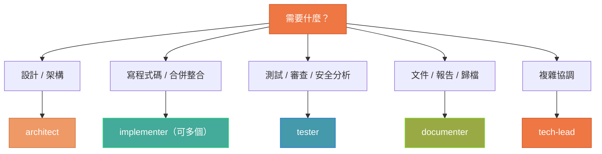
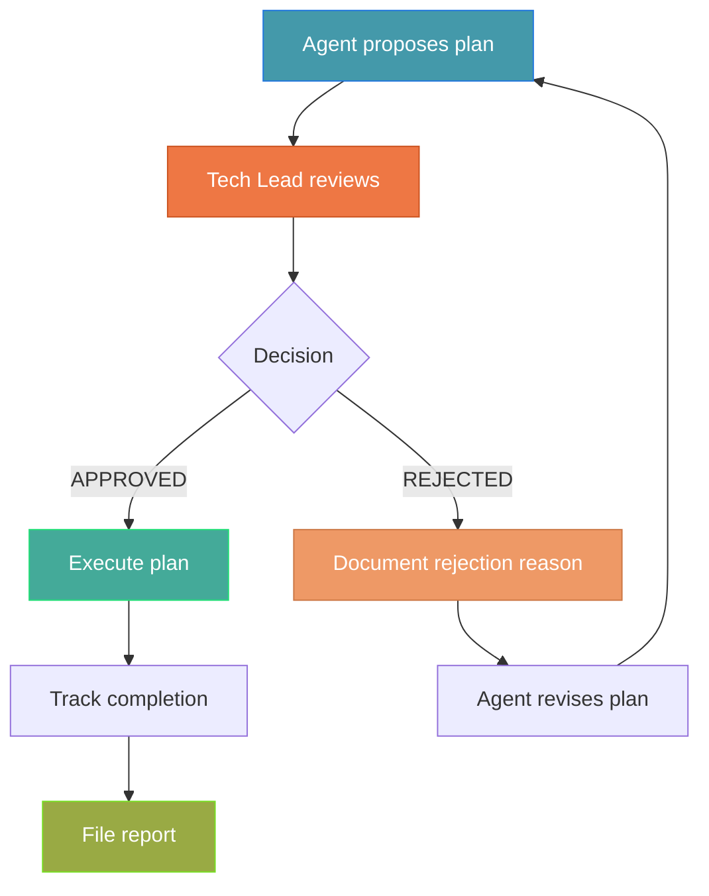

# Agent Army 使用指南

> **版本**: 3.0.0 | **最後更新**: 2026-03-05
> 從零開始設定和使用 Agent Army 系統的完整教學

---

## 目錄

1. [快速開始](#1-快速開始)
2. [前置條件](#2-前置條件)
3. [安裝與設定](#3-安裝與設定)
4. [基本使用](#4-基本使用)
5. [進階使用](#5-進階使用)
6. [Skill 詳細說明](#6-skill-詳細說明)
7. [Agent 角色說明](#7-agent-角色說明)
8. [工作流程範例](#8-工作流程範例)
9. [報告與文件管理](#9-報告與文件管理)
10. [Plan 追蹤與可追溯性](#10-plan-追蹤與可追溯性)
11. [自訂與擴展](#11-自訂與擴展)
12. [分發與安裝到其他專案](#12-分發與安裝到其他專案)
13. [功能更新流程](#13-功能更新流程)
14. [疑難排解](#14-疑難排解)

---

## 1. 快速開始

### 30 秒版本（Plugin 安裝）

```bash
# 1. 在 Claude Code 中加入 marketplace
/plugin marketplace add Muheng1992/symbiotic-engineering

# 2. 安裝 Agent Army plugin
/plugin install agent-army@symbiotic-engineering

# 3. 初始化你的專案
/agent-army:setup my-project

# 4. 開始使用！
/agent-army:assemble implement user authentication with JWT
```

### 傳統手動安裝（進階用戶）

```bash
# 1. Clone repo 並複製 .claude/ 目錄到你的專案
git clone https://github.com/Muheng1992/symbiotic-engineering.git
cp -r symbiotic-engineering/.claude/ /your/project/.claude/

# 2. 建立 docs/ 目錄結構
mkdir -p /your/project/docs/{reports/{code-review,test,security,fix,integration,quality-gate,plans},architecture,archive,guides}

# 3. 啟動 Claude Code
cd /your/project && claude

# 4. 開始使用！
/assemble implement user authentication with JWT
```

---

## 2. 前置條件

| 條件 | 最低版本 | 確認指令 |
|------|---------|---------|
| Claude Code CLI | v2.1.0+ | `claude --version` |
| Git | 2.x | `git --version` |
| Node.js (如果是 JS 專案) | 18+ | `node --version` |

### 驗證 Claude Code 設定

```bash
# 確認可用的 agents
claude agents

# 確認 Agent Teams 已啟用
claude --print-settings | grep AGENT_TEAMS
```

---

## 3. 安裝與設定

### 方式 A: Plugin 安裝（推薦 — 最簡單）

只需在 Claude Code 中執行三個指令：

```bash
# Step 1: 加入 marketplace
/plugin marketplace add Muheng1992/symbiotic-engineering

# Step 2: 安裝 plugin
/plugin install agent-army@symbiotic-engineering

# Step 3: 初始化專案
/agent-army:setup my-project
```

`/agent-army:setup` 會自動：
- 建立 `docs/` 目錄結構（含所有報告分類）
- 建立或更新 `.claude/CLAUDE.md`（含 Clean Architecture 標準）
- 配置 `.claude/settings.json`（啟用 Agent Teams）
- 建立 `docs/INDEX.md` 和 `docs/archive/ARCHIVE-INDEX.md`
- 初始化 Memory 架構（project memory templates）
- 偵測並推薦 MCP Servers（Context7、Sequential Thinking、Puppeteer）
- 安裝 Git Hooks（pre-commit、commit-msg、pre-push，可選）
- 配置 Keybindings（Agent Army 快捷鍵，可選）
- Workspace 設定（多專案協調，可選）

### 方式 B: 本機測試安裝

```bash
# Clone repository
git clone https://github.com/Muheng1992/symbiotic-engineering.git

# 用 plugin-dir 啟動 Claude Code
claude --plugin-dir ./symbiotic-engineering/plugins/agent-army
```

### 方式 C: 團隊自動安裝

在你的專案 `.claude/settings.json` 中加入：

```json
{
  "extraKnownMarketplaces": {
    "symbiotic-engineering": {
      "source": {
        "source": "github",
        "repo": "Muheng1992/symbiotic-engineering"
      }
    }
  },
  "enabledPlugins": {
    "agent-army@symbiotic-engineering": true
  }
}
```

團隊成員 clone 專案後，Claude Code 會自動提示安裝 Agent Army plugin。

### 方式 D: 傳統手動安裝

```bash
cd /your/project

# 複製 Agent Army 系統
cp -r /path/to/symbiotic-engineering/.claude/ .claude/

# 建立文件目錄
mkdir -p docs/{reports/{code-review,test,security,fix,integration,quality-gate,plans},architecture,archive,guides}

# 調整 .claude/CLAUDE.md 的專案描述
# 調整 .claude/settings.json 的權限設定
```

### 驗證安裝

```bash
# 查看所有可用的 agents
claude agents

# Plugin 安裝的 agents 會有 namespace 前綴：
# - agent-army:tech-lead
# - agent-army:architect
# - agent-army:implementer
# - agent-army:tester
# - agent-army:documenter

# 手動安裝的 agents 沒有前綴：
# - tech-lead
# - architect
# - ...
```

---

## 4. 基本使用

### 4.1 集結 Agent 大軍（最常用）

```
/assemble [功能描述]
```

範例：
```
/assemble implement a REST API for user management with CRUD operations
/assemble add JWT authentication to the existing Express server
/assemble refactor the payment module to follow Clean Architecture
```

執行流程：
1. Claude 分析你的專案結構
2. 根據任務複雜度決定團隊規模（3-5 agents）
3. 自動分解任務、設定依賴
4. 並行啟動 agents
5. 監控執行、處理問題
6. 產生報告、歸檔文件
7. 回報結果

### 4.2 Sprint 規劃

```
/sprint [功能描述或 issue URL]
```

範例：
```
/sprint implement dashboard with charts, filters, and export functionality
/sprint https://github.com/org/repo/issues/42
```

### 4.3 品質檢查

```
/quality-gate [範圍]
```

範例：
```
/quality-gate src/auth/           # 檢查特定目錄
/quality-gate user-management     # 檢查特定功能
/quality-gate all                 # 檢查整個專案
```

---

## 5. 進階使用

### 5.1 指定團隊組成

你可以在 `/assemble` 中指定需要的 agents：

```
/assemble implement payment gateway. Use architect for design, 3 implementers
for parallel coding, and tester for payment security review.
```

### 5.2 使用 Agent Teams（實驗性）

對於需要 agents 之間互相溝通的複雜任務：

```
Create an agent team to refactor the authentication system. Spawn:
- An architect teammate to redesign the module
- Two implementer teammates for frontend and backend
- A tester teammate to write comprehensive tests
Have them coordinate and challenge each other's approaches.
```

### 5.3 使用 /batch 進行大規模變更

```
/batch migrate all React class components to functional components with hooks
/batch update all API endpoints to v2 schema
/batch add error handling to all database query functions
```

### 5.4 指定 Plan Approval

要求 agent 在實作前先提交計畫：

```
/assemble implement feature X. All agents must submit plans for approval
before making any code changes.
```

### 5.5 直接使用特定 Agent

你也可以直接讓 Claude 使用特定 agent：

```
Use the tester agent to review my recent changes
Use the tester agent to scan src/auth/ for security issues
Use the tester agent to write tests for the user module
```

---

## 6. Skill 詳細說明

### `/assemble` — Agent 大軍集結器

**用途**: 自動分析專案、分解任務、啟動 agent 大軍

**語法**: `/assemble [功能描述]`

**行為**:
1. 讀取專案結構和 CLAUDE.md
2. 分解任務為 5-15 個獨立工作單元
3. 決定團隊規模（小/中/大/完整）
4. 啟動 agents 並行工作
5. 監控進度、處理問題
6. 產生報告並歸檔

**參考檔案**:
- `references/role-catalog.md` — 角色完整定義
- `references/workflow-patterns.md` — 工作流程模式

---

### `/sprint` — Sprint 規劃器

**用途**: 將功能分解為結構化的任務板

**語法**: `/sprint [功能描述 | issue URL]`

**輸出**: Sprint 計劃文件，包含任務板、依賴圖、風險評估

---

### `/quality-gate` — 品質閘門

**用途**: 在 merge 前執行全面品質檢查

**語法**: `/quality-gate [scope]`

**檢查項目**:
1. Build 驗證
2. 測試通過 + 覆蓋率
3. Code Review
4. 安全掃描
5. Clean Architecture 合規
6. 文件完整性

---

### `/integration-test` — 整合測試編排器

**用途**: 設計、設定、執行整合測試，並產出報告

**語法**: `/integration-test [scope: module name, feature name, or "all"]`

**五階段流程**:
1. **Test Scope Analysis** — 識別整合邊界、元件依賴、外部服務
2. **Environment Setup** — Test DB、Mock services、Test containers、Fixtures
3. **Scenario Design** — 三層測試設計：
   - Component Integration（模組間互動）
   - Service Integration（API / DB / 外部服務）
   - E2E Scenarios（完整使用者旅程）
4. **Test Execution** — 執行策略、平行/循序、失敗分類
5. **Result Analysis & Report** — 產出整合測試報告，歸檔到 `docs/reports/test/`

---

### `/code-review` — 程式碼審查編排器

**用途**: 結構化多維度程式碼審查，自動 diff 分析與報告歸檔

**語法**: `/code-review [scope: file path, branch, PR number, or "staged"]`

**四階段流程**:
1. **Diff Analysis** — 收集變更、分類檔案、識別高風險區域
2. **Multi-Dimensional Review** — 五維度審查：
   - Clean Architecture 合規
   - Code Quality（檔案長度、命名、DRY）
   - Security（OWASP Top 10）
   - Performance（N+1、阻塞操作）
   - Testability & Maintainability
3. **Structured Report** — Severity 分級（CRITICAL / HIGH / MEDIUM / LOW）
4. **Report Filing** — 歸檔到 `docs/reports/code-review/`

---

### `/retrospective` — Mission 回顧

**用途**: 在 mission 結束後進行結構化回顧，分析成功/失敗模式，更新 agent memory

**語法**: `/retrospective`

**五階段流程**:
1. **Data Collection** — 收集本次 mission 的報告、plan、git log
2. **Analysis** — 五維度分析（效率、品質、架構、協調、計畫準確度）
3. **Pattern Recognition** — 識別成功模式、失敗模式、摩擦點
4. **Actionable Improvements** — 產生具體可行的改善建議
5. **Memory Update** — 更新 agent memory，累積跨 session 知識

---

### `/tdd` — TDD 強制執行

**用途**: 強制 Red-Green-Refactor 循環，確保測試先行

**語法**: `/tdd [feature or function description]`

**三階段循環**:
1. **RED** — 先寫一個失敗的測試（必須 fail 才能繼續）
2. **GREEN** — 寫最少的程式碼讓測試通過（不多寫）
3. **REFACTOR** — 重構程式碼，保持所有測試通過

**Phase Gate**: 每個階段都有嚴格的 gate check，必須通過才能進入下一階段

**Anti-Pattern 防護**: 防止先寫碼後補測試、一次寫多個測試、GREEN 階段過度實作等常見壞習慣

---

### `/fix` — 智慧問題修復

**用途**: 診斷錯誤、分析根因、自動選擇適當 Agent 修復

**語法**: `/fix [error message, bug description, or issue reference]`

**五階段流程**:
1. **Problem Intake** — 收集錯誤訊息、堆疊追蹤、重現步驟
2. **Diagnosis** — 問題分類 + 5 Whys 根因分析
3. **Resolution Strategy** — 選擇適當 Agent 組合（單 Agent / 多 Agent）
4. **Fix Execution** — 先寫回歸測試，再修復，再全套測試
5. **Report & Learn** — 產生修復報告，記錄預防措施

**問題分類**: Build Error → `implementer` | Test Failure → `tester` | Security Issue → `tester` → `implementer` | Architecture Violation → `architect` → `implementer`

---

### `/timesheet` — 工時分析

**用途**: 分析多專案工作時間，產出日報

**語法**: `/timesheet [time-range]`

---

### `/context-sync` — 跨 Session Context 同步

**用途**: 在 session 結束前保存工作狀態，session 開始時恢復 context，支持多 agent context 傳遞

**語法**: `/context-sync [save | load | team]`

**三階段流程**:
1. **Context Save** — 收集 git 狀態、進行中的任務、blockers，寫入 memory
2. **Context Load** — 讀取 memory 和 session state，呈現上次工作摘要
3. **Multi-Agent Sync** — 讀取團隊配置和任務狀態，產生團隊 briefing

**實戰範例**:

```bash
# 情境 1: 一天結束，保存工作狀態
/context-sync save
# → 自動收集 git status、進行中的任務、blockers
# → 寫入 memory，下次 session 可恢復

# 情境 2: 隔天開始，恢復 context
/context-sync load
# → 讀取 memory 和 session state
# → 呈現上次工作摘要：在做什麼、做到哪裡、有什麼 blocker

# 情境 3: 多 agent 團隊 context 同步
/context-sync team
# → 讀取團隊配置和所有 agent 的任務狀態
# → 產生團隊 briefing：誰在做什麼、哪些任務 blocked
```

---

### `/onboard` — 專案上手分析

**用途**: 掃描專案結構、偵測技術棧和架構模式、產生結構化 memory

**語法**: `/onboard [project-name]`

**四階段流程**:
1. **Discovery** — 偵測語言、框架、Monorepo 結構、工具配置
2. **Deep Analysis** — 讀取 README、package manifest、架構模式偵測
3. **Memory Generation** — 產生結構化 MEMORY.md 和 topic files
4. **Verification** — 驗證 memory 完整性，列出需要人工確認的項目

**實戰範例**:

```bash
# 剛接手一個新專案
/onboard my-app

# Onboard 會自動：
# 1. 掃描檔案結構 → 偵測 React + TypeScript + Express
# 2. 讀取 package.json → 識別依賴和 scripts
# 3. 分析架構模式 → 偵測 Clean Architecture / MVC / 無明確架構
# 4. 產生 MEMORY.md → 記錄技術棧、架構、關鍵檔案
# 5. 列出需要人工確認的項目 → 環境變數、secrets、部署方式
#
# 之後所有 agent session 都會自動讀取這份 memory，
# 不需要每次重新解釋專案背景
```

---

### `/changelog` — 自動變更日誌

**用途**: 從 git 歷史和開發報告自動產生 CHANGELOG.md

**語法**: `/changelog [since tag | release major/minor/patch]`

**四階段流程**:
1. **Data Collection** — 解析 git log、讀取 docs/reports/
2. **Classification** — 按 Conventional Commits 分類（feat/fix/docs/refactor 等）
3. **Generation** — 產生 Keep a Changelog 格式
4. **Filing** — 更新 CHANGELOG.md 和 docs/INDEX.md

**實戰範例**:

```bash
# 從上個 tag 產生 changelog
/changelog since v2.0.0

# 指定 release 級別（自動 bump 版本號）
/changelog release minor
# → 如果當前是 v3.0.0，會產生 v3.1.0 的 changelog

# 只看 patch 級別的變更
/changelog release patch
```

---

### `dev-standards` — 開發標準（自動載入）

**用途**: Claude 自動載入的開發規範

**不需要手動觸發** — 當 Claude 寫程式碼時自動參考

**包含**:
- Clean Architecture 原則
- 程式碼命名規範
- 註解策略（WHY-not-WHAT）
- 錯誤處理標準
- 測試標準

---

## 7. Agent 角色說明

### 決策流程圖



### 角色快速參考

| 角色 | 何時使用 | 輸出 |
|------|---------|------|
| **tech-lead** | 複雜任務需要多 agent 協調（不直接寫碼） | 任務分解 + 委派協調 |
| **architect** | 新功能、重構、技術決策（plan mode，唯讀） | 設計文件 + 介面定義 |
| **implementer** | 寫/改程式碼、多 agent 工作完成後合併整合 | 程式碼檔案 + 整合報告 |
| **tester** | 寫/跑測試、程式碼審查、安全掃描 | 測試檔案 + 測試報告 + Review 報告 + 安全報告 |
| **documenter** | 更新文件、產生報告、管理報告歸檔和文件索引 | 文件檔案 + 結構化報告 + INDEX.md + 歸檔 |

### Agent 完整能力參考

| 能力 | tech-lead | architect | implementer | tester | documenter |
|------|-----------|-----------|-------------|--------|------------|
| **可用工具** | Read, Grep, Glob, Bash, Task, SendMessage | Read, Grep, Glob, Bash | Read, Write, Edit, Grep, Glob, Bash | Read, Write, Edit, Grep, Glob, Bash | Read, Write, Edit, Grep, Glob, Bash |
| **Model** | inherit (Opus) | inherit (Opus) | inherit (Opus) | inherit (Opus) | sonnet |
| **Plan Mode** | No | Yes (唯讀設計) | No | No | No |
| **Memory** | project | project | project | project | project |
| **可並行數** | 1 (單例) | 1 (單例) | 1-5 | 1-2 | 1 (單例) |
| **預載 Skills** | — | dev-standards | dev-standards | dev-standards, tdd, integration-test, code-review | dev-standards |
| **Write/Edit** | 不可 | 不可 | 可以 | 可以 | 可以 |
| **Spawn Agents** | 可以 (via Task) | 不可 | 不可 | 不可 | 不可 |

---

## 8. 工作流程範例

### 範例 1: 小功能（新增一個 API endpoint）

```
/assemble add a GET /api/users/:id endpoint that returns user profile data
```

系統自動：
1. 分析現有 API 結構
2. 啟動 implementer + tester（2 agents）
3. Implementer 寫 controller + use case
4. Tester 寫測試並審查
5. 回報結果

### 範例 2: 中型功能（用戶認證系統）

```
/assemble implement JWT-based authentication with login, register, and
token refresh endpoints. Include middleware for route protection.
```

系統自動：
1. Architect 設計認證架構（Clean Architecture）
2. 3 個 Implementer 並行：auth middleware / user endpoints / token service
3. Tester 寫全面測試並進行安全審查
4. Implementer 合併並驗證
5. Documenter 更新 API 文件、產生所有報告並歸檔

### 範例 3: 大規模重構

```
/batch migrate all Express route handlers from callbacks to async/await
```

系統自動：
1. 分析所有路由檔案
2. 分解為 5-30 個獨立工作單元
3. 展示計劃供你確認
4. 每個工作單元在獨立 git worktree 中執行
5. 每個完成後開 PR
6. 所有 PR 可以個別審查和合併

### 範例 4: Sprint 規劃 + 執行

```
# 先規劃
/sprint implement a dashboard with:
- Real-time data charts (Chart.js)
- Date range filter
- Export to CSV/PDF
- Mobile responsive layout

# 審查計劃後執行
/assemble execute the sprint plan above
```

---

## 9. 報告與文件管理

### 9.1 報告自動產生

每次 agent 活動後，documenter 會自動產生結構化報告。

報告位置：
```
docs/reports/
├── code-review/YYYY-MM-DD-[subject]-review-report.md
├── test/YYYY-MM-DD-[subject]-test-report.md
├── security/YYYY-MM-DD-[subject]-security-report.md
├── fix/YYYY-MM-DD-[subject]-fix-report.md
├── integration/YYYY-MM-DD-[subject]-integration-report.md
├── quality-gate/YYYY-MM-DD-[subject]-quality-gate.md
└── plans/YYYY-MM-DD-[subject]-plan.md
```

### 9.2 查看報告索引

所有報告都索引在 `docs/INDEX.md`。

### 9.3 歸檔策略

- 報告**永不刪除**
- 過時文件移到 `docs/archive/YYYY-MM/`
- 歸檔文件列在 `docs/archive/ARCHIVE-INDEX.md`
- 歸檔時加上元資料（日期、原因、取代文件）

---

## 10. Plan 追蹤與可追溯性

### 10.1 Plan 文件化

每當 Agent 進入 Plan 模式或產生設計方案時，Plan 都會被記錄：

**儲存位置**: `docs/reports/plans/YYYY-MM-DD-[subject]-plan.md`

**Plan 文件格式**:
```markdown
# Plan: [Feature Name]

## Metadata
- **Date**: YYYY-MM-DD HH:MM
- **Author**: [agent-name]
- **Status**: PROPOSED | APPROVED | REJECTED | EXECUTED | PARTIALLY_EXECUTED
- **Approved By**: [agent-name or human]
- **Rejected By**: [agent-name, if rejected]
- **Rejection Reason**: [reason, if rejected]

## Plan Content
[Detailed plan...]

## Execution Tracking
| Step | Status | Executor | Completed At | Notes |
|------|--------|----------|-------------|-------|
| 1    | Done   | implementer | HH:MM     |       |
| 2    | Done   | implementer | HH:MM     |       |
| 3    | Skipped | —       | —           | [reason] |

## Deviations
[Any deviations from the original plan and why]

## Final Status
- **Fully Executed**: YES / NO
- **Completion Rate**: N/M steps (XX%)
- **Deviations**: N deviations documented
```

### 10.2 Plan 審核流程



### 10.3 查看 Plan 歷史

```bash
# 列出所有 plans
ls docs/reports/plans/

# 搜尋被拒絕的 plans
grep -l "REJECTED" docs/reports/plans/*.md

# 搜尋未完全執行的 plans
grep -l "Fully Executed: NO" docs/reports/plans/*.md
```

---

## 11. 自訂與擴展

### 11.1 新增自訂 Agent

在 `.claude/agents/` 新增 `.md` 檔案：

```markdown
---
name: my-custom-agent
description: >
  Description of when to use this agent...
tools: Read, Write, Edit, Bash
model: inherit
memory: project
skills:
  - dev-standards
---

You are a [role description]. When invoked:

1. [Step 1]
2. [Step 2]
...
```

### 11.2 新增自訂 Skill

在 `.claude/skills/` 新增目錄：

```bash
mkdir -p .claude/skills/my-skill
```

建立 `SKILL.md`：

```markdown
---
name: my-skill
description: What this skill does and when to use it
---

Instructions for Claude when this skill is invoked...
```

### 11.3 修改 Quality Gate

編輯 `.claude/skills/quality-gate/SKILL.md` 來新增或修改品質檢查項目。

### 11.4 Templates 使用說明

Setup 安裝的 templates 可以根據專案需求自訂。

#### Memory Templates

安裝位置：`~/.claude/projects/{project}/memory/`

| 檔案 | 用途 | 自訂建議 |
|------|------|----------|
| `MEMORY.md` | 主記憶（200 行上限，自動載入） | 記錄專案概覽、技術棧、關鍵決策 |
| `architecture.md` | 架構決策記錄 | 記錄分層邊界、API 合約、資料模型 |
| `debugging.md` | 除錯筆記 | 記錄常見問題和解法 |
| `patterns.md` | 程式碼模式 | 記錄專案慣用的設計模式和 idioms |
| `conventions.md` | 命名與風格 | 記錄專案特有的命名規則和工作流程 |

#### Git Hooks Templates

安裝位置：`.git/hooks/`

| Hook | 檢查內容 | 自訂方式 |
|------|----------|----------|
| `pre-commit` | 檔案長度 ≤ 300 行、secrets 偵測、.env 攔截 | 修改 `MAX_LINES` 變數或 `SECRETS_PATTERN` |
| `commit-msg` | Conventional Commits 格式 | 修改 regex pattern |
| `pre-push` | 推送前提醒 | 加入自訂檢查 |

#### CI/CD Template

安裝位置：`.github/workflows/quality-gate.yml`

6 道品質閘門：Build → Tests → Lint → Security Audit → File Size Check → Commit Messages

可自訂：Node.js 版本、測試指令、安全掃描範圍。

#### Keybindings Template

安裝位置：`~/.claude/keybindings.json`

| 快捷鍵 | 指令 | 說明 |
|--------|------|------|
| `Ctrl+Shift+A` | `/agent-army:assemble` | 集結 Agent 大軍 |
| `Ctrl+Shift+Q` | `/agent-army:quality-gate` | 品質檢查 |
| `Ctrl+Shift+R` | `/agent-army:code-review` | 程式碼審查 |
| `Ctrl+Shift+T` | `/agent-army:tdd` | TDD 循環 |
| `Ctrl+Shift+F` | `/agent-army:fix` | 智慧修復 |
| `Ctrl+Shift+S` | `/agent-army:sprint` | Sprint 規劃 |
| `Ctrl+Shift+C` | `/agent-army:context-sync` | Context 同步 |

#### Workspace Template

安裝位置：`~/.claude/workspace.json`

定義多專案環境中的專案清單、共享規範（commit format、branch prefix、push 前品質檢查）。

### 11.5 Hooks 行為詳解

Agent Army 使用兩層 hooks 系統。

#### 層 1: Claude Code Hooks（`.claude/settings.json`）

在 Claude Code 內部觸發，影響 AI agent 的行為：

| Hook | 觸發時機 | 系統訊息 |
|------|---------|---------|
| `PostToolUse(Write\|Edit)` | Agent 寫入/編輯程式碼後 | "Verify Clean Architecture compliance — dependencies must point inward only." |
| `PostToolUse(npm install\|pip install\|...)` | Agent 安裝新依賴後 | "Verify: License compatibility, Known CVEs, Bundle size impact, Is it actively maintained?" |
| `PreToolUse(git push*)` | Agent 準備 push 前 | "Have you run /agent-army:quality-gate?" |
| `Stop` | Session 結束前 | "Have all reports been filed in docs/reports/? Is docs/INDEX.md updated?" |

#### 層 2: Git Hooks（`.git/hooks/`，由 Templates 安裝）

在 git 操作時觸發，影響所有開發者（不只是 AI）：

| Hook | 觸發時機 | 檢查內容 |
|------|---------|---------|
| `pre-commit` | `git commit` 前 | 檔案長度、secrets 偵測、.env 攔截 |
| `commit-msg` | Commit message 寫入後 | Conventional Commits 格式驗證 |
| `pre-push` | `git push` 前 | 品質提醒 |

**兩層互補**: Claude Code Hooks 在 AI 寫碼時即時提醒；Git Hooks 在提交/推送時做最後防線。

### 11.6 新增 Hooks

編輯 `.claude/settings.json` 的 `hooks` 區段。

---

## 12. 分發與安裝到其他專案

### 方法 1: Plugin Marketplace（推薦 — 最簡單）

任何人只需要知道你的 GitHub repo URL 就可以安裝：

```bash
# 使用者在 Claude Code 中執行：
/plugin marketplace add Muheng1992/symbiotic-engineering
/plugin install agent-army@symbiotic-engineering
/agent-army:setup my-project
```

**優點**: 一鍵安裝、自動更新、版本管理
**前置條件**: GitHub repo 需要是 public（或使用者有 access）

### 方法 2: 團隊自動安裝

在團隊專案的 `.claude/settings.json` 中設定，新成員 clone 後自動提示安裝：

```json
{
  "extraKnownMarketplaces": {
    "symbiotic-engineering": {
      "source": {
        "source": "github",
        "repo": "Muheng1992/symbiotic-engineering"
      }
    }
  },
  "enabledPlugins": {
    "agent-army@symbiotic-engineering": true
  }
}
```

### 方法 3: 本機測試 / CI 環境

```bash
git clone https://github.com/Muheng1992/symbiotic-engineering.git
claude --plugin-dir ./symbiotic-engineering/plugins/agent-army
```

### 方法 4: 傳統直接複製

```bash
# 複製核心設定
cp -r .claude/agents/ /new-project/.claude/agents/
cp -r .claude/skills/ /new-project/.claude/skills/
cp .claude/settings.json /new-project/.claude/settings.json
cp .claude/CLAUDE.md /new-project/.claude/CLAUDE.md

# 建立文件結構
mkdir -p /new-project/docs/{reports/{code-review,test,security,fix,integration,quality-gate,plans},architecture,archive,guides}
```

### 發布你自己的 Marketplace

如果你 fork 了本 repo 並做了修改，可以作為獨立 marketplace 發布：

1. **Fork** 到你的 GitHub org
2. 修改 `.claude-plugin/marketplace.json` 中的 `name` 和 `owner`
3. 修改 `plugins/agent-army/.claude-plugin/plugin.json` 的 `repository`
4. Push 到 GitHub
5. 分享你的安裝指令：`/plugin marketplace add YOUR_ORG/YOUR_REPO`

### Plugin 更新

```bash
# 使用者更新到最新版本
/plugin marketplace update symbiotic-engineering
/plugin update agent-army@symbiotic-engineering
```

**注意**: 每次更新 plugin 內容後，記得在 `plugin.json` 中更新 `version`，否則使用者的 cache 不會更新。

---

## 13. 功能更新流程

當你新增或修改 Agent Army 的功能（新 agent、新 skill、修改既有定義）時，需要同步更新多處。以下是標準更新 checklist。

### 13.1 新增 Skill 的更新清單

| # | 更新項目 | 檔案位置 | 說明 |
|---|---------|---------|------|
| 1 | **建立 Skill 定義** | `plugins/agent-army/skills/[name]/SKILL.md` | Plugin 主副本 |
| 2 | **建立本地副本** | `.claude/skills/[name]/SKILL.md` | 與主副本完全相同 |
| 3 | **更新關聯 Agent** | `plugins/agent-army/agents/[agent].md` + `.claude/agents/[agent].md` | 在 `skills:` 陣列加入新 skill |
| 4 | **更新 Quality Gate**（如適用） | 兩處 `quality-gate/SKILL.md` | 加入新的品質檢查項目 |
| 5 | **更新設計文件** | `docs/AGENT-ARMY-DESIGN.md` | Skill 表格 + Mermaid 圖 + 目錄結構 |
| 6 | **更新 README** | `README.md` | Skill 數量 + Skill 表格 |
| 7 | **更新 CLAUDE.md** | `.claude/CLAUDE.md` | Available Skills 表格 |
| 8 | **更新使用指南** | `docs/AGENT-ARMY-USAGE.md` | Skill 說明 + 速查表 |
| 9 | **更新 Marketplace** | `.claude-plugin/marketplace.json` | description + version |
| 10 | **更新 Plugin manifest** | `plugins/agent-army/.claude-plugin/plugin.json` | description + version |

### 13.2 新增 Agent 的更新清單

| # | 更新項目 | 檔案位置 |
|---|---------|---------|
| 1 | 建立 Agent 定義 | `plugins/agent-army/agents/[name].md` + `.claude/agents/[name].md` |
| 2 | 更新設計文件 | `docs/AGENT-ARMY-DESIGN.md`（角色矩陣 + Mermaid 圖） |
| 3 | 更新 README | `README.md`（Agent 表格 + 數量） |
| 4 | 更新 CLAUDE.md | `.claude/CLAUDE.md`（Available Agents 表格） |
| 5 | 更新使用指南 | `docs/AGENT-ARMY-USAGE.md`（角色說明 + 決策流程圖） |
| 6 | 更新 Marketplace/Plugin JSON | 兩處 JSON 的 description + version |

### 13.3 版本號更新規則

遵循語義化版本（Semantic Versioning）：

| 變更類型 | 版本號位置 | 範例 |
|----------|-----------|------|
| 新增 skill / agent（向後相容） | MINOR | `1.0.0` → `1.1.0` |
| 修改既有 skill / agent 行為 | MINOR | `1.1.0` → `1.2.0` |
| 修正 bug / typo | PATCH | `1.1.0` → `1.1.1` |
| 破壞性變更（移除 agent、改名） | MAJOR | `1.1.0` → `2.0.0` |

需要同步更新 version 的檔案：
- `.claude-plugin/marketplace.json` → `metadata.version` + plugin 的 `version`
- `plugins/agent-army/.claude-plugin/plugin.json` → `version`

### 13.4 發布更新到使用者

```bash
# 1. 完成所有修改並驗證
#    - plugin 和 local 副本一致（diff 無差異）
#    - frontmatter 格式正確
#    - 所有文件同步更新

# 2. Commit 並 push
git add -A
git commit -m "feat: add integration-test and code-review skills"
git push origin main

# 3. 使用者端更新
/plugin marketplace update symbiotic-engineering
/plugin update agent-army@symbiotic-engineering
```

### 13.5 驗證更新完整性

更新完成後，執行以下驗證：

```bash
# 確認 plugin 和 local 副本一致
diff plugins/agent-army/agents/[agent].md .claude/agents/[agent].md
diff plugins/agent-army/skills/[skill]/SKILL.md .claude/skills/[skill]/SKILL.md

# 確認 frontmatter 格式
head -10 plugins/agent-army/skills/[skill]/SKILL.md
head -15 plugins/agent-army/agents/[agent].md

# 確認數量一致
ls plugins/agent-army/skills/ | wc -l   # 應與文件中的數字一致
ls plugins/agent-army/agents/ | wc -l   # 應與文件中的數字一致
```

---

## 14. 疑難排解

### Agent 沒有出現

```bash
# 確認 agent 檔案存在
ls .claude/agents/

# 確認 YAML frontmatter 格式正確
head -5 .claude/agents/tech-lead.md

# 重新載入
# 在 Claude Code 中執行 /agents 查看
```

### Skill 沒有觸發

```bash
# 確認 skill 檔案存在
ls .claude/skills/

# 確認 SKILL.md 有 frontmatter
head -5 .claude/skills/assemble/SKILL.md

# 手動觸發測試
/assemble test
```

### Agent Teams 不工作

```bash
# 確認啟用了實驗功能
grep AGENT_TEAMS .claude/settings.json

# 應該看到：
# "CLAUDE_CODE_EXPERIMENTAL_AGENT_TEAMS": "1"
```

### Context 超載

```bash
# 在 Claude Code 中檢查
/context

# 如果有 skill 被排除，考慮：
# 1. 精簡 CLAUDE.md（目標 ≤ 150 行）
# 2. 將較少用的 skill 設為 disable-model-invocation: true
# 3. 設定環境變數增加 budget：
# export SLASH_COMMAND_TOOL_CHAR_BUDGET=32000
```

### 報告沒有被歸檔

確認 `documenter` agent 在 `/assemble` 的執行流程中被啟動。

手動歸檔：
```
Use the documenter agent to file all pending reports and update the index
```

### Hook 沒有觸發

```bash
# 確認 settings.json 中的 hooks 格式正確
cat .claude/settings.json | python3 -m json.tool

# 測試 hook 腳本可執行
chmod +x .claude/hooks/scripts/*.sh
```

### Templates 沒有產生

```bash
# 確認 setup 已執行
ls -la docs/ .claude/

# 如果缺少 memory templates
/agent-army:setup my-project
# setup 會偵測已存在的檔案並只補齊缺少的部分

# 手動安裝特定 template
# Memory:
cp plugins/agent-army/templates/memory/* .claude/memory/
# Git Hooks:
cp plugins/agent-army/templates/git-hooks/* .git/hooks/
chmod +x .git/hooks/*
```

### Setup 失敗

```bash
# 確認 plugin 已正確安裝
/plugin list

# 確認目標目錄可寫入
ls -la .claude/

# 重新執行 setup（安全的，不會覆蓋已存在的檔案）
/agent-army:setup my-project
```

### Plugin 更新後功能沒變

```bash
# 清除 plugin cache
/plugin uninstall agent-army@symbiotic-engineering
/plugin install agent-army@symbiotic-engineering

# 確認版本號
/plugin list  # 應顯示 v3.0.0

# 如果仍有問題，嘗試重新加入 marketplace
/plugin marketplace remove symbiotic-engineering
/plugin marketplace add Muheng1992/symbiotic-engineering
/plugin install agent-army@symbiotic-engineering
```

### Git Worktree 衝突

```bash
# 列出所有 worktrees
git worktree list

# 清理過期的 worktrees
git worktree prune

# 如果 implementer 留下了未清理的 worktree
git worktree remove /path/to/worktree --force

# 預防措施：在 /assemble 時指定 worktree 清理
/assemble [feature]. Clean up worktrees after completion.
```

---

## 附錄：指令速查表

### Plugin 安裝版（有 namespace 前綴）

| 指令 | 用途 | 範例 |
|------|------|------|
| `/agent-army:setup [name]` | 初始化專案 | `/agent-army:setup my-app` |
| `/agent-army:assemble [desc]` | 集結 Agent 大軍 | `/agent-army:assemble add user auth` |
| `/agent-army:sprint [desc]` | Sprint 規劃 | `/agent-army:sprint dashboard feature` |
| `/agent-army:quality-gate [scope]` | 品質檢查 | `/agent-army:quality-gate src/` |
| `/agent-army:integration-test [scope]` | 整合測試編排 | `/agent-army:integration-test src/auth/` |
| `/agent-army:code-review [scope]` | 程式碼審查編排 | `/agent-army:code-review staged` |
| `/agent-army:retrospective` | Mission 回顧 | `/agent-army:retrospective` |
| `/agent-army:tdd [feature]` | TDD 強制執行 | `/agent-army:tdd add validation logic` |
| `/agent-army:fix [error]` | 智慧問題修復 | `/agent-army:fix build fails with type error` |
| `/agent-army:timesheet [range]` | 工時分析 | `/agent-army:timesheet today` |
| `/agent-army:context-sync [mode]` | 跨 Session Context 同步 | `/agent-army:context-sync save` |
| `/agent-army:onboard [name]` | 專案上手分析 | `/agent-army:onboard my-app` |
| `/agent-army:changelog [spec]` | 自動變更日誌 | `/agent-army:changelog release minor` |
| `/batch [instruction]` | 大規模並行變更 | `/batch migrate to React hooks` |

### 手動安裝版（無前綴）

| 指令 | 用途 | 範例 |
|------|------|------|
| `/assemble [desc]` | 集結 Agent 大軍 | `/assemble add user auth` |
| `/sprint [desc]` | Sprint 規劃 | `/sprint dashboard feature` |
| `/quality-gate [scope]` | 品質檢查 | `/quality-gate src/` |
| `/integration-test [scope]` | 整合測試編排 | `/integration-test src/auth/` |
| `/code-review [scope]` | 程式碼審查編排 | `/code-review staged` |
| `/retrospective` | Mission 回顧 | `/retrospective` |
| `/tdd [feature]` | TDD 強制執行 | `/tdd add validation logic` |
| `/fix [error]` | 智慧問題修復 | `/fix build fails with type error` |
| `/timesheet [range]` | 工時分析 | `/timesheet today` |
| `/context-sync [mode]` | 跨 Session Context 同步 | `/context-sync save` |
| `/onboard [name]` | 專案上手分析 | `/onboard my-app` |
| `/changelog [spec]` | 自動變更日誌 | `/changelog release minor` |
| `/batch [instruction]` | 大規模並行變更 | `/batch migrate to React hooks` |

---

*Agent Army Usage Guide v3.0.0 | Symbiotic Engineering | 2026-03-05*
