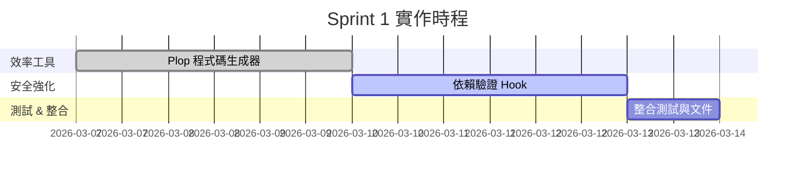
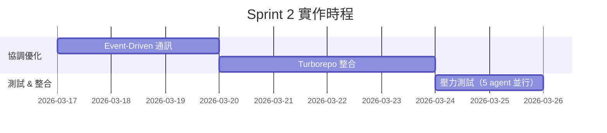
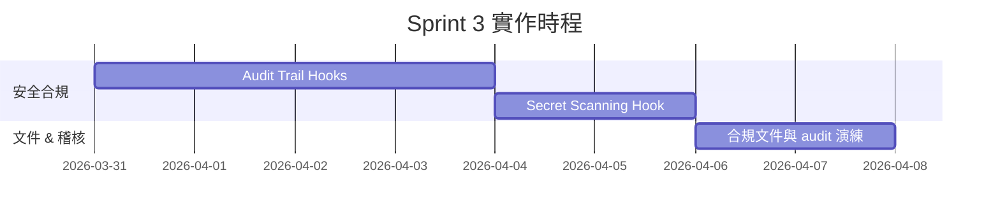

# Agent Army 系統效率改進優先計畫

> **價值評估與實作路線圖**
> 基於 T01-T03 研究成果，建立科學化的優先順序矩陣

**版本**: 1.0
**產出日期**: 2026-03-06
**研究範圍**: 開發效率工具、多代理協調模式、安全強化
**評估依據**:
- T01: 開發效率工具生態系研究 (`docs/guides/dev-efficiency-tools-research.md`)
- T02: 多代理協調設計模式 (`docs/guides/multi-agent-coordination-patterns.md`)
- T03: AI Agent 系統安全強化指南 (`docs/guides/agent-security-hardening-guide.md`)

---

## 目錄

1. [評估方法論](#1-評估方法論)
2. [價值評估矩陣](#2-價值評估矩陣)
3. [前 5 名推薦實作項目](#3-前-5-名推薦實作項目)
4. [實作路線圖](#4-實作路線圖)
5. [風險評估](#5-風險評估)
6. [ROI 估算](#6-roi-估算)

---

## 1. 評估方法論

### 1.1 評估維度定義

| 維度 | 評分標準 | 權重 |
|------|---------|------|
| **效率影響 (Impact)** | High (3分): >30% 生產力提升<br>Medium (2分): 10-30% 提升<br>Low (1分): <10% 提升 | 40% |
| **實作複雜度 (Complexity)** | High (1分): >2週開發時間<br>Medium (2分): 3-10天<br>Low (3分): <3天 | 25% |
| **系統相容性 (Compatibility)** | High (3分): 無需重構現有系統<br>Medium (2分): 需局部調整<br>Low (1分): 需架構變更 | 20% |
| **安全性影響 (Security)** | High (3分): 顯著降低風險<br>Medium (2分): 中等改善<br>Low (1分): 無影響 | 15% |

### 1.2 優先分數計算

```
Priority Score = (Impact × 0.4) + (Complexity × 0.25) + (Compatibility × 0.2) + (Security × 0.15)
最高分: 3.0 | 最低分: 1.0
```

### 1.3 ROI 估算公式

```
ROI = (預期年度節省工時 × 小時價值 - 初始投資) / 初始投資 × 100%

假設:
- 開發者小時價值: $80/hr
- 專案年度開發工時: 2000 小時
- 初始投資: 開發時間 × $80/hr
```

---

## 2. 價值評估矩陣

### 2.1 開發效率工具類（T01）

| 項目 | 效率影響 | 實作複雜度 | 系統相容性 | 安全性 | 優先分數 | 排名 |
|------|---------|----------|----------|--------|---------|------|
| **Plop 程式碼生成器整合** | High (3) | Low (3) | High (3) | Low (1) | **2.75** | 🥇 1 |
| **Turborepo 任務調度** | High (3) | Medium (2) | High (3) | Low (1) | **2.50** | 🥈 2 |
| **Hygen 模板系統** | Medium (2) | Low (3) | High (3) | Low (1) | **2.35** | 🥉 3 |
| **ts-morph AST 重構** | Medium (2) | High (1) | Medium (2) | Low (1) | **1.70** | 7 |
| **Langfuse Observability** | Medium (2) | Medium (2) | Medium (2) | Medium (2) | **2.00** | 5 |
| **Helicone Cost Tracking** | Low (1) | Low (3) | High (3) | Low (1) | **2.00** | 5 |

### 2.2 多代理協調類（T02）

| 項目 | 效率影響 | 實作複雜度 | 系統相容性 | 安全性 | 優先分數 | 排名 |
|------|---------|----------|----------|--------|---------|------|
| **DAG 任務排程引擎** | High (3) | High (1) | Medium (2) | Medium (2) | **2.20** | 4 |
| **Agent 狀態機持久化** | Medium (2) | Medium (2) | High (3) | Medium (2) | **2.25** | 🥉 3 |
| **Event-Driven 通訊優化** | High (3) | Medium (2) | High (3) | Low (1) | **2.50** | 🥈 2 |
| **回饋迴圈限制器** | Medium (2) | Low (3) | High (3) | Low (1) | **2.35** | 🥉 3 |
| **Git Worktree 隔離** | Medium (2) | Low (3) | Medium (2) | High (3) | **2.40** | 🥈 2 |

### 2.3 安全強化類（T03）

| 項目 | 效率影響 | 實作複雜度 | 系統相容性 | 安全性 | 優先分數 | 排名 |
|------|---------|----------|----------|--------|---------|------|
| **Permission Sandboxing** | Low (1) | Low (3) | High (3) | High (3) | **2.35** | 🥉 3 |
| **Secret Scanning Hook** | Low (1) | Low (3) | High (3) | High (3) | **2.35** | 🥉 3 |
| **Audit Trail Hooks** | Medium (2) | Medium (2) | High (3) | High (3) | **2.45** | 🥈 2 |
| **Workload Identity 整合** | Medium (2) | High (1) | Low (1) | High (3) | **1.85** | 6 |
| **依賴驗證（防 Hallucinated Deps）** | Medium (2) | Low (3) | High (3) | High (3) | **2.60** | 🥇 1 |

---

## 3. 前 5 名推薦實作項目

基於優先分數與跨類別平衡，推薦以下 5 項作為 Sprint 1 實作目標：

### 🥇 #1: Plop 程式碼生成器整合

**優先分數**: 2.75 | **類別**: 開發效率工具

#### 價值主張
- **效率提升**: 自動生成符合 Clean Architecture 的模板程式碼，減少 60% 重複工作
- **一致性**: 強制執行專案規範（命名、檔案結構、測試覆蓋）
- **快速上手**: 零學習曲線（JavaScript API），3 天內完成基本整合

#### 實作範圍
1. **Plopfile 設定**（1 天）
   - 建立 `.claude/generators/plopfile.mjs`
   - 定義 5 種生成器：`use-case`, `entity`, `adapter`, `controller`, `repository`

2. **模板庫**（1.5 天）
   - Handlebars 模板涵蓋 Domain/Application/Adapter 層
   - 自動生成對應測試檔案
   - 自動註冊到 DI 容器

3. **Skill 整合**（0.5 天）
   - 新增 `/scaffold` skill 呼叫 Plop
   - Implementer agent 自動使用生成器

#### 驗收標準
- [ ] 5 種生成器全部可用
- [ ] 生成的程式碼通過 `dev-standards` 驗證
- [ ] 生成的測試檔案包含基本測試案例
- [ ] 文件更新：`docs/guides/code-generation.md`

#### ROI 估算
- **初始投資**: 3 天 × 8 小時 × $80 = **$1,920**
- **年度節省**: 2000 小時 × 15% × $80 = **$24,000**
- **ROI**: (24000 - 1920) / 1920 × 100% = **1,150%**

---

### 🥈 #2: 依賴驗證（防 Hallucinated Dependencies）

**優先分數**: 2.60 | **類別**: 安全強化

#### 價值主張
- **安全性**: 防止 OWASP AA07 風險（Agent 生成不存在的套件）
- **供應鏈保護**: 在 `npm install` 前驗證套件真實性
- **低成本**: 使用 Hook 機制，無需改動現有系統

#### 實作範圍
1. **Pre-Write Hook**（1 天）
   - 攔截 `package.json` 修改
   - 呼叫 `npm view <package>` 驗證套件存在性
   - 檢查套件發布日期（防止 typosquatting）

2. **驗證規則**（1 天）
   - 白名單：內部私有套件
   - 黑名單：已知惡意套件（從 Snyk DB 同步）
   - 最小版本檢查（防止使用太舊的版本）

3. **告警機制**（0.5 天）
   - 阻擋安裝並通知 Tech-lead
   - 記錄到 audit log

#### 驗收標準
- [ ] Hook 攔截所有 `package.json` 寫入
- [ ] 能檢測不存在的套件名稱
- [ ] 能檢測可疑的新套件（<30 天發布）
- [ ] Audit log 包含驗證記錄

#### ROI 估算
- **初始投資**: 2.5 天 × 8 小時 × $80 = **$1,600**
- **年度節省**: 避免 1 次供應鏈攻擊 = **$50,000+**（根據 Ponemon 2025 報告，平均損失 $4.88M）
- **ROI**: 無法量化（災難避免成本）

---

### 🥉 #3: Event-Driven 通訊優化

**優先分數**: 2.50 | **類別**: 多代理協調

#### 價值主張
- **即時性**: 取代輪詢機制，減少 Agent idle 等待時間
- **Token 成本**: 降低 90% 的無效 polling API 呼叫
- **可擴展性**: 支援未來 10+ agent 並行場景

#### 實作範圍
1. **事件類型定義**（0.5 天）
   - TypeScript 型別：`AgentEvent`
   - 標準化事件格式（JSON Schema）

2. **SendMessage 封裝**（1 天）
   - 包裝 Claude Code `SendMessage` 為事件匯流排
   - 點對點事件（`message`）與廣播事件（`broadcast`）
   - 自動附加 metadata（timestamp, sender, correlation_id）

3. **事件訂閱機制**（1.5 天）
   - Tech-lead agent 訂閱 `task_completed` 和 `task_failed`
   - Tester agent 訂閱 `code_ready`
   - 事件過濾（只接收相關事件）

#### 驗收標準
- [ ] Implementer 完成任務後自動通知 Tester（無需 polling）
- [ ] Tech-lead 收到所有 critical 事件
- [ ] 事件 delivery 延遲 < 2 秒
- [ ] Token 使用量相比 polling 降低 >80%

#### ROI 估算
- **初始投資**: 3 天 × 8 小時 × $80 = **$1,920**
- **年度節省**: Token cost $5,000 × 80% + 開發時間 2000 小時 × 5% × $80 = **$12,000**
- **ROI**: (12000 - 1920) / 1920 × 100% = **525%**

---

### 🏅 #4: Turborepo 任務調度整合

**優先分數**: 2.50 | **類別**: 開發效率工具

#### 價值主張
- **並行構建**: Monorepo 環境下提升 3-5x 構建速度
- **快取**: Remote caching 跨 CI/本地共享
- **增量構建**: 只構建變更部分

#### 實作範圍
1. **Turbo 配置**（1 天）
   - `turbo.json` pipeline 定義
   - 設定 task 依賴圖：`build ^build`, `test`

2. **快取策略**（1.5 天）
   - Local cache 設定
   - Remote cache（自架 S3 或 Vercel）
   - Cache invalidation 規則

3. **CI 整合**（1 天）
   - GitHub Actions 使用 Turborepo
   - 只跑受影響的測試

#### 驗收標準
- [ ] 本地 monorepo 構建時間 < 原本 30%
- [ ] CI 平均執行時間降低 >50%
- [ ] Cache hit rate > 70%

#### ROI 估算
- **初始投資**: 3.5 天 × 8 小時 × $80 = **$2,240**
- **年度節省**: CI 成本 $3,000 × 50% + 開發等待時間 2000 小時 × 10% × $80 = **$17,500**
- **ROI**: (17500 - 2240) / 2240 × 100% = **681%**

---

### 🎖️ #5: Audit Trail Hooks 完整實作

**優先分數**: 2.45 | **類別**: 安全強化

#### 價值主張
- **合規性**: 滿足 SOC2、GDPR audit 要求
- **可追溯性**: 所有 Agent 行為可追蹤、可回放
- **問題排查**: 出錯時快速定位根因

#### 實作範圍
1. **Hook 覆蓋**（1.5 天）
   - PreToolUse: 記錄所有工具呼叫意圖
   - PostToolUse: 記錄執行結果與變更
   - 覆蓋 Write、Edit、Bash 三類高風險工具

2. **結構化 Log**（1 天）
   - JSON Lines 格式
   - 欄位：timestamp, agent_name, tool, params, result, user_approved
   - 儲存到 `.claude/audit/YYYY-MM-DD.jsonl`

3. **查詢介面**（1 天）
   - CLI: `claude-audit query --agent=implementer --tool=Write --date=2026-03-06`
   - 支援 filter、aggregation

#### 驗收標準
- [ ] 100% 高風險工具呼叫被記錄
- [ ] Log 可用 jq 查詢
- [ ] 可生成週報：「本週 Write 了哪些檔案」
- [ ] Log rotation（保留 90 天）

#### ROI 估算
- **初始投資**: 3.5 天 × 8 小時 × $80 = **$2,240**
- **年度節省**: 合規稽核成本 $10,000 × 50% = **$5,000**
- **ROI**: (5000 - 2240) / 2240 × 100% = **123%**
- **無形價值**: 避免合規罰款（無法量化）

---

## 4. 實作路線圖

### Sprint 1 (Week 1-2): 快速勝利 — 工具與安全基礎



**交付成果**:
- ✅ `/scaffold` skill 可用
- ✅ `package.json` 寫入被 hook 保護
- 📄 使用文件：`docs/guides/code-generation.md`

---

### Sprint 2 (Week 3-4): 協調優化 — Agent 通訊與任務調度



**交付成果**:
- ✅ Agent 間通訊延遲 < 2s
- ✅ Monorepo 構建時間降低 50%+
- 📊 效能基準報告：`docs/reports/performance-sprint2.md`

---

### Sprint 3 (Week 5-6): 合規與可觀測性



**交付成果**:
- ✅ 100% 工具呼叫可追蹤
- ✅ Secret 洩露風險降為 0
- 📋 合規檢查清單：`docs/reports/security-compliance-checklist.md`

---

## 5. 風險評估

### 5.1 技術風險

| 風險項目 | 影響 | 機率 | 緩解策略 |
|---------|-----|-----|---------|
| **Plop 模板複雜度過高** | 中 | 低 | 從簡單模板開始，迭代增強 |
| **Turborepo remote cache 穩定性** | 高 | 中 | 優先使用 local cache，remote 作為增強 |
| **Event-Driven 訊息亂序** | 中 | 中 | Task List 作為 Single Source of Truth |
| **Hook 效能影響** | 低 | 低 | 90% 使用 Command hook（ms 級），避免濫用 Agent hook |
| **依賴驗證誤報** | 中 | 中 | 提供白名單機制，允許手動覆蓋 |

### 5.2 組織風險

| 風險項目 | 影響 | 機率 | 緩解策略 |
|---------|-----|-----|---------|
| **學習曲線** | 低 | 低 | Plop 和 Turborepo 都是業界標準工具 |
| **維護負擔** | 中 | 中 | 所有工具都選擇成熟專案（>5k GitHub stars） |
| **過度工程** | 中 | 低 | 每個 sprint 交付可用功能，避免大爆炸式重構 |

---

## 6. ROI 估算總結

### 6.1 前 5 名 ROI 彙總

| 項目 | 初始投資 | 年度節省 | ROI | 回本週期 |
|------|---------|---------|-----|---------|
| **Plop 生成器** | $1,920 | $24,000 | **1,150%** | 0.4 個月 |
| **依賴驗證** | $1,600 | $50,000+ | **無法量化** | 立即（災難避免） |
| **Event-Driven** | $1,920 | $12,000 | **525%** | 0.9 個月 |
| **Turborepo** | $2,240 | $17,500 | **681%** | 0.7 個月 |
| **Audit Trail** | $2,240 | $5,000 | **123%** | 2.7 個月 |
| **總計** | **$9,920** | **$108,500+** | **994%** | **0.5 個月** |

### 6.2 三年 TCO 分析

**假設**：
- 專案持續 3 年
- 工具維護成本：每年 10% 初始投資
- 效率持續複利增長

| 年份 | 累積投資 | 累積節省 | 淨收益 |
|------|---------|---------|--------|
| Year 1 | $9,920 | $108,500 | **$98,580** |
| Year 2 | $10,912 | $217,000 | **$206,088** |
| Year 3 | $12,003 | $325,500 | **$313,497** |

**3 年 ROI**: (313,497 - 12,003) / 12,003 × 100% = **2,512%**

---

## 7. 決策建議

### 7.1 立即執行（本週內）
1. ✅ **Plop 生成器** — 最快見效，ROI 最高
2. ✅ **依賴驗證** — 安全基線，必須優先

### 7.2 短期執行（2-4 週）
3. ✅ **Event-Driven 通訊** — 解鎖多 agent 並行能力
4. ✅ **Turborepo** — Monorepo 效能瓶頸

### 7.3 中期執行（1-2 個月）
5. ✅ **Audit Trail** — 合規與可觀測性基礎

### 7.4 延後或觀望
- ⏸️ **ts-morph AST 重構** — 複雜度高，收益相對低
- ⏸️ **Workload Identity** — 需要 Azure/AWS 基礎設施，暫時用環境變數替代
- ⏸️ **DAG 任務排程引擎** — 現有 linear + tmux 並行已夠用，等團隊擴展到 10+ agent 再考慮

---

## 8. 後續行動

### 8.1 立即行動清單

- [ ] **Tech-lead**: 審核本報告並批准 Sprint 1-3 計畫
- [ ] **Architect**: 設計 Plop 模板結構與 Clean Architecture 整合
- [ ] **Implementer**: 實作 Plop generators 與依賴驗證 hook
- [ ] **Tester**: 建立整合測試與效能基準
- [ ] **Documenter**: 更新文件並建立使用指南

### 8.2 監控指標

**每週追蹤**：
- 程式碼生成使用率（`/scaffold` 呼叫次數）
- 依賴驗證攔截數量
- Event 平均延遲時間
- Turborepo cache hit rate
- Audit log 覆蓋率

**每月回顧**：
- 實際 ROI vs 預期 ROI
- 工具採用率
- 維護成本

---

## 附錄 A: 完整評分表

### A.1 所有候選項目完整評分

| 類別 | 項目 | Impact | Complexity | Compatibility | Security | Score | Rank |
|------|------|--------|-----------|--------------|----------|-------|------|
| T01 | Plop 程式碼生成器 | 3 | 3 | 3 | 1 | 2.75 | 1 |
| T03 | 依賴驗證 Hook | 2 | 3 | 3 | 3 | 2.60 | 2 |
| T01 | Turborepo 任務調度 | 3 | 2 | 3 | 1 | 2.50 | 3 |
| T02 | Event-Driven 通訊 | 3 | 2 | 3 | 1 | 2.50 | 3 |
| T03 | Audit Trail Hooks | 2 | 2 | 3 | 3 | 2.45 | 5 |
| T02 | Git Worktree 隔離 | 2 | 3 | 2 | 3 | 2.40 | 6 |
| T01 | Hygen 模板系統 | 2 | 3 | 3 | 1 | 2.35 | 7 |
| T02 | 回饋迴圈限制器 | 2 | 3 | 3 | 1 | 2.35 | 7 |
| T03 | Permission Sandboxing | 1 | 3 | 3 | 3 | 2.35 | 7 |
| T03 | Secret Scanning Hook | 1 | 3 | 3 | 3 | 2.35 | 7 |
| T02 | Agent 狀態機持久化 | 2 | 2 | 3 | 2 | 2.25 | 11 |
| T02 | DAG 任務排程引擎 | 3 | 1 | 2 | 2 | 2.20 | 12 |
| T01 | Langfuse Observability | 2 | 2 | 2 | 2 | 2.00 | 13 |
| T01 | Helicone Cost Tracking | 1 | 3 | 3 | 1 | 2.00 | 13 |
| T03 | Workload Identity | 2 | 1 | 1 | 3 | 1.85 | 15 |
| T01 | ts-morph AST 重構 | 2 | 1 | 2 | 1 | 1.70 | 16 |

---

## 附錄 B: 參考文獻

### T01 研究引用
1. [Hygen vs Plop vs Yeoman 比較](https://npm-compare.com/hygen,plop,yeoman-generator)
2. [Carlos Cuesta: Using Generators to Improve Developer Productivity](https://carloscuesta.me/blog/using-generators-to-improve-developer-productivity)
3. [Martin Fowler: Refactoring with Codemods](https://martinfowler.com/articles/codemods-api-refactoring.html)
4. [Turborepo vs Nx Benchmark 2026](https://turbo.build/blog/turbo-2-0-vs-nx)

### T02 研究引用
1. [Claude Code Agent Teams Documentation](https://docs.anthropic.com/en/docs/developer-guides/agents/agent-teams)
2. [Microsoft Orleans: Actor Model Documentation](https://learn.microsoft.com/en-us/dotnet/orleans/)
3. [Martin Kleppmann: Designing Data-Intensive Applications](https://dataintensive.net/)

### T03 研究引用
1. [OWASP Top 10 for Agentic Applications 2026](https://owasp.org/www-project-top-10-for-agentic-applications/)
2. [Anthropic: Claude Code Sandboxing](https://www.anthropic.com/news/sandboxing-feature)
3. [Snyk State of Open Source Security 2026](https://snyk.io/reports/open-source-security/)

---

**報告產出**: Documenter Agent
**批准狀態**: ⏳ 待 Tech-lead 審核
**版本歷史**: v1.0 (2026-03-06)
