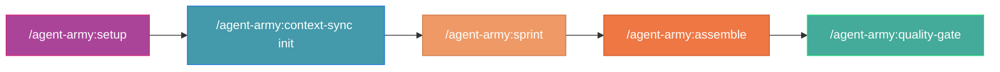

# Agent Army — Claude Code Plugin

> AI-powered software development team for Claude Code CLI.
> 10 specialized agents + 12 skills covering the full SDLC with Clean Architecture enforcement.

## Quick Install

### Option 1: Via Marketplace (Recommended)

```bash
# Step 1: Add the marketplace
/plugin marketplace add Muheng1992/symbiotic-engineering

# Step 2: Install the plugin
/plugin install agent-army@symbiotic-engineering

# Step 3: Initialize your project
/agent-army:setup my-project
```

### Option 2: Local Testing

```bash
# Clone the repo
git clone https://github.com/Muheng1992/symbiotic-engineering.git

# Run Claude Code with the plugin
claude --plugin-dir ./symbiotic-engineering/plugins/agent-army
```

### Option 3: Project-scoped Install

Add to your project's `.claude/settings.json`:

```json
{
  "extraKnownMarketplaces": {
    "symbiotic-engineering": {
      "source": {
        "source": "github",
        "repo": "Muheng1992/symbiotic-engineering"
      }
    }
  },
  "enabledPlugins": {
    "agent-army@symbiotic-engineering": true
  }
}
```

## What's Included

### 10 Specialized Agents

| Agent | Role | Model |
|-------|------|-------|
| `tech-lead` | Orchestration & delegation (no Write/Edit) | opus |
| `architect` | System design & API design (plan mode) | opus |
| `implementer` | Code implementation | opus |
| `tester` | Unit + integration testing | opus |
| `reviewer` | Code review (read-only) | opus |
| `documenter` | Documentation | sonnet |
| `security-auditor` | Security scanning (read-only) | opus |
| `integrator` | Merge & E2E verification | opus |
| `doc-manager` | Document lifecycle management | sonnet |
| `reporter` | Structured report generation | sonnet |

### 12 Skills (Slash Commands)

| Skill | Command | Purpose |
|-------|---------|---------|
| **Assemble** | `/agent-army:assemble [feature]` | Launch full agent army for a feature |
| **Sprint** | `/agent-army:sprint [feature]` | Sprint planning & task decomposition |
| **Quality Gate** | `/agent-army:quality-gate [scope]` | Quality checkpoint (6 gates) |
| **Context Sync** | `/agent-army:context-sync [action]` | Context management across agents |
| **Integration Test** | `/agent-army:integration-test [scope]` | Integration test orchestration (5-stage) |
| **Code Review** | `/agent-army:code-review [scope]` | Code review orchestration (4-stage) |
| **Setup** | `/agent-army:setup [project-name]` | Initialize project for Agent Army |
| **TDD** | `/agent-army:tdd [feature]` | TDD Red-Green-Refactor enforcement |
| **Fix** | `/agent-army:fix [error]` | Smart problem resolution & diagnosis |
| **Timesheet** | `/agent-army:timesheet [time-range]` | Work time analysis & daily report |
| **Retrospective** | `/agent-army:retrospective` | Mission retrospective & self-improvement |
| **Dev Standards** | *(auto-loaded)* | Clean Architecture & coding standards |

### Hooks

| Event | Trigger | Action |
|-------|---------|--------|
| `PostToolUse` | After Write/Edit | Remind Clean Architecture compliance |
| `Stop` | Before session end | Check if reports are filed |

## Workflow Example



```
# 1. Setup (first time only)
/agent-army:setup my-app

# 2. Initialize context
/agent-army:context-sync init

# 3. Plan a sprint
/agent-army:sprint "Add user authentication with JWT"

# 4. Deploy the agent army
/agent-army:assemble "Add user authentication with JWT"

# 5. Quality check before merge
/agent-army:quality-gate all
```

## Architecture

```
Agent Army Plugin
├── agents/           10 specialized agent definitions
├── skills/           12 skills (slash commands)
│   ├── assemble/     Full army orchestrator
│   ├── sprint/       Sprint planning
│   ├── quality-gate/ Quality checkpoints
│   ├── context-sync/ Context management
│   ├── integration-test/ Integration test orchestration
│   ├── code-review/  Code review orchestration
│   ├── tdd/          TDD enforcement
│   ├── fix/          Smart problem resolution
│   ├── timesheet/    Work time analysis & daily report
│   ├── retrospective/ Mission retrospective
│   ├── setup/        Project initialization
│   └── dev-standards/ Coding standards (auto-loaded)
└── hooks/            Clean Architecture enforcement
```

## Requirements

- Claude Code CLI (v1.0.33+)
- Agent Teams feature: set `CLAUDE_CODE_EXPERIMENTAL_AGENT_TEAMS=1` in environment

## Key Features

- **Parallel Agent Execution**: Multiple agents work simultaneously on independent tasks
- **Clean Architecture Enforcement**: Hooks + standards ensure dependency rules
- **Full Report Lifecycle**: All reviews, tests, audits filed and historically preserved
- **Plan Traceability**: Every plan tracked with approval/rejection/execution status
- **Cost Optimization**: Documentation agents use Sonnet; reasoning agents use Opus
- **Context Management**: Agents receive only the context they need
- **TDD Enforcement**: Red-Green-Refactor cycle as a blocking gate
- **Smart Fix**: Automatic diagnosis and dynamic agent selection for bug fixes
- **Role Isolation**: Tech Lead coordinates only; Architect designs only (plan mode)

## License

MIT
